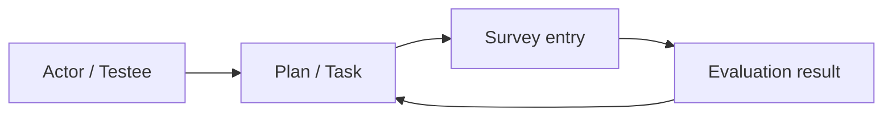

# Plan 跨模块协作

**本文回答**：Plan 如何和 Actor、Survey、Evaluation 协作，而不拥有它们的主状态。

## 30 秒结论



| 协作对象 | 关系 |
| -------- | ---- |
| Actor | 入组和任务对象引用 testee / clinician |
| Survey | 任务最终指向问卷/量表入口 |
| Evaluation | 任务完成和测评结果形成闭环 |

## 协作要解决什么问题

Plan 本质是编排域，它一定会引用 Actor、Survey 和 Evaluation；但引用不等于拥有。跨模块协作设计要解决的是“Plan 能生成可执行任务，同时不复制其他模块的业务事实”。

| 被协作模块 | Plan 需要什么 | Plan 不应该做什么 |
| ---------- | ------------- | ----------------- |
| Actor | testee / clinician / org scope | 不维护受试者标签、医生权限或 IAM 用户 |
| Survey | 问卷/量表入口引用 | 不校验每道题答案，不保存答卷 |
| Evaluation | 任务完成后的测评闭环 | 不生成报告，不推进 Assessment pipeline |
| Event System | `task.*` 通知出站 | 不把事件当作任务状态权威 |

## 架构设计

```mermaid
sequenceDiagram
    participant API as Plan API
    participant Scope as ScopeLoader
    participant Actor as Actor Service
    participant Survey as Survey/Scale
    participant Plan as Plan Application
    participant Task as Plan Domain

    API->>Plan: create/enroll/schedule command
    Plan->>Scope: validate org/testee/survey scope
    Scope->>Actor: load testee/clinician reference
    Scope->>Survey: validate entry reference
    Plan->>Task: generate or transition task
```

`ScopeLoader` 是防腐层式的应用服务协作点。它把外部模块的信息压缩成 Plan 需要的引用和校验结果，不把 Actor 或 Survey 的完整领域模型塞进 Plan 聚合。

## 设计模式应用

| 模式 | 位置 | 说明 |
| ---- | ---- | ---- |
| 防腐层 | `scope_loader.go` | 隔离 Actor/Survey 的模型变化 |
| 应用服务编排 | `enrollment_service.go`、`query_service.go` | 跨 repository 查询和权限检查不放进领域实体 |
| 引用而非复制 | Plan 持有 testee/survey identifiers | 减少跨模块数据同步和一致性负担 |
| 事件集成 | `task.*` | Plan 对外表达状态变化，而不是直接调用 worker 通知 |

## 为什么这样设计

跨模块引用有两种常见做法：一种是强关联，Plan 保存大量 Actor 和 Survey 快照；另一种是弱引用，Plan 只保存必要标识并在应用服务中校验。当前选择更接近弱引用，因为 Actor 标签、Survey 版本和 Evaluation 结果都有自己的生命周期。Plan 复制它们会带来缓存一致性和历史语义问题。

## 取舍与边界

| 取舍 | 收益 | 代价 |
| ---- | ---- | ---- |
| 只保存必要引用 | Plan 模型更稳定 | 查询详情时需要组合多个模块 |
| ScopeLoader 做跨模块校验 | 领域层保持纯粹 | 应用服务测试要覆盖更多协作场景 |
| 不拥有 Evaluation | 避免状态机纠缠 | Plan/Evaluation 联合视图需要读侧聚合 |

## 代码锚点

- Scope loader：[scope_loader.go](../../../internal/apiserver/application/plan/scope_loader.go)
- Enrollment service：[enrollment_service.go](../../../internal/apiserver/application/plan/enrollment_service.go)
- Plan query：[query_service.go](../../../internal/apiserver/application/plan/query_service.go)

## Verify

```bash
go test ./internal/apiserver/application/plan
```
