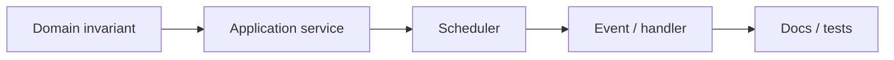
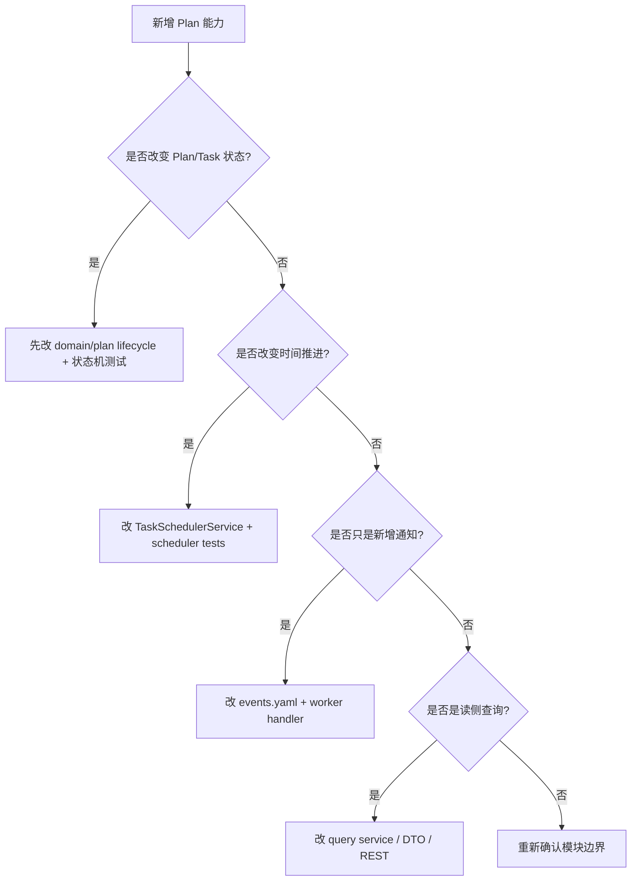

# 新增计划能力 SOP

**本文回答**：新增计划字段、任务状态、调度规则或通知事件时如何避免跨模块漂移。

## 30 秒结论



新增 Plan 能力时先判断它属于计划规则、任务状态、调度机制、通知事件还是跨模块读模型。不要从 controller 或 scheduler 直接开始改，否则很容易绕过领域状态机。

## SOP 要解决什么问题

Plan 的变更通常会同时碰到时间、状态和事件。例如新增一种任务取消原因，可能影响任务状态机、REST DTO、worker 通知、统计查询和文档。SOP 的目标是让变更沿着“领域不变量 -> 应用编排 -> 运行时 -> 事件 -> 文档”的顺序推进。

## 清单

| 变更 | 必做 |
| ---- | ---- |
| 新状态 | 更新 domain state machine、application tests、事件说明 |
| 新调度规则 | 更新 scheduler tests、leader lock 边界、配置说明 |
| 新通知 | 更新 `events.yaml`、worker handler registry、事件文档 |
| 新查询 | 更新 REST 契约、query service、模块文档 |

## 决策树



## 设计审查清单

| 审查项 | 必须回答 |
| ------ | -------- |
| 问题归属 | 这是计划编排问题，还是 Actor/Survey/Evaluation 问题 |
| 状态机 | 是否新增状态、动作或非法转移 |
| 调度语义 | 是否依赖 scheduler tick、leader lock 或补偿任务 |
| 事件语义 | 是否需要 `task.*`，delivery class 是否仍符合业务重要性 |
| 取舍 | 是否引入更强实时性、更多跨模块查询或更复杂补偿 |

## 为什么按这个顺序

Plan 是状态驱动模块。先改领域状态机，可以让非法状态尽早在测试中暴露；再改应用服务和 scheduler，可以保证运行时只调用合法领域动作；最后改事件和文档，可以避免把通知或 UI 需求误写成领域事实。

## 常见反模式

| 反模式 | 风险 |
| ------ | ---- |
| 在 scheduler 中直接改 task status | 绕过状态机，事件和状态可能不一致 |
| 用 `task.*` 事件替代 repository 状态 | 事件丢失会导致业务状态不可恢复 |
| 在 Plan 中复制 Testee/Survey 完整数据 | 跨模块漂移，历史语义不清 |
| 任务开放时直接创建 Assessment | 把“计划入口”误建模为“测评已开始” |

## 代码与测试锚点

| 能力 | 锚点 |
| ---- | ---- |
| Plan 领域模型 | [internal/apiserver/domain/plan](../../../internal/apiserver/domain/plan/) |
| Plan 应用服务 | [internal/apiserver/application/plan](../../../internal/apiserver/application/plan/) |
| Scheduler runner | [internal/apiserver/runtime/scheduler](../../../internal/apiserver/runtime/scheduler/) |
| 任务事件契约 | [configs/events.yaml](../../../configs/events.yaml) |
| Worker task handler | [internal/worker/handlers/task_handler.go](../../../internal/worker/handlers/task_handler.go) |

## Verify

```bash
go test ./internal/apiserver/domain/plan ./internal/apiserver/application/plan ./internal/apiserver/runtime/scheduler ./internal/worker/handlers
python scripts/check_docs_hygiene.py
```
