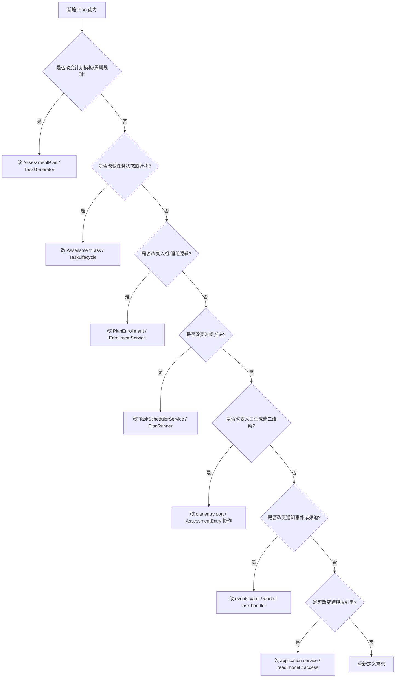

# 新增计划能力 SOP

**本文回答**：当 Plan 模块需要新增计划字段、调度规则、任务状态、入口能力、通知事件、跨模块引用或补偿能力时，应该按什么顺序判断边界、修改领域模型、应用服务、调度器、事件契约、worker handler、测试和文档，避免绕过状态机或把 Plan 写成 Survey/Evaluation 的附属模块。

---

## 30 秒结论

新增 Plan 能力前，先判断它属于哪一类变化：

| 变化类型 | 示例 | 首要落点 |
| -------- | ---- | -------- |
| 计划模板能力 | 新增 schedule type、计划适用范围、触发时间规则 | `domain/plan.AssessmentPlan` |
| 任务状态能力 | 新增状态、完成条件、重新开放、延期 | `domain/plan.AssessmentTask` + `TaskLifecycle` |
| 入组能力 | 新增入组条件、批量入组、重新入组策略 | `PlanEnrollment` + `EnrollmentService` |
| 调度能力 | 新增扫描窗口、补偿调度、手动 schedule scope | `TaskSchedulerService` + runtime scheduler |
| 入口能力 | 新增 entry target、二维码策略、入口过期策略 | `planentry` port + `AssessmentEntry` |
| 通知能力 | 新增提醒、渠道、模板、通知事件 | `task.*` event + worker handler / notifier |
| 跨模块能力 | 与 Actor、Survey、Evaluation、Statistics 新协作 | application service / read model |
| 补偿能力 | 批量重排、补发通知、任务修复 | application command + 状态机约束 |

最小执行顺序：

```text
边界判断
  -> 领域模型 / 状态机
  -> 应用服务编排
  -> repository / mapper / query
  -> scheduler / runtime 配置
  -> event catalog / worker handler
  -> REST/gRPC contract
  -> tests
  -> docs
```

一句话原则：

> **Plan 变化先过领域状态机，再进应用编排；不要从 controller、scheduler 或 worker 直接改状态。**

---

## 1. 新增能力前的边界判断

Plan 是编排域。很多需求看起来像 Plan，其实可能属于其它模块。

| 产品需求 | 先判断 | 可能归属 |
| -------- | ------ | -------- |
| “任务到期后自动生成评估” | 是任务过期，还是答卷已提交？ | Plan / Survey / Evaluation |
| “医生能看到哪些任务” | 是关系权限，还是任务查询？ | Actor / Plan |
| “任务打开后发小程序通知” | 是任务状态，还是通知渠道？ | Plan event / Worker / Notification |
| “新增随访计划规则” | 是 schedule type，还是业务模板？ | Plan |
| “报告出来后任务才完成” | 完成条件取决于 AnswerSheet、Assessment 还是 Report？ | Plan + Evaluation |
| “某些高风险对象自动加入计划” | 触发源是报告结果，计划入组是 Plan | Evaluation -> Plan |
| “任务完成率统计” | 原始事实是 Task，统计读模型是 Statistics | Plan + Statistics |

边界不清时，先不要改代码。

---

## 2. 决策树



---

## 3. 新增计划模板能力

### 3.1 适用场景

- 新增 schedule type。
- 新增 triggerTime 规则。
- 新增计划适用人群。
- 新增计划与 scale/questionnaire 的绑定方式。
- 新增计划暂停/结束策略。
- 新增计划元数据字段。

### 3.2 修改顺序

1. 修改 `AssessmentPlan` 字段和值对象。
2. 修改 `PlanScheduleType` 或相关枚举。
3. 修改 `NewAssessmentPlan` 校验。
4. 修改 `TaskGenerator.GenerateTasks` 和 `GenerateTasksUntil`。
5. 修改 repository/mapper。
6. 修改 command DTO / REST contract。
7. 修改 query result。
8. 补 domain/application 测试。
9. 更新文档。

### 3.3 新增 schedule type 的检查点

| 检查项 | 说明 |
| ------ | ---- |
| 是否使用相对时间 | 优先相对 startDate，而非绝对时间 |
| 是否需要 totalTimes | by_week/by_day 需要，custom/fixed_date 可由列表决定 |
| 是否需要 fixedDates 或 relativeWeeks | 不同类型参数不同 |
| triggerTime 如何应用 | 任务 plannedAt 是否要 normalize |
| 入组时是否一次性生成 | 长周期可能需要滚动生成 |
| 恢复计划如何推断 startDate | Resume 逻辑是否支持 |

---

## 4. 新增任务状态或状态迁移

### 4.1 适用场景

- 新增 `reopened`。
- 新增 `skipped`。
- 新增 `failed_to_notify`。
- 任务延期。
- 任务重新开放。
- 任务补做。
- 取消原因。

### 4.2 修改顺序

1. 修改 `TaskStatus`。
2. 修改 `AssessmentTask` 状态判断方法。
3. 修改 `TaskLifecycle`。
4. 修改状态迁移表。
5. 修改 task event 或新增事件。
6. 修改 TaskSchedulerService。
7. 修改 TaskManagementService。
8. 修改 repository/mapper。
9. 修改 REST DTO。
10. 修改 worker handler。
11. 补测试和文档。

### 4.3 重要规则

不要直接暴露：

```go
task.SetStatus(...)
```

正确路径是：

```text
TaskLifecycle.SomeCommand(...)
  -> task.packagePrivateMethod(...)
  -> task.addEvent(...)
```

### 4.4 新增状态前必须回答

| 问题 | 示例 |
| ---- | ---- |
| 它是业务状态还是展示状态 | “即将开放”可能是查询计算，不一定是状态 |
| 是否终态 | completed/expired/canceled 是终态 |
| 可以从哪些状态进入 | pending -> opened |
| 可以迁移到哪些状态 | opened -> completed/expired/canceled |
| 是否产生事件 | 状态变化是否需要外部通知 |
| 是否影响 scheduler | scheduler 是否要扫描该状态 |
| 是否影响统计 | 完成率、过期率、取消率是否变化 |

---

## 5. 新增入组/退组能力

### 5.1 适用场景

- 批量入组。
- 自动入组。
- 按风险入组。
- 重新入组。
- 修改 startDate。
- 退组后保留/取消任务。
- 入组幂等策略调整。

### 5.2 修改顺序

1. 修改 `PlanEnrollment` 领域服务。
2. 修改 `PlanValidator`。
3. 修改 `EnrollmentService`。
4. 修改 task 生成/调和逻辑。
5. 修改 repository 查询能力。
6. 修改接口 DTO。
7. 补入组幂等测试。
8. 补退组取消任务测试。

### 5.3 不要这样做

| 反模式 | 风险 |
| ------ | ---- |
| 入组时不检查已有任务 | 重复任务 |
| 直接删除任务 | 丢失历史和审计 |
| 改 startDate 后直接覆盖 completed task | 破坏历史事实 |
| 在 PlanEnrollment 里直接持久化 | 领域层污染基础设施 |

---

## 6. 新增调度能力

### 6.1 适用场景

- 改调度 interval。
- 增加 pending lookback。
- 手动触发某个 plan/testee 调度。
- 支持补偿扫描。
- 支持滚动生成未来任务。
- 支持不同 org 独立调度策略。

### 6.2 修改顺序

1. 修改 runtime scheduler options。
2. 修改 `PlanRunner`。
3. 修改 `TaskSchedulerService`。
4. 修改 context scope，例如 planID/testeeIDs/lowerBound。
5. 修改 metrics/logs。
6. 补 scheduler test。
7. 更新运行时文档。

### 6.3 调度能力的边界

Scheduler 只负责时间触发和选主，不负责业务判断。业务判断必须落在：

```text
TaskSchedulerService
TaskLifecycle
PlanLifecycle
```

不要在 runtime scheduler 里写复杂业务规则。

---

## 7. 新增入口能力

### 7.1 适用场景

- 新增 entry target type。
- 新增二维码参数。
- 新增入口有效期策略。
- 新增入口渠道。
- 新增入口预览。
- 新增入口权限校验。

### 7.2 修改顺序

1. 修改 planentry port。
2. 修改 AssessmentEntry domain/application。
3. 修改 `TaskSchedulerService` 的 entry generator 调用。
4. 修改 TaskLifecycle.Open 参数或任务字段。
5. 修改 task.opened payload。
6. 修改 worker 通知。
7. 修改 REST contract。
8. 补 entry 生成和打开测试。

### 7.3 注意

Entry token 不是 IAM token。入口能力属于 Actor/AssessmentEntry 协作边界，Plan 只保存 task 上需要的 entryToken/entryURL/expireAt。

---

## 8. 新增通知事件或通知渠道

### 8.1 适用场景

- 任务开放通知。
- 任务快过期提醒。
- 任务已过期通知。
- 任务取消通知。
- 任务完成通知。
- 医生端提醒。
- 小程序订阅消息。

### 8.2 修改顺序

1. 判断是否需要新增事件，还是复用 `task.*`。
2. 修改 `configs/events.yaml`。
3. 修改 `domain/plan/events.go`。
4. 修改状态迁移中 addEvent。
5. 修改 worker handler registry。
6. 修改 `task_handler.go`。
7. 修改 `TaskNotifier` port 或 internal client。
8. 补 worker handler 测试。
9. 更新事件/运行时/Plan 文档。

### 8.3 delivery class 判断

当前 task.* 是 best_effort。如果新增通知只是提醒，可继续 best_effort。

如果事件丢失会导致主业务卡住，才考虑 durable_outbox。但这不是只改 `events.yaml`，还要设计 outbox stage 边界、relay、幂等和排障。

---

## 9. 新增跨模块协作

### 9.1 与 Actor

如果新增能力依赖 Testee/Clinician/Relation：

- 不要复制 Actor 字段到 Plan。
- 在应用层校验 org scope 和关系权限。
- 读侧展示可以组合 Actor read model。
- 写侧仍由 Actor 维护主事实。

### 9.2 与 Scale

如果新增能力依赖 Scale：

- Plan 保存 scaleCode 或必要引用。
- Scale 规则仍由 Scale 模块维护。
- 应用层可校验 scale 是否存在/发布。
- 不要把 Factor/InterpretationRule 写进 Plan。

### 9.3 与 Survey/Evaluation

如果新增能力依赖答卷或报告：

- 答卷事实属于 Survey。
- Assessment/Report 属于 Evaluation。
- Plan 只在任务完成时关联 assessmentID。
- 不要让 Plan 直接执行 Evaluation pipeline。

### 9.4 与 Statistics

如果新增能力只是为了统计：

- 优先通过事件和读模型实现。
- 不要为了统计把冗余字段塞进 Plan 主模型。
- 明确统计口径和最终一致性。

---

## 10. 补偿能力设计

### 10.1 适用场景

- missed scheduler tick。
- pending task 长期未开放。
- opened task 未过期。
- task.opened 通知失败。
- plan resume 后任务缺失。
- task.completed 没有关联 assessmentID。

### 10.2 判断补偿层级

| 问题 | 补偿位置 |
| ---- | -------- |
| 状态没推进 | TaskSchedulerService 或手动 schedule |
| 通知没发 | worker/notifier 补发，不改 task 状态 |
| 事件没出站 | event/outbox/worker 层补偿 |
| 任务生成错了 | PlanEnrollment/TaskGenerator 修复 |
| 已完成任务错了 | 谨慎处理，避免破坏历史事实 |

### 10.3 不要做

- 不要用补偿脚本直接 set status。
- 不要删除 completed task 重建。
- 不要重发通知时重新 open task。
- 不要把统计错误当成主状态错误。

---

## 11. 合并前检查清单

| 检查项 | 是否完成 |
| ------ | -------- |
| 已确认能力属于 Plan，而不是 Actor/Survey/Evaluation | ☐ |
| 已明确是否改变 Plan 状态机 | ☐ |
| 已明确是否改变 Task 状态机 | ☐ |
| 已更新领域模型和领域服务 | ☐ |
| 已更新应用服务编排 | ☐ |
| 已更新 repository/mapper/read model | ☐ |
| 已更新 scheduler/runtime 配置 | ☐ |
| 已更新 event catalog | ☐ |
| 已更新 worker handler/notifier | ☐ |
| 已更新 REST/gRPC 契约 | ☐ |
| 已补 domain tests | ☐ |
| 已补 application tests | ☐ |
| 已补 scheduler tests | ☐ |
| 已补 worker tests | ☐ |
| 已更新 Plan 文档组 | ☐ |
| 已更新运行时或事件文档 | ☐ |

---

## 12. 反模式

| 反模式 | 风险 |
| ------ | ---- |
| 在 scheduler 里直接改 task.status | 绕过状态机和事件 |
| 用 task.* 事件替代 task repository | 事件丢失导致状态不可恢复 |
| 任务开放时直接创建 Assessment | 把“应做任务”误建模为“测评已发生” |
| Plan 复制 Testee/Scale/Report 全量数据 | 跨模块漂移 |
| 通知失败回滚 task opened | 状态事实和副作用混淆 |
| completed task 被 reschedule | 破坏历史事实 |
| 新增状态不补迁移表 | 后续维护人员无法判断合法流转 |

---

## 13. 推荐测试命令

```bash
go test ./internal/apiserver/domain/plan
go test ./internal/apiserver/application/plan
go test ./internal/apiserver/runtime/scheduler
go test ./internal/worker/handlers
```

如果修改事件契约：

```bash
go test ./internal/pkg/eventcatalog
go test ./internal/worker/integration/eventing
```

如果修改 REST 契约：

```bash
make docs-rest
make docs-verify
```

如果修改文档：

```bash
make docs-hygiene
```

---

## 14. 文档同步

| 变更类型 | 至少同步 |
| -------- | -------- |
| Plan/Task 模型 | [00-整体模型.md](./00-整体模型.md) |
| 状态机 | [01-计划任务状态机.md](./01-计划任务状态机.md) |
| 调度/事件/通知 | [02-调度与通知事件.md](./02-调度与通知事件.md) |
| 跨模块引用 | [03-跨模块协作.md](./03-跨模块协作.md) |
| Runtime scheduler | [../../01-运行时/06-后台任务与调度.md](../../01-运行时/06-后台任务与调度.md) |
| Event system | `docs/03-基础设施/event/` |
| REST/API | `docs/04-接口与运维/` |

---

## 15. 代码锚点

- Plan domain：[../../../internal/apiserver/domain/plan/](../../../internal/apiserver/domain/plan/)
- Plan application：[../../../internal/apiserver/application/plan/](../../../internal/apiserver/application/plan/)
- Plan scheduler：[../../../internal/apiserver/runtime/scheduler/plan_scheduler.go](../../../internal/apiserver/runtime/scheduler/plan_scheduler.go)
- Event catalog：[../../../configs/events.yaml](../../../configs/events.yaml)
- Worker task handler：[../../../internal/worker/handlers/task_handler.go](../../../internal/worker/handlers/task_handler.go)
- Plan routes：[../../../internal/apiserver/transport/rest/routes_plan.go](../../../internal/apiserver/transport/rest/routes_plan.go)

---

## 16. 下一跳

| 目标 | 文档 |
| ---- | ---- |
| 回看整体模型 | [00-整体模型.md](./00-整体模型.md) |
| 修改状态机 | [01-计划任务状态机.md](./01-计划任务状态机.md) |
| 修改调度/通知 | [02-调度与通知事件.md](./02-调度与通知事件.md) |
| 修改跨模块协作 | [03-跨模块协作.md](./03-跨模块协作.md) |
