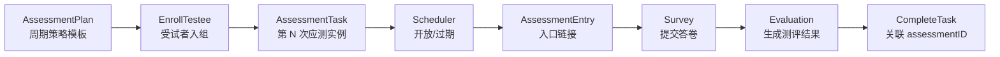
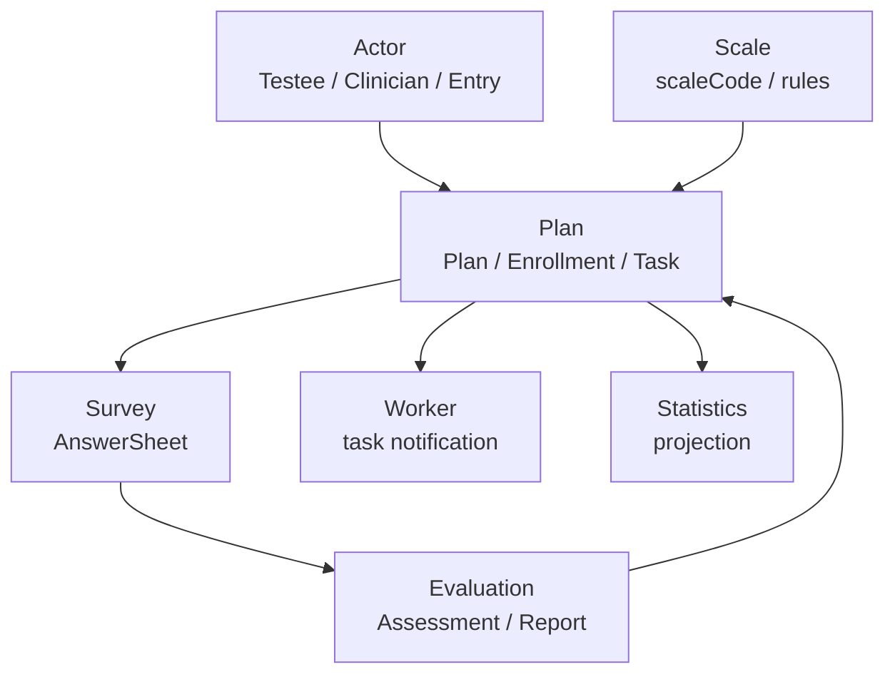

# Plan 深讲阅读地图

**本文回答**：`plan` 子目录这一组文档应该如何阅读；Plan 模块负责什么、不负责什么；`AssessmentPlan`、`AssessmentTask`、入组、调度、通知事件、跨模块协作和新增能力 SOP 分别应该去哪里看。

---

## 30 秒结论

| 维度 | 结论 |
| ---- | ---- |
| 模块定位 | `plan` 是 qs-server 的**周期测评编排域**，负责“谁应该在什么时候完成什么测评” |
| 核心模板 | `AssessmentPlan` 是周期策略模板，定义测什么、如何排期、计划状态，不直接绑定具体受试者 |
| 运行实例 | `AssessmentTask` 是计划分解后的第 N 次应测实例，负责 pending/opened/completed/expired/canceled 状态 |
| 入组能力 | `PlanEnrollment` 负责受试者加入计划，并根据 startDate 生成或调和任务 |
| 调度能力 | `PlanRunner + TaskSchedulerService` 负责按时间开放/过期任务 |
| 通知事件 | `task.opened / completed / expired / canceled` 是任务状态通知，当前是 best_effort |
| 跨模块边界 | Plan 引用 Testee、Scale、AssessmentEntry、Assessment，但不拥有 Actor/Suvrey/Evaluation 主状态 |
| 关键取舍 | Plan 不在任务开放时直接创建 Assessment，避免把“应做任务”误建模为“测评已发生” |
| 推荐读法 | 先读整体模型，再读状态机、调度事件、跨模块协作，最后读新增能力 SOP |

一句话概括：

> **Plan 负责把长期测评安排拆成可调度的任务；Survey 负责答卷事实，Evaluation 负责测评结果。**

---

## 1. Plan 模块负责什么

Plan 模块负责周期测评编排。

它要回答：

```text
哪个机构有一个测评计划？
这个计划测哪套量表？
这个计划按什么周期产生任务？
哪个受试者加入了这个计划？
某个受试者第 N 次任务计划什么时候开放？
任务是否已经开放？
任务是否已经完成？
任务是否已经过期或取消？
任务开放后如何生成入口和通知？
任务完成后如何关联 Assessment？
```

Plan 的核心不是“算分”或“生成报告”，而是**时间、任务和编排**。

---

## 2. Plan 不负责什么

| 不属于 Plan 的内容 | 应归属 |
| ------------------ | ------ |
| 受试者档案、标签、医生关系 | `actor` |
| 入口 token 的完整接入语义、intake 建档 | `actor/assessmententry` |
| 问卷题型、答案值、答卷提交、答案校验 | `survey` |
| 量表因子、计分策略、风险文案 | `scale` |
| Assessment 状态、Evaluation pipeline、Report | `evaluation` |
| 行为漏斗、完成率看板、统计读模型 | `statistics` |
| scheduler 运行时、leader lock、Redis lock runtime | `01-运行时` / `03-基础设施` |
| 小程序订阅消息具体发送实现 | worker / notification / internal gRPC |

一句话边界：

```text
Plan 管“应该做什么、什么时候做”；
Survey 管“实际答了什么”；
Evaluation 管“结果是什么”。
```

---

## 3. 本目录文档地图

```text
plan/
├── README.md
├── 00-整体模型.md
├── 01-计划任务状态机.md
├── 02-调度与通知事件.md
├── 03-跨模块协作.md
└── 04-新增计划能力SOP.md
```

| 顺序 | 文档 | 先回答什么 |
| ---- | ---- | ---------- |
| 1 | [00-整体模型.md](./00-整体模型.md) | Plan 的编排域定位、AssessmentPlan/Task/Enrollment 的核心模型和边界 |
| 2 | [01-计划任务状态机.md](./01-计划任务状态机.md) | Plan 状态和 Task 状态如何迁移，哪些动作会产生 task.* 事件 |
| 3 | [02-调度与通知事件.md](./02-调度与通知事件.md) | PlanRunner 如何定时开放/过期任务，worker 如何消费 task.* 做通知 |
| 4 | [03-跨模块协作.md](./03-跨模块协作.md) | Plan 如何引用 Actor、Scale、Entry、Survey、Evaluation，但不拥有它们 |
| 5 | [04-新增计划能力SOP.md](./04-新增计划能力SOP.md) | 新增计划字段、调度规则、状态、通知、入口能力时怎么改 |

---

## 4. 推荐阅读路径

### 4.1 第一次理解 Plan

按顺序读：

```text
00-整体模型
  -> 01-计划任务状态机
  -> 02-调度与通知事件
```

读完后应能回答：

1. `AssessmentPlan` 为什么是模板？
2. `AssessmentTask` 为什么是运行时实例？
3. Plan 和 Task 为什么需要两套状态机？
4. 为什么 task.opened 不等于 Assessment 已创建？
5. Scheduler 为什么不应该直接改 task.status？

### 4.2 要改任务状态

读：

```text
01-计划任务状态机
  -> 04-新增计划能力SOP
```

重点看：

- `PlanStatus` 与 `TaskStatus` 的迁移表。
- `TaskLifecycle.Open / Complete / Expire / Cancel / Reschedule`。
- 哪些状态是终态。
- completed task 为什么不能 reschedule。
- 新状态是否需要新事件。

### 4.3 要改调度规则

读：

```text
02-调度与通知事件
  -> 00-整体模型
  -> 04-新增计划能力SOP
```

重点看：

- `PlanRunner` 的 interval、initial delay、orgIDs、leader lock。
- `TaskSchedulerService.SchedulePendingTasks`。
- pending lookback。
- EntryGenerator。
- expired task 扫描。
- task 事件和 worker 通知。

### 4.4 要改入组、退组或周期生成

读：

```text
00-整体模型
  -> 03-跨模块协作
  -> 04-新增计划能力SOP
```

重点看：

- `PlanEnrollment.EnrollTestee`。
- `TaskGenerator.GenerateTasks`。
- 入组幂等和任务调和。
- startDate 的相对时间语义。
- 退组如何取消未执行任务。

### 4.5 要排查“任务没通知 / 没开放 / 没过期”

读：

```text
02-调度与通知事件
  -> 01-计划任务状态机
```

按现象定位：

| 现象 | 优先检查 |
| ---- | -------- |
| 到点任务没开放 | PlanRunner 是否启用、lock 是否获取、orgIDs、pending task 查询、parent plan 是否 active |
| 任务开放但没通知 | task.opened 是否发布、worker 是否消费、InternalClient/Notifier 是否失败 |
| opened 任务没过期 | expireAt、FindExpiredTasks、TaskLifecycle.Expire、taskRepo.Save |
| 任务事件消费失败 | worker handler、payload、notifier、Ack/Nack |

---

## 5. Plan 的主业务轴线



这条主线说明：

1. Plan 先定义策略。
2. Testee 入组后生成 Task。
3. Scheduler 到时间开放 Task。
4. 用户通过 Entry 进入 Survey。
5. Survey/Evaluation 生成实际测评结果。
6. Plan 在合适时机把 Task 标记为 completed，并关联 assessmentID。

---

## 6. 与其它模块的协作



| 协作方向 | Plan 使用什么 | Plan 不做什么 |
| -------- | ------------- | ------------- |
| Actor -> Plan | testeeID、clinician、entry | 不维护 Testee 档案和医生关系 |
| Scale -> Plan | scaleCode | 不定义量表规则 |
| Plan -> Survey | 入口进入作答 | 不保存 AnswerSheet |
| Survey -> Evaluation | 提交答卷后生成 Assessment | Plan 不执行评估 |
| Evaluation -> Plan | assessmentID 可用于完成 task | Plan 不保存 Report |
| Plan -> Worker | task.* 事件 | Plan 不直接发通知 |
| Plan -> Statistics | 任务状态变化 | Plan 不维护统计看板 |

---

## 7. Plan 的四条关键链路

### 7.1 计划创建链路

```text
Create Plan
  -> AssessmentPlan
  -> scheduleType / triggerTime / totalTimes
  -> active
```

对应文档：

- [00-整体模型.md](./00-整体模型.md)

### 7.2 入组生成任务链路

```text
EnrollTestee
  -> PlanEnrollment
  -> TaskGenerator
  -> AssessmentTask pending
  -> SaveBatch
```

对应文档：

- [00-整体模型.md](./00-整体模型.md)
- [03-跨模块协作.md](./03-跨模块协作.md)

### 7.3 调度开放链路

```text
PlanRunner tick
  -> leader lock
  -> SchedulePendingTasks
  -> EntryGenerator
  -> TaskLifecycle.Open
  -> task.opened
  -> worker notification
```

对应文档：

- [02-调度与通知事件.md](./02-调度与通知事件.md)

### 7.4 完成/过期/取消链路

```text
CompleteTask / ExpireTask / CancelTask
  -> TaskLifecycle
  -> taskRepo.Save
  -> task.completed / task.expired / task.canceled
```

对应文档：

- [01-计划任务状态机.md](./01-计划任务状态机.md)

---

## 8. Plan 的事实源

| 事实 | 事实源 |
| ---- | ------ |
| 计划模板 | `AssessmentPlan` |
| 计划状态 | `AssessmentPlan.status` |
| 任务实例 | `AssessmentTask` |
| 任务状态 | `AssessmentTask.status` |
| 入组生成逻辑 | `PlanEnrollment` + `TaskGenerator` |
| 调度推进 | `TaskSchedulerService` |
| 调度运行时 | `PlanRunner` |
| 任务事件契约 | `configs/events.yaml` |
| 受试者档案 | Actor/Testee |
| 量表规则 | Scale |
| 答卷事实 | Survey |
| 测评结果 | Evaluation |

原则：

```text
Task repository 是任务状态事实源；
task.* 事件是通知；
Evaluation 是测评结果事实源；
Statistics 是读侧投影。
```

---

## 9. 维护原则

### 9.1 状态变更必须走生命周期服务

不要直接 update status。应通过：

```text
PlanLifecycle
TaskLifecycle
```

再由应用层保存和发布事件。

### 9.2 Scheduler 不写复杂业务规则

Scheduler 只负责：

- tick。
- leader lock。
- 调用应用服务。

业务判断应在：

```text
TaskSchedulerService
TaskLifecycle
PlanLifecycle
```

### 9.3 task.* 事件不是强一致命令

当前 task 事件是 best_effort。它们适合通知和投影，不适合强一致推进主链路。

### 9.4 Plan 不直接创建 Assessment

Task opened 只是任务入口开放。Assessment 应由 Survey/Evaluation 在用户实际提交答卷后产生。

### 9.5 Plan 不复制其它模块主数据

Plan 保存引用：

```text
testeeID
scaleCode
assessmentID
```

不要复制 Testee、Scale、Report 全量数据。

---

## 10. 常见误区

### 10.1 “Plan 就是定时创建 Assessment”

错误。Plan 创建 Task，Assessment 由 Evaluation 创建。

### 10.2 “task.opened 就代表测评已开始”

错误。它只代表入口已开放。

### 10.3 “task.completed 就等于 report.generated”

错误。task.completed 是计划任务完成事件，report.generated 是 Evaluation 报告事件。

### 10.4 “通知失败要回滚任务状态”

不应该。通知是副作用，任务状态是业务事实。

### 10.5 “Plan 暂停后 opened task 还能继续填写”

当前设计会在暂停时取消 pending/opened task。

---

## 11. 代码锚点

### Domain

- AssessmentPlan：[../../../internal/apiserver/domain/plan/assessment_plan.go](../../../internal/apiserver/domain/plan/assessment_plan.go)
- AssessmentTask：[../../../internal/apiserver/domain/plan/assessment_task.go](../../../internal/apiserver/domain/plan/assessment_task.go)
- PlanEnrollment：[../../../internal/apiserver/domain/plan/plan_enrollment.go](../../../internal/apiserver/domain/plan/plan_enrollment.go)
- TaskGenerator：[../../../internal/apiserver/domain/plan/task_generator.go](../../../internal/apiserver/domain/plan/task_generator.go)
- PlanLifecycle：[../../../internal/apiserver/domain/plan/plan_lifecycle.go](../../../internal/apiserver/domain/plan/plan_lifecycle.go)
- TaskLifecycle：[../../../internal/apiserver/domain/plan/task_lifecycle.go](../../../internal/apiserver/domain/plan/task_lifecycle.go)

### Application / Runtime

- Plan application：[../../../internal/apiserver/application/plan/](../../../internal/apiserver/application/plan/)
- TaskSchedulerService：[../../../internal/apiserver/application/plan/task_scheduler_service.go](../../../internal/apiserver/application/plan/task_scheduler_service.go)
- TaskManagementService：[../../../internal/apiserver/application/plan/task_management_service.go](../../../internal/apiserver/application/plan/task_management_service.go)
- PlanRunner：[../../../internal/apiserver/runtime/scheduler/plan_scheduler.go](../../../internal/apiserver/runtime/scheduler/plan_scheduler.go)

### Event / Worker

- Event catalog：[../../../configs/events.yaml](../../../configs/events.yaml)
- Task handler：[../../../internal/worker/handlers/task_handler.go](../../../internal/worker/handlers/task_handler.go)

---

## 12. Verify

```bash
go test ./internal/apiserver/domain/plan
go test ./internal/apiserver/application/plan
go test ./internal/apiserver/runtime/scheduler
go test ./internal/worker/handlers
```

如果修改事件契约：

```bash
go test ./internal/pkg/eventcatalog
go test ./internal/worker/integration/eventing
```

如果修改接口文档：

```bash
make docs-rest
make docs-verify
make docs-hygiene
```

---

## 13. 下一跳

| 目标 | 文档 |
| ---- | ---- |
| 理解整体模型 | [00-整体模型.md](./00-整体模型.md) |
| 理解状态机 | [01-计划任务状态机.md](./01-计划任务状态机.md) |
| 理解调度通知 | [02-调度与通知事件.md](./02-调度与通知事件.md) |
| 理解跨模块协作 | [03-跨模块协作.md](./03-跨模块协作.md) |
| 新增计划能力 | [04-新增计划能力SOP.md](./04-新增计划能力SOP.md) |
| 回看业务模块入口 | [../README.md](../README.md) |
