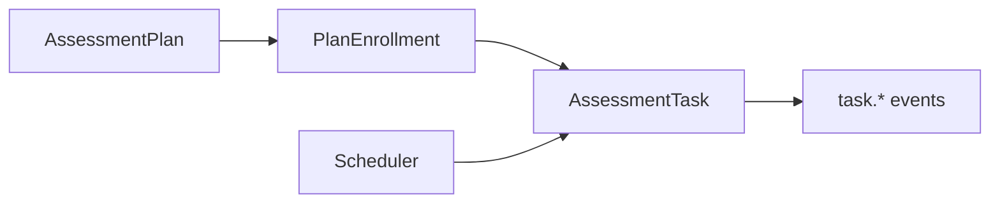

# Plan 深讲阅读地图

**本文回答**：`plan` 深讲目录如何阅读；计划、入组、任务、调度和通知事件分别在哪里讲。

## 30 秒结论

| 维度 | 当前事实 |
| ---- | -------- |
| 模块定位 | `plan` 负责计划模板、入组关系、任务生成、任务生命周期和调度 |
| 关键对象 | `AssessmentPlan`、`PlanEnrollment`、`AssessmentTask` |
| 事件边界 | 当前只保留 `task.*` 事件，计划生命周期本身不再单独事件化 |
| 调度边界 | scheduler 使用 leader lock，多实例抢不到锁跳过本轮 |



## 阅读顺序

1. [00-整体模型](./00-整体模型.md)
2. [01-计划任务状态机](./01-计划任务状态机.md)
3. [02-调度与通知事件](./02-调度与通知事件.md)
4. [03-跨模块协作](./03-跨模块协作.md)
5. [04-新增计划能力SOP](./04-新增计划能力SOP.md)

## Verify

```bash
go test ./internal/apiserver/domain/plan ./internal/apiserver/application/plan ./internal/apiserver/runtime/scheduler
```
