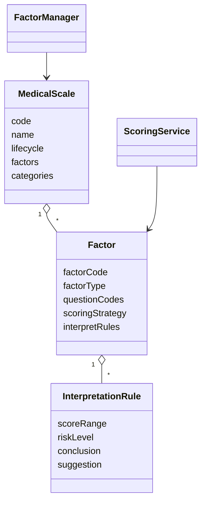
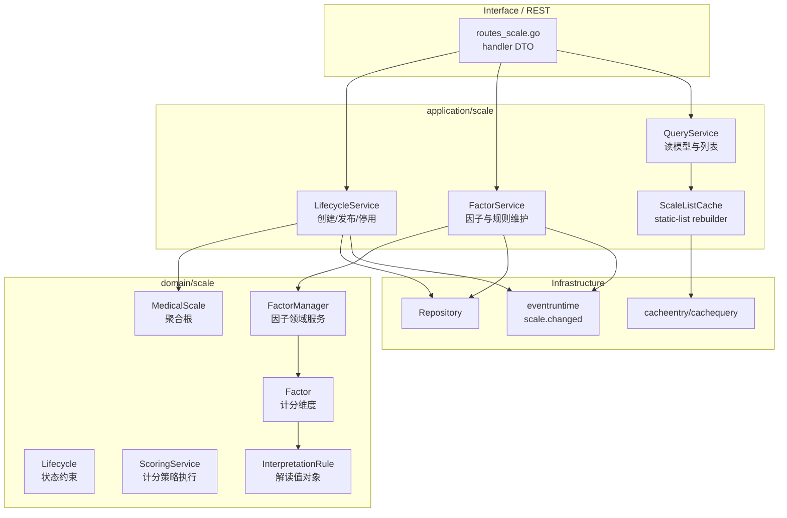
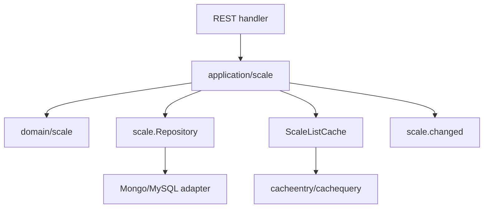

# Scale 整体模型

**本文回答**：Scale 模块内部有哪些领域对象、应用服务和缓存边界，以及它为什么是规则权威源而不是答卷或报告的附属表。

## 30 秒结论

| 问题 | 结论 |
| ---- | ---- |
| Scale 管什么 | 管量表基本信息、生命周期、因子、计分策略、解读规则 |
| Scale 不管什么 | 不管具体答卷答案、不推进 Assessment 状态、不生成报告正文 |
| 聚合根 | `MedicalScale`，它约束因子集合、状态、分类和基础属性 |
| 领域服务 | `FactorManager` 管理因子结构，`ScoringService` 根据答卷和因子策略计算分数 |
| 应用服务 | `lifecycle_service`、`factor_service`、`query_service` 负责事务、权限、事件和缓存协调 |

## 模块要解决什么问题

Scale 要解决的是“心理/医学量表规则由谁维护、如何稳定复用”的问题。系统中至少有三类事实容易被混在一起：

| 事实类型 | 例子 | 权威归属 |
| -------- | ---- | -------- |
| 规则事实 | 量表编码、因子、题目引用、计分策略、风险区间、解释文案 | Scale |
| 作答事实 | 某个受试者某次提交了哪些答案 | Survey / AnswerSheet |
| 产出事实 | 某次评估的状态、分数、报告、建议 | Evaluation |

如果把规则事实塞进 Survey，问卷会变成“规则 + 展示 + 作答”的大聚合；如果把规则事实塞进 Evaluation，评估 pipeline 会直接硬编码量表规则，后续新增策略会导致评估链路频繁变动。Scale 独立成界的核心意图是：**把可被多条评估链路复用的规则，沉淀为稳定领域模型**。

## 主模型



Scale 的领域模型只表达“规则”。答卷里的选项、文本和分数事实属于 Survey/AnswerSheet；测评推进、报告生成和失败补偿属于 Evaluation。

## 架构设计



这个分层的关键是调用方向：应用层编排事务、缓存和事件；领域层只表达规则不变量；基础设施层只保存和优化读取。`ScoringService` 虽然会被 Evaluation 消费，但它仍属于 Scale 领域，因为它解释的是 Scale 规则而不是 Assessment 状态。

## 模块内分层



应用服务负责把外部请求翻译为领域操作，并在变更后触发缓存重建和 `scale.changed` 事件。领域层不直接知道 Redis、事件系统或 HTTP。

## 当前边界

| 边界 | 当前事实 |
| ---- | -------- |
| 与 Survey | Survey 可以引用量表和题目结构，但答卷事实不回写 Scale |
| 与 Evaluation | Evaluation 查询 Scale 规则并执行计分/解读，不反向修改 Scale |
| 与 Event | 规则变更发布 `scale.changed`，delivery class 为 `best_effort` |
| 与 Cache | `ScaleListCache` 优化全局列表，不承担业务一致性来源 |

## 领域模型设计

| 模型 | 类型 | 设计职责 |
| ---- | ---- | -------- |
| `MedicalScale` | 聚合根 | 维护量表身份、生命周期、分类、因子集合等规则边界 |
| `Factor` | 实体 / 子对象 | 表示一个可计分维度，持有题目引用、计分策略和解读规则 |
| `InterpretationRule` | 值对象 | 表达分数区间到风险等级、结论、建议的映射 |
| `FactorManager` | 领域服务 | 处理因子集合的新增、更新、删除和一致性校验 |
| `ScoringService` | 领域服务 / 策略执行器 | 根据 `ScoringStrategyCode` 计算因子分 |
| `ScaleListCache` | 应用层读优化 | 缓存静态列表页，不作为规则权威 |

Scale 的聚合边界不是“某张表的一行”，而是“一个量表规则集合”。因子和解读规则跟随量表生命周期一起维护，因此放在同一领域边界内。这样做的收益是规则发布和因子变更可以由同一个应用服务控制；代价是聚合不能无限膨胀，复杂公式、外部规则引擎或多版本并行发布如果出现，需要单独拆模型。

## 设计模式应用

| 模式 | 源码落点 | 为什么使用 |
| ---- | -------- | ---------- |
| 聚合根 | `MedicalScale` | 把量表规则的一致性入口收敛到一个模型，避免应用层到处拼规则 |
| 领域服务 | `FactorManager`、`ScoringService` | 因子管理和计分跨多个值对象，不适合塞进单个实体方法 |
| 策略模式 | `ScoringStrategyCode` + `ScoringService` 分支 | 计分算法可扩展，但对 Evaluation 暴露统一计算结果 |
| 值对象 | `InterpretationRule`、分数区间、风险等级 | 规则输出要稳定、可比较、可测试，不能散落为字符串 |
| Repository | application 依赖 repository 接口 | 领域模型不关心 Mongo/MySQL 映射 |
| Static-list cache | `ScaleListCache` | 全局列表读多写少，用缓存优化读取但不改变规则一致性来源 |

这里没有把 Scale 做成“规则引擎框架”。当前规则复杂度主要是因子计分和区间解读，用领域服务和策略分支足够直接；如果过早引入 DSL 或脚本引擎，会增加调试、审计和测试成本。

## 为什么这样设计

Scale 独立出来的主要收益是降低修改放大系数：新增量表字段、计分策略或解读规则时，优先改 `domain/scale` 和 `application/scale`，Evaluation 只消费计算结果，Survey 只引用规则定义。替代方案是把规则固化在 Questionnaire 或 Evaluation pipeline 中，但这会带来两个问题：一是规则变更会影响答卷提交路径，二是评估结果不可解释，因为分数从哪里来不再有单一模型承接。

当前设计选择了“显式领域模型 + 轻量策略”的方式，而不是“统一规则引擎”。这是一个务实取舍：规则数量和复杂度还没有达到必须引入规则引擎的程度；把规则留在 Go 领域模型中，能得到更强的类型约束、测试覆盖和代码审查可读性。

## 取舍与边界

| 取舍 | 当前选择 | 代价 |
| ---- | -------- | ---- |
| 规则权威 | Scale 是规则权威 | Evaluation 每次执行必须明确加载规则，不能偷用缓存快照 |
| 计分扩展 | Go 代码策略分支 | 非研发人员不能直接配置任意公式 |
| 事件语义 | `scale.changed` 为 best-effort | 不能用它承诺规则变更后所有旧 Assessment 自动重算 |
| 缓存语义 | 列表缓存只优化读 | 缓存 miss 时必须能从 repository 重建 |
| 聚合大小 | 因子和规则留在 Scale 聚合内 | 规则持续膨胀时需要重新评估拆分 |

## 代码锚点与测试锚点

- 聚合与类型：[internal/apiserver/domain/scale/medical_scale.go](../../../internal/apiserver/domain/scale/medical_scale.go)、[internal/apiserver/domain/scale/types.go](../../../internal/apiserver/domain/scale/types.go)
- 应用服务：[internal/apiserver/application/scale/lifecycle_service.go](../../../internal/apiserver/application/scale/lifecycle_service.go)、[internal/apiserver/application/scale/factor_service.go](../../../internal/apiserver/application/scale/factor_service.go)、[internal/apiserver/application/scale/query_service.go](../../../internal/apiserver/application/scale/query_service.go)
- 装配入口：[internal/apiserver/container/assembler/scale.go](../../../internal/apiserver/container/assembler/scale.go)

## Verify

```bash
go test ./internal/apiserver/domain/scale ./internal/apiserver/application/scale
```
