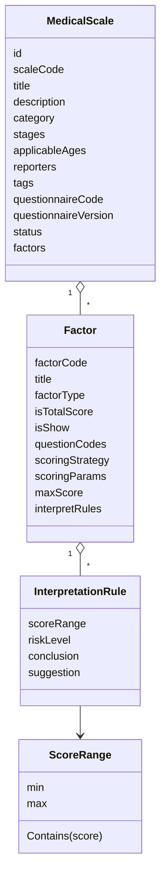
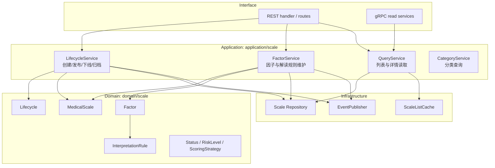
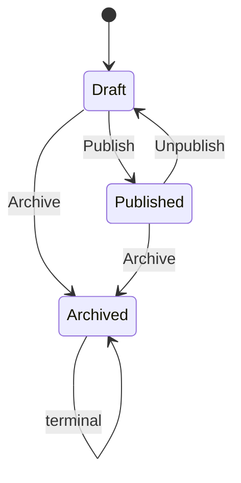

# Scale 整体模型

**本文回答**：`scale` 模块在 qs-server 中负责什么、为什么它是“量表规则权威源”，`MedicalScale`、`Factor`、`InterpretationRule` 如何组成规则模型，以及它与 `survey / evaluation / actor / plan / statistics` 的边界在哪里。

---

## 30 秒结论

| 维度 | 结论 |
| ---- | ---- |
| 模块定位 | Scale 是 qs-server 的**量表规则域**，负责维护医学/心理量表的规则事实 |
| 核心聚合 | `MedicalScale` 是聚合根，内部持有基本信息、分类标签、问卷绑定、状态、因子和解读规则 |
| 规则对象 | `Factor` 表示一个计分维度，持有关联题目、计分策略、最大分和解读规则 |
| 解读对象 | `InterpretationRule` 把分数区间映射为风险等级、结论文案和建议文案 |
| 生命周期 | Scale 有 `draft / published / archived` 三类状态，由领域 `Lifecycle` 控制 |
| 事件 | Scale 变更通过 `scale.changed` 通知外部，当前属于生命周期/治理类事件 |
| 不负责 | 不保存具体答卷、不推进 Assessment 状态、不生成报告正文、不管理受试者 |
| 协作关系 | Survey 提供答卷事实，Scale 提供规则，Evaluation 组合二者产出测评结果 |

一句话概括：

> **Survey 记录用户答了什么，Scale 定义这些答案应该如何被规则解释，Evaluation 把作答事实和规则组合成测评结果。**

---

## 1. Scale 要解决什么问题

在问卷&量表系统里，容易混在一起的事实至少有三类：

| 事实类型 | 例子 | 权威归属 |
| -------- | ---- | -------- |
| 作答事实 | 某个孩子某次提交了哪些答案、每题得分是多少 | Survey / AnswerSheet |
| 规则事实 | ADHD 量表有哪些因子、每个因子包含哪些题、分数区间如何解读 | Scale |
| 产出事实 | 某次测评得分、风险等级、报告结论、建议 | Evaluation |

Scale 模块要解决的是第二类问题：**量表规则由谁维护、如何复用、如何被 Evaluation 稳定消费。**

如果没有 Scale 这个独立模块，规则通常会被塞进两个地方：

1. 塞进 Survey：问卷会同时承担展示结构、作答事实、医学解释规则，聚合过大。
2. 塞进 Evaluation：评估 pipeline 会硬编码各种量表规则，新增量表就要频繁改评估流程。

Scale 独立成界的目的就是：**把可被多次测评复用的规则沉淀成明确模型，让 Survey 和 Evaluation 都不要直接硬编码医学量表规则。**

---

## 2. Scale 的核心模型



### 2.1 MedicalScale

`MedicalScale` 是 Scale 的聚合根。它负责维护一套量表规则的整体一致性。

它包含：

| 字段 | 说明 |
| ---- | ---- |
| `scaleCode` | 量表编码，系统内识别量表 |
| `title / description` | 量表基础说明 |
| `category` | 主类，例如 ADHD、ASD、压力等 |
| `stages` | 使用阶段，例如深评、随访、结局 |
| `applicableAges` | 适用年龄段 |
| `reporters` | 填报人类型，例如 parent、teacher、self、clinical |
| `tags` | 额外标签，不替代主类 |
| `questionnaireCode / questionnaireVersion` | 绑定的问卷编码与版本 |
| `status` | draft / published / archived |
| `factors` | 因子集合，含计分策略和解读规则 |

`MedicalScale` 聚合根不是简单的“量表资料表”，而是规则的一致性入口。比如：替换因子时会校验因子编码唯一，并要求总分因子唯一。

### 2.2 Factor

`Factor` 是量表中的测量维度。一个量表通常由多个因子组成，例如：

```text
总分
注意力缺陷
多动冲动
情绪问题
睡眠问题
```

`Factor` 保存：

| 字段 | 说明 |
| ---- | ---- |
| `code` | 因子编码 |
| `title` | 因子名称 |
| `factorType` | primary / multilevel |
| `isTotalScore` | 是否为总分因子 |
| `isShow` | 是否在报告里展示 |
| `questionCodes` | 该因子关联哪些题目 |
| `scoringStrategy` | sum / avg / cnt |
| `scoringParams` | 计分参数，例如计数策略参数 |
| `maxScore` | 最大分 |
| `interpretRules` | 分数到风险/文案的规则 |

### 2.3 InterpretationRule

`InterpretationRule` 是解读规则值对象，表达：

```text
某个因子的某个分数区间 -> 风险等级 + 结论 + 建议
```

它包含：

| 字段 | 说明 |
| ---- | ---- |
| `scoreRange` | 分数区间，当前是左闭右开 `[min, max)` |
| `riskLevel` | none / low / medium / high / severe |
| `conclusion` | 结论文案 |
| `suggestion` | 建议文案 |

`FindInterpretRule(score)` 会在 Factor 的解读规则中查找匹配区间。

---

## 3. Scale 的整体分层



### 3.1 Domain 层

Domain 层只表达规则模型和不变量：

- Scale 的状态是否合法。
- Scale 是否已归档。
- Factor 是否重复。
- 是否只有一个总分因子。
- 解读规则是否有效。
- 风险等级是否合法。
- 分数区间是否合法。

Domain 层不关心：

- HTTP DTO。
- Mongo PO。
- Redis cache。
- MQ topic。
- Evaluation pipeline 如何执行。

### 3.2 Application 层

Application 层负责编排：

- 参数校验。
- 加载 Scale。
- 调用领域生命周期或聚合方法。
- 持久化。
- 发布事件。
- 重建列表缓存。
- 与 Questionnaire catalog 同步绑定版本。

这就是为什么 lifecycle_service 里会同时出现 repository、questionnaireCatalog、eventPublisher、listCache：这些都是应用层编排职责，不属于领域对象自身。

### 3.3 Infrastructure 层

Infrastructure 层提供：

- Scale repository。
- Scale list cache。
- 与 event runtime 对接的 publisher。
- 后续可能的 read model / projection。

基础设施是可替换实现，不应该反向决定领域规则。

---

## 4. Scale 的生命周期

Scale 当前状态有三类：



| 状态 | 语义 |
| ---- | ---- |
| `draft` | 草稿，可编辑，不应作为稳定评估规则对外使用 |
| `published` | 已发布，可被 Evaluation 作为规则消费 |
| `archived` | 已归档，不可再变回 draft/published |

领域 `Lifecycle` 负责控制：

| 方法 | 规则 |
| ---- | ---- |
| `Publish` | archived 不能发布；发布前执行 `ValidateForPublish`；成功后触发 `scale.changed` |
| `Unpublish` | archived 不能下线；非 published 不能下线 |
| `Archive` | 已 archived 不能重复归档 |

Scale 发布前还会确保问卷绑定版本。如果量表的 questionnaire version 为空，应用层会尝试从问卷目录获取可用版本并补齐绑定。

---

## 5. 因子与规则模型

### 5.1 因子为什么属于 Scale

因子不是答卷的一部分。答卷只知道：

```text
question_code -> answer value / answer score
```

因子知道：

```text
哪些 question_code 属于一个维度
如何聚合这些题目的分数
这个维度分数如何解释
```

因此，Factor 必须属于 Scale，而不是 AnswerSheet。

### 5.2 因子集合的不变量

`MedicalScale.ReplaceFactors` 当前会校验：

| 不变量 | 说明 |
| ------ | ---- |
| 因子列表不能为空 | 不能替换为空列表 |
| 因子对象不能为空 | 每个 factor 必须存在 |
| 因子编码不能为空 | factor code 是定位规则的关键 |
| 因子编码唯一 | 同一量表内不能重复 factor code |
| 总分因子唯一 | 一个量表只能有一个 total score factor |

### 5.3 因子变更入口

应用层 `FactorService` 提供：

| 方法 | 语义 |
| ---- | ---- |
| `AddFactor` | 新增因子 |
| `UpdateFactor` | 更新已有因子 |
| `RemoveFactor` | 删除指定因子 |
| `ReplaceFactors` | 批量替换全部因子 |
| `UpdateFactorInterpretRules` | 更新某个因子的解读规则 |
| `ReplaceInterpretRules` | 批量替换多个因子的解读规则 |

每次因子变更后，应用层会：

1. 持久化 Scale。
2. 发布 `scale.changed` updated 事件。
3. 重建 published list cache。

---

## 6. 计分策略与解读规则

### 6.1 计分策略

当前 `ScoringStrategyCode` 包含：

| 策略 | 语义 |
| ---- | ---- |
| `sum` | 求和 |
| `avg` | 平均 |
| `cnt` | 计数，通常配合 `CntOptionContents` |

这些策略属于因子层级，不是单题级别。单题答案分由 Survey 的 AnswerSheet scoring 处理；因子分由 Scale/Evaluation 使用 Scale 规则聚合。

### 6.2 风险等级

当前风险等级包括：

```text
none / low / medium / high / severe
```

这些等级是规则事实的一部分，但一次测评最终风险等级属于 Evaluation 产出。换句话说：

```text
Scale 定义“多少分是什么风险”
Evaluation 计算“这次测评落在哪个风险”
```

### 6.3 分数区间

`ScoreRange` 当前采用左闭右开区间：

```text
[min, max)
```

这样可以避免边界值重叠。例如：

```text
[0, 10)
[10, 20)
[20, 30)
```

分数 10 只会落在 `[10,20)`，不会同时匹配两个规则。

---

## 7. 与 Survey 的边界

Scale 和 Survey 的边界可以这样理解：

| 问题 | Survey | Scale |
| ---- | ------ | ----- |
| 问卷结构 | 负责 | 只通过 questionnaireCode/version 绑定 |
| 题目选项 | 负责 | 通过 questionCodes 引用题目 |
| 作答值 | 负责 | 不保存 |
| 答案级分数 | 负责 | 消费分数或题目引用 |
| 因子聚合 | 不负责 | 负责定义规则 |
| 风险解读 | 不负责 | 负责定义规则 |

Scale 不应该直接保存 AnswerSheet，也不应该复制 Questionnaire 的全部题目结构。它只保存与规则相关的题目引用。

### 7.1 questionnaireCode + questionnaireVersion

`MedicalScale` 内保存：

```text
questionnaireCode
questionnaireVersion
```

它的作用是把量表规则绑定到某个问卷版本上。发布量表时，如果版本缺失，应用层会尝试从问卷目录获取可用版本。

这保证 Evaluation 后续拿到 Scale 时，能够知道应当与哪个问卷版本协作。

---

## 8. 与 Evaluation 的边界

Evaluation 消费 Scale，但不应该修改 Scale。

| Evaluation 需要 | 来源 |
| --------------- | ---- |
| 量表基本信息 | Scale |
| 因子列表 | Scale |
| 因子关联题目 | Scale |
| 计分策略 | Scale |
| 解读规则 | Scale |
| 风险等级文案 | Scale |
| 本次测评状态 | Evaluation 自己 |
| 本次因子得分 | Evaluation 产出 |
| 报告正文 | Evaluation 产出 |

因此，Evaluation pipeline 应做的是：

```text
加载 Assessment / AnswerSheet / Questionnaire / Scale
  -> 使用 Scale 规则计算因子分
  -> 匹配 InterpretationRule
  -> 生成 EvaluationResult / Report
```

而不是把规则硬编码在 pipeline 中。

---

## 9. 与事件、缓存的边界

### 9.1 scale.changed

Scale 变更会产生 `scale.changed` 事件。典型动作包括：

- published。
- unpublished。
- archived。
- updated。

它用于通知缓存、二维码、治理或后续副作用。它不应该被理解为“所有历史测评必须重算”的命令。

### 9.2 ScaleListCache

Scale 的全局列表读取较多，因此应用层会在生命周期变更或因子变更后重建 published list cache。

缓存边界：

| 能力 | 说明 |
| ---- | ---- |
| 加速列表查询 | 可以 |
| 作为 Scale 规则权威源 | 不可以 |
| 替代 repository | 不可以 |
| 影响 Evaluation 正确性 | 不应该 |

Evaluation 需要规则时，应以 repository / query service 的规则事实为准，而不是只依赖列表缓存。

---

## 10. Scale 的设计模式

| 模式 | 当前落点 | 作用 |
| ---- | -------- | ---- |
| 聚合根 | `MedicalScale` | 收口量表规则一致性 |
| 实体 | `Factor` | 表达可计分维度和题目引用 |
| 值对象 | `InterpretationRule`、`ScoreRange`、`RiskLevel` | 表达稳定规则值 |
| 领域服务 | `Lifecycle` | 状态迁移、发布验证、事件触发 |
| 应用服务 | `LifecycleService`、`FactorService`、`QueryService` | 编排仓储、事件、缓存、外部目录 |
| Repository | `scale.Repository` | 隔离持久化 |
| Strategy | `ScoringStrategyCode` | 表达因子计分策略 |
| Event | `scale.changed` | 通知规则变化 |
| Cache | `PublishedListCache` | 优化列表读取 |

---

## 11. 为什么不用一个“通用规则引擎”替代 Scale 模型

当前没有把 Scale 做成 DSL 或脚本规则引擎，是一个务实选择。

| 方案 | 优点 | 问题 |
| ---- | ---- | ---- |
| 显式领域模型 | 类型清楚、易测试、易审查、便于文档化 | 非研发配置能力有限 |
| 通用规则引擎 | 配置灵活 | 调试困难、审计困难、版本治理复杂 |
| 写死在 Evaluation | 开发快 | 新量表会污染 pipeline，规则不可复用 |
| 写进 Questionnaire | 看似简单 | 问卷变成展示 + 规则 + 解释的大对象 |

当前项目的规则复杂度更适合“显式领域模型 + 轻量策略”。如果未来引入更复杂公式或专家规则，可以把规则引擎作为 Scale 的基础设施能力，而不是替代 Scale 的领域边界。

---

## 12. 设计取舍

| 设计 | 收益 | 代价 |
| ---- | ---- | ---- |
| Scale 独立成界 | Survey 和 Evaluation 都不硬编码医学规则 | 需要明确跨模块加载顺序 |
| Factor 留在聚合内 | 因子与量表生命周期一致 | 聚合可能随规则复杂度膨胀 |
| InterpretationRule 是值对象 | 解读规则可测试、可比较 | 复杂解读模板可能需要额外模型 |
| `scale.changed` 做通知 | 变更后可触发缓存/二维码等副作用 | 不能承诺强一致重算 |
| PublishedListCache 优化读取 | 列表性能更好 | 需要重建和失效策略 |
| 规则绑定 questionnaire version | 与 Survey 版本一致 | 发布流程更复杂 |

---

## 13. 常见误区

### 13.1 “Scale 就是 Questionnaire 的附属表”

错误。Questionnaire 是采集模板，Scale 是规则权威。Scale 可以绑定 Questionnaire，但不依附于 Questionnaire 的内部结构。

### 13.2 “Factor 是 Evaluation 里的临时计算结果”

错误。Factor 是量表规则中的维度定义。Evaluation 里的 factor score 才是一次测评的计算结果。

### 13.3 “InterpretationRule 是报告文案”

不完全对。InterpretationRule 是规则文案和风险映射，报告会消费它，但报告自身是 Evaluation 产出。

### 13.4 “scale.changed 之后所有评估自动重算”

当前不应这么理解。`scale.changed` 是规则变更通知，不是历史 Assessment 重算命令。

### 13.5 “缓存中的量表列表就是规则事实”

错误。缓存只服务读取。Scale 规则事实仍以 repository 中的 MedicalScale 为准。

---

## 14. 代码锚点

### Domain

- MedicalScale 聚合：[../../../internal/apiserver/domain/scale/medical_scale.go](../../../internal/apiserver/domain/scale/medical_scale.go)
- Factor 实体：[../../../internal/apiserver/domain/scale/factor.go](../../../internal/apiserver/domain/scale/factor.go)
- InterpretationRule：[../../../internal/apiserver/domain/scale/interpretation_rule.go](../../../internal/apiserver/domain/scale/interpretation_rule.go)
- Scale 类型和值对象：[../../../internal/apiserver/domain/scale/types.go](../../../internal/apiserver/domain/scale/types.go)
- 生命周期领域服务：[../../../internal/apiserver/domain/scale/lifecycle.go](../../../internal/apiserver/domain/scale/lifecycle.go)

### Application

- LifecycleService：[../../../internal/apiserver/application/scale/lifecycle_service.go](../../../internal/apiserver/application/scale/lifecycle_service.go)
- FactorService：[../../../internal/apiserver/application/scale/factor_service.go](../../../internal/apiserver/application/scale/factor_service.go)
- QueryService：[../../../internal/apiserver/application/scale/query_service.go](../../../internal/apiserver/application/scale/query_service.go)

### Infrastructure / Runtime

- Scale 装配：[../../../internal/apiserver/container/assembler/scale.go](../../../internal/apiserver/container/assembler/scale.go)
- 事件契约：[../../../configs/events.yaml](../../../configs/events.yaml)

---

## 15. Verify

```bash
go test ./internal/apiserver/domain/scale
go test ./internal/apiserver/application/scale
```

如果修改了 Scale 事件或缓存：

```bash
go test ./internal/pkg/eventcatalog
go test ./internal/apiserver/application/eventing
```

如果修改了 REST/gRPC 契约：

```bash
make docs-rest
make docs-verify
```

---

## 16. 下一跳

| 目标 | 下一篇 |
| ---- | ------ |
| 理解因子与计分 | [01-规则与因子计分.md](./01-规则与因子计分.md) |
| 理解风险文案 | [02-解读规则与风险文案.md](./02-解读规则与风险文案.md) |
| 理解 Evaluation 如何消费 Scale | [03-与Evaluation衔接.md](./03-与Evaluation衔接.md) |
| 新增量表规则 | [04-新增量表规则SOP.md](./04-新增量表规则SOP.md) |
| 看 Survey 与 Scale 的分离 | [../survey/00-整体模型.md](../survey/00-整体模型.md) |
