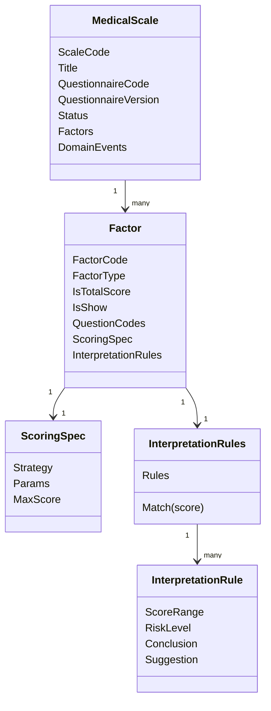
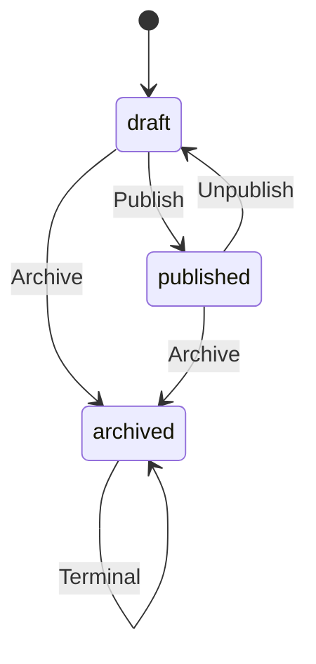

# MedicalScale 模型：MedicalScale / Factor / Interpretation

> 本文是 Scale 模块文档的第二篇。
>
> README 已经说明：Scale 是 qs-server 的医学量表规则域，负责定义“怎么算、怎么解释”，不负责保存答卷，也不负责执行测评。
>
> 本文聚焦 Scale 内部规则模型：`MedicalScale` 如何作为规则聚合根；`Factor` 如何表达测量维度；`ScoringSpec` 如何收口计分规格；`InterpretationRules` 如何表达分数区间、风险等级、结论和建议；发布态规则为什么必须冻结；Scale 规则模型与 Evaluation 结果模型的边界在哪里。

---

## 1. 结论先行

`MedicalScale` 是 Scale 模块的规则聚合根。

它表达一份医学量表规则，而不是一次测评结果。

它负责把以下规则对象收口到同一个一致性边界内：

```text
MedicalScale      量表规则聚合根
Factor            因子规则实体
ScoringSpec       计分规格值对象
ScoringParams     计分参数值对象
InterpretationRules 解读规则集合值对象
InterpretationRule  单条解读规则值对象
RiskLevel         规则中的风险等级枚举
ScaleChangedEvent 规则变化领域事件
```

一句话概括：

> **MedicalScale 是一份可设计、可发布、可冻结、可追溯的医学量表规则聚合。**

这篇文档只讲 Scale 内部规则模型。

```text
问卷绑定链路 -> 02-问卷与量表链路-问卷绑定.md
测评执行链路 -> 03-量表与测评链路-分数计算引擎与测评分析引擎.md
分层事实源索引 -> 04-Scale模块分层架构与事实源索引.md
```

---

## 2. 本文边界

本文重点：

```text
MedicalScale 聚合根；
MedicalScale 生命周期；
Factor 因子规则实体；
ScoringSpec 计分规格；
InterpretationRules 解读规则集合；
InterpretationRule 单条解读规则；
RiskLevel 规则等级；
规则冻结与发布前校验；
Scale 规则模型与 Evaluation 结果模型边界。
```

本文不展开：

```text
QuestionnaireBindingResolver；
QuestionnaireCatalog；
Factor.QuestionCodes 与 Survey Question 的绑定校验；
EvaluationEngine 的完整 pipeline；
Worker 消费事件；
Outbox 出站实现。
```

这些由后续文档承接。

---

## 3. Scale 规则模型总览

Scale 内部模型可以抽象为：



这套模型的核心语义是：

```text
MedicalScale 定义一份量表规则；
Factor 定义一个测量维度；
ScoringSpec 定义这个维度如何计分；
InterpretationRules 定义这个维度的分数如何解释；
Evaluation 使用这些规则产出某次测评结果。
```

---

# 第一部分：MedicalScale 聚合根

---

## 4. 为什么 MedicalScale 是聚合根

Scale 模块中有多个规则对象：

```text
MedicalScale；
Factor；
ScoringSpec；
ScoringParams；
InterpretationRules；
InterpretationRule；
RiskLevel。
```

其中 `MedicalScale` 是聚合根，因为它负责保护跨对象一致性。

例如：

```text
一份量表下的 FactorCode 不能重复；
一份量表最多只能有一个总分因子；
发布态量表必须绑定明确 QuestionnaireVersion；
发布态量表必须包含可执行因子规则；
发布态和归档态不允许修改规则字段；
规则变更后需要产生 ScaleChangedEvent。
```

这些规则不是单个 `Factor` 能独立保护的。

因此，必须由 `MedicalScale` 作为统一入口维护。

外部不应该直接修改聚合内部的 `Factor / ScoringSpec / InterpretationRules`。

正确方式是：

```text
MedicalScale.AddFactor
MedicalScale.UpdateFactor
MedicalScale.RemoveFactor
MedicalScale.ReplaceFactors
MedicalScale.UpdateFactorInterpretRules
MedicalScale.AddFactorInterpretRule
MedicalScale.Publish
MedicalScale.Archive
```

---

## 5. MedicalScale 的核心结构

`MedicalScale` 可以抽象为：

```text
MedicalScale
├── ID
├── ScaleCode
├── Title
├── Description
├── Category
├── Stages
├── ApplicableAges
├── Reporters
├── Tags
├── QuestionnaireCode
├── QuestionnaireVersion
├── Status
├── Factors
├── CreatedBy / CreatedAt
├── UpdatedBy / UpdatedAt
└── DomainEvents
```

这些字段可以分成四类。

| 类型 | 字段 | 说明 |
| --- | --- | --- |
| 标识信息 | ID / ScaleCode | 识别一份 MedicalScale |
| 展示信息 | Title / Description / Category / Tags 等 | 用于后台管理、前台展示和检索 |
| 规则信息 | QuestionnaireCode / QuestionnaireVersion / Factors | 决定 Evaluation 如何执行量表 |
| 治理信息 | Status / Audit / Events | 生命周期、审计和事件出站 |

其中最重要的是：

```text
QuestionnaireCode + QuestionnaireVersion + Factors
```

它们共同决定：

```text
这份量表基于哪份问卷；
每个因子看哪些题；
每个因子如何计分；
每个分数区间如何解释。
```

---

## 6. MedicalScale 的核心不变量

`MedicalScale` 至少需要保护以下不变量。

| 不变量 | 说明 |
| --- | --- |
| ScaleCode 不能为空 | 量表必须有稳定业务编码 |
| Title 不能为空 | 量表必须具备基本展示名称 |
| FactorCode 不能重复 | 同一量表内因子编码必须唯一 |
| 总分因子最多一个 | 避免总分计算和报告展示歧义 |
| 发布态必须绑定问卷 | Evaluation 需要知道规则基于哪份问卷 |
| 发布态必须绑定问卷版本 | 保证规则可追溯到确定 QuestionnaireVersion |
| 发布态必须有可执行因子 | 防止半成品规则进入 Evaluation |
| 发布态规则冻结 | 防止历史 Evaluation 被后续编辑污染 |
| 归档态不可编辑 | 归档后退出正常维护链路 |

这些不变量说明：

```text
MedicalScale 不能被当成普通 DTO 或数据库记录直接更新；
所有规则变更都应通过聚合行为或领域服务进入。
```

---

## 7. 展示信息与规则信息

`MedicalScale` 内部需要区分两类信息。

```text
展示信息；
规则信息。
```

### 7.1 展示信息

展示信息包括：

```text
Title；
Description；
Category；
Stages；
ApplicableAges；
Reporters；
Tags。
```

它们主要服务于：

```text
后台管理；
前台展示；
筛选检索；
运营分类。
```

展示信息通常不改变 Evaluation 结果。

因此，在业务允许的情况下，发布态可以继续修改部分展示信息。

### 7.2 规则信息

规则信息包括：

```text
QuestionnaireCode；
QuestionnaireVersion；
Factors；
Factor.QuestionCodes；
ScoringSpec；
InterpretationRules。
```

它们会直接影响 Evaluation 结果。

因此，一旦量表发布，这些字段必须冻结。

如果允许发布后继续改规则，会出现严重问题：

```text
同一份 AnswerSheet 在不同时间得到不同结果；
历史报告无法解释当时使用的规则；
线上评估结果被后台编辑污染；
统计数据失去可追溯性。
```

所以 `MedicalScale` 必须在领域层保护规则冻结，而不是只依赖前端按钮、接口权限或后台约定。

---

## 8. MedicalScale 生命周期

`MedicalScale` 的生命周期可以抽象为三种核心状态：

```text
draft；
published；
archived。
```



### 8.1 Draft：规则设计态

`draft` 表示量表仍在设计中。

允许：

```text
编辑展示信息；
绑定或更新 QuestionnaireVersion；
添加因子；
更新因子；
删除因子；
替换因子集合；
修改 ScoringSpec；
修改 InterpretationRules；
同步最新 QuestionnaireVersion。
```

草稿态可以是不完整的。

例如：

```text
可以没有完整因子；
可以没有解读规则；
可以暂时没有总分因子；
可以暂时未绑定问卷版本。
```

因为草稿只是规则设计过程，不会被 Evaluation 正式使用。

### 8.2 Published：规则发布态

`published` 表示量表规则已经可以被 Evaluation 使用。

发布态必须满足：

```text
基础信息合法；
已绑定 QuestionnaireCode；
已绑定 QuestionnaireVersion；
存在可执行因子；
存在总分因子；
因子规则合法；
计分规格合法；
解读规则合法。
```

发布态的核心语义是：

```text
规则完整；
规则可执行；
规则被冻结。
```

发布态允许的操作应该非常谨慎。

| 操作 | 是否允许 | 说明 |
| --- | --- | --- |
| 修改标题 / 描述 / 标签 | 可按业务允许 | 展示信息，不改变规则计算 |
| 修改因子 | 不允许 | 会改变规则事实 |
| 修改 ScoringSpec | 不允许 | 会改变计分结果 |
| 修改 InterpretationRules | 不允许 | 会改变解释结果 |
| 修改 QuestionnaireVersion | 不允许 | 会改变规则基准问卷 |
| Unpublish | 允许 | 回到草稿态或维护态 |
| Archive | 允许 | 退出正常业务链路 |

### 8.3 Archived：归档态

`archived` 表示量表退出正常业务链路。

归档态不允许继续编辑。

归档不等于删除。

历史 Evaluation 仍可能引用归档量表，因此归档后的规则仍需要可查询、可审计、可追溯。

---

## 9. 规则冻结语义

规则冻结是 `MedicalScale` 最关键的生命周期语义之一。

规则冻结保护的是：

```text
Questionnaire binding；
Factor 集合；
Factor.QuestionCodes；
ScoringSpec；
InterpretationRules。
```

### 9.1 为什么规则冻结必须在领域层做

如果只在前端隐藏按钮或接口层判断状态，仍然可能被绕过。

例如：

```text
后台脚本直接调用 application service；
另一个 handler 忘记判断状态；
测试或迁移代码直接调用聚合方法；
后续新功能绕过旧检查。
```

因此，规则冻结必须由 `MedicalScale` 自己保护。

规则变更方法在执行前应先判断：

```text
当前状态是否允许编辑规则？
```

如果不允许，应返回领域错误。

### 9.2 展示信息为什么可以单独处理

不是所有字段都需要冻结。

例如标题、描述、标签可能只是展示信息。

如果它们不影响 Evaluation 结果，可以允许发布后修改。

所以 `MedicalScale` 需要区分：

```text
ensureRuleEditable：保护规则字段；
ensureDisplayEditable：保护展示字段。
```

这种区分可以避免两个极端：

```text
所有字段发布后都不能改，导致运营维护困难；
所有字段发布后都能改，导致规则事实不稳定。
```

---

## 10. 发布前校验

发布不是简单状态切换。

发布意味着：

```text
这份 MedicalScale 规则已经可以被 Evaluation 正式执行。
```

因此，发布前必须做完整校验。

发布前校验至少包括：

```text
title 非空；
scaleCode 非空；
factors 非空；
存在且仅存在一个总分因子；
每个 factor 合法；
非总分 factor 绑定题目；
questionCodes 非空且不重复；
ScoringSpec 合法；
InterpretationRules 非空且不重叠；
RiskLevel 合法；
已绑定 QuestionnaireCode；
已绑定 QuestionnaireVersion。
```

这些校验共同保证：

```text
Evaluation 可以安全加载并执行这份规则。
```

---

# 第二部分：Factor 与 ScoringSpec

---

## 11. Factor 的模型定位

`Factor` 是 `MedicalScale` 聚合内部的规则实体。

它表达：

```text
这份量表中的一个测量维度或总分维度。
```

它负责定义：

```text
这个因子叫什么；
这个因子是什么类型；
这个因子是否是总分因子；
这个因子是否展示；
这个因子关联哪些题；
这个因子如何计分；
这个因子的分数如何解释。
```

它不负责表达：

```text
某次测评中这个因子实际得了多少分；
某次测评中命中了哪个风险等级；
某次测评报告如何展示。
```

这些属于 Evaluation。

一句话：

> **Factor 是规则实体，FactorScore 才是执行结果。**

---

## 12. Factor 的核心结构

`Factor` 可以抽象为：

```text
Factor
├── FactorCode
├── Title / Description
├── FactorType
├── IsTotalScore
├── IsShow
├── QuestionCodes
├── ScoringSpec
└── InterpretationRules
```

字段语义如下。

| 字段 | 语义 |
| --- | --- |
| FactorCode | 因子编码，同一 MedicalScale 内唯一 |
| Title / Description | 因子展示信息 |
| FactorType | 因子类型，例如 domain / total 等 |
| IsTotalScore | 是否总分因子 |
| IsShow | 是否在报告或前台结果中展示 |
| QuestionCodes | 参与该因子计算的题目编码 |
| ScoringSpec | 该因子的计分规格 |
| InterpretationRules | 该因子的解读规则集合 |

Factor 的核心不是展示维度，而是：

```text
QuestionCodes + ScoringSpec + InterpretationRules
```

它们共同决定：

```text
读取哪些答案；
如何计算分数；
如何解释分数。
```

---

## 13. FactorCode 与唯一性

`FactorCode` 是 MedicalScale 内部识别因子的稳定编码。

它需要在同一份 MedicalScale 内保持唯一。

原因是：

```text
Evaluation 需要通过 FactorCode 标识结果；
ReportBuilder 需要通过 FactorCode 组织章节；
RuleSnapshot 需要引用 FactorCode；
后续规则演进需要稳定引用因子。
```

唯一性应由 `MedicalScale` 保护，而不是由单个 `Factor` 自己保护。

---

## 14. IsTotalScore 与总分因子

总分因子用于表达整份量表的总分规则。

一份 MedicalScale 通常最多只能有一个总分因子。

原因是：

```text
多个总分因子会导致总分语义不清楚；
Evaluation 不知道哪个总分用于总风险等级；
ReportBuilder 不知道哪个结果作为总览；
Statistics 不知道哪个总分参与汇总。
```

是否必须有总分因子，是发布前校验策略。

当前医学量表通常建议：

```text
发布态必须有且仅有一个总分因子。
```

---

## 15. IsShow 的语义

`IsShow` 表示该因子是否在结果或报告中展示。

它不等于是否参与计算。

可能存在：

```text
参与计算但不展示的中间因子；
展示但不参与总分的维度因子；
总分因子展示在报告摘要中。
```

因此，Evaluation / ReportBuilder 消费时应区分：

```text
用于计算；
用于解释；
用于展示。
```

---

## 16. QuestionCodes 的语义

`QuestionCodes` 表示该因子需要读取哪些题目的答案参与计算。

它必须结合 MedicalScale 的问卷绑定解释。

```text
MedicalScale.QuestionnaireCode = ADHD_PARENT
MedicalScale.QuestionnaireVersion = 1.0.0
Factor.QuestionCodes = [Q001, Q002, Q003]
```

含义是：

```text
这个因子基于 ADHD_PARENT 1.0.0 版本问卷中的 Q001 / Q002 / Q003 计算。
```

`QuestionCodes` 不是 Question 对象。

Scale 不拥有 Survey 的 Question。

Scale 只保存题目编码引用。

具体的绑定校验放在：

```text
02-问卷与量表链路-问卷绑定.md
```

---

## 17. ScoringSpec 的模型定位

`ScoringSpec` 是计分规格值对象。

它负责收口：

```text
Strategy；
Params；
MaxScore。
```

它表达的是规则定义，不是执行结果。

```text
ScoringSpec 属于 Scale；
ScoreCalculator 属于 Evaluation；
FactorScore 属于 Evaluation。
```

一句话：

> **ScoringSpec 定义怎么计分，ScoreCalculator 执行计分。**

---

## 18. ScoringSpec 的核心结构

`ScoringSpec` 可以抽象为：

```text
ScoringSpec
├── Strategy
├── Params
└── MaxScore
```

| 字段 | 语义 |
| --- | --- |
| Strategy | 计分策略编码，例如 sum / average / weighted 等 |
| Params | 计分策略参数 |
| MaxScore | 理论最大分或规则定义最大值 |

ScoringSpec 应保护：

```text
Strategy 合法；
Params 与 Strategy 匹配；
MaxScore 合法；
必要参数存在。
```

---

## 19. ScoringSpec 与 Answer.Score 的关系

Survey 中的 `Answer.Score` 是单题基础分。

Scale 中的 `ScoringSpec` 定义如何聚合这些基础分。

例如：

```text
Answer.Score: Q001=1, Q002=2, Q003=0
ScoringSpec.Strategy = sum
FactorScore = 1 + 2 + 0 = 3
```

边界如下。

| 概念 | 归属 | 说明 |
| --- | --- | --- |
| OptionScore | Survey / Questionnaire | 选项基础分配置 |
| Answer.Score | Survey / AnswerSheet | 单题基础分事实 |
| ScoringSpec | Scale | 因子计分规则 |
| ScoreCalculator | Evaluation | 执行计分策略 |
| FactorScore | Evaluation | 某次执行结果 |

---

## 20. 为什么 ScoringSpec 不执行计算

如果 ScoringSpec 自己读取 AnswerSheet 并执行计算，会导致：

```text
Scale 依赖 Survey 答卷事实；
Scale 产生 Evaluation 结果；
规则域和执行域混杂；
后续 MBTI / Big Five 等模型难以并列接入。
```

正确方式是：

```text
Scale 定义 ScoringSpec；
Evaluation 的 ScoreCalculator 执行 ScoringSpec；
Evaluation 保存 FactorScore。
```

---

# 第三部分：InterpretationRules 与 RiskLevel

---

## 21. InterpretationRule 的模型定位

`InterpretationRule` 是单条解读规则值对象。

它表达：

```text
某个分数区间对应什么风险等级、结论和建议。
```

可以抽象为：

```text
InterpretationRule
├── ScoreRange
├── RiskLevel
├── Conclusion
└── Suggestion
```

例如：

```text
[0, 10)  -> none   -> 表现正常
[10, 20) -> low    -> 轻度风险
[20, 30) -> medium -> 中度风险
[30, 40) -> high   -> 高度风险
```

---

## 22. ScoreRange 的边界语义

分数区间推荐使用左闭右开：

```text
[min, max)
```

原因是：

```text
相邻区间更容易衔接；
边界值不会重复命中；
区间排序和校验更简单；
与多数编程语言区间习惯一致。
```

例如：

```text
[0, 10)
[10, 20)
[20, 30)
```

score = 10 时，只命中第二个区间。

---

## 23. InterpretationRules 为什么不是裸 slice

`InterpretationRules` 是规则集合值对象。

它不应该只是：

```text
[]InterpretationRule
```

因为多条规则之间存在集合级不变量。

它至少需要保护：

```text
每条规则合法；
ScoreRange 合法；
区间不重叠；
规则排序稳定；
给定 score 最多命中一条规则。
```

这些不变量不是单条 `InterpretationRule` 能独立保护的。

因此，需要 `InterpretationRules` 作为集合值对象。

---

## 24. InterpretationRules.Match(score)

`InterpretationRules` 可以提供：

```text
Match(score)
```

它表达：

```text
给定一个分数，命中哪条解读规则。
```

注意边界：

```text
Match 返回规则定义；
Evaluation 保存命中结果。
```

也就是说：

```text
InterpretationRule 属于 Scale；
InterpretationResult 属于 Evaluation。
```

Evaluation 调用 Match 后，不应该只保存 RiskLevel。

更稳妥的是保存命中规则快照：

```text
FactorCode；
Score；
ScoreRange；
RiskLevel；
Conclusion；
Suggestion。
```

---

## 25. RiskLevel 的语义

`RiskLevel` 在 Scale 中是规则等级。

它表示：

```text
某条 InterpretationRule 可以命中的风险等级。
```

它不是某次测评的结果本身。

边界如下。

| 概念 | 归属 | 说明 |
| --- | --- | --- |
| RiskLevel | Scale | 规则中定义的可命中等级 |
| RiskLevelResult | Evaluation | 某次测评命中的等级结果 |
| Report Label / Color | Report / Frontend | 展示层表达 |

因此，不应该给 Factor 一个固定 RiskLevel。

因为：

```text
Factor 本身没有固定风险等级；
风险等级取决于本次 FactorScore 命中了哪条 InterpretationRule。
```

---

## 26. Conclusion / Suggestion 的边界

`Conclusion` 和 `Suggestion` 是规则文案模板。

它们属于 Scale 规则定义的一部分。

但最终报告不是简单拼接这些字段。

ReportBuilder 可能要处理：

```text
选择哪些因子展示；
按风险等级排序；
合并重复建议；
补充总评；
生成章节结构；
根据受试者年龄、角色、场景调整表达；
结合多个因子给出综合建议。
```

所以边界是：

```text
Scale 定义可命中的文案模板；
Evaluation 产生命中结果；
ReportBuilder 组织最终报告。
```

---

# 第四部分：规则封装、事件与应用层协作

---

## 27. FactorSnapshot 与聚合封装

Factor 是聚合内部实体。

如果外部直接拿到 `*Factor` 指针，就可能绕过 `MedicalScale` 修改规则。

因此，对外查询应该使用：

```text
FactorSnapshot
```

而不是可变实体指针。

这符合聚合封装原则：

```text
内部可以使用实体；
外部只拿只读快照；
所有规则变更都经过聚合根行为方法。
```

---

## 28. 领域事件

`MedicalScale` 在状态或规则发生变化时，需要产生领域事件。

核心事件可以抽象为：

```text
ScaleChangedEvent
```

事件动作包括：

```text
created；
updated；
published；
unpublished；
archived；
deleted。
```

推荐方式是：

```text
领域行为产生事件；
application service 发布聚合收集到的事件。
```

例如：

```text
MedicalScale.AddFactor -> add ScaleChangedEvent；
MedicalScale.Publish -> add ScaleChangedEvent；
ApplicationService -> PublishCollectedEvents。
```

不推荐 application service 手动拼接领域事件。

原因是：

```text
事件代表领域事实变化；
领域事实变化应由领域模型自己感知；
application 只是编排和出站。
```

---

## 29. 应用层如何使用 MedicalScale

应用层服务负责把外部命令转成领域行为。

### 29.1 创建量表

```text
CreateScaleCommand
  -> 校验基础参数
  -> 解析/校验 Questionnaire binding
  -> NewMedicalScale
  -> Repository.Create
  -> PublishCollectedEvents
```

创建后的量表通常处于 `draft`。

### 29.2 更新基础信息

```text
UpdateBasicInfoCommand
  -> Repository.GetByCode
  -> BaseInfo.UpdateBasicInfo
  -> Repository.Update
  -> PublishCollectedEvents
  -> RefreshCache
```

展示信息是否允许发布后修改，由领域服务和聚合状态共同决定。

### 29.3 更新问卷绑定

问卷绑定属于规则字段。

```text
UpdateQuestionnaireCommand
  -> validate questionnaire exists/version/type
  -> Repository.GetByCode
  -> BaseInfo.UpdateQuestionnaire
  -> MedicalScale.ensureRuleEditable
  -> Repository.Update
  -> PublishCollectedEvents
```

发布态不应该允许直接修改问卷绑定。

### 29.4 编辑因子规则

```text
Add / Update / Remove / Replace Factor Command
  -> DTO to Factor / ScoringSpec / InterpretationRules
  -> Repository.GetByCode
  -> MedicalScale factor behavior
  -> Repository.Update
  -> PublishCollectedEvents
  -> RefreshCache
```

application service 负责组装命令，不负责绕过领域模型判断规则是否可编辑。

### 29.5 发布量表

```text
PublishCommand
  -> Repository.GetByCode
  -> Lifecycle.Publish
  -> Validator.ValidateForPublish
  -> MedicalScale.publish
  -> Repository.Update
  -> PublishCollectedEvents
  -> RefreshCache
```

发布后，规则字段被冻结。

---

## 30. 当前模型成熟度评价

| 方面 | 评价 |
| --- | --- |
| 聚合根边界 | MedicalScale 作为规则聚合根成立 |
| 生命周期语义 | draft / published / archived 边界清楚 |
| 规则冻结 | published / archived 下规则字段不可编辑 |
| Factor 模型 | 能表达测量维度、总分因子、题目引用和展示策略 |
| ScoringSpec | 能收口计分策略、参数和最大分 |
| InterpretationRules | 能保护区间不重叠、唯一匹配等集合不变量 |
| RiskLevel 边界 | 规则等级与本次结果等级已区分 |
| 聚合封装 | FactorSnapshot 可以避免外部持有可变实体 |
| 领域事件 | ScaleChangedEvent 表达规则事实变化 |
| Evaluation 边界 | 规则模型与执行结果边界清楚 |

综合判断：

```text
Scale 内部规则模型已经具备清晰聚合边界，可以作为 qs-server 中“规则域建模”的核心样板。
```

---

## 31. 后续演进方向

### 31.1 ScaleVersion

当前 `MedicalScale` 已经通过发布态冻结保证规则稳定。

但更完整的规则事实源应该支持：

```text
MedicalScaleCode + MedicalScaleVersion
```

这样每一次发布都可以形成一个明确规则版本。

未来可以设计：

```text
draft 编辑下一版本；
publish 冻结该版本；
Evaluation 记录 MedicalScaleCode + MedicalScaleVersion。
```

### 31.2 RuleSnapshot

Evaluation 执行时可以保存规则快照。

这样即使 Scale 后续归档、迁移或重构，历史 Evaluation 仍然可以解释：

```text
当时使用了哪些因子；
当时如何计分；
当时分数区间如何解释。
```

### 31.3 EvaluationModelRef

未来如果支持 MBTI、Big Five、DISC 等模型，Evaluation 不应该只依赖 MedicalScale。

需要抽象：

```text
EvaluationModelRef
├── Type
├── Code
├── Version
└── Title
```

当前 MedicalScale 可以作为：

```text
Type = medical_scale
```

的规则模型接入 Evaluation。

---

## 32. 不建议做的事情

| 不建议 | 原因 |
| --- | --- |
| 发布后继续修改 Factor / ScoringSpec / InterpretationRules | 会破坏历史评估可追溯性 |
| 自动同步 published scale 的 QuestionnaireVersion | 会改变已发布规则基准 |
| 让 application service 直接修改 MedicalScale 字段 | 会绕过聚合不变量 |
| 对外暴露可变 `*Factor` 指针 | 会破坏聚合封装 |
| 在 MedicalScale 中保存 FactorScore | FactorScore 是 Evaluation 结果 |
| 在 MedicalScale 中生成 Report | Report 属于 Evaluation / ReportBuilder |
| 把 MBTI 规则塞进 MedicalScale | MBTI 应是同级规则域，不是 MedicalScale 的子类型 |
| 给 Factor 设置固定 RiskLevel | RiskLevel 取决于本次 score 命中规则，不是 Factor 固定属性 |

---

## 33. 代码锚点

| 主题 | 路径 |
| --- | --- |
| MedicalScale 聚合根 | `internal/apiserver/domain/scale/medical_scale.go` |
| Factor 因子实体 | `internal/apiserver/domain/scale/factor.go` |
| ScoringSpec 计分规格 | `internal/apiserver/domain/scale/scoring_spec.go` |
| InterpretationRules 规则集 | `internal/apiserver/domain/scale/interpretation_rules.go` |
| InterpretationRule 单条规则 | `internal/apiserver/domain/scale/interpretation_rule.go` |
| Scale 类型和值对象 | `internal/apiserver/domain/scale/types.go` |
| Scale 生命周期服务 | `internal/apiserver/domain/scale/lifecycle.go` |
| Scale 基础信息服务 | `internal/apiserver/domain/scale/baseinfo.go` |
| Scale 发布校验器 | `internal/apiserver/domain/scale/validator.go` |
| Scale 领域错误 | `internal/apiserver/domain/scale/errors.go` |
| Scale 领域事件 | `internal/apiserver/domain/scale/events.go` |
| 生命周期应用服务 | `internal/apiserver/application/scale/lifecycle_service.go` |
| 生命周期创建流程 | `internal/apiserver/application/scale/lifecycle_creation_workflow.go` |
| 基础信息更新流程 | `internal/apiserver/application/scale/lifecycle_basic_info_workflow.go` |
| 因子应用服务 | `internal/apiserver/application/scale/factor_service.go` |
| 因子命令组装 | `internal/apiserver/application/scale/factor_command_assembler.go` |
| DTO 转换 | `internal/apiserver/application/scale/converter.go` |

---

## 34. Verify

修改 `MedicalScale / Factor / ScoringSpec / InterpretationRules` 后，建议执行：

```bash
go test ./internal/apiserver/domain/scale/...
go test ./internal/apiserver/application/scale/...
```

如果改动涉及 Survey 问卷绑定：

```bash
go test ./internal/apiserver/application/survey/...
go test ./internal/apiserver/application/scale/...
```

如果改动涉及 Evaluation 规则消费：

```bash
go test ./internal/apiserver/application/evaluation/...
go test ./internal/worker/...
```

全量质量入口：

```bash
make test
make lint
make docs-hygiene
```

---

## 35. 面试与宣讲口径

### 35.1 30 秒版本

```text
MedicalScale 是 Scale 模块的规则聚合根，它表达一份医学量表规则，而不是测评结果。
它内部管理问卷版本绑定、Factor 因子集合、ScoringSpec 计分规格、InterpretationRules 解读规则和生命周期状态。
draft 可以编辑规则，published 必须通过完整性校验并冻结规则字段，archived 退出正常维护链路。
这样可以保证 Evaluation 使用的量表规则稳定、可追溯，不会被后台编辑污染历史结果。
```

### 35.2 3 分钟版本

```text
Scale 模块解决的是“量表规则可信”的问题。

MedicalScale 是医学量表规则的聚合根。它不是一张普通配置表，而是一份可设计、可发布、可冻结、可追溯的规则事实。

MedicalScale 内部包含多个 Factor。Factor 是规则实体，用来定义一个测量维度关联哪些题、是否是总分因子、如何计分、如何解释。具体的计分策略由 ScoringSpec 收口，它定义 Strategy、Params 和 MaxScore。分数解释由 InterpretationRules 收口，它不是普通 slice，而是带集合级不变量的规则集合，需要保证分数区间合法、不重叠、给定 score 最多命中一条规则。

MedicalScale 的生命周期分为 draft、published、archived。draft 是规则设计态，允许逐步补全因子、计分和解读规则。published 是规则发布态，发布前必须校验问卷绑定、因子、总分因子、计分规格和解读规则完整性。发布后，因子、计分规格、解读规则和问卷版本绑定都会被冻结。archived 表示退出正常业务链路，不允许继续编辑。

这个设计的核心价值是保证 Scale 是稳定的规则事实源。Survey 提供 AnswerSheet，Scale 提供 MedicalScale 规则，Evaluation 执行规则并产出 FactorScore、RiskLevelResult 和 Report。三者边界清楚，系统后续才容易接入 MBTI 等新的测评模型。
```

### 35.3 高频追问

| 追问 | 回答要点 |
| --- | --- |
| MedicalScale 为什么是聚合根？ | 它保护跨 Factor 的不变量，例如因子编码唯一、总分因子唯一、发布前完整性和规则冻结 |
| Factor 是什么？ | Factor 是 MedicalScale 内部的规则实体，定义测量维度、题目引用、计分规格和解读规则 |
| FactorScore 属于 Scale 吗？ | 不属于，FactorScore 是 Evaluation 的执行结果 |
| ScoringSpec 做什么？ | 定义计分策略、参数和最大分，具体执行由 Evaluation 的 ScoreCalculator 完成 |
| InterpretationRules 为什么不是裸 slice？ | 多条规则之间有区间不重叠、排序和唯一匹配等集合级不变量 |
| draft 和 published 的区别？ | draft 可编辑且允许不完整，published 必须完整可执行且规则冻结 |
| 为什么发布后不能改规则？ | 防止历史 Evaluation 结果被后台编辑污染，保证规则可追溯 |
| 为什么对外用 FactorSnapshot？ | 避免外部持有可变 Factor 指针绕过聚合修改规则 |
| MedicalScale 未来还缺什么？ | ScaleVersion / RuleSnapshot / EvaluationModelRef 是后续演进方向 |

---

## 36. 下一篇文档

下一篇建议维护：

```text
02-问卷与量表链路-问卷绑定.md
```

重点回答：

```text
Scale 为什么必须绑定 QuestionnaireCode + QuestionnaireVersion；
QuestionnaireBindingResolver / QuestionnaireCatalog 如何作为 Survey 防腐层；
Factor.QuestionCodes 如何引用 Survey 题目；
draft / published / archived 下问卷版本同步策略；
发布前如何校验 Factor.QuestionCodes 与 QuestionnaireVersion 的一致性。
```
