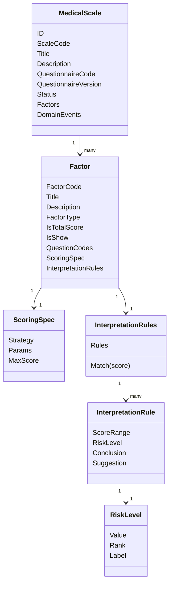
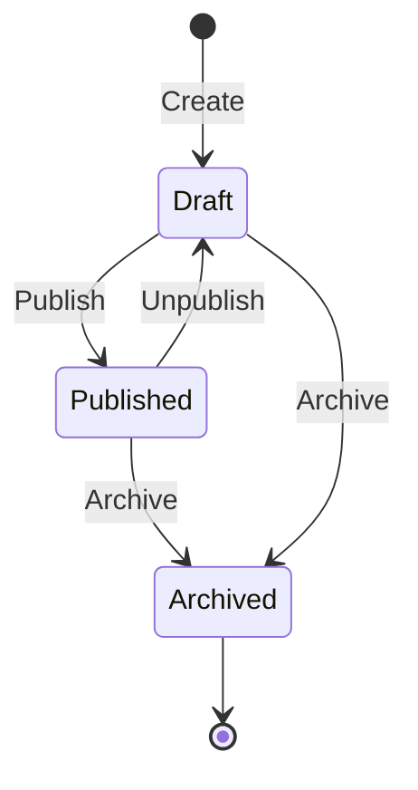
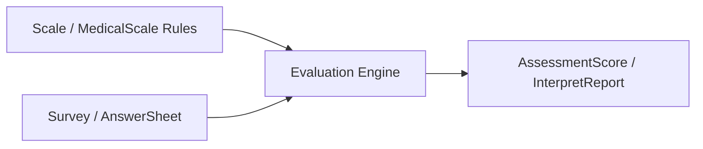

# 01-Scale模型：MedicalScale / Factor / Interpretation 模型设计

> 本文是 Scale 模块文档的第一篇，聚焦 **Scale 的领域模型设计**。
>
> Scale 模块的核心职责不是执行测评，也不是保存测评结果，而是维护一套可设计、可发布、可冻结、可追溯的 **医学量表解释规则**。
>
> 在新一轮文档体系中，Scale 应被理解为一种 **Interpretation Model（解释模型）实现**：它与未来的 MBTI、BigFive、职业兴趣测评等模型同级，负责提供“如何根据答卷解释结果”的规则；真正的执行引擎属于 Evaluation 模块。

---

## 1. 结论先行

Scale 模块的领域核心是 `MedicalScale` 聚合。

它表达一份医学/心理量表规则，而不是一次测评结果。

它负责把以下对象收口到同一个一致性边界内：

```text
MedicalScale          量表规则聚合根
Factor                因子规则实体
ScoringSpec           因子计分规格值对象
ScoringParams         计分参数值对象
InterpretationRules   因子解读规则集合值对象
InterpretationRule    单条分数区间解读规则值对象
RiskLevel             规则中的风险等级枚举/值对象
ScaleChangedEvent     规则变化领域事件
```

一句话概括：

> **MedicalScale 是一份可设计、可发布、可冻结、可追溯的医学量表解释模型。**

它只回答三类问题：

```text
这份量表规则是什么？
这份量表基于哪份问卷版本？
这份量表中的因子如何计分、如何解释？
```

它不回答这些问题：

```text
用户提交了什么答案？
某次测评实际算出了多少分？
某次测评命中了哪个风险等级？
某次测评报告如何保存？
某次测评失败后如何重试？
```

这些属于 Survey 和 Evaluation 模块。

---

## 2. 本文边界

本文只讲 Scale 模块的领域模型设计。

本文重点：

```text
MedicalScale 聚合根；
MedicalScale 生命周期；
MedicalScale 与 QuestionnaireVersion 的绑定关系；
Factor 因子规则实体；
ScoringSpec 计分规格；
InterpretationRules 解读规则集合；
InterpretationRule 单条解读规则；
RiskLevel 风险等级；
ScaleChangedEvent 规则变化事件；
Scale 作为 Interpretation Model 的定位。
```

本文不展开：

```text
Scale 创建、发布、因子维护、问卷绑定的应用服务流程；
Scale 查询服务、Snapshot、DTO、读模型；
Evaluation 如何加载 Scale 并执行测评；
AnswerSheet 如何提交与校验；
Mongo / MySQL / Cache / Outbox 的具体实现。
```

这些由后续文档承接：

```text
02-Scale 维护链路--生命周期-因子维护-问卷绑定.md
03-Scale 查询链路--查询服务与读模型.md
04-Scale 测评链路--Scale与Evaluation联动详解.md
05-Scale模块分层架构与事实源索引.md
```

---

## 3. Scale 在新文档体系中的位置

在旧文档中，Scale 经常被描述为：

```text
Scale 管“怎么算、怎么解释”
Evaluation 管“这一次测评执行后的结果”
```

这个说法在只支持医学量表时基本成立，但随着系统计划支持 MBTI，它需要进一步精确化。

更准确的终局表达应该是：

```text
Survey              管“用户提交了什么答卷事实”
InterpretationModel 管“某类测评模型如何解释答卷”
Scale               是 InterpretationModel 的医学量表实现
MBTI                是 InterpretationModel 的人格类型实现
Evaluation          管“如何执行一次测评、保存结果、生成报告、处理失败重试”
```

因此，Scale 不是所有测评解释规则的总包。

Scale 只是解释模型体系中的一种具体实现：

```text
Interpretation Model
├── Scale / MedicalScale
├── MBTI
├── BigFive
└── CareerInterest
```

这意味着：

```text
Scale 可以定义 MedicalScale / Factor / ScoringSpec / InterpretationRules；
Scale 不应该定义通用 Evaluation Pipeline；
Scale 不应该把 MBTI 这类人格类型模型塞进 MedicalScale；
Scale 不应该保存 AssessmentScore / InterpretReport；
Scale 不应该成为所有解释模型的大杂烩。
```

---

## 4. Scale 规则模型总览

Scale 内部模型可以抽象为：



这套模型的核心语义是：

```text
MedicalScale 定义一份量表规则；
Factor 定义一个测量维度；
ScoringSpec 定义这个维度如何计分；
InterpretationRules 定义这个维度的分数如何解释；
RiskLevel 定义规则命中后的风险等级语义；
Evaluation 消费这些规则，产出某次测评结果。
```

---

## 5. 为什么 MedicalScale 是聚合根

Scale 模块中存在多个规则对象：

```text
MedicalScale
Factor
ScoringSpec
ScoringParams
InterpretationRules
InterpretationRule
RiskLevel
```

这些对象不是彼此孤立的数据结构，而是共同构成一份可执行量表规则。

因此，必须由 `MedicalScale` 作为聚合根统一维护跨对象一致性。

典型不变量包括：

```text
一份量表下的 FactorCode 不能重复；
一份量表最多只能有一个总分因子；
发布态量表必须绑定明确的 QuestionnaireVersion；
发布态量表必须包含可执行的 Factor 规则；
发布态量表的规则字段必须冻结；
归档态量表不允许继续编辑；
规则变更后需要产生 ScaleChangedEvent。
```

这些规则不是单个 `Factor` 或 `ScoringSpec` 能独立保护的。

例如，`FactorCode` 唯一性必须在整份 `MedicalScale` 内判断。

再比如，“最多只能有一个总分因子”也必须由聚合根检查，因为单个 `Factor` 不知道其它 Factor 的存在。

所以外部代码不应该直接修改聚合内部对象。

错误方式：

```go
scale.Factors[i].ScoringSpec = newSpec
scale.Factors = append(scale.Factors, factor)
scale.Status = StatusPublished
```

正确方式：

```go
scale.AddFactor(factor)
scale.UpdateFactor(factorCode, command)
scale.ReplaceFactors(factors)
scale.Publish(now)
scale.Archive(now)
```

应用层负责组织用例，领域层负责保护规则。

---

## 6. MedicalScale 核心结构

`MedicalScale` 可以抽象为：

```text
MedicalScale
├── ID
├── ScaleCode
├── Title
├── Description
├── Category
├── Stages
├── ApplicableAges
├── Reporters
├── Tags
├── QuestionnaireCode
├── QuestionnaireVersion
├── Status
├── Factors
├── CreatedBy / CreatedAt
├── UpdatedBy / UpdatedAt
└── DomainEvents
```

这些字段可以分为四类。

| 类型 | 字段 | 说明 |
| --- | --- | --- |
| 标识信息 | ID / ScaleCode | 识别一份 MedicalScale |
| 展示信息 | Title / Description / Category / Tags | 后台管理、前台展示、检索 |
| 规则信息 | QuestionnaireCode / QuestionnaireVersion / Factors | 决定 Evaluation 如何消费规则 |
| 治理信息 | Status / Audit / Events | 生命周期、审计、事件出站 |

其中最重要的是：

```text
QuestionnaireCode + QuestionnaireVersion + Factors
```

它们共同决定：

```text
这份量表基于哪份问卷；
这份量表基于问卷的哪个版本；
每个因子读取哪些题；
每个因子如何计分；
每个因子如何解释。
```

---

## 7. MedicalScale 生命周期

MedicalScale 的生命周期可以抽象为三种核心状态：

```text
draft      草稿态，可编辑规则
published  发布态，可用于测评执行，规则冻结
archived   归档态，不再用于新测评，只保留历史事实
```

状态流转如下：



### 7.1 draft

`draft` 是量表创建后的设计态。

此时可以编辑：

```text
基础展示信息；
问卷绑定；
因子列表；
因子题目引用；
计分规则；
解释规则；
风险等级配置。
```

draft 的核心语义是：

> 规则还没有进入正式测评执行，可以被反复调整。

### 7.2 published

`published` 是正式可执行状态。

发布意味着：

```text
这份 MedicalScale 规则已经通过完整校验；
这份 MedicalScale 已经可以被 Evaluation 正式消费；
这份 MedicalScale 的规则字段必须冻结；
后续测评结果需要能够追溯到这份已发布规则。
```

发布态禁止修改规则字段。

禁止修改的典型字段包括：

```text
QuestionnaireCode
QuestionnaireVersion
Factors
Factor.QuestionCodes
Factor.ScoringSpec
Factor.InterpretationRules
RiskLevel
```

允许修改的字段应非常谨慎，通常只允许更新非规则展示信息，并且必须明确不会影响测评结果的可追溯性。

### 7.3 archived

`archived` 是归档态。

归档表示这份量表不再用于新的测评。

但是不能删除它，因为历史测评结果仍然需要追溯到当时使用的规则。

archived 的核心语义是：

```text
不再用于新测评；
不允许编辑规则；
可以用于历史查询、审计、报告追溯。
```

---

## 8. 规则冻结语义

规则冻结是 Scale 模块最关键的生命周期语义之一。

规则冻结保护的是：

```text
历史测评结果的可解释性；
历史报告的可追溯性；
用户看到的报告与当时规则之间的一致性；
线上测评执行的稳定性。
```

如果 published scale 可以自动同步最新 QuestionnaireVersion，会导致一个严重问题：

```text
同一个 MedicalScaleCode 下，今天和昨天执行的测评规则不一样；
历史 Assessment 无法说明当时到底按哪套题目和规则计算；
Report 中的解释内容可能不再对应原始答卷；
线上报告和后台规则发生漂移。
```

因此必须坚持：

> **published / archived 下，所有规则字段不可编辑。**

如果业务需要调整已发布量表，正确做法不是原地修改，而是：

```text
创建新版本；
或取消发布回到 draft 后重新发布；
或创建新的 MedicalScaleCode / Version；
并保持历史 Assessment 继续引用旧规则快照。
```

---

## 9. QuestionnaireRef：Scale 与 Survey 的稳定绑定

MedicalScale 不直接持有 Survey 的 `Questionnaire` 聚合对象。

它只持有稳定引用：

```text
QuestionnaireCode
QuestionnaireVersion
```

原因是：

```text
Questionnaire 的生命周期属于 Survey；
MedicalScale 的生命周期属于 Scale；
二者通过版本引用协作，而不是互相持有聚合对象；
MedicalScale 必须绑定明确的问卷版本，才能保证 Factor.QuestionCodes 的稳定性。
```

如果 Scale 只绑定 `QuestionnaireCode`，而不绑定 `QuestionnaireVersion`，会出现问题：

```text
问卷发布了新版本；
题目 code 被新增、删除或调整；
选项基础分发生变化；
Factor.QuestionCodes 仍然引用旧题目集合；
Evaluation 执行时无法判断当前规则对应哪个问卷版本。
```

因此，Scale 与 Survey 的绑定必须具备版本语义：

```text
MedicalScale.QuestionnaireCode
MedicalScale.QuestionnaireVersion
Factor.QuestionCodes
```

语义是：

> 这份 MedicalScale 规则基于某个确定的 QuestionnaireVersion 设计，因子题目引用必须存在于该问卷版本中。

---

## 10. Factor 因子规则实体

`Factor` 是 `MedicalScale` 聚合内部的规则实体。

它表达一个测量维度。

例如：

```text
注意力因子；
多动因子；
焦虑因子；
抑郁因子；
总分因子。
```

Factor 的核心结构可以抽象为：

```text
Factor
├── FactorCode
├── Title
├── Description
├── FactorType
├── IsTotalScore
├── IsShow
├── QuestionCodes
├── ScoringSpec
└── InterpretationRules
```

### 10.1 FactorCode

`FactorCode` 是 MedicalScale 内部识别因子的稳定编码。

它需要在同一份 MedicalScale 内保持唯一。

例如：

```text
attention
hyperactivity
anxiety
depression
total
```

唯一性必须由 `MedicalScale` 保护，而不是由单个 `Factor` 自己保护。

### 10.2 FactorType

`FactorType` 用于描述因子类型。

常见类型可以包括：

```text
domain  领域因子
total   总分因子
custom  自定义因子
```

是否需要保留独立的 `FactorType`，取决于代码当前实现。

但文档语义上应明确：

```text
领域因子用于描述某个测量维度；
总分因子用于描述整体得分；
展示因子与计算因子可以按业务需要区分。
```

### 10.3 IsTotalScore

一份 MedicalScale 通常最多只能有一个总分因子。

原因是：

```text
总分是整份量表的整体解释入口；
多个总分因子会导致 Evaluation 不知道哪个是整体风险；
Report 的整体结论也会出现歧义。
```

所以 `IsTotalScore = true` 的因子必须在聚合内唯一。

### 10.4 IsShow

`IsShow` 表示该因子是否在报告或前端中展示。

它解决的问题是：

```text
有些因子只用于中间计算；
有些因子需要在报告中展示；
有些因子参与总分，但不单独展示。
```

注意：`IsShow` 只影响展示，不应该影响计分规则本身。

### 10.5 QuestionCodes

`QuestionCodes` 表示这个因子读取哪些题目的答案参与计算。

例如：

```text
Factor.Attention.QuestionCodes = [Q001, Q002, Q003]
Factor.Hyperactivity.QuestionCodes = [Q004, Q005, Q006]
```

它是 Scale 与 Survey 的关键连接点。

它必须满足：

```text
每个 QuestionCode 必须存在于绑定的 QuestionnaireVersion 中；
QuestionCode 对应的题型必须适合该因子的 ScoringSpec；
published scale 下不允许修改 QuestionCodes。
```

---

## 11. ScoringSpec 计分规格

`ScoringSpec` 是因子的计分规格。

它描述：

```text
这个因子如何根据 QuestionCodes 对应的答案计算出一个分数。
```

它不描述：

```text
某次实际得分是多少；
某次答卷答案是什么；
某次计算是否成功；
某次报告如何展示。
```

这些属于 Evaluation。

### 11.1 ScoringSpec 的核心字段

ScoringSpec 可以抽象为：

```text
ScoringSpec
├── Strategy
├── Params
└── MaxScore
```

其中：

```text
Strategy  表示计分策略，例如 sum / average / weighted_sum；
Params    表示计分参数，例如权重、反向题、归一化参数；
MaxScore  表示理论最大分，用于解释区间校验和报告展示。
```

### 11.2 典型计分策略

常见策略包括：

```text
sum            对题目得分求和
average        对题目得分取平均
weighted_sum   按权重求和
reverse_sum    支持反向题的求和
custom         自定义规则
```

不建议在 Scale 文档中过早绑定某一种实现细节。

Scale 的模型层只需要表达：

> ScoringSpec 是因子计分规则的稳定描述，Evaluation 根据它执行具体计算。

### 11.3 ScoringSpec 不变量

ScoringSpec 至少应满足：

```text
Strategy 不能为空；
Params 必须符合 Strategy 要求；
MaxScore 不能为负；
如果使用 QuestionCodes，参数中的题目引用必须与 Factor.QuestionCodes 一致；
published scale 下不可修改。
```

---

## 12. InterpretationRules 解读规则集合

`InterpretationRules` 是一个因子的解读规则集合。

它负责回答：

```text
给定一个 factor score，应该命中哪条解释规则？
该分数对应什么风险等级？
该分数对应什么结论和建议？
```

它由多条 `InterpretationRule` 组成。

### 12.1 InterpretationRules 的职责

InterpretationRules 应负责：

```text
维护规则集合；
校验区间是否合法；
校验区间是否重叠；
按 score 匹配单条 InterpretationRule；
保证 published 前规则可执行。
```

它不应负责：

```text
保存某次命中结果；
生成完整报告；
修改 Assessment 状态；
决定 Worker 是否重试。
```

### 12.2 区间匹配语义

每条 InterpretationRule 通常包含一个分数区间。

例如：

```text
0  - 10   normal
11 - 20   low
21 - 30   medium
31 - 40   high
```

匹配时必须明确：

```text
区间边界是闭区间还是半开区间；
是否允许区间缺口；
是否允许默认规则；
多个规则同时命中时如何处理。
```

推荐语义：

```text
同一因子的解释区间不允许重叠；
同一个 score 最多命中一条规则；
如果没有命中，Evaluation 应返回明确错误或使用默认规则；
published 前应尽量校验区间覆盖完整性。
```

---

## 13. InterpretationRule 单条解读规则

`InterpretationRule` 是单条分数区间解读规则。

它可以抽象为：

```text
InterpretationRule
├── ScoreRange
├── RiskLevel
├── Conclusion
├── Suggestion
└── Extra
```

### 13.1 ScoreRange

`ScoreRange` 表示规则适用的得分范围。

它应保证：

```text
min <= max；
边界语义明确；
与同一 Factor 下其它规则不重叠。
```

### 13.2 RiskLevel

`RiskLevel` 表示命中后的风险等级。

它是规则中的等级标签，不是某次测评结果。

某次测评真正命中的等级，应由 Evaluation 生成 `RiskLevelResult` 或等价结果对象。

### 13.3 Conclusion / Suggestion

`Conclusion` 和 `Suggestion` 是命中该规则后的解释文本。

它们属于规则事实。

需要注意：

```text
规则中的文案是模板或静态解释；
报告中的最终内容可能还会经过 ReportBuilder 组合；
如果未来支持 AI 生成解释，AI 输出也不应该直接污染 MedicalScale 规则模型。
```

---

## 14. RiskLevel 风险等级

`RiskLevel` 是 Scale 规则中的风险等级。

它可以被设计为枚举，也可以被设计为值对象。

常见取值包括：

```text
none
low
medium
high
severe
```

RiskLevel 的核心语义是：

```text
表达规则命中后的等级标签；
支持报告排序和展示；
支持前端颜色、文案、图标等展示扩展；
不保存某次测评命中事实。
```

这里必须区分：

```text
RiskLevel          Scale 规则中的等级定义
RiskLevelResult    Evaluation 某次执行命中的等级结果
```

如果把 `RiskLevelResult` 放入 Scale，就会污染规则域。

---

## 15. ScaleChangedEvent 领域事件

当 MedicalScale 的规则事实发生变化时，应产生 Scale 领域事件。

典型场景：

```text
创建 MedicalScale；
更新 Questionnaire binding；
新增 Factor；
修改 Factor；
删除 Factor；
替换 Factors；
修改 ScoringSpec；
修改 InterpretationRules；
Publish；
Unpublish；
Archive。
```

事件语义必须稳定：

```text
ScaleChangedEvent 表达规则事实发生变化；
它不表达 Evaluation 已经重新执行；
它不表达历史 Report 已经刷新；
它不表达 AnswerSheet 已提交。
```

如果 ScaleChangedEvent 需要跨进程可靠出站，应由 Scale application / repository 的可靠边界负责。

它的典型用途包括：

```text
刷新 Scale 缓存；
通知读模型重建；
让后台管理端感知规则变化；
必要时触发某些下游维护任务。
```

但它不应该默认触发历史测评重算。

历史测评是否重算是单独业务决策，不能混入 Scale 规则事件的基础语义。

---

## 16. Scale 与 Evaluation 结果模型的边界

这是本文最关键的边界之一。

Scale 中存在：

```text
Factor
ScoringSpec
InterpretationRules
RiskLevel
```

Evaluation 中才应该存在：

```text
Assessment
FactorScore
TotalScore
RiskLevelResult
InterpretationResult
InterpretReport
```

二者关系如下：



规则与结果必须分离：

```text
Factor 是规则，FactorScore 是结果；
ScoringSpec 是规则，CalculatedScore 是结果；
InterpretationRule 是规则，InterpretationResult 是结果；
RiskLevel 是规则等级，RiskLevelResult 是某次命中结果；
MedicalScale 是规则聚合，Assessment 是执行聚合。
```

如果 Scale 保存结果，会导致：

```text
MedicalScale 既是规则又是运行时状态；
同一份规则被多次测评污染；
规则快照和历史报告难以追溯；
MBTI 等模型难以与 Scale 同级扩展。
```

因此，Scale 必须保持纯规则域。

---

## 17. Scale 作为 Interpretation Model 的实现

在未来多模型体系中，Scale 应被视为一种 Interpretation Model。

它与 MBTI 的关系不是父子关系，而是同级关系：

```text
Scale：基于医学量表、因子、计分规则、风险等级解释答卷；
MBTI：基于四组维度、人格类型、类型画像解释答卷；
BigFive：基于五大人格维度解释答卷；
CareerInterest：基于职业兴趣维度解释答卷。
```

因此，不应把 MBTI 塞进 Scale。

错误方向：

```text
MedicalScale 增加 MBTIType 字段；
Factor 强行表达 E/I、S/N、T/F、J/P；
RiskLevel 强行表达人格类型；
InterpretationRules 强行生成 MBTI profile。
```

正确方向：

```text
抽象 InterpretationModel；
Scale 实现 MedicalScale 规则模型；
MBTI 实现 MBTI 规则模型；
Evaluation 通过 ModelRef / Provider 选择具体模型；
各模型只负责自己的规则定义和解释语义。
```

Scale 文档应守住这个边界。

---

## 18. 模型维护原则

### 18.1 只通过聚合根修改规则

任何规则变更都应通过 `MedicalScale` 聚合根行为进入。

不建议让 application service 或 infra mapper 直接修改内部字段。

### 18.2 发布前做完整校验

发布前至少校验：

```text
ScaleCode 合法；
QuestionnaireCode / QuestionnaireVersion 已绑定；
Factors 非空；
FactorCode 唯一；
总分因子最多一个；
每个 Factor 的 QuestionCodes 非空且合法；
每个 Factor 的 ScoringSpec 合法；
每个 Factor 的 InterpretationRules 合法；
解释区间不重叠；
必要时校验解释区间覆盖完整得分范围。
```

### 18.3 published 规则不可变

发布后的规则必须冻结。

如果需要修改规则，应创建新版本或回到 draft 后重新发布，而不是原地修改已发布规则。

### 18.4 不跨聚合持有对象

MedicalScale 不应持有 Questionnaire 对象。

Factor 不应持有 Question 对象。

Scale 只保存稳定引用：

```text
QuestionnaireCode
QuestionnaireVersion
QuestionCode
```

### 18.5 不保存执行结果

Scale 不保存：

```text
AnswerSheet
Assessment
FactorScore
RiskLevelResult
InterpretationResult
InterpretReport
```

这些属于 Survey 或 Evaluation。

---

## 19. 常见误区

### 19.1 误区一：把 Factor 当成 FactorScore

错误理解：

```text
Factor 表示某次测评中的因子得分。
```

正确理解：

```text
Factor 是量表规则中的因子定义。
FactorScore 才是某次测评中的因子得分。
```

### 19.2 误区二：把 RiskLevel 当成结果

错误理解：

```text
RiskLevel 表示用户这次测评的风险结果。
```

正确理解：

```text
RiskLevel 是规则中的等级定义。
RiskLevelResult 才是某次测评命中的等级结果。
```

### 19.3 误区三：Scale 直接读取 AnswerSheet

错误方向：

```text
ScaleService 读取 AnswerSheet 并计算得分。
```

正确方向：

```text
Evaluation 读取 AnswerSheet 和 Scale 规则，然后执行测评。
```

### 19.4 误区四：published scale 自动同步最新问卷版本

错误方向：

```text
Questionnaire 发布新版本后，自动修改 published MedicalScale 的 QuestionnaireVersion。
```

正确方向：

```text
published scale 是规则事实，必须冻结。
草稿态可以同步最新问卷版本，发布态不可以自动同步。
```

### 19.5 误区五：把 MBTI 放进 Scale

错误方向：

```text
让 MedicalScale 同时承载医学量表和 MBTI。
```

正确方向：

```text
Scale 与 MBTI 都是 Interpretation Model 的具体实现。
Evaluation 通过统一模型引用加载不同解释模型。
```

---

## 20. 小结

Scale 模块的模型设计可以用一句话收束：

> **Scale 是医学量表解释规则域，MedicalScale 是规则聚合根，Factor / ScoringSpec / InterpretationRules 是其内部规则对象，Evaluation 只消费规则并保存执行结果。**

因此，Scale 文档第一篇必须建立三个核心认知：

```text
第一，MedicalScale 是聚合根，负责规则一致性；
第二，Scale 只保存规则，不保存任何一次测评结果；
第三，Scale 是 Interpretation Model 的一种实现，未来应与 MBTI 等模型同级接入 Evaluation。
```

只要守住这三点，Scale 模块就不会演变成测评系统里的“大杂烩模块”，也能为下一阶段的 MBTI 扩展和 Evaluation 通用化提供清晰的边界。