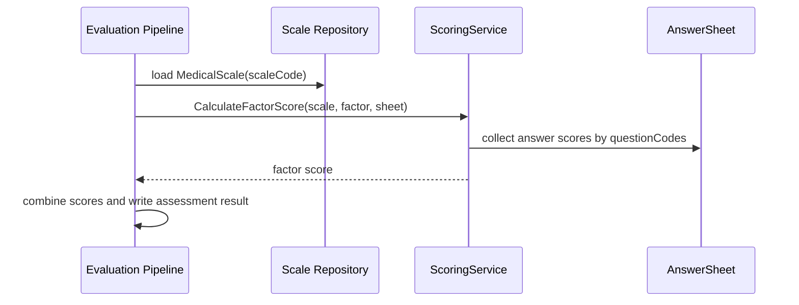
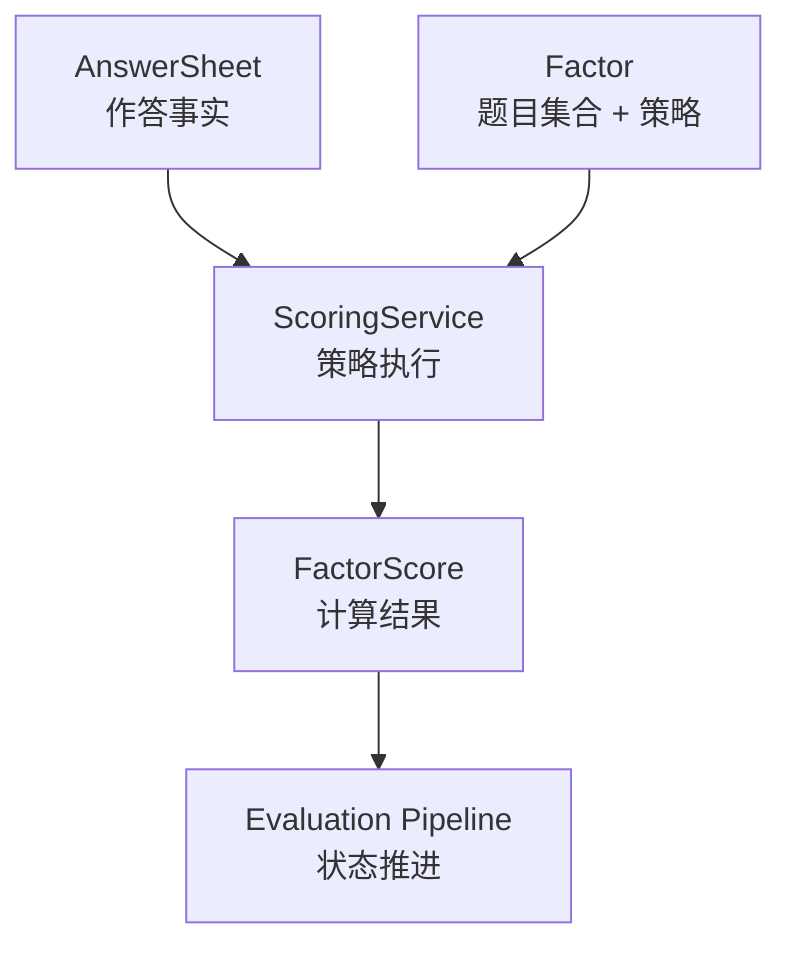
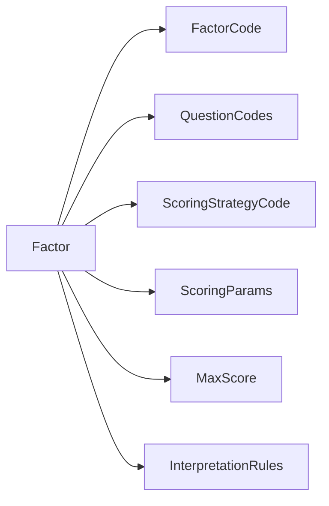

# 规则与因子计分

**本文回答**：Scale 如何用 Factor 和 ScoringStrategy 表达量表计分规则，以及新增计分能力时应该改哪里。

## 30 秒结论

| 维度 | 结论 |
| ---- | ---- |
| 因子角色 | `Factor` 是量表内可计分维度，关联一组 question code 和一个计分策略 |
| 策略执行 | `ScoringService.CalculateFactorScore` 根据因子策略从 AnswerSheet 收集题目分数并计算 |
| 当前策略 | 代码中至少包含 sum / avg 等策略分支，具体策略以 `ScoringStrategyCode` 为准 |
| 设计边界 | 计分策略只算分，不决定 Assessment 状态，也不写报告 |
| 扩展规则 | 新策略必须补领域测试、应用服务 DTO 转换、Evaluation pipeline 消费验证 |

## 这个子模型要解决什么问题

因子计分解决的是“同一份答卷怎样被不同规则维度解释”的问题。一个量表可能既有总分，也有多个分因子；每个因子可能引用不同题目集合，也可能采用不同计算方式。把这些规则直接写在 Evaluation pipeline 里会导致 pipeline 同时承担规则解释和状态推进；把它们写在 Survey 里又会让答卷提交路径知道太多医学规则。

Scale 的做法是把计分规则拆成三层：

| 层次 | 问题 | 模型 |
| ---- | ---- | ---- |
| 取题 | 这个因子需要哪些题目 | `Factor.QuestionCodes` |
| 算法 | 这些题目分数如何合成 | `ScoringStrategyCode` / `ScoringParams` |
| 解释 | 合成分数对应什么风险与建议 | `InterpretationRule` |

## 计分时序



计分发生在 Evaluation 主链中，但规则权威来自 Scale。这样能避免把规则变更、答卷事实和测评状态揉成同一个模型。

## 架构与领域服务设计



`ScoringService` 是领域服务而不是应用服务，因为它不处理事务、权限、缓存或事件；它只解释领域规则。Evaluation 调用它时，输入是 AnswerSheet 作答事实和 Scale 规则，输出是可被 Assessment 使用的分数事实。

这个设计把“规则如何算”从“算完之后业务如何推进”中剥离出来。前者属于 Scale，后者属于 Evaluation。这样新增计分策略时，主要改 `domain/scale/scoring_service.go`，而不是改整个评估流水线。

## 因子模型



`Factor` 同时承载“怎么取题”和“怎么算分”的规则。`InterpretationRules` 虽然挂在因子上，但它们不参与算分，只参与分数到风险/结论/建议的解释。

## 设计模式应用

| 模式 | 具体应用 | 价值 |
| ---- | -------- | ---- |
| 策略模式 | `ScoringStrategyCode` 选择不同计算逻辑 | 新增算法时保持 Evaluation 调用面稳定 |
| 领域服务 | `ScoringService` 独立于 `Factor` 实体 | 计分需要同时读取因子、题目答案和参数，放在实体里会过重 |
| 参数对象 | `ScoringParams` 承载策略参数 | 避免函数参数不断增长，也方便测试非法参数 |
| 值对象 | 因子编码、题目编码、分数区间 | 让规则可验证、可比较、可序列化 |

当前没有引入职责链，因为计分不是一组可自由组合的处理器，而是“一种策略选一个算法”。职责链更适合 Evaluation pipeline 那种多步骤处理场景。

## 为什么这样设计

替代方案一是把每个量表的计分逻辑写成独立 handler。这会让新增量表很快，但规则会分散，难以统一测试和复用。替代方案二是引入通用公式 DSL。这能提升配置能力，但会带来表达式安全、调试、版本审计和错误定位成本。当前系统选择策略枚举，是因为规则复杂度仍可由代码承接，而且医疗/心理规则更需要明确可审查的实现。

## 取舍与边界

| 边界 | 说明 |
| ---- | ---- |
| 不做状态推进 | 计分失败可以让 Evaluation pipeline 失败，但 `ScoringService` 不直接改 Assessment |
| 不做答卷校验 | 缺失答案、非法答案的基础校验属于 Survey/AnswerSheet，计分只处理它需要的输入 |
| 不做报告编排 | 计分只输出分数，报告章节和文案组合属于 Evaluation Report |
| 不做动态公式引擎 | 当前规则通过 Go 代码和测试审计，复杂度上升后再评估 DSL |

## 扩展策略检查表

| 检查点 | 说明 |
| ------ | ---- |
| 领域类型 | 是否需要新增 `ScoringStrategyCode` 或 `ScoringParams` 字段 |
| 领域服务 | 是否在 `scoring_service.go` 中有明确分支和错误语义 |
| DTO 转换 | `application/scale/factor_service.go` 是否能把外部 DTO 转成领域对象 |
| Evaluation 消费 | pipeline 是否只消费结果，不直接解析策略细节 |
| 测试 | 覆盖正常分数、缺失答案、非法参数和边界分数 |

## 代码锚点与测试锚点

- 因子实体：[internal/apiserver/domain/scale/factor.go](../../../internal/apiserver/domain/scale/factor.go)
- 因子管理领域服务：[internal/apiserver/domain/scale/factor_manager.go](../../../internal/apiserver/domain/scale/factor_manager.go)
- 计分服务：[internal/apiserver/domain/scale/scoring_service.go](../../../internal/apiserver/domain/scale/scoring_service.go)
- DTO 转换：[internal/apiserver/application/scale/factor_service.go](../../../internal/apiserver/application/scale/factor_service.go)

## Verify

```bash
go test ./internal/apiserver/domain/scale ./internal/apiserver/application/scale
```
