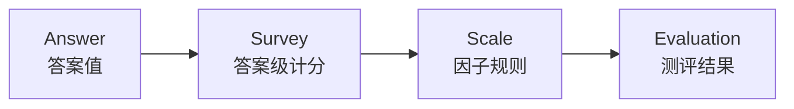
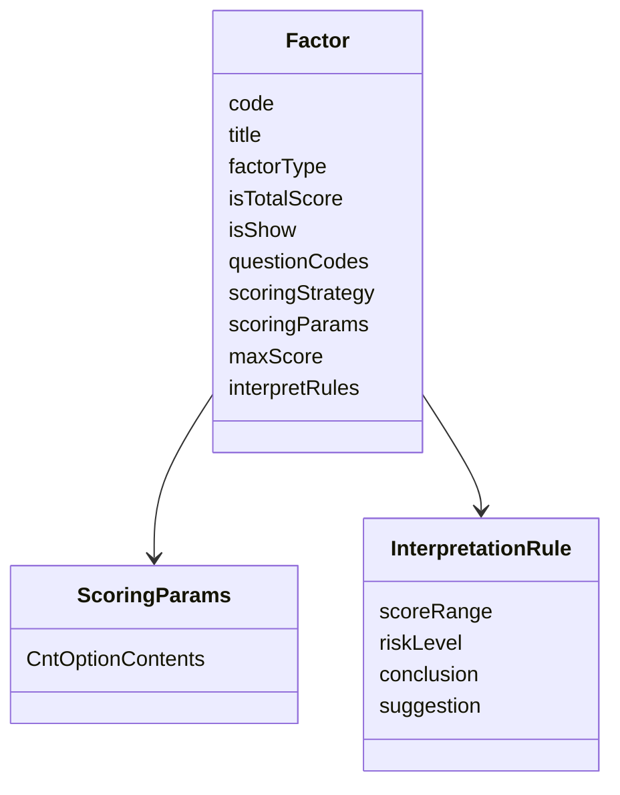
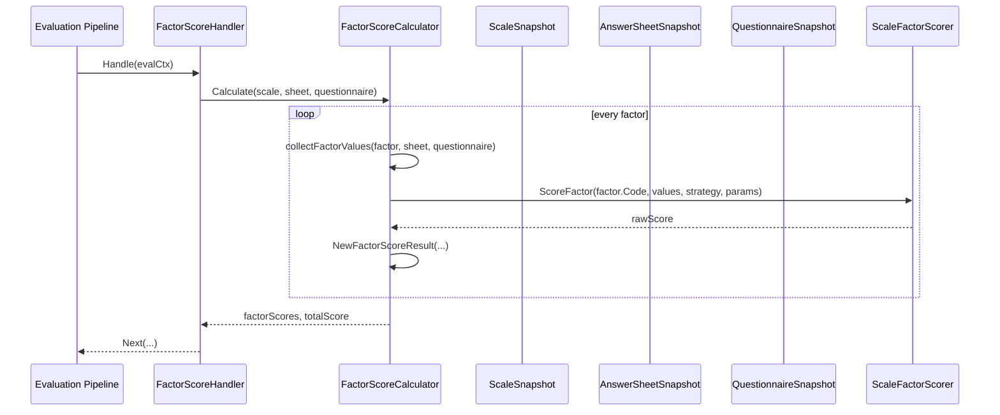

# 规则与因子计分

**本文回答**：Scale 模块如何通过 `Factor`、`ScoringStrategyCode`、`ScoringParams` 表达量表计分规则；Survey 的答案级分数如何进入因子计分；Evaluation pipeline 如何消费这些规则；新增因子计分策略时应该改哪些地方。

---

## 30 秒结论

| 维度 | 结论 |
| ---- | ---- |
| 计分层级 | Survey 负责答案级分数；Scale 负责因子计分规则；Evaluation 负责执行一次测评并保存结果 |
| 因子角色 | `Factor` 是量表内的计分维度，持有 `questionCodes`、`scoringStrategy`、`scoringParams`、`maxScore` |
| 当前策略 | Scale 当前内置 `sum / avg / cnt` 三类因子计分策略 |
| 执行位置 | Evaluation pipeline 的 `FactorScoreHandler` 会读取 Scale snapshot、AnswerSheet snapshot、Questionnaire snapshot 并计算因子分 |
| 规则入口 | `FactorScoreCalculator` 先按 factor 取值，再调用 `ruleengine.ScaleFactorScorer.ScoreFactor` |
| 总分语义 | 如果存在 `isTotalScore=true` 的因子，总分优先取该因子的 raw score；否则对各因子 raw score 求和 |
| 不负责 | Scale 不保存本次测评分数，不推进 Assessment 状态，不生成报告 |
| 扩展原则 | 新计分策略要同时补 Factor 类型、ruleengine adapter、Evaluation factor score 取值逻辑、测试和文档 |

一句话概括：

> **Factor 定义“哪些题怎么算成一个维度分”，Evaluation 在一次测评中使用这些规则算出本次因子分。**

---

## 1. 为什么需要因子计分模型

一个医学/心理量表通常不只是“所有题求个总分”。它可能包含多个维度，例如：

```text
总分
注意力缺陷
多动冲动
情绪问题
睡眠问题
社会适应
```

这些维度通常有不同的题目集合和计算规则。比如：

| 因子 | 关联题目 | 计分策略 |
| ---- | -------- | -------- |
| 总分 | 所有核心题 | sum |
| 注意力缺陷 | Q1、Q2、Q3、Q4 | sum |
| 睡眠问题 | Q8、Q9、Q10 | avg |
| 特定症状数 | 若干题 | cnt |

如果把这些规则写进 Evaluation pipeline，pipeline 会变成“规则大杂烩”；如果写进 Survey，AnswerSheet 会理解过多医学规则。Scale 独立表达因子计分，能让三者分工清楚：

```text
Survey：题目答案与单题分
Scale：因子结构与计分规则
Evaluation：一次测评的执行与结果保存
```

---

## 2. 三层计分边界



| 层级 | 输入 | 输出 | 所属模块 |
| ---- | ---- | ---- | -------- |
| 答案级计分 | Answer value + Question options | 每题 score、AnswerSheet total score | Survey |
| 因子级计分 | AnswerSheet scores + Factor questionCodes + strategy | Factor raw score | Scale 规则 / Evaluation 执行 |
| 测评级解释 | Factor raw score + InterpretationRule | risk level、conclusion、suggestion、report | Scale 规则 / Evaluation 产出 |

注意：**Scale 定义规则，但不保存某次测评的分数结果。** 本次分数结果属于 Evaluation。

---

## 3. Factor 的计分模型

`Factor` 是 Scale 中的计分维度实体。



### 3.1 Factor 的计分字段

| 字段 | 说明 |
| ---- | ---- |
| `questionCodes` | 当前因子需要收集哪些题目的答案分数或答案值 |
| `scoringStrategy` | 因子聚合策略，目前支持 `sum / avg / cnt` |
| `scoringParams` | 策略参数，目前 `cnt` 使用 `CntOptionContents` |
| `maxScore` | 该因子的理论最大分，可用于展示或归一化 |
| `isTotalScore` | 该因子是否代表总分 |
| `interpretRules` | 因子分数的后续解释规则，不参与原始计分计算 |

### 3.2 因子不变量

`MedicalScale.ReplaceFactors` 会维护几个关键不变量：

| 不变量 | 说明 |
| ------ | ---- |
| 因子列表不能为空 | Scale 不能被替换成没有规则维度 |
| 因子 code 不能为空 | 因子需要稳定定位 |
| 因子 code 唯一 | 同一量表内不能有两个相同因子 |
| 只能有一个总分因子 | 避免总分语义冲突 |

这些规则属于 Scale 聚合，不应该放在 Evaluation 里。

---

## 4. 当前计分策略

当前内置策略定义在 `ScoringStrategyCode`：

| 策略 | 代码 | 语义 | 输入 |
| ---- | ---- | ---- | ---- |
| 求和 | `sum` | 对关联题目的答案分求和 | `[]float64` |
| 平均 | `avg` | 对关联题目的答案分求平均 | `[]float64` |
| 计数 | `cnt` | 统计命中特定选项内容的题目数量 | `[]float64`，每个命中记 1 |

### 4.1 sum

`sum` 策略用于大多数总分和维度分场景：

```text
factor_score = score(Q1) + score(Q2) + score(Q3)
```

Evaluation 会先按 factor.questionCodes 收集 AnswerSheet 中对应题目的 `answer.Score`，再交给 `ScaleFactorScorer` 执行 `sum`。

### 4.2 avg

`avg` 策略用于需要平均化的维度：

```text
factor_score = sum(scores) / len(scores)
```

如果没有值，当前返回 0。

### 4.3 cnt

`cnt` 策略不是简单统计有多少题，而是统计“答案选项内容命中目标内容”的数量。

它依赖：

```text
Factor.ScoringParams.CntOptionContents
Questionnaire options
AnswerSheet answer value
```

执行时需要 Questionnaire snapshot，因为要把 option id 映射成 option content。

---

## 5. 因子分计算时序



这里有一个关键点：**FactorScoreHandler 在 Evaluation pipeline 中执行，但规则仍然来自 Scale snapshot。**

---

## 6. collectFactorValues 的取值逻辑

不同策略收集输入值的方式不同。

### 6.1 sum / avg

`sum` 和 `avg` 使用题目的答案级分数：

```text
factor.questionCodes
  -> 从 AnswerSheetSnapshot.Answers 找到同 question_code 的 answer
  -> 取 answer.Score
  -> []float64
```

这说明 Survey 的答案级计分必须先完成，否则因子分无法得到有意义的输入。

### 6.2 cnt

`cnt` 需要更多上下文：

```text
factor.questionCodes
  -> 找到 answer
  -> 从 answer.value 得到 option id
  -> 到 QuestionnaireSnapshot 中找到 option content
  -> 判断 option content 是否在 factor.ScoringParams.CntOptionContents
  -> 命中则 append 1.0
```

这解释了为什么 `cnt` 策略需要 Questionnaire snapshot：答案里可能只有 option code，而业务规则可能以 option content 为匹配目标。

---

## 7. ScaleFactorScorer 的执行逻辑

`ruleengine.ScaleFactorScorer` 是因子计分执行器。当前支持：

```text
sum
avg / average
cnt / count
```

如果遇到未知策略，会返回错误。FactorScoreCalculator 当前在调用失败时返回 0 分。这是一个重要取舍：它避免 pipeline 直接 panic，但也要求日志、测试和规则配置审查足够严格。

### 7.1 与 AnswerScorer 的区别

| 能力 | 所属 | 作用 |
| ---- | ---- | ---- |
| `AnswerScorer` | Survey 答卷计分 | 单题答案值 -> 单题分 |
| `ScaleFactorScorer` | Scale/Evaluation 因子计分 | 一组题目分/命中值 -> 因子分 |

不要把两者混为一个东西。

---

## 8. totalScore 的计算规则

FactorScoreCalculator 返回：

```text
[]FactorScoreResult
totalScore
```

当前 totalScore 的语义是：

1. 如果 factorScores 中存在 `IsTotalScore=true` 的因子，直接取该因子的 `RawScore` 作为 totalScore。
2. 如果没有总分因子，则把所有因子的 `RawScore` 求和。

这意味着总分因子是一个显式优先规则。新增因子时要特别注意 `isTotalScore`，避免多个因子争夺总分语义。

---

## 9. 因子分与解读规则的边界

因子计分只得到 raw score。

```text
FactorScoreCalculator -> rawScore
```

风险等级、结论和建议不是在这个阶段完成，而是在后续 Interpretation 阶段根据 `InterpretationRule` 匹配。

| 阶段 | 输入 | 输出 |
| ---- | ---- | ---- |
| FactorScore | Factor + AnswerSheet + Questionnaire | factor raw score |
| Interpretation | factor raw score + InterpretationRule | risk level、conclusion、suggestion |

这就是为什么 `Factor` 同时持有 `scoringStrategy` 和 `interpretRules`，但它们在 pipeline 中处于不同阶段。

---

## 10. 规则配置与业务语义

### 10.1 questionCodes 的业务含义

`questionCodes` 表示“这个因子关心哪些题”。它不是数据库外键强约束，而是规则引用。

因此，新增或调整 questionCodes 时要注意：

| 风险 | 说明 |
| ---- | ---- |
| 引用了不存在的题 | 计分时会收集不到分数 |
| 引用了非计分题 | 分数可能为 0 |
| 问卷版本变更 | Scale 绑定的 questionnaireVersion 必须同步 |
| 题目 code 改名 | 旧规则和旧答卷可能失效 |

### 10.2 scoringParams 的业务含义

当前 `ScoringParams` 主要服务 `cnt` 策略。

| 参数 | 用途 |
| ---- | ---- |
| `CntOptionContents` | 指定哪些 option content 被视为命中 |

如果后续新增策略，不要把所有参数都塞进一个无语义 map；优先在 `ScoringParams` 中显式建模，除非已经进入通用规则引擎阶段。

---

## 11. 新增计分策略怎么做

例如新增 `weighted_avg`。

### 11.1 设计前置问题

先回答：

| 问题 | 示例 |
| ---- | ---- |
| 策略名是什么 | `weighted_avg` |
| 输入值是什么 | 题目分数列表 |
| 参数是什么 | 每题权重 |
| 参数如何与题目对应 | 按 questionCode map，而不是数组位置 |
| 空值如何处理 | 跳过还是按 0 |
| 是否影响 maxScore | 是否需要重新计算 |
| 是否影响解释规则 | 解释仍按 raw score 还是 normalized score |

### 11.2 修改点

| 层 | 修改 |
| -- | ---- |
| Domain | 新增 `ScoringStrategyCode` |
| Domain | 扩展 `ScoringParams` |
| Application | DTO 转换支持新策略和参数 |
| RuleEngine | `ScaleFactorScorer.ScoreFactor` 支持新策略 |
| Evaluation | `collectFactorValues` 是否要新增取值逻辑 |
| Test | 补 domain、ruleengine、pipeline 测试 |
| Docs | 更新本篇和新增量表规则 SOP |

### 11.3 不应该做的事

- 不要在 Evaluation pipeline 中硬编码某个量表的特殊计算。
- 不要把复杂计分规则写到 REST handler。
- 不要用字符串拼公式而没有校验和测试。
- 不要让 `cnt` 参数复用成所有策略的万能字段。

---

## 12. 新增因子时的检查清单

| 检查项 | 说明 |
| ------ | ---- |
| factor code 是否唯一 | 同一个 MedicalScale 内不能重复 |
| 是否误设多个 total score | 只能有一个总分因子 |
| questionCodes 是否存在于绑定问卷版本 | 否则计分收集不到值 |
| strategy 是否有效 | 只能使用已支持策略 |
| scoringParams 是否符合策略语义 | `cnt` 需要 target contents |
| maxScore 是否合理 | 用于展示和解释时不能乱填 |
| interpretRules 是否覆盖分数区间 | 后续解释阶段需要 |
| 是否影响报告展示 | `isShow` 要明确 |
| 是否影响 Evaluation 测试 | 要补 pipeline 验证 |

---

## 13. 设计模式与实现意图

| 模式 | 当前实现 | 为什么这样设计 |
| ---- | -------- | -------------- |
| Strategy | `ScoringStrategyCode` + `ScaleFactorScorer` | 不同聚合算法有统一调用面 |
| Value Object | `FactorCode`、`ScoringParams`、`ScoreRange` | 规则配置可校验、可测试 |
| Aggregate Invariant | `MedicalScale.ReplaceFactors` | 因子唯一、总分唯一由聚合保护 |
| Pipeline Consumer | `FactorScoreHandler` | Evaluation 只消费规则结果，不拥有规则定义 |
| Snapshot | `ScaleSnapshot` / `AnswerSheetSnapshot` / `QuestionnaireSnapshot` | Evaluation 运行时使用稳定输入，不直接改规则模型 |

---

## 14. 设计取舍

| 设计 | 收益 | 代价 |
| ---- | ---- | ---- |
| Factor 保存 questionCodes | 规则清晰、可配置 | 题目 code 变更需要同步 |
| sum/avg/cnt 策略显式枚举 | 易测试、易审查 | 配置灵活性低于 DSL |
| cnt 依赖 Questionnaire options | 能按业务选项内容计数 | 需要 QuestionnaireSnapshot，链路更复杂 |
| totalScore 因子优先 | 总分语义清晰 | 配错多个 total score 会造成歧义，需聚合校验 |
| 失败返回 0 | 避免 pipeline 崩溃 | 需要日志和测试避免静默错误 |

---

## 15. 常见误区

### 15.1 “因子分就是答卷总分”

错误。答卷总分是 Survey 答案级计分的结果之一；因子分是 Scale 规则按题目集合聚合得到的维度分。

### 15.2 “FactorScoreHandler 属于 Scale 模块”

不准确。它位于 Evaluation pipeline 中，负责在一次测评执行时消费 Scale 规则。规则定义属于 Scale，执行上下文属于 Evaluation。

### 15.3 “cnt 策略只需要 AnswerSheet”

错误。当前 cnt 策略需要 QuestionnaireSnapshot 把 option id 映射为 option content。

### 15.4 “新增计分策略只改 ruleengine”

不够。还要改 `ScoringStrategyCode`、`ScoringParams`、DTO 转换、pipeline 取值逻辑、测试和文档。

### 15.5 “InterpretationRule 参与 raw score 计算”

错误。InterpretationRule 参与分数解释，不参与 raw score 聚合。

---

## 16. 代码锚点

### Scale Domain

- Factor 实体：[../../../internal/apiserver/domain/scale/factor.go](../../../internal/apiserver/domain/scale/factor.go)
- Scale 类型与策略：[../../../internal/apiserver/domain/scale/types.go](../../../internal/apiserver/domain/scale/types.go)
- MedicalScale 聚合：[../../../internal/apiserver/domain/scale/medical_scale.go](../../../internal/apiserver/domain/scale/medical_scale.go)

### Scale Application

- FactorService：[../../../internal/apiserver/application/scale/factor_service.go](../../../internal/apiserver/application/scale/factor_service.go)
- LifecycleService：[../../../internal/apiserver/application/scale/lifecycle_service.go](../../../internal/apiserver/application/scale/lifecycle_service.go)

### RuleEngine / Evaluation

- ruleengine port：[../../../internal/apiserver/port/ruleengine/ruleengine.go](../../../internal/apiserver/port/ruleengine/ruleengine.go)
- ScaleFactorScorer：[../../../internal/apiserver/infra/ruleengine/scoring.go](../../../internal/apiserver/infra/ruleengine/scoring.go)
- FactorScoreHandler：[../../../internal/apiserver/application/evaluation/engine/pipeline/factor_score.go](../../../internal/apiserver/application/evaluation/engine/pipeline/factor_score.go)
- FactorScoreCalculator：[../../../internal/apiserver/application/evaluation/engine/pipeline/factor_score_calculator.go](../../../internal/apiserver/application/evaluation/engine/pipeline/factor_score_calculator.go)

---

## 17. Verify

```bash
go test ./internal/apiserver/domain/scale
go test ./internal/apiserver/application/scale
go test ./internal/apiserver/infra/ruleengine
go test ./internal/apiserver/application/evaluation/engine/pipeline
```

如果修改了因子 DTO 或接口契约：

```bash
make docs-rest
make docs-verify
```

如果修改了 factor score 进入报告或风险解释的语义，还应同步检查：

```text
docs/02-业务模块/scale/02-解读规则与风险文案.md
docs/02-业务模块/evaluation/02-EnginePipeline.md
docs/02-业务模块/evaluation/03-Report与Interpretation.md
```

---

## 18. 下一跳

| 目标 | 下一篇 |
| ---- | ------ |
| 理解解读规则和风险文案 | [02-解读规则与风险文案.md](./02-解读规则与风险文案.md) |
| 理解 Evaluation 如何消费因子分 | [03-与Evaluation衔接.md](./03-与Evaluation衔接.md) |
| 新增量表规则 | [04-新增量表规则SOP.md](./04-新增量表规则SOP.md) |
| 回看 Scale 整体模型 | [00-整体模型.md](./00-整体模型.md) |
| 理解 Survey 答案级计分 | [../survey/03-题型校验与计分扩展.md](../survey/03-题型校验与计分扩展.md) |
