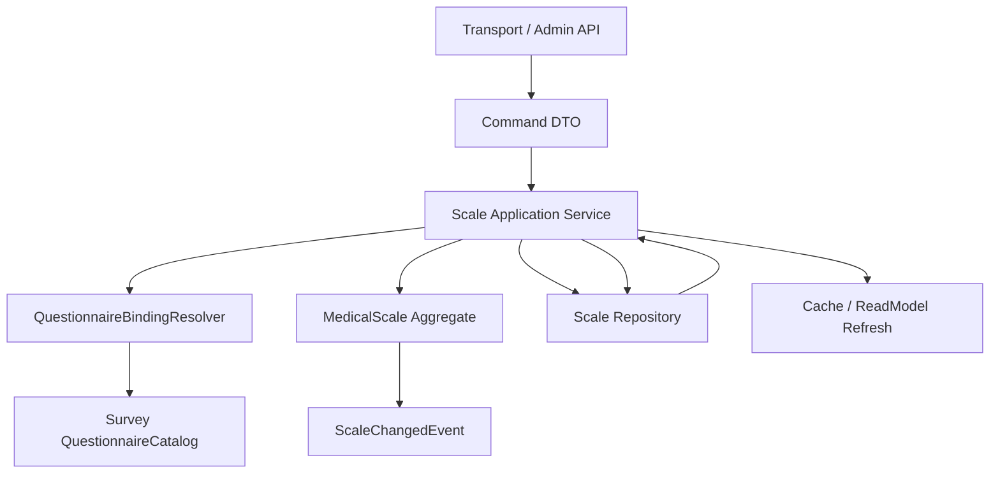
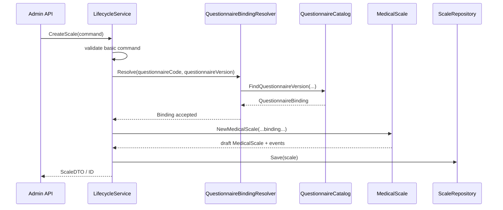
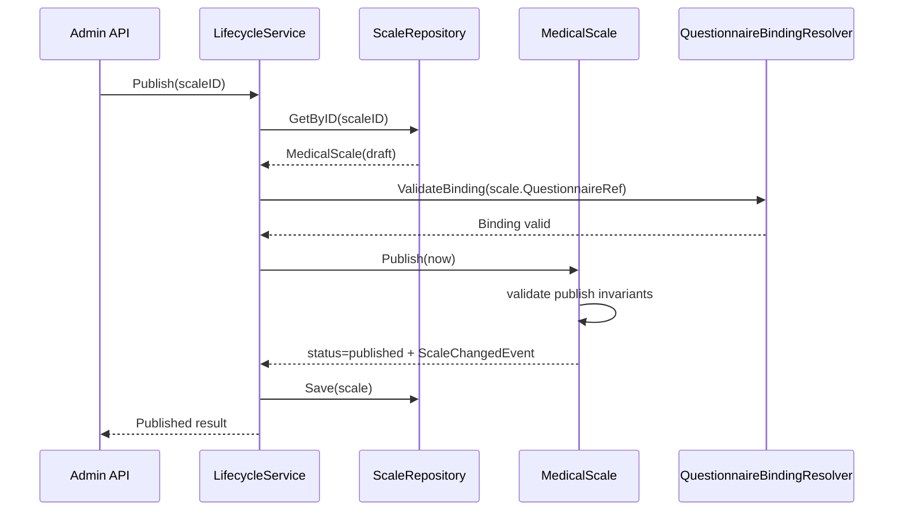
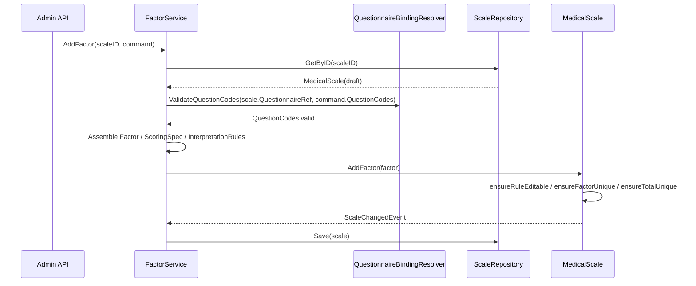
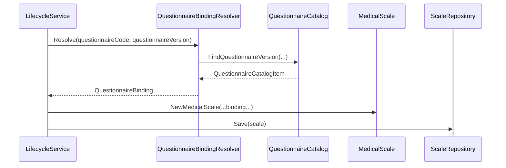

# 02-Scale 维护链路：生命周期、因子维护与问卷绑定

> 本文是 Scale 模块文档的第二篇，聚焦 **Scale 的维护链路设计**。
>
> 第一篇已经说明：`MedicalScale` 是医学量表解释规则聚合根，`Factor / ScoringSpec / InterpretationRules / RiskLevel` 是聚合内部规则对象。本文继续回答：这些规则对象如何被创建、编辑、发布、冻结、归档，以及 Scale 如何通过稳定的 `QuestionnaireCode + QuestionnaireVersion` 与 Survey 模块协作。
>
> 本文关注 Application 层的用例编排和 Domain 层的规则保护边界，不展开查询读模型，也不展开 Evaluation 如何消费 Scale 规则。

---

## 1. 结论先行

Scale 维护链路本质上由三类用例组成：

```text
生命周期维护：Create / UpdateBasicInfo / Publish / Unpublish / Archive / Delete
因子规则维护：AddFactor / UpdateFactor / RemoveFactor / ReplaceFactors / UpdateInterpretRules
问卷绑定维护：BindQuestionnaire / UpdateQuestionnaire / SyncQuestionnaireVersion / ValidateQuestionCodes
```

它们共同维护一份 `MedicalScale` 规则事实。

应用层负责：

```text
接收 command；
校验基础参数；
调用问卷绑定防腐层；
加载 MedicalScale 聚合；
组装 Factor / ScoringSpec / InterpretationRules；
调用聚合行为；
保存聚合；
发布领域事件；
刷新缓存或读模型。
```

领域层负责：

```text
保护 FactorCode 唯一；
保护总分因子唯一；
保护 published / archived 规则冻结；
保护 InterpretationRules 区间合法；
保护发布前规则完整性；
产生 ScaleChangedEvent。
```

维护链路的核心原则是：

> **Application 编排流程，Domain 保护规则，Infra 负责持久化，Survey Binding 负责读取问卷目录事实。**

---

## 2. 本文边界

本文重点：

```text
Scale 生命周期维护链路；
Scale 基础信息更新链路；
Factor 因子维护链路；
ScoringSpec / InterpretationRules 组装与更新；
Questionnaire binding 问卷绑定链路；
draft / published / archived 下的维护规则差异；
维护链路中的领域事件与缓存刷新；
常见错误边界。
```

本文不展开：

```text
Scale 查询 DTO / Snapshot / ReadModel；
Evaluation 如何加载 Scale 规则并执行测评；
AnswerSheet 提交事实模型；
Mongo mapper / repository 具体实现细节；
Outbox relay / MQ 消费细节。
```

这些由后续文档承接：

```text
03-Scale 查询链路--查询服务与读模型.md
04-Scale 测评链路--Scale与Evaluation联动详解.md
05-Scale模块分层架构与事实源索引.md
```

---

## 3. 维护链路总览

Scale 维护链路可以抽象为：



典型流程为：

```text
1. Transport 层接收后台管理请求；
2. Application 层将请求转换为 command；
3. Application 层做基础参数校验；
4. 如果涉及问卷绑定，先调用 QuestionnaireBindingResolver；
5. Application 层加载 MedicalScale 聚合；
6. Application 层组装领域对象；
7. 调用 MedicalScale 聚合行为；
8. Repository 保存聚合；
9. 发布聚合内收集的 ScaleChangedEvent；
10. 刷新缓存或读模型。
```

这条链路中，每一层的职责必须清楚。

```text
Transport 不直接修改领域对象；
Application 不绕过聚合根修改字段；
Domain 不访问数据库、缓存、MQ；
Infra 不决定业务规则；
Survey Binding 不拥有 Scale 聚合；
Event 不表达 Evaluation 已执行。
```

---

## 4. Application 层服务划分

Scale 的应用层不应该只有一个巨大的 `ScaleService`。

更合理的划分是按用例类型组织：

```text
LifecycleService      负责生命周期和基础信息维护
FactorService         负责因子规则维护
QueryService          负责查询读模型输出
QuestionnaireBinding  负责问卷绑定解析与同步
```

本文主要讨论前三类写侧维护服务：

```text
LifecycleService
FactorService
QuestionnaireBindingResolver / Syncer
```

`QueryService` 留到第三篇查询链路展开。

### 4.1 LifecycleService

LifecycleService 负责量表生命周期类用例。

典型方法包括：

```text
Create
UpdateBasicInfo
UpdateQuestionnaire
Publish
Unpublish
Archive
Delete
```

它的职责是编排流程：

```text
接收 command；
校验基础输入；
调用 QuestionnaireBindingResolver；
创建或加载 MedicalScale；
调用聚合行为；
保存聚合；
发布事件；
刷新缓存。
```

它不应该直接做：

```text
scale.Status = published
scale.QuestionnaireVersion = latest
scale.Factors = append(scale.Factors, factor)
```

这些必须交给领域行为保护。

### 4.2 FactorService

FactorService 负责因子规则维护。

典型方法包括：

```text
AddFactor
UpdateFactor
RemoveFactor
ReplaceFactors
UpdateFactorInterpretRules
ReplaceInterpretRules
```

它的职责是：

```text
接收因子 command；
组装 Factor / ScoringSpec / InterpretationRules；
加载 MedicalScale 聚合；
调用 MedicalScale 的因子维护行为；
保存聚合；
发布事件；
刷新缓存。
```

它不应该决定最终领域不变量。

例如：

```text
FactorCode 是否唯一；
总分因子是否唯一；
published 下是否可编辑；
InterpretationRules 区间是否重叠。
```

这些最终判断必须由 `MedicalScale` 聚合保护。

### 4.3 QuestionnaireBindingResolver

QuestionnaireBindingResolver 是 Scale 与 Survey 的防腐层。

它负责让 Scale 在不直接依赖 Survey 聚合内部对象的情况下，读取问卷目录事实。

典型职责包括：

```text
校验 QuestionnaireCode 是否存在；
校验 QuestionnaireVersion 是否存在；
校验问卷类型是否适合作为医学量表问卷；
校验 Factor.QuestionCodes 是否存在于绑定版本；
检查一份问卷是否允许绑定多份量表；
返回可写入 MedicalScale 的 QuestionnaireRef 信息。
```

它的上游是 Scale application service。

它的下游是 Survey 提供的 QuestionnaireCatalog 或等价查询端口。

---

## 5. 生命周期维护链路

### 5.1 Create：创建 MedicalScale 草稿

创建量表的目标是生成一份 draft 状态的 MedicalScale 规则聚合。

典型流程：



创建时应保证：

```text
ScaleCode 合法且不重复；
Title 等基础展示信息合法；
QuestionnaireCode / QuestionnaireVersion 合法；
初始状态为 draft；
如果初始化 Factors，则必须通过聚合行为加入。
```

创建时不应该：

```text
直接创建 published 量表；
跳过问卷绑定校验；
直接持有完整 Questionnaire 聚合；
将默认 FactorScore 或 Report 写入 Scale。
```

### 5.2 UpdateBasicInfo：更新基础展示信息

基础展示信息包括：

```text
Title
Description
Category
Stages
ApplicableAges
Reporters
Tags
```

这些字段通常用于后台管理、前台展示和检索。

需要区分两类字段：

```text
展示字段：不会影响测评结果，可相对宽松更新；
规则字段：会影响测评结果，必须遵守发布冻结。
```

`UpdateBasicInfo` 应只修改展示字段。

如果某个字段会影响 Evaluation 执行，例如 `QuestionnaireVersion`、`Factors`、`ScoringSpec`，不应放在 BasicInfo 更新接口中。

### 5.3 Publish：发布 MedicalScale

发布是 Scale 生命周期中最重要的动作。

发布意味着：

```text
这份规则已经通过校验；
这份规则可以被 Evaluation 消费；
这份规则将成为历史测评可追溯事实；
发布后规则字段冻结。
```

发布流程可以概括为：



发布前至少应校验：

```text
当前状态必须是 draft；
QuestionnaireCode / QuestionnaireVersion 已绑定；
绑定问卷版本存在；
Factors 非空；
FactorCode 唯一；
总分因子最多一个；
每个 Factor 的 QuestionCodes 非空；
每个 QuestionCode 存在于绑定问卷版本中；
每个 Factor 的 ScoringSpec 合法；
每个 Factor 的 InterpretationRules 合法；
解释区间不重叠；
必要时校验解释区间覆盖完整得分范围。
```

发布后禁止修改：

```text
QuestionnaireCode
QuestionnaireVersion
Factors
Factor.QuestionCodes
Factor.ScoringSpec
Factor.InterpretationRules
RiskLevel
```

### 5.4 Unpublish：取消发布

`Unpublish` 表示将 published 量表回退到 draft。

它适用于：

```text
发现规则配置错误；
发布后尚未被正式测评使用；
业务允许回退修改。
```

需要谨慎：如果已有 Assessment 引用了该 published 版本，取消发布可能影响历史追溯。

因此更推荐的规则是：

```text
如果没有历史测评引用，可以 Unpublish；
如果已有历史测评引用，应创建新版本或归档旧版本；
是否允许 Unpublish 应由业务策略决定。
```

### 5.5 Archive：归档量表

归档表示该量表不再用于新的测评。

归档后：

```text
不允许编辑规则；
不允许作为新测评模型被选择；
仍然可用于历史报告追溯；
可被后台审计查询。
```

Archive 不等于 Delete。

归档是一种业务状态，删除是一种数据生命周期动作。

### 5.6 Delete：删除量表

删除操作应非常谨慎。

建议只允许删除 draft 状态下、且未被任何业务引用的量表。

不建议删除：

```text
published 量表；
archived 量表；
已经被 Assessment 或历史报告引用的量表；
已经产生过正式规则事件的量表。
```

对正式规则来说，归档比删除更安全。

---

## 6. 因子维护链路

因子维护是 Scale 维护链路中最复杂的一部分。

原因是 Factor 同时关联：

```text
QuestionCodes；
ScoringSpec；
InterpretationRules；
RiskLevel；
Report 展示语义；
Evaluation 执行输入。
```

因此，FactorService 需要细致组装对象，但最终规则保护必须由 MedicalScale 聚合完成。

---

## 7. AddFactor：新增因子

新增因子流程：



新增因子时需要校验：

```text
scale 当前状态必须允许规则编辑；
FactorCode 非空且在当前 MedicalScale 内唯一；
如果 IsTotalScore=true，则当前聚合内不能已有总分因子；
QuestionCodes 必须存在于绑定的 QuestionnaireVersion；
ScoringSpec 合法；
InterpretationRules 合法。
```

应用层可以提前做基础校验，但领域层必须做最终保护。

---

## 8. UpdateFactor：更新因子

更新因子可能涉及：

```text
Title / Description；
FactorType；
IsTotalScore；
IsShow；
QuestionCodes；
ScoringSpec；
InterpretationRules。
```

需要分清楚：

```text
展示字段更新：影响报告展示；
规则字段更新：影响 Evaluation 结果。
```

只要会影响 Evaluation 结果，就应视为规则变更。

典型流程：

```text
1. 加载 MedicalScale；
2. 校验当前状态是否可编辑；
3. 如果 QuestionCodes 变化，调用 QuestionnaireBindingResolver 校验；
4. 组装新的 Factor 规则对象；
5. 调用 MedicalScale.UpdateFactor；
6. 聚合内部校验 FactorCode、总分因子、规则合法性；
7. 保存聚合；
8. 发布 ScaleChangedEvent；
9. 刷新缓存或读模型。
```

不建议在 UpdateFactor 中直接局部修改内部字段。

错误方向：

```go
scale.Factors[i].QuestionCodes = command.QuestionCodes
scale.Factors[i].ScoringSpec = spec
```

正确方向：

```go
scale.UpdateFactor(factorCode, updatedFactor)
```

---

## 9. RemoveFactor：删除因子

删除因子属于规则变更。

删除前至少需要考虑：

```text
当前状态是否可编辑；
FactorCode 是否存在；
删除后是否仍然满足发布规则；
如果删除的是总分因子，是否允许；
是否会影响当前草稿发布。
```

对于 draft 状态，删除因子通常允许。

对于 published / archived 状态，应禁止删除。

删除因子后需要产生 ScaleChangedEvent，并刷新缓存或读模型。

---

## 10. ReplaceFactors：整体替换因子集合

整体替换适用于后台批量编辑或从配置导入规则。

这是高风险操作，因为它可能同时改变：

```text
因子数量；
FactorCode；
QuestionCodes；
ScoringSpec；
InterpretationRules；
总分因子。
```

因此 ReplaceFactors 必须一次性完成完整校验。

推荐流程：

```text
1. 校验 scale 当前状态可编辑；
2. 校验输入 factor 列表非空；
3. 校验 FactorCode 全局唯一；
4. 校验总分因子最多一个；
5. 批量校验所有 QuestionCodes；
6. 校验所有 ScoringSpec；
7. 校验所有 InterpretationRules；
8. 构造新的 Factors 集合；
9. 调用 MedicalScale.ReplaceFactors；
10. 保存聚合并发布事件。
```

ReplaceFactors 不应半途保存。

要么整组规则替换成功，要么整个操作失败。

---

## 11. UpdateFactorInterpretRules：更新解释规则

解释规则更新会直接影响报告中的风险等级、结论和建议。

因此它是规则变更。

更新时必须校验：

```text
当前状态可编辑；
FactorCode 存在；
每条 InterpretationRule 的 ScoreRange 合法；
同一 Factor 下区间不重叠；
RiskLevel 合法；
Conclusion / Suggestion 符合业务要求；
必要时校验区间覆盖完整得分范围。
```

注意：解释规则是 Scale 规则事实，不是 Evaluation 结果。

```text
InterpretationRule 是规则；
InterpretationResult 是某次测评命中的结果。
```

更新解释规则不应修改任何历史 InterpretReport。

如果业务需要重算历史报告，应通过独立的重算任务处理，而不是在 Scale 维护链路中自动执行。

---

## 12. ScoringSpec 组装链路

ScoringSpec 往往由后台 DTO 转换而来。

应用层需要做两件事：

```text
将 command DTO 转换为领域值对象；
校验 DTO 级别的参数完整性。
```

领域层需要做最终不变量保护：

```text
Strategy 是否支持；
Params 是否符合 Strategy；
MaxScore 是否合理；
QuestionCodes 与 ScoringSpec 是否一致；
发布态是否允许修改。
```

建议将 DTO 组装逻辑放在 command assembler 或 factory 中，而不是堆在 service 方法中。

例如：

```text
FactorCommandAssembler
├── BuildFactor(command)
├── BuildScoringSpec(command.Scoring)
└── BuildInterpretationRules(command.Rules)
```

这样 FactorService 保持编排职责，不被 DTO 转换细节污染。

---

## 13. 问卷绑定维护链路

Scale 与 Survey 的关系不是对象持有关系，而是版本引用关系。

Scale 保存：

```text
QuestionnaireCode
QuestionnaireVersion
Factor.QuestionCodes
```

Survey 提供：

```text
Questionnaire 目录事实；
QuestionnaireVersion 目录事实；
Question 列表；
QuestionType；
Option；
SubmissionSpec。
```

Scale 不直接持有 Survey 聚合对象。

---

## 14. 为什么必须绑定 QuestionnaireVersion

只绑定 `QuestionnaireCode` 不够。

因为问卷会演进：

```text
题目可能新增；
题目可能删除；
题目类型可能变化；
选项可能变化；
选项基础分可能变化；
提交规格可能变化。
```

这些变化都会影响 Scale 的 Factor.QuestionCodes 和 ScoringSpec。

因此 MedicalScale 必须绑定：

```text
QuestionnaireCode + QuestionnaireVersion
```

语义是：

> 这份 MedicalScale 规则基于某个确定的 QuestionnaireVersion 设计，Evaluation 执行时也必须使用与之匹配的答卷事实。

---

## 15. QuestionnaireBindingResolver 设计

QuestionnaireBindingResolver 是 Scale 与 Survey 之间的防腐层。

它应隐藏 Survey 内部复杂模型，只向 Scale 提供绑定所需的轻量目录事实。

可以抽象为：

```text
QuestionnaireBindingResolver
├── Resolve(code, version)
├── ValidateBinding(code, version)
├── ValidateQuestionCodes(code, version, questionCodes)
└── ResolveLatestVersion(code)
```

返回结果可以是：

```text
QuestionnaireBinding
├── QuestionnaireCode
├── QuestionnaireVersion
├── QuestionnaireType
├── Status
├── QuestionIndex
└── SubmissionSpecSummary
```

Scale 应关心的是：

```text
问卷是否存在；
版本是否存在；
问卷是否已发布；
问卷类型是否适合作为量表问卷；
QuestionCodes 是否存在；
题型是否适合对应 ScoringSpec。
```

Scale 不应关心：

```text
Survey 聚合如何保存；
Questionnaire 如何发布；
AnswerSheet 如何提交；
SubmissionSpec 如何内部构造。
```

---

## 16. 创建时的问卷绑定

创建 MedicalScale 时，如果指定问卷，需要执行绑定解析。

流程：



创建时绑定校验应包括：

```text
QuestionnaireCode 不能为空；
QuestionnaireVersion 如果为空，是否允许使用 latest 由业务决定；
QuestionnaireVersion 必须存在；
Questionnaire 必须是可绑定状态；
Questionnaire 类型必须适合 MedicalScale；
是否允许一份问卷绑定多份 Scale，需要由业务规则决定。
```

---

## 17. 更新问卷绑定

更新 Questionnaire binding 属于规则变更。

因为它会改变：

```text
MedicalScale 绑定的题目集合；
Factor.QuestionCodes 的合法性；
ScoringSpec 的输入来源；
Evaluation 执行时加载规则的上下文。
```

典型流程：

```text
1. 加载 MedicalScale；
2. 校验当前状态是否可编辑；
3. 调用 QuestionnaireBindingResolver 校验新绑定；
4. 校验现有 Factor.QuestionCodes 是否仍存在于新 QuestionnaireVersion；
5. 调用 MedicalScale.UpdateQuestionnaire；
6. 保存聚合；
7. 发布 ScaleChangedEvent；
8. 刷新缓存或读模型。
```

如果新问卷版本不包含已有 Factor.QuestionCodes，应拒绝更新，或者要求用户先调整因子规则。

---

## 18. draft 同步最新问卷版本

当 Survey 发布新的 QuestionnaireVersion 时，draft scale 可以选择同步最新版本。

原因是：

```text
draft 仍在设计中；
还没有正式用于测评；
同步最新问卷有利于配置维护；
不会破坏历史测评结果。
```

同步流程可以是：

```text
1. Survey 发布新 QuestionnaireVersion；
2. Scale Syncer 找到绑定该 QuestionnaireCode 的 draft scales；
3. 校验 Factor.QuestionCodes 在新版本中仍然存在；
4. 更新 draft scale 的 QuestionnaireVersion；
5. 产生 ScaleChangedEvent；
6. 刷新缓存或读模型。
```

注意：同步不是简单赋值。

必须先校验因子引用的题目是否仍然存在。

---

## 19. published 不自动同步问卷版本

published scale 不能自动同步最新问卷版本。

原因是 published scale 已经成为规则事实。

如果自动同步，会破坏：

```text
历史测评可追溯性；
报告解释一致性；
Assessment 与 MedicalScale 的绑定关系；
Evaluation 执行的稳定性。
```

因此必须坚持：

```text
Questionnaire 发布新版本 -> 不自动修改 published MedicalScale.QuestionnaireVersion
```

如果业务希望使用新问卷版本，应通过显式流程创建或发布新的 Scale 版本。

---

## 20. 维护链路中的领域事件

Scale 维护链路中的规则变化应产生 ScaleChangedEvent。

事件语义是：

```text
Scale 规则事实发生变化。
```

它不表达：

```text
Evaluation 已经重新执行；
历史报告已经刷新；
AnswerSheet 已经提交；
某个用户风险等级发生变化。
```

典型事件触发点包括：

```text
CreateScale；
UpdateBasicInfo；
UpdateQuestionnaire；
AddFactor；
UpdateFactor；
RemoveFactor；
ReplaceFactors；
UpdateInterpretRules；
Publish；
Unpublish；
Archive。
```

事件发布后，下游可以做：

```text
刷新 Scale 缓存；
更新后台读模型；
通知前端配置更新；
必要时触发规则变更审计。
```

但不要默认触发历史测评重算。

历史测评重算是独立业务能力，应由 Evaluation 或运维任务显式控制。

---

## 21. 缓存与读模型刷新

Scale 规则通常会被 Evaluation 和前台展示频繁读取。

因此维护链路完成后，可能需要刷新：

```text
Scale detail cache；
Scale list cache；
Questionnaire binding cache；
Evaluation rule snapshot cache；
后台读模型；
热门量表列表。
```

刷新策略可以分为两种：

```text
同步刷新：维护操作成功后立即清理相关缓存；
异步刷新：通过 ScaleChangedEvent 触发消费者重建读模型。
```

推荐原则：

```text
影响正确性的缓存，优先同步失效；
影响展示性能的读模型，可以异步重建；
所有缓存消费者必须能处理重复事件。
```

---

## 22. 事务边界与一致性

Scale 维护链路至少涉及：

```text
MedicalScale 聚合保存；
ScaleChangedEvent 出站；
缓存或读模型刷新。
```

其中业务事实和待发布事件应在同一个可靠边界内提交。

推荐事务边界：

```text
保存 MedicalScale 聚合
+ stage ScaleChangedEvent
```

缓存刷新可以在事务后执行。

如果缓存刷新失败，不应回滚已提交的规则事实，但应通过事件重试或后台任务修复。

---

## 23. 状态与操作矩阵

| 操作 | draft | published | archived |
| --- | --- | --- | --- |
| UpdateBasicInfo | 允许 | 谨慎允许 | 禁止或仅审计字段 |
| UpdateQuestionnaire | 允许 | 禁止 | 禁止 |
| AddFactor | 允许 | 禁止 | 禁止 |
| UpdateFactor | 允许 | 禁止 | 禁止 |
| RemoveFactor | 允许 | 禁止 | 禁止 |
| ReplaceFactors | 允许 | 禁止 | 禁止 |
| UpdateInterpretRules | 允许 | 禁止 | 禁止 |
| Publish | 允许 | 不适用 | 禁止 |
| Unpublish | 不适用 | 视业务允许 | 禁止 |
| Archive | 允许 | 允许 | 不适用 |
| Delete | 谨慎允许 | 禁止 | 禁止 |

这个矩阵不是 UI 权限，而是领域规则。

UI 可以提前禁用按钮，但最终必须由领域模型保护。

---

## 24. 常见错误设计

### 24.1 Application 直接改聚合字段

错误方向：

```go
scale.Status = StatusPublished
scale.QuestionnaireVersion = latest
scale.Factors = factors
```

问题是绕过了领域不变量。

正确方向：

```go
scale.Publish(now)
scale.UpdateQuestionnaire(binding)
scale.ReplaceFactors(factors)
```

### 24.2 Scale Service 读取 AnswerSheet

错误方向：

```text
ScaleService -> AnswerSheetRepository -> CalculateScore
```

问题是 Scale 被污染成执行模块。

正确方向：

```text
EvaluationService -> AnswerSheetRepository + ScaleQueryService -> Execute
```

### 24.3 published 自动同步问卷版本

错误方向：

```text
Questionnaire 发布新版本后，自动修改所有绑定 Scale。
```

正确方向：

```text
draft scale 可以同步；
published scale 必须冻结；
新规则应通过新版本显式发布。
```

### 24.4 FactorService 决定所有不变量

错误方向：

```text
FactorService 校验 FactorCode 唯一后直接保存。
```

问题是领域规则散落在应用层。

正确方向：

```text
FactorService 可以预校验；
MedicalScale 必须做最终校验。
```

### 24.5 ScaleChangedEvent 表达测评结果变化

错误方向：

```text
ScaleChangedEvent = 用户报告需要刷新
```

正确方向：

```text
ScaleChangedEvent = 规则事实发生变化
```

是否重算历史报告，是 Evaluation 或运维任务的独立决策。

---

## 25. 小结

Scale 维护链路可以用一句话总结：

> **应用层编排生命周期、因子维护和问卷绑定流程；领域层通过 MedicalScale 聚合保护规则一致性；Survey Binding 通过防腐层读取问卷目录事实；事件与缓存机制负责规则变化后的系统同步。**

本文需要建立四个核心认知：

```text
第一，Scale 的维护对象是规则，不是测评结果；
第二，所有规则变更必须通过 MedicalScale 聚合行为进入；
第三，QuestionnaireCode + QuestionnaireVersion 是 Scale 与 Survey 协作的稳定边界；
第四，published scale 是历史可追溯规则事实，不能自动同步、不能原地修改。
```

守住这四点，Scale 模块的维护链路就不会失控，也能为 Evaluation 通用化和未来 MBTI 等解释模型接入提供稳定规则基础。
