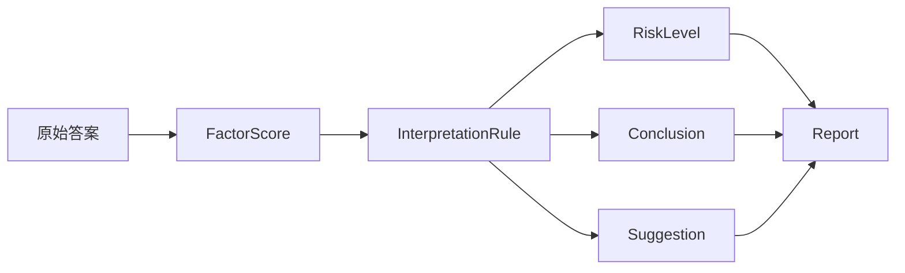
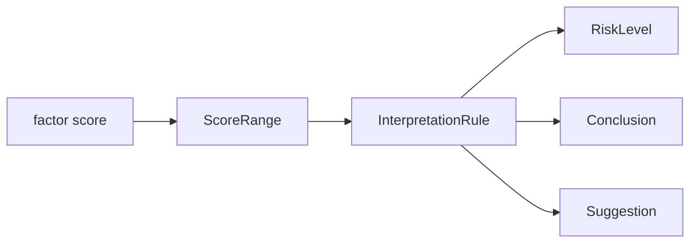
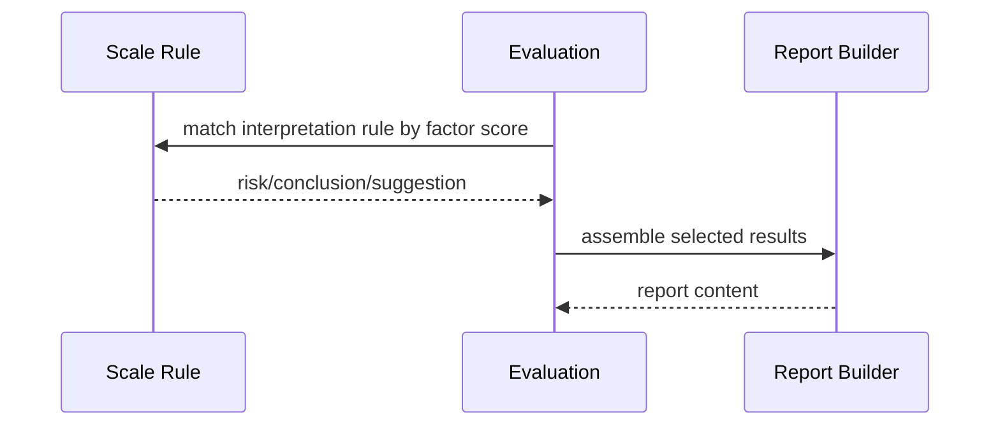

# 解读规则与风险文案

**本文回答**：Scale 如何把分数区间映射成风险等级、结论和建议，以及这类文案为什么属于规则域。

## 30 秒结论

| 问题 | 结论 |
| ---- | ---- |
| 解读规则是什么 | `InterpretationRule` 是 `ScoreRange -> RiskLevel / Conclusion / Suggestion` 的值对象 |
| 谁持有规则 | 规则挂在 `Factor` 上，由 `MedicalScale` 聚合统一保存 |
| 谁使用规则 | Evaluation 在得到因子分数后查找匹配规则，形成结果解释 |
| 不做什么 | 不在文案层推进 Assessment 状态，不把报告模板逻辑塞回 Scale |

## 子模型要解决什么问题

分数本身不能直接被业务人员、医生或受试者理解。解读规则要解决的是“一个因子分数代表什么风险、应该给出什么结论和建议”的问题。它必须跟随量表规则版本维护，而不是散落在报告模板或 worker handler 中，否则同一个分数在不同链路中可能被解释成不同含义。



这个链路说明：解读规则不是 UI 文案，也不是报告模板；它是 Scale 规则域的输出模型。

## 模型图



解读规则属于 Scale，因为它随量表版本和因子定义变化；报告编排属于 Evaluation/Report，因为它决定哪些解释最终进入报告。

## 区间匹配语义

`InterpretationRule.Matches(score)` 是当前区间匹配入口。维护规则时应优先保证：

| 语义 | 要求 |
| ---- | ---- |
| 区间稳定 | 边界分数的包含/排除语义不能在文档里猜测，必须以 `ScoreRange` 和测试为准 |
| 风险稳定 | `RiskLevel` 不应被临时文案替代，避免报告和统计无法聚合 |
| 文案稳定 | conclusion/suggestion 是规则输出，不应在 worker 或报告层二次硬编码 |

## 领域模型和设计模式

| 模型 / 模式 | 作用 | 设计理由 |
| ----------- | ---- | -------- |
| `InterpretationRule` 值对象 | 固化 score range、risk、conclusion、suggestion | 区间规则没有独立生命周期，适合作为因子的组成部分 |
| 区间匹配策略 | 通过 `Matches(score)` 封装边界判断 | 避免应用层和报告层重复写 `min/max` 判断 |
| 风险等级枚举 | 让风险可统计、可筛选、可告警 | 如果只存自然语言文案，后续统计和标签回写会变脆弱 |
| Report Builder | 最终选择和组织规则输出 | Scale 只给解释，不决定报告结构 |

这里使用的是“值对象 + 策略方法”的轻量设计，而不是独立规则表驱动的引擎。原因是风险区间本身与因子强绑定，单独拆成全局规则中心会削弱量表规则的内聚性。

## 与 Report 的边界



Scale 提供“某个因子分数的解释是什么”；Report 负责“报告怎么组织这些解释”。这两个职责不能混在同一个服务里。

## 为什么这样设计

风险文案放在 Scale，而不是 Report，是因为它表达的是医学/心理规则，而不是排版结构。Report Builder 可以决定是否展示某条解释、如何排序、如何组合多因子结果，但不应该重新定义某个分数区间的风险含义。

替代方案是把风险文案放进报告模板。这个方案短期改模板方便，但会导致同一量表规则被多个模板复制；一旦风险等级调整，就需要全局搜索模板并人工同步。当前设计牺牲了一部分模板自由度，换取规则权威和测试可控。

## 取舍与边界

| 取舍 | 当前选择 |
| ---- | -------- |
| 文案归属 | 规则解释文案归 Scale，报告结构归 Evaluation Report |
| 区间冲突 | 文档不声明自动修复，必须由领域校验和测试发现 |
| 多语言 | 当前不把多语言资源放进解读规则；如果需要应独立设计 i18n 层 |
| 历史重算 | 修改规则不自动重算历史 Assessment，除非另行设计补偿任务 |

## 代码锚点与测试锚点

- 解读规则值对象：[internal/apiserver/domain/scale/interpretation_rule.go](../../../internal/apiserver/domain/scale/interpretation_rule.go)
- 因子规则查找：[internal/apiserver/domain/scale/factor.go](../../../internal/apiserver/domain/scale/factor.go)
- 应用服务更新规则：[internal/apiserver/application/scale/factor_service.go](../../../internal/apiserver/application/scale/factor_service.go)
- Evaluation 报告域：[internal/apiserver/domain/evaluation/report/](../../../internal/apiserver/domain/evaluation/report/)

## Verify

```bash
go test ./internal/apiserver/domain/scale ./internal/apiserver/application/scale ./internal/apiserver/domain/evaluation/...
```
