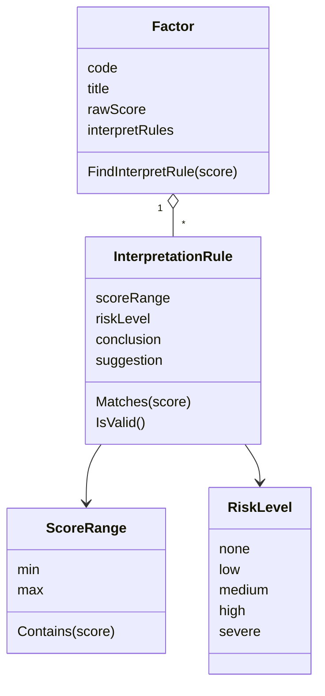
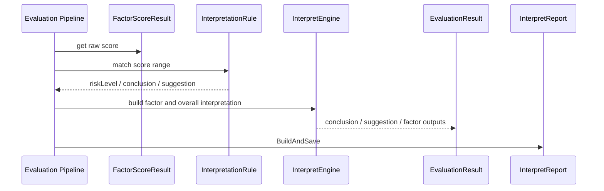

# 解读规则与风险文案

**本文回答**：Scale 模块如何把因子分数映射成风险等级、结论文案和建议文案；为什么 `InterpretationRule` 属于量表规则域；Evaluation pipeline 如何消费这些规则生成本次测评结果和报告；新增或调整风险文案时应该改哪些地方。

---

## 30 秒结论

| 维度 | 结论 |
| ---- | ---- |
| 规则定位 | 解读规则是 Scale 的规则事实，不是 Report 模板里的临时文案 |
| 核心对象 | `InterpretationRule = ScoreRange + RiskLevel + Conclusion + Suggestion` |
| 持有位置 | 解读规则挂在 `Factor` 上，随 `MedicalScale` 一起维护 |
| 区间语义 | `ScoreRange` 当前使用左闭右开区间 `[min, max)` |
| 风险等级 | 当前风险等级为 `none / low / medium / high / severe` |
| 执行位置 | Evaluation pipeline 的 Interpretation 阶段消费因子分和解读规则 |
| 输出结果 | Evaluation 生成本次测评的 risk level、conclusion、suggestion、report |
| 不负责 | Scale 不保存本次测评结论，不决定报告结构，不推进 Assessment 状态 |
| 扩展原则 | 新增风险等级、区间规则或文案结构时，要同步 domain、DTO、report、统计/标签和文档 |

一句话概括：

> **Scale 定义“多少分意味着什么”，Evaluation 决定“这一次测评落在哪个规则上，并把结果写入 Assessment / Report”。**

---

## 1. 为什么解读规则属于 Scale

因子分数本身没有业务可读性。比如某个因子得分为 `18`，它可能代表：

```text
正常
轻度风险
中度风险
高风险
需要进一步筛查
```

这些语义不是 UI 展示，也不是报告排版，而是量表规则的一部分。因此它应该跟随 Scale 维护，而不是散落在：

- Report 模板。
- worker handler。
- Evaluation pipeline 的 if/else。
- 前端展示逻辑。
- 统计标签逻辑。

Scale 统一持有解读规则，可以保证同一套量表规则在不同链路中被一致解释。

---

## 2. 解读规则模型



### 2.1 InterpretationRule

`InterpretationRule` 是值对象，包含：

| 字段 | 说明 |
| ---- | ---- |
| `scoreRange` | 分数区间 |
| `riskLevel` | 风险等级 |
| `conclusion` | 结论文案 |
| `suggestion` | 建议文案 |

它提供：

| 方法 | 语义 |
| ---- | ---- |
| `Matches(score)` | 判断分数是否落在当前区间 |
| `IsValid()` | 判断区间和风险等级是否合法 |

### 2.2 ScoreRange

`ScoreRange` 当前是左闭右开区间：

```text
[min, max)
```

例如：

```text
[0, 10)   -> none
[10, 20)  -> low
[20, 30)  -> medium
[30, 40)  -> high
```

分数 `10` 命中 `[10,20)`，不会同时命中 `[0,10)`。

这种设计的目标是避免边界重叠，尤其是浮点分数场景。

### 2.3 RiskLevel

当前风险等级包括：

```text
none
low
medium
high
severe
```

`RiskLevel` 不能简单替换成自然语言文案，因为它会被多个下游使用：

| 下游 | 用途 |
| ---- | ---- |
| Evaluation | 保存测评风险等级 |
| Report | 展示风险等级 |
| Actor / Tagging | 高风险标签、重点关注 |
| Statistics | 风险聚合统计 |
| Notification | 风险触发类通知 |

风险等级是可聚合字段，结论和建议是解释文案。二者不应该混用。

---

## 3. 从因子分到风险解释



实际运行中，Evaluation pipeline 会先完成 FactorScore，再进入 Interpretation 阶段。Scale 提供规则，Evaluation 在本次上下文中生成结果。

### 3.1 Scale 做什么

Scale 定义：

```text
factor raw score in range X
  -> risk level Y
  -> conclusion Z
  -> suggestion W
```

### 3.2 Evaluation 做什么

Evaluation 执行：

```text
本次 Assessment
  -> 本次 FactorScore
  -> 匹配 Scale 解读规则
  -> 生成本次 EvaluationResult
  -> 保存 Assessment result
  -> 生成并保存 InterpretReport
```

也就是说，Scale 是规则权威，Evaluation 是执行和落库。

---

## 4. InterpretationHandler 的职责边界

Evaluation pipeline 中的 `InterpretationHandler` 负责：

1. 根据因子得分和风险等级生成解读结论和建议。
2. 构建 `EvaluationResult`。
3. 将评估结果应用到 `Assessment`。
4. 生成并保存 `InterpretReport`。
5. 调用下一个 handler。

这说明：

| 事项 | 属于 |
| ---- | ---- |
| 解读规则定义 | Scale |
| 本次解释生成 | Evaluation pipeline |
| Assessment 状态更新 | Evaluation |
| Report 构建保存 | Evaluation / Report |
| 风险规则维护 | Scale |
| 报告结构组织 | Report Builder |

不要把 `InterpretationHandler` 理解成 Scale 的一部分。它只是消费 Scale 规则的执行节点。

---

## 5. InterpretEngine port

Evaluation 中还有一个 `interpretengine` port，用于把规则输入转换成解释输出。

核心类型包括：

| 类型 | 语义 |
| ---- | ---- |
| `RuleSpec` | 分数区间、风险等级、标签、描述、建议 |
| `Result` | 某个因子的解释结果 |
| `FactorScore` | 因子分输入 |
| `CompositeRuleSpec` | 多因子组合规则 |
| `CompositeResult` | 综合解释结果 |
| `Interpreter` | 解释执行接口 |
| `DefaultProvider` | 缺省解释输出提供器 |

这意味着：Scale 的 `InterpretationRule` 是规则模型；Evaluation 可以通过 interpretengine 将规则模型转成一次测评的解释结果。

---

## 6. 风险文案和报告文案的边界

这是最容易写乱的地方。

| 内容 | 应归属 | 说明 |
| ---- | ------ | ---- |
| “分数 20-30 是中风险” | Scale | 这是规则 |
| “中风险的结论文案是什么” | Scale | 这是规则输出 |
| “报告里先展示总分还是分因子” | Evaluation Report | 这是报告结构 |
| “报告是否合并多个因子建议” | Evaluation Report | 这是报告编排 |
| “UI 用红色还是橙色” | Frontend | 这是展示样式 |
| “高风险是否打标签” | Evaluation 后处理 / Actor | 这是后续业务动作 |

### 6.1 Scale 不应该做报告排版

Scale 不应该关心：

- 报告章节顺序。
- 页面布局。
- 是否展示图表。
- 是否折叠低风险因子。
- 是否按人群定制展示样式。

这些都属于 Report 或前端。

### 6.2 Report 不应该重定义规则

Report 不应该写：

```text
if score > 30 then 高风险
```

它应该使用 Scale/Evaluation 已生成的解释结果。否则同一分数可能在不同报告模板中被解释成不同风险。

---

## 7. 区间规则设计

### 7.1 区间覆盖

维护解读规则时应检查：

| 检查项 | 说明 |
| ------ | ---- |
| 是否覆盖有效分数范围 | 避免某些分数没有解释 |
| 是否存在区间重叠 | 避免同一分数匹配多个规则 |
| 是否存在区间空洞 | 避免某些边界无法解释 |
| 边界值是否符合预期 | 左闭右开意味着 max 不包含 |
| 是否有负分或超最大分场景 | 按量表规则明确处理 |

### 7.2 区间排序

即使当前 `FindInterpretRule` 按规则列表顺序查找，也不应该依赖“后写覆盖前写”这种隐含语义。更好的做法是在保存规则时保证：

```text
无重叠
无无效区间
必要时按 min 升序
```

如果未来支持优先级规则，应显式增加 priority 字段，而不是靠数组顺序。

---

## 8. 综合风险等级

单因子风险不一定等于总风险。常见综合风险策略包括：

| 策略 | 说明 |
| ---- | ---- |
| 取总分因子解释 | 如果存在 total score factor，以总分因子为总风险 |
| 取最高风险因子 | 任一高风险因子提升整体风险 |
| 多因子组合规则 | 多个条件同时满足时触发某个综合结论 |
| 默认策略 | 无匹配规则时返回默认解读 |

当前 interpretengine 已预留 composite 相关类型，例如 `CompositeRuleSpec`、`FactorCondition`、`CompositeResult`。这说明未来可以扩展综合解释，但不能在 Scale 单因子规则里硬编码所有组合逻辑。

### 8.1 单因子 vs 综合解释

| 类型 | 输入 | 输出 |
| ---- | ---- | ---- |
| 单因子解释 | 一个 factor raw score + 该 factor rules | factor risk / conclusion / suggestion |
| 综合解释 | 多个 factor scores + composite rules | overall risk / conclusion / suggestion |

单因子规则适合放在 Factor；综合规则如果变复杂，可能需要单独模型，不应强塞进某个普通 Factor。

---

## 9. 修改风险文案时的影响范围

修改 `InterpretationRule` 不只是“改一句话”。它可能影响：

| 影响点 | 说明 |
| ------ | ---- |
| 新测评报告 | 后续测评会用新规则 |
| 历史报告 | 已生成报告是否重算，要有明确策略 |
| 风险标签 | 高风险/重点关注后处理可能变化 |
| 统计聚合 | 风险等级分布可能变化 |
| 通知策略 | 如果通知依赖风险等级，可能受影响 |
| 医学审计 | 规则变更需要可追溯 |

因此，修改风险文案或风险区间时，建议同时记录：

```text
变更原因
适用量表
适用版本
是否影响历史报告
是否需要补偿重算
谁审核
```

---

## 10. 新增风险等级怎么做

如果要新增风险等级，例如 `critical`，不是只加字符串。

至少需要检查：

| 层 | 修改 |
| -- | ---- |
| Scale domain | `RiskLevel` 常量、`IsValid`、`DisplayName` |
| DTO / OpenAPI | 风险等级枚举或说明 |
| Evaluation | risk level 映射、overall risk 策略 |
| Report | 展示文案、样式、排序 |
| Actor/Tagging | 是否触发重点关注 |
| Statistics | 风险分布聚合是否支持 |
| Tests | 区间匹配、报告、统计、标签 |
| Docs | Scale / Evaluation / 接口文档 |

### 10.1 风险等级的稳定性

风险等级一旦进入报告、统计和标签，就成为跨模块语义。不要轻易重命名或删除。

如果只是改展示文案，优先改 display label；如果改变风险等级枚举，必须做兼容设计。

---

## 11. 新增解读文案字段怎么做

例如想增加：

```text
clinical_note
family_advice
training_plan_suggestion
```

先判断它是规则输出还是报告结构：

| 字段 | 可能归属 |
| ---- | -------- |
| clinical_note | 可能属于 Scale 规则输出 |
| family_advice | 可能属于 Scale 规则输出 |
| training_plan_suggestion | 可能属于 Evaluation/Plan 衔接 |
| section_title | 可能属于 Report 模板 |
| display_color | 前端展示 |

如果确实属于规则输出，需要修改：

```text
InterpretationRule
DTO / mapper
FactorService
Evaluation interpretation result
Report builder
OpenAPI/proto
tests
docs
```

不要只在 Report 层追加字段，否则规则事实会分散。

---

## 12. 设计模式与实现意图

| 模式 | 当前实现 | 为什么这样设计 |
| ---- | -------- | -------------- |
| Value Object | `InterpretationRule` | 解读规则没有独立生命周期，适合作为因子的组成部分 |
| Range Matching | `ScoreRange.Contains` / `InterpretationRule.Matches` | 封装边界判断，避免各处手写 min/max |
| Enum | `RiskLevel` | 让风险可统计、可筛选、可触发后续动作 |
| Port | `interpretengine.Interpreter` | Evaluation 通过统一解释接口生成结果 |
| Pipeline Handler | `InterpretationHandler` | 把解释生成、Assessment 应用、Report 保存纳入 Evaluation 流程 |
| Finalizer | `InterpretationFinalizer` | 明确“生成解释”和“保存结果/报告”的边界 |

---

## 13. 设计取舍

| 设计 | 收益 | 代价 |
| ---- | ---- | ---- |
| 解读规则归 Scale | 规则权威集中，便于审计 | Report 不能随意改风险语义 |
| 风险等级枚举化 | 可统计、可标签、可通知 | 新等级变更成本高 |
| ScoreRange 左闭右开 | 边界不重叠 | 维护人员必须理解 max 不包含 |
| InterpretationHandler 保存结果和报告 | pipeline 一次完成测评产出 | 失败补偿需要清楚区分 Assessment 和 Report 状态 |
| interpretengine port | 后续可支持 composite 规则 | 当前实现路径比直接 if/else 更抽象 |

---

## 14. 常见误区

### 14.1 “解读文案属于 Report”

不准确。风险区间对应的结论和建议属于 Scale 规则输出；Report 负责组织这些输出。

### 14.2 “riskLevel 可以直接写中文”

不建议。中文文案不适合统计、排序、标签和接口兼容。应保留稳定枚举，再做展示转换。

### 14.3 “修改文案不会影响业务”

不一定。如果文案只是展示语言，影响较小；如果同时调整 riskLevel 或 scoreRange，就会影响报告、标签和统计。

### 14.4 “区间重叠没关系，先匹配到哪个算哪个”

不建议。量表规则应避免隐含优先级。若确实需要优先级，应显式建模。

### 14.5 “历史报告应该自动跟随最新规则变化”

不一定。已生成报告是历史产出事实，是否重算需要单独补偿策略，不能由 Scale 修改自动触发。

---

## 15. 代码锚点

### Scale Domain

- InterpretationRule：[../../../internal/apiserver/domain/scale/interpretation_rule.go](../../../internal/apiserver/domain/scale/interpretation_rule.go)
- Factor：[../../../internal/apiserver/domain/scale/factor.go](../../../internal/apiserver/domain/scale/factor.go)
- RiskLevel / ScoreRange：[../../../internal/apiserver/domain/scale/types.go](../../../internal/apiserver/domain/scale/types.go)
- FactorService：[../../../internal/apiserver/application/scale/factor_service.go](../../../internal/apiserver/application/scale/factor_service.go)

### Evaluation

- InterpretationHandler：[../../../internal/apiserver/application/evaluation/engine/pipeline/interpretation.go](../../../internal/apiserver/application/evaluation/engine/pipeline/interpretation.go)
- Interpretation pipeline context：[../../../internal/apiserver/application/evaluation/engine/pipeline/context.go](../../../internal/apiserver/application/evaluation/engine/pipeline/context.go)
- interpretengine port：[../../../internal/apiserver/port/interpretengine/interpretengine.go](../../../internal/apiserver/port/interpretengine/interpretengine.go)
- Evaluation assessment domain：[../../../internal/apiserver/domain/evaluation/assessment/](../../../internal/apiserver/domain/evaluation/assessment/)
- Report domain：[../../../internal/apiserver/domain/evaluation/report/](../../../internal/apiserver/domain/evaluation/report/)

---

## 16. Verify

```bash
go test ./internal/apiserver/domain/scale
go test ./internal/apiserver/application/scale
go test ./internal/apiserver/application/evaluation/engine/pipeline
go test ./internal/apiserver/domain/evaluation/...
```

如果修改风险等级枚举或接口输出：

```bash
make docs-rest
make docs-verify
```

如果修改风险标签或统计口径，还应同步检查：

```text
docs/02-业务模块/actor/
docs/02-业务模块/statistics/
docs/02-业务模块/evaluation/
```

---

## 17. 下一跳

| 目标 | 下一篇 |
| ---- | ------ |
| 理解因子分怎么来 | [01-规则与因子计分.md](./01-规则与因子计分.md) |
| 理解 Evaluation 如何消费 Scale | [03-与Evaluation衔接.md](./03-与Evaluation衔接.md) |
| 新增量表规则 | [04-新增量表规则SOP.md](./04-新增量表规则SOP.md) |
| 理解报告产出 | [../evaluation/03-Report与Interpretation.md](../evaluation/03-Report与Interpretation.md) |
