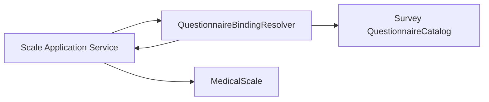
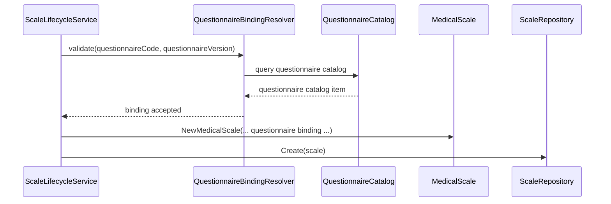

# 问卷与量表链路：问卷绑定

> 本文是 Scale 模块文档的第三篇。
>
> 上一篇《01-MedicalScale模型-MedicalScale-Factor-Interpretation》已经说明：Scale 是医学量表规则域，`MedicalScale` 是规则聚合根，`Factor / ScoringSpec / InterpretationRules` 共同定义“怎么算、怎么解释”。
>
> 本文聚焦 Scale 与 Survey 的协作链路：`MedicalScale` 为什么必须绑定 `QuestionnaireCode + QuestionnaireVersion`；`Factor.QuestionCodes` 如何引用 Survey 中的题目；`QuestionnaireBindingResolver / QuestionnaireCatalog` 如何作为 Scale 与 Survey 之间的防腐层；为什么 draft scale 可以同步最新问卷版本，而 published scale 不能自动同步；发布前如何校验 Scale 规则与绑定问卷版本的一致性。

---

## 1. 结论先行

Scale 与 Survey 之间不是包含关系，也不是直接对象引用关系。

它们通过稳定的版本引用协作：

```text
MedicalScale
  -> QuestionnaireCode
  -> QuestionnaireVersion
  -> Factor.QuestionCodes
```

Survey 负责定义问卷结构和保存答卷事实：

```text
Questionnaire；
Question；
Option；
ValidationRule；
SubmissionSpec；
AnswerSheet；
AnswerValue。
```

Scale 负责定义基于某份问卷版本的医学量表规则：

```text
MedicalScale；
Factor；
ScoringSpec；
InterpretationRules；
InterpretationRule；
RiskLevel。
```

一句话概括：

> **Survey 定义“题目与答案事实”，Scale 定义“这些题目如何组成量表规则”。**

因此，Scale 必须绑定确定的：

```text
QuestionnaireCode + QuestionnaireVersion
```

而不能只绑定 `QuestionnaireCode`。

---

## 2. 本文边界

本文只讲 Scale 与 Survey 的问卷绑定链路。

本文重点：

```text
QuestionnaireCode + QuestionnaireVersion；
Factor.QuestionCodes；
QuestionnaireBindingResolver；
QuestionnaireCatalog；
绑定创建与更新流程；
问卷版本同步策略；
Factor.QuestionCodes 与 QuestionnaireVersion 的一致性校验；
一问卷绑定多量表的策略；
未来 EvaluationModelRef 演进。
```

本文不展开：

```text
MedicalScale / Factor / ScoringSpec / InterpretationRules 的内部模型细节；
AnswerSheet 提交事实；
Evaluation 分数计算引擎；
测评分析引擎；
Report 生成；
Outbox 出站。
```

这些由以下文档承接：

```text
01-MedicalScale模型-MedicalScale-Factor-Interpretation.md
03-量表与测评链路-分数计算引擎与测评分析引擎.md
04-Scale模块分层架构与事实源索引.md
```

---

## 3. 为什么 Scale 必须绑定 QuestionnaireVersion

`QuestionnaireCode` 只能说明：

```text
这份量表基于哪一类问卷。
```

但不能说明：

```text
这份量表规则具体基于哪一版问卷结构。
```

而 Scale 的规则强依赖问卷版本。

例如 Factor 会保存：

```text
QuestionCodes = [Q001, Q002, Q003]
```

这些 question code 是否存在、题型是什么、选项是什么、选项基础分是多少，都依赖具体 `QuestionnaireVersion`。

如果只绑定 `QuestionnaireCode`，会出现问题：

```text
问卷后来新增题目；
问卷后来删除题目；
题目编码发生变化；
题型发生变化；
选项发生变化；
选项基础分发生变化；
Factor.QuestionCodes 指向的题目在新版本中不存在；
历史 Evaluation 无法说明当时按哪版问卷和量表规则执行。
```

所以 Scale 必须绑定：

```text
QuestionnaireCode + QuestionnaireVersion
```

它的语义是：

```text
这份 MedicalScale 规则基于某个确定的 Questionnaire 版本设计。
```

---

## 4. Survey 与 Scale 的职责分工

Survey 和 Scale 的边界如下。

| 概念 | 归属 | 说明 |
| --- | --- | --- |
| Questionnaire | Survey | 问卷模板聚合 |
| QuestionnaireVersion | Survey | 问卷模板版本 |
| Question | Survey | 题目定义 |
| QuestionType | Survey | 题型语义 |
| Option | Survey | 选项定义 |
| ValidationRule | Survey | 答案提交合法性规则 |
| SubmissionSpec | Survey | 已发布问卷的可提交规格 |
| AnswerSheet | Survey | 答卷提交事实 |
| AnswerValue | Survey | 类型化答案值 |
| MedicalScale | Scale | 医学量表规则聚合 |
| Factor | Scale | 因子规则实体 |
| Factor.QuestionCodes | Scale | 对 Survey 题目的编码引用 |
| ScoringSpec | Scale | 计分规格 |
| InterpretationRules | Scale | 解读规则集合 |

关键原则：

```text
Scale 可以引用 Survey 中的问卷版本和题目编码；
Scale 不应该直接拥有 Survey 的 Questionnaire / Question / Option 对象。
```

原因是：

```text
Questionnaire 的生命周期属于 Survey；
MedicalScale 的生命周期属于 Scale；
二者通过版本引用协作，而不是互相持有聚合对象。
```

---

## 5. Factor.QuestionCodes 的语义

`Factor.QuestionCodes` 表示：

```text
这个因子在绑定的 QuestionnaireVersion 中，需要读取哪些题目的答案参与计分。
```

例如：

```text
MedicalScale.QuestionnaireCode = ADHD_PARENT
MedicalScale.QuestionnaireVersion = 1.0.0

Factor.Attention.QuestionCodes = [Q001, Q002, Q003]
```

它的含义是：

```text
注意力因子基于 ADHD_PARENT 1.0.0 版本问卷中的 Q001、Q002、Q003 计算。
```

`Factor.QuestionCodes` 不应该理解为：

```text
Factor 拥有这些 Question；
Factor 可以修改 Question；
Scale 可以维护 QuestionType 或 Option；
Scale 可以校验 AnswerValue。
```

这些都属于 Survey / Evaluation 的边界。

Factor 只保存题目编码引用。

---

## 6. 为什么不直接持有 Question 对象

如果 Scale 直接持有 Survey 的 Question 对象，会出现几个问题。

### 6.1 聚合边界被破坏

Questionnaire 是 Survey 聚合，MedicalScale 是 Scale 聚合。

一个聚合直接持有另一个聚合内部实体，会导致：

```text
生命周期耦合；
持久化耦合；
版本边界模糊；
领域规则互相渗透。
```

### 6.2 历史规则不可追溯

如果 Scale 持有的是当前 Question 对象，而不是 QuestionnaireVersion 引用，后台修改问卷后，Scale 规则可能被动变化。

这会导致：

```text
同一份 MedicalScale 在不同时间关联到不同题目结构；
历史 Evaluation 难以复盘；
报告解释失去规则证据链。
```

### 6.3 模块职责膨胀

如果 Scale 直接操作 Question，就会开始关心：

```text
题型；
选项；
校验规则；
答案值解析；
问卷发布状态。
```

这些都是 Survey 的职责。

因此，Scale 只保存引用，不持有对象。

---

## 7. QuestionnaireBindingResolver：Scale 与 Survey 的防腐层

Scale 需要知道某个 Questionnaire 是否存在、是否适合绑定，但不应该直接操作 Survey 聚合。

因此需要一个绑定解析/校验组件：

```text
QuestionnaireBindingResolver
```

它的职责是：

```text
校验 QuestionnaireCode 是否存在；
校验 QuestionnaireVersion 是否存在；
校验 Questionnaire 类型是否适合作为 MedicalScale 问卷；
校验同一 QuestionnaireCode 是否已经绑定其他 Scale；
返回可写入 MedicalScale 的 QuestionnaireRef 信息。
```

它的上游是 Scale application service。

它的下游是 Survey Catalog / Questionnaire Catalog。



这个组件本质上是 Scale 与 Survey 之间的防腐层。

它避免 Scale 直接依赖 Survey 的完整领域模型。

防腐层的核心价值是：在两个语义不同的子系统之间建立适配与翻译层，防止外部模型直接污染本地领域模型。Scale 与 Survey 虽然同在一个 qs-server 内，但它们依然是不同业务边界；Scale 只需要 Survey 的目录事实，不需要吞入 Survey 的完整模型。

---

## 8. QuestionnaireCatalog 的角色

Scale 只需要 Survey 提供轻量目录能力。

例如：

```text
FindByCode(code)
FindByCodeVersion(code, version)
FindPublishedByCode(code)
```

返回的信息可以是目录视图，而不是完整 Questionnaire 聚合。

典型字段包括：

```text
QuestionnaireCode；
QuestionnaireVersion；
QuestionnaireType；
Status；
Title；
QuestionCodes；
QuestionTypes；
OptionScoreSummary。
```

Scale 使用这些信息做绑定校验。

例如：

```text
这个 questionnaire 是否存在？
这个 version 是否存在？
这个 questionnaire 是否是 medical_scale 类型？
Factor.QuestionCodes 是否存在于该 version 中？
题型是否适合对应 ScoringSpec？
```

Catalog 的目标不是让 Scale 操作 Survey，而是提供跨模块只读事实。

---

## 9. 绑定创建流程

创建 MedicalScale 时，如果提供 QuestionnaireCode / Version，需要执行绑定校验。

流程可以概括为：



绑定创建时应该保证：

```text
questionnaireCode 合法；
如果指定 questionnaireVersion，则该 version 存在；
questionnaire 类型适合 MedicalScale；
没有违反一问卷绑定多量表的业务限制。
```

创建后的 `MedicalScale` 通常处于 `draft`。

---

## 10. 更新绑定流程

更新 Questionnaire binding 属于规则变更。

因为它会改变：

```text
Scale 基于哪版问卷；
Factor.QuestionCodes 应该解释到哪版题目；
Evaluation 后续读取答案的题目基准。
```

因此，更新绑定必须经过 `MedicalScale` 的规则冻结检查。

流程：

```text
UpdateQuestionnaireCommand
  -> QuestionnaireBindingResolver.validate
  -> Repository.GetByCode
  -> BaseInfo.UpdateQuestionnaire
  -> MedicalScale.ensureRuleEditable
  -> Repository.Update
  -> PublishCollectedEvents
```

发布态和归档态不应该允许更新绑定。

---

## 11. 问卷版本同步策略

当 Survey 发布新的 QuestionnaireVersion 时，Scale 可能需要同步绑定版本。

但不能所有 Scale 都自动同步。

推荐策略如下。

| Scale 状态 | 是否自动同步最新 QuestionnaireVersion | 原因 |
| --- | --- | --- |
| draft | 可以 | 草稿仍在设计中，跟随最新问卷有助于维护 |
| published | 不可以 | 发布态是规则事实，自动同步会破坏规则稳定性 |
| archived | 不可以 | 归档态退出正常维护链路 |

### 11.1 draft scale 为什么可以同步

`draft` 表示规则还在设计中。

此时问卷发布新版本后，Scale 同步最新 QuestionnaireVersion 是合理的。

它可以帮助设计者继续基于最新问卷完善规则。

### 11.2 published scale 为什么不能同步

`published` scale 已经是可执行规则事实。

如果自动同步 QuestionnaireVersion，会导致：

```text
Factor.QuestionCodes 可能指向不同题目结构；
ScoringSpec 的输入发生变化；
InterpretationRules 的分数区间可能不再适配；
历史 Evaluation 难以说明当时基于哪版规则执行。
```

因此，published scale 必须冻结绑定版本。

如果需要基于新问卷版本调整规则，应采用显式流程：

```text
Unpublish 后维护；
创建新的 ScaleVersion；
或者 Fork 一个新的 draft。
```

### 11.3 archived scale 为什么不同步

`archived` scale 代表历史规则。

它的价值在于可追溯，而不是继续维护。

自动同步会破坏历史事实。

---

## 12. QuestionnaireBindingSyncer

`QuestionnaireBindingSyncer` 可以理解为 Survey 事件到 Scale 草稿规则的同步器。

典型触发条件：

```text
Questionnaire published；
Questionnaire version changed；
存在绑定该 QuestionnaireCode 的 draft MedicalScale。
```

Syncer 应该做：

```text
找到绑定该 QuestionnaireCode 的 MedicalScale；
仅处理 draft 状态；
如果 QuestionnaireVersion 不同，则更新绑定版本；
保存 MedicalScale；
发布 ScaleChangedEvent。
```

Syncer 不应该做：

```text
修改 published scale；
修改 archived scale；
自动改 Factor.QuestionCodes；
自动生成 ScoringSpec；
自动生成 InterpretationRules。
```

因为这些都是规则设计行为，不能由同步器偷偷完成。

---

## 13. Factor.QuestionCodes 与版本一致性

`Factor.QuestionCodes` 必须以 MedicalScale 绑定的 QuestionnaireVersion 为解释上下文。

也就是说：

```text
Factor.QuestionCodes = [Q001, Q002]
```

不能单独解释。

它必须结合：

```text
MedicalScale.QuestionnaireCode = X
MedicalScale.QuestionnaireVersion = Y
```

才能说明：

```text
Q001 / Q002 是 X 问卷 Y 版本中的题目。
```

发布前可以进一步校验：

```text
所有 Factor.QuestionCodes 都存在于绑定 QuestionnaireVersion；
题目类型是否适配 ScoringSpec；
选项基础分是否满足计分策略需要；
是否允许同一 questionCode 出现在多个 Factor 中；
是否允许 total score factor 不直接绑定题目。
```

这些属于 Scale 与 Survey 协作校验。

---

## 14. 与 Survey 的数据一致性边界

Scale 与 Survey 之间不需要强事务。

因为它们不是同一个聚合。

合理的一致性模型是：

```text
Survey 发布 QuestionnaireVersion；
Scale 通过 Catalog 查询可绑定版本；
draft scale 可以同步最新版本；
published scale 冻结已绑定版本；
Evaluation 执行时基于 AnswerSheet.QuestionnaireRef + MedicalScale.QuestionnaireRef 校验一致性。
```

### 14.1 Evaluation 执行时的一致性校验

Evaluation 执行时需要确认：

```text
AnswerSheet.QuestionnaireCode == MedicalScale.QuestionnaireCode；
AnswerSheet.QuestionnaireVersion == MedicalScale.QuestionnaireVersion；
Factor.QuestionCodes 可以从 AnswerSheet 中找到对应答案。
```

如果不一致，应拒绝执行或进入失败状态。

原因是：

```text
答卷事实和量表规则必须基于同一问卷版本。
```

---

## 15. 一问卷绑定多量表的问题

一个 QuestionnaireCode 是否允许绑定多个 MedicalScale，是业务策略问题。

### 15.1 不允许多绑定

如果一个问卷只对应一份 MedicalScale，则绑定解析器需要检查：

```text
同一 QuestionnaireCode 是否已经绑定其他 Scale。
```

优点：

```text
关系简单；
Evaluation 根据 questionnaireCode 解析 scale 更容易；
减少歧义。
```

缺点：

```text
复用同一问卷做不同规则解释会受限。
```

### 15.2 允许多绑定

如果未来一个问卷可以对应多个规则模型，则需要额外区分：

```text
ScaleCode；
EvaluationModelRef；
Task 配置；
Plan 绑定；
显式规则选择策略。
```

否则 Evaluation 无法仅凭 questionnaireCode 判断应该使用哪份规则。

当前阶段可以采用简单策略，但文档中要保留演进空间。

---

## 16. 与未来 EvaluationModelRef 的关系

当前 Scale 与 Survey 的绑定服务于 MedicalScale。

未来系统支持 MBTI、Big Five、DISC 等模型时，Evaluation 不应该只通过 questionnaireCode 找 MedicalScale。

更通用的方式是：

```text
EvaluationModelRef
├── Type: medical_scale / mbti / big_five / ...
├── Code
├── Version
└── Title
```

MedicalScale 可以暴露：

```text
Type = medical_scale
Code = MedicalScaleCode
Version = MedicalScaleVersion
QuestionnaireRef = QuestionnaireCode + QuestionnaireVersion
```

这样，Survey 与 Scale 的绑定不会阻碍未来多测评模型扩展。

---

## 17. 当前链路成熟度评价

| 方面 | 评价 |
| --- | --- |
| 版本引用 | QuestionnaireCode + QuestionnaireVersion 边界清楚 |
| 聚合边界 | Scale 不直接持有 Survey Question 对象 |
| Factor.QuestionCodes | 作为题目编码引用成立 |
| 防腐层 | QuestionnaireBindingResolver / Catalog 可以保护 Scale 模型 |
| draft 同步 | 可以支持规则设计态跟随最新问卷版本 |
| published 冻结 | 能避免已发布规则被问卷版本变化污染 |
| Evaluation 校验 | AnswerSheet 与 MedicalScale 需要基于同一 QuestionnaireRef |
| 多模型演进 | EvaluationModelRef 可为 MBTI 等模型预留空间 |

综合判断：

```text
Scale 与 Survey 的绑定边界是清楚的：Survey 是问卷事实源，Scale 是量表规则事实源，二者通过版本化引用协作，不通过对象持有耦合。
```

---

## 18. 后续演进方向

### 18.1 更强的 QuestionCode 发布校验

未来发布前可以校验：

```text
Factor.QuestionCodes 必须存在于绑定 QuestionnaireVersion；
题目类型必须适配 ScoringSpec；
选项基础分必须满足计分策略需要；
题目是否允许重复出现在多个 Factor 中。
```

这些校验可以通过 QuestionnaireCatalog 提供轻量题目信息完成。

### 18.2 ScaleVersion

当 MedicalScale 引入版本后，绑定关系应升级为：

```text
MedicalScaleCode + MedicalScaleVersion
  -> QuestionnaireCode + QuestionnaireVersion
```

每个发布版本绑定确定问卷版本。

### 18.3 RuleSnapshot

Evaluation 执行时可以保存：

```text
QuestionnaireRef；
MedicalScaleRef；
FactorRuleSnapshot；
ScoringSpecSnapshot；
InterpretationRuleSnapshot。
```

这样历史结果可完整追溯。

### 18.4 多模型绑定

未来如果一个 Questionnaire 可以服务多个模型，需要引入显式绑定策略：

```text
Plan / Task 指定 EvaluationModelRef；
或者 QuestionnaireBinding 表支持多模型；
或者 EvaluationModelResolver 根据上下文解析。
```

---

## 19. 不建议做的事情

| 不建议 | 原因 |
| --- | --- |
| Scale 直接持有 Question 对象 | 破坏 Survey / Scale 聚合边界 |
| 只绑定 QuestionnaireCode | 无法追溯具体问卷版本 |
| published scale 自动同步最新 QuestionnaireVersion | 会破坏已发布规则稳定性 |
| Syncer 自动修改 Factor.QuestionCodes | 规则设计不应由同步器隐式完成 |
| Scale 直接校验 AnswerValue | 答案值属于 Survey，执行校验属于 Survey / Evaluation |
| Evaluation 只凭 QuestionnaireCode 找规则 | 未来多模型或多规则绑定时会产生歧义 |
| 把 MBTI 问卷绑定进 MedicalScale | MBTI 应该是同级规则域，不是 MedicalScale 的子类型 |

---

## 20. 代码锚点

| 主题 | 路径 |
| --- | --- |
| MedicalScale 问卷绑定字段 | `internal/apiserver/domain/scale/medical_scale.go` |
| BaseInfo 更新问卷绑定 | `internal/apiserver/domain/scale/baseinfo.go` |
| Factor.QuestionCodes | `internal/apiserver/domain/scale/factor.go` |
| QuestionnaireBindingResolver | `internal/apiserver/application/scale/questionnaire_binding_resolver.go` |
| QuestionnaireBindingSyncer | `internal/apiserver/application/scale/questionnaire_binding_syncer.go` |
| 生命周期应用服务 | `internal/apiserver/application/scale/lifecycle_service.go` |
| 创建流程 | `internal/apiserver/application/scale/lifecycle_creation_workflow.go` |
| 基础信息/问卷更新流程 | `internal/apiserver/application/scale/lifecycle_basic_info_workflow.go` |
| Scale 查询服务 | `internal/apiserver/application/scale/query_service.go` |
| Survey Questionnaire 模型 | `internal/apiserver/domain/survey/questionnaire` |
| Survey SubmissionSpec | `internal/apiserver/domain/survey/questionnaire/submission_spec.go` |
| Survey 模块文档 | `docs/02-业务模块/survey` |

---

## 21. Verify

修改 Scale 与 Survey 绑定逻辑后，建议执行：

```bash
go test ./internal/apiserver/domain/scale/...
go test ./internal/apiserver/application/scale/...
go test ./internal/apiserver/domain/survey/...
go test ./internal/apiserver/application/survey/...
```

如果改动涉及 Evaluation 执行前的一致性校验：

```bash
go test ./internal/apiserver/application/evaluation/...
go test ./internal/worker/...
```

如果改动涉及问卷发布事件或同步器：

```bash
go test ./internal/apiserver/application/scale/...
go test ./internal/apiserver/application/eventing/...
```

全量质量入口：

```bash
make test
make lint
make docs-hygiene
```

---

## 22. 面试与宣讲口径

### 22.1 30 秒版本

```text
Scale 不直接持有 Survey 的 Question 对象，而是通过 QuestionnaireCode + QuestionnaireVersion 绑定确定问卷版本，Factor 只保存 QuestionCodes 作为题目引用。
这样 MedicalScale 的规则就能明确说明自己基于哪版问卷设计。draft scale 可以跟随最新问卷版本同步，但 published scale 是已发布规则事实，不能自动同步，否则会破坏历史评估可追溯性。
```

### 22.2 3 分钟版本

```text
Scale 与 Survey 的边界非常关键。Survey 负责 Questionnaire、Question、Option、AnswerSheet 和 AnswerValue；Scale 负责 MedicalScale、Factor、ScoringSpec 和 InterpretationRules。

MedicalScale 不直接持有 Question 对象，而是保存 QuestionnaireCode 和 QuestionnaireVersion。Factor 也不持有 Question，只保存 QuestionCodes。这样做是为了避免跨聚合直接引用，同时保证规则可追溯。

如果 Scale 只绑定 QuestionnaireCode，就无法说明这份规则到底基于哪版问卷。问卷版本变化后，题目、选项和基础分都可能变化，历史 Evaluation 就无法复盘。所以 Scale 必须绑定确定的 QuestionnaireVersion。

Scale 和 Survey 之间通过 QuestionnaireBindingResolver / QuestionnaireCatalog 协作。Resolver 只读取问卷目录信息，校验问卷是否存在、版本是否存在、类型是否适合绑定、是否违反绑定策略，不直接操作 Survey 聚合。

问卷版本同步也要区分状态。draft scale 仍在设计中，可以跟随最新 QuestionnaireVersion；published scale 已经是规则事实，不能自动同步；archived scale 也不再同步。这样可以保证 Evaluation 使用的规则和答卷基于同一问卷版本。
```

### 22.3 高频追问

| 追问 | 回答要点 |
| --- | --- |
| 为什么 Scale 绑定 QuestionnaireVersion？ | 保证规则基于确定问卷版本，避免问卷变化污染规则 |
| Factor 为什么只保存 QuestionCodes？ | Question 属于 Survey，Scale 只保存题目引用 |
| Scale 能不能直接持有 Question？ | 不建议，会破坏聚合边界和版本边界 |
| draft scale 为什么可以同步最新问卷版本？ | draft 仍在设计中，跟随最新问卷有助于维护 |
| published scale 为什么不能同步？ | published 是规则事实，自动同步会破坏历史可追溯性 |
| QuestionnaireBindingResolver 的作用？ | 作为 Scale 与 Survey 的防腐层，校验问卷目录和绑定合法性 |
| 一个 Questionnaire 能否绑定多个 Scale？ | 这是业务策略；允许多绑定时需要 EvaluationModelRef 或 Plan 明确选择规则 |
| Evaluation 执行时要校验什么？ | AnswerSheet 与 MedicalScale 必须基于同一 QuestionnaireCode + Version |

---

## 23. 下一篇文档

下一篇建议维护：

```text
03-量表与测评链路-分数计算引擎与测评分析引擎.md
```

重点回答：

```text
Evaluation 如何消费 MedicalScale；
Factor / ScoringSpec / InterpretationRules 如何作为执行输入；
FactorScore / RiskLevelResult / Report 为什么属于 Evaluation；
Evaluation 执行前如何校验 AnswerSheet 与 MedicalScale 的 QuestionnaireRef 一致；
未来 EvaluationModelRef 如何让 MedicalScale 与 MBTI 等规则模型并列接入。
```
