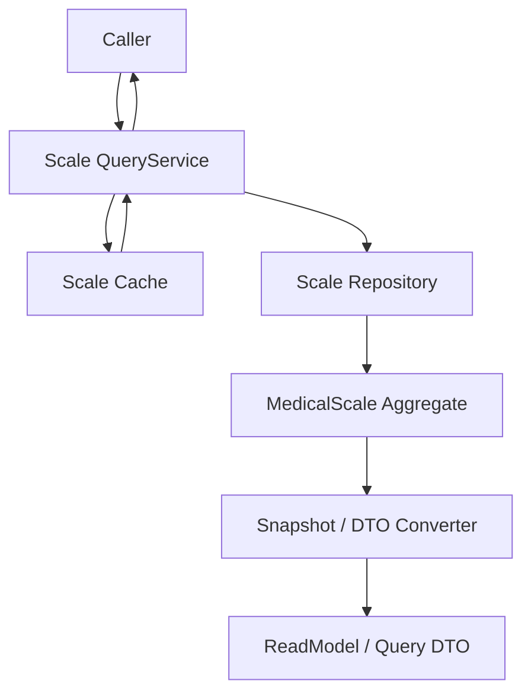
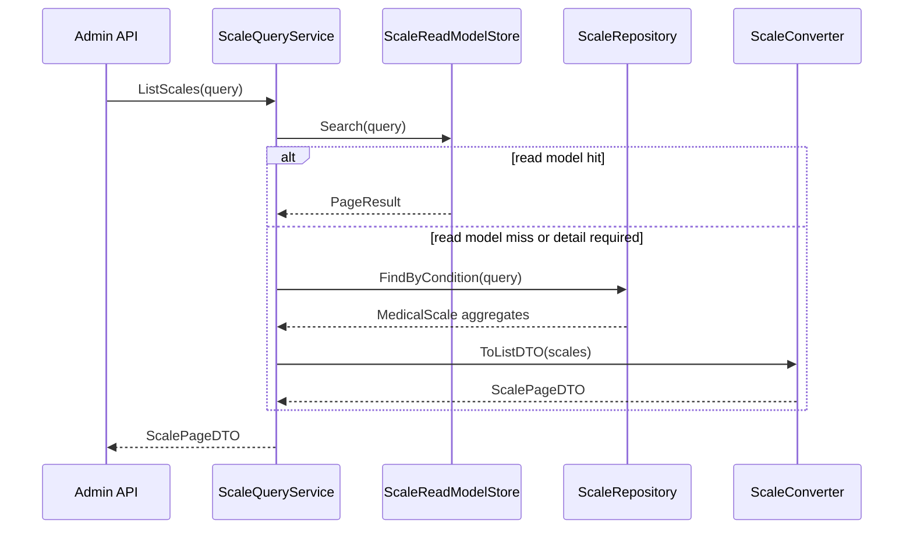
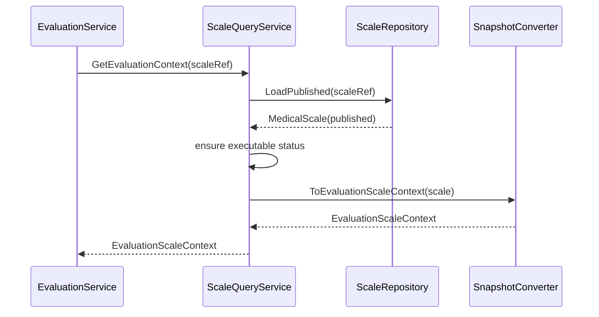

# 03-Scale 查询链路：查询服务与读模型

> 本文是 Scale 模块文档的第三篇，聚焦 **Scale 查询链路、查询服务与读模型设计**。
>
> 前两篇已经说明：`MedicalScale` 是医学量表解释规则聚合根，Scale 维护链路负责创建、编辑、发布、冻结、归档和问卷绑定。本文继续回答：Scale 规则如何被后台管理端、前台展示层、Evaluation 测评引擎以及其它模块安全地读取。
>
> 本文重点不是“如何修改 Scale”，而是“如何查询 Scale”。查询链路应尽量避免暴露可变领域对象，优先输出 Snapshot / DTO / ReadModel，让不同调用方按场景读取稳定数据。

---

## 1. 结论先行

Scale 查询链路的核心目标是：

```text
对后台管理端，提供完整、可分页、可筛选、可审计的量表管理视图；
对前台展示层，提供已发布、可展示、轻量化的量表展示视图；
对 Evaluation，提供可执行、冻结、可追溯的规则快照；
对统计与运营模块，提供稳定的读模型和索引字段；
对缓存与读模型，提供清晰的刷新边界。
```

查询链路不应该直接暴露 `MedicalScale` 可变聚合对象。

推荐输出模型包括：

```text
MedicalScaleSnapshot      领域规则快照
FactorSnapshot            因子规则快照
ScaleQueryDTO             后台管理查询 DTO
ScaleListItemDTO          列表页轻量 DTO
ScaleDetailDTO            详情页 DTO
EvaluationScaleContext    Evaluation 消费规则上下文
QuestionnaireBindingView  问卷绑定视图
```

一句话概括：

> **Scale 查询服务不是领域聚合的 getter 集合，而是为不同读场景提供稳定、只读、可缓存、可演进的数据视图。**

---

## 2. 本文边界

本文重点：

```text
Scale 查询服务的职责；
后台管理查询链路；
前台展示查询链路；
Evaluation 规则读取链路；
Snapshot / DTO / ReadModel 的边界；
缓存与读模型设计；
查询链路中的发布态过滤；
查询链路的防漂移原则。
```

本文不展开：

```text
MedicalScale 聚合内部模型细节；
Scale 创建、发布、因子维护、问卷绑定写侧流程；
Evaluation 如何执行计分和解释；
Report 如何生成；
Mongo / MySQL mapper 的具体实现细节。
```

这些由其它文档承接：

```text
01-Scale模型--MedicalScale-Factor-Interpretion 模型设计.md
02-Scale 维护链路--生命周期-因子维护-问卷绑定.md
04-Scale 测评链路--Scale与Evaluation联动详解.md
05-Scale模块分层架构与事实源索引.md
```

---

## 3. 为什么需要专门的查询链路

如果 Scale 查询只是简单返回 `MedicalScale` 聚合，会出现几个问题。

第一，聚合对象是写模型。

它的主要职责是保护规则不变量，不是为前端、后台、Evaluation 提供各种展示结构。

第二，不同调用方需要的数据不同。

```text
后台管理需要完整规则、状态、审计信息；
前台展示只需要已发布量表的展示信息；
Evaluation 只需要可执行规则快照；
统计模块只需要量表分类、状态、绑定问卷等索引字段。
```

第三，直接暴露聚合对象容易破坏封装。

例如：

```go
scale.Factors()[0].ScoringSpec.Params["weight"] = 2
```

如果查询返回的是可变引用，就可能绕过聚合根修改内部状态。

因此 Scale 查询链路必须明确：

```text
聚合对象属于写模型；
查询输出属于读模型；
读模型可以来自聚合快照，也可以来自专门 read store；
外部模块只读取 Snapshot / DTO，不持有可变领域对象。
```

---

## 4. 查询场景总览

Scale 查询场景可以分成四类。

| 场景 | 调用方 | 输出模型 |
| --- | --- | --- |
| 后台管理 | Admin / Operating | ScaleQueryDTO / ScaleDetailDTO |
| 前台展示 | 小程序 / collection-server | PublishedScaleView / ScaleListItemDTO |
| 测评执行 | Evaluation | EvaluationScaleContext / MedicalScaleSnapshot |
| 运营统计 | Statistics / HotRank | ScaleReadModel / ScaleIndex |

这四类场景虽然都读取 Scale，但关注点不同。

不能用一个 DTO 满足所有场景。

---

## 5. 查询链路总览

Scale 查询链路可以抽象为：



典型流程：

```text
1. 调用方发起查询；
2. QueryService 判断查询场景；
3. 优先读取缓存或读模型；
4. 缓存未命中时从 Repository 加载 MedicalScale；
5. 将聚合转换为 Snapshot / DTO；
6. 返回只读结果；
7. 必要时回填缓存。
```

关键原则：

```text
QueryService 可以读取聚合，但不能修改聚合；
Converter 可以组装 DTO，但不能决定业务规则；
Cache 可以提升性能，但不能成为规则事实源；
读模型可以冗余字段，但必须能从规则事实重建。
```

---

## 6. QueryService 的职责

Scale QueryService 是 Scale 应用层的读侧入口。

它应负责：

```text
按 ID 查询 Scale；
按 ScaleCode 查询 Scale；
分页查询后台管理列表；
查询已发布量表列表；
查询量表详情；
查询某份问卷绑定的 Scale；
为 Evaluation 加载规则上下文；
组装 Snapshot / DTO；
处理缓存读取与回填。
```

它不应负责：

```text
创建或修改 MedicalScale；
修改 Factor；
修改 Questionnaire binding；
执行计分；
生成 Report；
保存 FactorScore；
决定 Assessment 状态。
```

QueryService 是读侧编排，不是写侧应用服务。

---

## 7. 查询服务接口设计

QueryService 可以按场景提供不同方法。

例如：

```go
type QueryService interface {
    GetByID(ctx context.Context, id uint64) (*ScaleDetailDTO, error)
    GetByCode(ctx context.Context, code string) (*ScaleDetailDTO, error)
    List(ctx context.Context, query ScaleListQuery) (*ScalePageDTO, error)
    ListPublished(ctx context.Context, query PublishedScaleQuery) (*PublishedScalePageDTO, error)
    GetEvaluationContext(ctx context.Context, ref ScaleRef) (*EvaluationScaleContext, error)
    GetBindingView(ctx context.Context, code string) (*QuestionnaireBindingView, error)
}
```

这些方法背后的输出模型不完全相同。

原因是不同场景的稳定性要求不同。

后台管理可以看到 draft / published / archived。

前台展示通常只能看到 published。

Evaluation 只能消费可执行、冻结、版本明确的规则。

---

## 8. Snapshot / DTO / ReadModel 的区别

Scale 查询链路中最容易混淆的是三类模型：

```text
Snapshot
DTO
ReadModel
```

### 8.1 Snapshot

Snapshot 是领域规则的只读快照。

它来源于 `MedicalScale` 聚合，但不暴露聚合行为。

例如：

```text
MedicalScaleSnapshot
├── ID
├── ScaleCode
├── Title
├── QuestionnaireRef
├── Status
├── Factors
└── Version / UpdatedAt
```

Snapshot 的目标是：

```text
保持领域语义；
只读；
可安全传递给 Evaluation；
可用于规则快照追溯；
避免外部直接持有聚合指针。
```

### 8.2 DTO

DTO 是面向接口输出的传输对象。

例如后台详情页需要：

```text
ScaleDetailDTO
├── 基础信息
├── 状态信息
├── 问卷绑定信息
├── 因子列表
├── 创建 / 更新时间
└── 操作权限提示
```

DTO 可以包含展示友好的字段，例如：

```text
statusText
categoryName
questionnaireTitle
canPublish
canArchive
```

这些字段不一定属于领域模型。

### 8.3 ReadModel

ReadModel 是为查询性能和展示便利而建立的读侧模型。

它可以冗余字段。

例如：

```text
ScaleReadModel
├── ScaleID
├── ScaleCode
├── Title
├── Category
├── Status
├── QuestionnaireCode
├── QuestionnaireVersion
├── FactorCount
├── PublishedAt
├── UpdatedAt
└── HotRank
```

ReadModel 的目标是：

```text
支持分页；
支持筛选；
支持排序；
支持搜索；
提升查询性能。
```

ReadModel 不是规则事实源。

如果读模型丢失或漂移，应能从 `MedicalScale` 规则事实重建。

---

## 9. 后台管理查询链路

后台管理需要完整的 Scale 视图。

典型查询包括：

```text
分页查询量表列表；
按状态筛选；
按分类筛选；
按关键词搜索；
查看量表详情；
查看因子规则；
查看问卷绑定；
查看发布状态；
查看最近更新时间；
查看是否可发布 / 可归档 / 可删除。
```

后台查询链路可以抽象为：



后台列表页建议返回轻量 DTO。

例如：

```text
ScaleListItemDTO
├── ID
├── ScaleCode
├── Title
├── Category
├── Status
├── QuestionnaireCode
├── QuestionnaireVersion
├── FactorCount
├── UpdatedAt
└── OperationHints
```

后台详情页可以返回完整规则 DTO。

```text
ScaleDetailDTO
├── BasicInfo
├── QuestionnaireBinding
├── FactorDTO[]
├── LifecycleInfo
├── AuditInfo
└── OperationHints
```

其中 OperationHints 不是领域规则本身，而是根据状态计算出的 UI 辅助信息。

例如：

```text
canEdit
canPublish
canUnpublish
canArchive
canDelete
```

最终能不能执行操作，仍要由写侧领域逻辑保护。

---

## 10. 前台展示查询链路

前台展示通常只关心 published 量表。

它不应该看到：

```text
draft 规则；
archived 规则；
内部审计字段；
完整 ScoringSpec；
后台维护字段；
领域事件。
```

前台展示查询应输出轻量视图：

```text
PublishedScaleView
├── ScaleCode
├── Title
├── Description
├── Category
├── Tags
├── ApplicableAges
├── Reporters
├── QuestionnaireCode
├── QuestionnaireVersion
└── DisplayConfig
```

前台查询链路的关键原则：

```text
只返回 published；
不泄露内部规则细节；
不暴露计分权重和解释区间；
输出面向展示，而不是面向维护；
缓存优先，但缓存必须随 ScaleChangedEvent 失效。
```

如果前台需要开始测评，它真正需要的是：

```text
可展示的量表信息；
绑定的 QuestionnaireCode / QuestionnaireVersion；
跳转到 Survey 提交入口。
```

它不需要完整 Factor 和 ScoringSpec。

---

## 11. Evaluation 查询链路

Evaluation 是 Scale 查询链路中最特殊的调用方。

它不是为了展示，而是为了执行测评。

Evaluation 需要的是可执行规则上下文。

可以抽象为：

```text
EvaluationScaleContext
├── ScaleRef
├── QuestionnaireRef
├── FactorSnapshots
├── RuleVersion
└── PublishedAt / UpdatedAt
```

其中 FactorSnapshots 包括：

```text
FactorCode
IsTotalScore
IsShow
QuestionCodes
ScoringSpecSnapshot
InterpretationRulesSnapshot
```

Evaluation 查询链路：



Evaluation 查询必须保证：

```text
Scale 状态必须是 published；
QuestionnaireCode / QuestionnaireVersion 必须明确；
FactorSnapshots 非空；
ScoringSpecSnapshot 完整；
InterpretationRulesSnapshot 完整；
返回的是只读快照，不是可变聚合对象。
```

Evaluation 执行时应同时校验：

```text
AnswerSheet.QuestionnaireCode == Scale.QuestionnaireCode
AnswerSheet.QuestionnaireVersion == Scale.QuestionnaireVersion
```

如果不一致，应拒绝执行或进入失败处理。

---

## 12. Questionnaire Binding 查询视图

Scale 查询链路还需要提供问卷绑定视图。

这个视图服务于后台管理和运维排查。

例如：

```text
QuestionnaireBindingView
├── ScaleCode
├── ScaleTitle
├── ScaleStatus
├── QuestionnaireCode
├── QuestionnaireVersion
├── QuestionnaireTitle
├── QuestionnaireStatus
├── FactorQuestionCodeSummary
└── BindingHealth
```

BindingHealth 可以表达：

```text
绑定问卷是否存在；
绑定版本是否存在；
Factor.QuestionCodes 是否全部存在；
绑定问卷是否已经有新版本；
draft 是否可同步；
published 是否禁止自动同步。
```

注意：BindingHealth 是查询诊断结果，不是领域规则本身。

它可以帮助后台提示：

```text
当前量表绑定的问卷已有新版本，草稿态可同步；
当前量表已发布，不允许自动同步；
当前因子引用了不存在的题目，请修复后发布。
```

---

## 13. 查询过滤规则

不同查询入口需要不同过滤规则。

### 13.1 后台管理入口

后台管理可以查询全部状态：

```text
draft
published
archived
```

但应根据权限控制可见范围。

### 13.2 前台展示入口

前台展示只能查询：

```text
published
```

并且要过滤：

```text
不可见分类；
不适用年龄；
不适用报告人；
被下架或归档的量表。
```

### 13.3 Evaluation 入口

Evaluation 只能加载：

```text
published + executable
```

如果传入 draft 或 archived，应该返回明确错误。

### 13.4 运营统计入口

统计入口可以读取多种状态，但必须明确统计口径。

例如：

```text
只统计 published；
统计全部历史；
排除 archived；
按分类聚合；
按绑定问卷聚合。
```

---

## 14. 缓存设计

Scale 查询很适合缓存，但缓存不能成为事实源。

典型缓存对象：

```text
scale:detail:{scaleID}
scale:code:{scaleCode}
scale:published:list:{queryHash}
scale:evaluation-context:{scaleCode}:{version}
scale:binding:{questionnaireCode}:{version}
```

缓存策略：

```text
后台详情可以短 TTL；
前台 published 列表可以中等 TTL；
Evaluation context 可以长 TTL，但必须被 ScaleChangedEvent 精确失效；
归档和取消发布必须立即失效相关 published 缓存。
```

缓存失效来源：

```text
CreateScale；
UpdateBasicInfo；
UpdateQuestionnaire；
AddFactor；
UpdateFactor；
RemoveFactor；
ReplaceFactors；
UpdateInterpretRules；
Publish；
Unpublish；
Archive；
Delete。
```

需要注意：

```text
规则字段变化必须失效 Evaluation context；
展示字段变化必须失效前台展示缓存；
状态变化必须失效列表缓存；
问卷绑定变化必须失效 binding cache。
```

---

## 15. 读模型设计

如果 Scale 查询压力较高，或者后台需要复杂筛选排序，可以引入专门读模型。

读模型可以包含：

```text
ScaleReadModel
├── ScaleID
├── ScaleCode
├── Title
├── Category
├── Status
├── QuestionnaireCode
├── QuestionnaireVersion
├── FactorCount
├── TotalFactorCode
├── PublishedAt
├── UpdatedAt
├── Tags
└── SearchText
```

读模型适合：

```text
分页查询；
关键词搜索；
按分类筛选；
按状态筛选；
按更新时间排序；
热门量表查询；
运营统计聚合。
```

读模型不适合：

```text
作为规则事实源；
承载完整 InterpretationRules；
被 Evaluation 直接作为最终执行规则；
绕过 MedicalScale 聚合做规则修改。
```

如果读模型与领域事实不一致，必须以 `MedicalScale` 聚合为准。

---

## 16. Snapshot 转换原则

将 MedicalScale 转换为 Snapshot 时，需要遵守以下原则。

### 16.1 深拷贝

Snapshot 不应暴露领域对象内部引用。

例如：

```text
Factors 应复制为 FactorSnapshot；
QuestionCodes 应复制切片；
ScoringSpec.Params 应复制 map；
InterpretationRules 应复制规则集合。
```

避免外部调用方通过 Snapshot 修改聚合内部数据。

### 16.2 保留规则语义

Snapshot 应保留 Evaluation 需要的规则信息。

不能因为“只读”就丢失：

```text
QuestionnaireVersion；
FactorCode；
QuestionCodes；
ScoringSpec；
InterpretationRules；
RiskLevel。
```

### 16.3 明确版本信息

Snapshot 应包含规则版本或更新时间信息。

用于：

```text
Evaluation 执行日志；
Report 追溯；
缓存失效；
排查规则漂移。
```

### 16.4 不包含运行时结果

Snapshot 不包含：

```text
FactorScore；
RiskLevelResult；
InterpretationResult；
AssessmentStatus；
ReportContent。
```

这些属于 Evaluation。

---

## 17. 查询链路中的错误处理

查询链路需要返回明确错误。

典型错误包括：

```text
ScaleNotFound
ScaleNotPublished
ScaleArchived
QuestionnaireBindingMissing
InvalidQuestionnaireVersion
EvaluationContextUnavailable
ReadModelOutdated
CacheDecodeFailed
```

不同调用方处理方式不同。

后台管理：

```text
可以展示错误详情，提示运维修复；
可以展示 binding health；
可以允许进入草稿修复流程。
```

前台展示：

```text
隐藏不可用量表；
返回友好错误；
避免暴露内部规则错误。
```

Evaluation：

```text
失败应进入 Assessment 失败处理；
记录明确失败原因；
不要继续执行不完整规则。
```

---

## 18. 查询链路与权限

Scale 查询也需要权限控制。

后台管理查询需要校验：

```text
组织权限；
角色权限；
量表管理权限；
跨租户访问限制。
```

前台查询需要校验：

```text
量表是否 published；
是否对当前入口可见；
是否适用于当前受试者；
是否与测评计划匹配。
```

Evaluation 查询需要校验：

```text
调用方是否为内部可信服务；
scaleRef 是否来自合法 Assessment / Task；
是否允许加载该组织下的量表规则。
```

权限不应该写死在 Repository。

Repository 只负责数据访问。

权限应由 Application / Guard / Policy 层处理。

---

## 19. 查询链路与 ScaleChangedEvent

ScaleChangedEvent 是查询链路防漂移的重要输入。

当规则变化后，查询侧要同步处理：

```text
清理 detail cache；
清理 list cache；
清理 evaluation context cache；
重建 read model；
更新热门量表索引；
刷新 binding health。
```

事件消费者必须幂等。

因为事件可能重复投递。

幂等策略包括：

```text
按 scaleID 覆盖重建读模型；
按 eventID 去重；
按 updatedAt 判断是否过期；
缓存删除操作天然幂等。
```

---

## 20. 查询链路的架构护栏

### 20.1 不暴露可变聚合对象

错误方向：

```go
return scale
```

正确方向：

```go
return ToScaleDetailDTO(scale)
return ToMedicalScaleSnapshot(scale)
return ToEvaluationScaleContext(scale)
```

### 20.2 Evaluation 不读取后台 DTO

错误方向：

```text
Evaluation 使用 ScaleDetailDTO 执行计分。
```

问题是后台 DTO 可能包含 UI 字段，也可能缺少执行所需规则。

正确方向：

```text
Evaluation 使用 EvaluationScaleContext / MedicalScaleSnapshot。
```

### 20.3 前台不暴露 ScoringSpec

错误方向：

```text
小程序接口返回完整 ScoringSpec 和 InterpretationRules。
```

问题是泄露规则细节，也增加接口耦合。

正确方向：

```text
前台只返回展示信息和绑定问卷入口。
```

### 20.4 ReadModel 不是事实源

错误方向：

```text
直接修改 ReadModel 来修正规则。
```

正确方向：

```text
修改 MedicalScale 聚合，然后通过事件重建 ReadModel。
```

### 20.5 Cache 不是事实源

错误方向：

```text
缓存中有规则，所以数据库缺失也能继续执行。
```

正确方向：

```text
缓存只是加速层，规则事实源仍是持久化的 MedicalScale 聚合。
```

---

## 21. 常见查询链路示例

### 21.1 后台查看量表详情

```text
Admin API
-> ScaleQueryService.GetByID
-> Repository.Load
-> Converter.ToScaleDetailDTO
-> 返回后台详情
```

### 21.2 前台查看已发布量表列表

```text
Frontend API
-> ScaleQueryService.ListPublished
-> PublishedScaleCache / ReadModel
-> 返回 PublishedScaleView
```

### 21.3 Evaluation 加载执行规则

```text
EvaluationService
-> ScaleQueryService.GetEvaluationContext
-> Load published MedicalScale
-> ToEvaluationScaleContext
-> 校验 AnswerSheet.QuestionnaireRef
-> 执行计分和解释
```

### 21.4 规则变更后刷新读模型

```text
FactorService.UpdateFactor
-> MedicalScale.UpdateFactor
-> Save aggregate + ScaleChangedEvent
-> Event consumer rebuild ScaleReadModel
-> Delete evaluation context cache
```

---

## 22. 小结

Scale 查询链路可以用一句话总结：

> **QueryService 根据调用场景输出不同的只读视图：后台管理使用 DTO，前台展示使用 Published View，Evaluation 使用规则快照，统计运营使用 ReadModel；所有查询输出都不能替代 MedicalScale 聚合事实源。**

本文需要建立五个核心认知：

```text
第一，MedicalScale 是写模型，不能直接暴露给外部；
第二，Snapshot / DTO / ReadModel 分别服务于不同读场景；
第三，Evaluation 必须读取可执行规则快照，而不是后台展示 DTO；
第四，前台展示只能看到 published 且经过裁剪的量表视图；
第五，缓存和读模型都不是事实源，必须能从 MedicalScale 聚合重建。
```

守住这些边界，Scale 查询链路才能既服务后台管理、前台展示和测评执行，又不会污染领域模型或破坏规则可追溯性。
