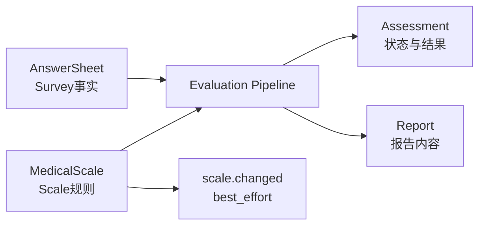
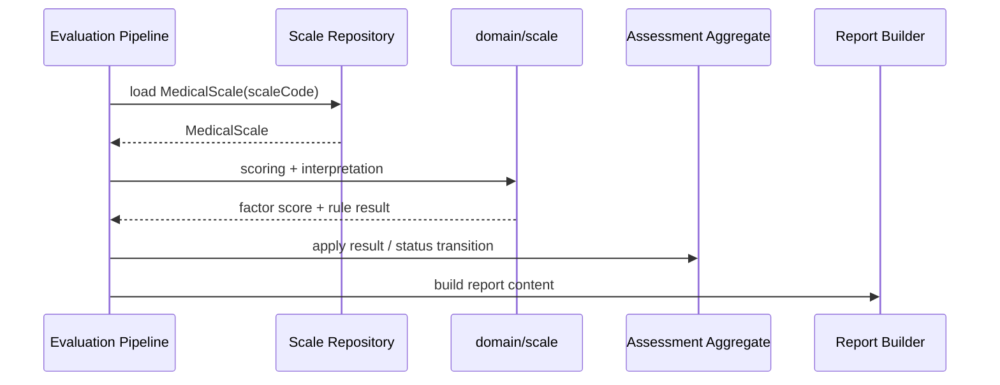
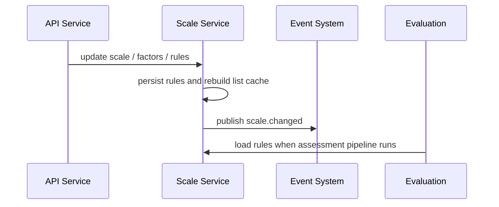

# 与 Evaluation 衔接

**本文回答**：Evaluation 如何消费 Scale 规则，以及为什么 Scale 不应该直接知道 Assessment、Pipeline 或 Report。

## 30 秒结论

| 维度 | 结论 |
| ---- | ---- |
| 调用方向 | Evaluation 读取 Scale，Scale 不调用 Evaluation |
| 数据方向 | AnswerSheet + MedicalScale -> Assessment result / Report |
| 事件方向 | `scale.changed` 是规则变更事件，不能替代 Evaluation 的测评事件 |
| 缓存方向 | Scale 列表缓存是读优化，Evaluation 仍应以 repository 和领域规则为准 |

## 这个边界要解决什么问题

Scale 与 Evaluation 最容易发生职责混淆：Scale 知道规则，Evaluation 知道某次测评的状态和产出。衔接设计要解决的是“Evaluation 能稳定消费规则，但 Scale 不反向拥有评估生命周期”的问题。

如果 Scale 直接触发测评重算，规则变更会变成一个隐式业务命令，可能影响大量历史 Assessment；如果 Evaluation 直接硬编码规则，规则域会被架空。当前设计选择**单向读取 + 事件通知**：

| 方向 | 含义 |
| ---- | ---- |
| Evaluation -> Scale | 在 pipeline 执行时加载规则并计算结果 |
| Scale -> Event | 规则变更后发布 best-effort 通知，供缓存、列表或外部感知 |
| Scale -/-> Evaluation | Scale 不直接推进 Assessment，不直接生成 Report |

## 协作图



这张图是 Scale 与 Evaluation 的核心边界：Scale 不写 Assessment，Evaluation 不拥有规则定义。

## 架构设计



这条时序体现了两个设计原则：规则计算是 Scale 领域服务，状态推进是 Evaluation 聚合行为；Pipeline 是应用层职责链，负责按顺序连接它们。

## 常见误区

| 误区 | 正确做法 |
| ---- | -------- |
| 在 Scale 内生成报告 | 报告编排属于 Evaluation/Report |
| 在 Evaluation 内硬编码分数区间 | 分数区间属于 Scale 的 `InterpretationRule` |
| 把量表列表缓存当规则一致性保障 | 缓存只优化读，不作为规则权威 |
| 用 `scale.changed` 触发测评重算 | 当前 `scale.changed` 是 best-effort 规则变更通知，不是 durable evaluation command |

## 设计模式与取舍

| 模式 / 技法 | 在衔接中的位置 | 取舍 |
| ----------- | -------------- | ---- |
| 防腐边界 | Evaluation 只通过 repository/领域服务消费 Scale 规则 | 需要显式加载规则，但避免跨聚合直接改状态 |
| 职责链 | Evaluation pipeline 编排作答、规则、结果、报告 | 每个 handler 边界清楚，但排障要看 pipeline 顺序 |
| 策略模式 | Scale 的计分/解读策略 | 新策略扩展集中，但仍需 Evaluation 契约测试 |
| 事件通知 | `scale.changed` best-effort | 适合缓存/外部感知，不适合承诺历史重算 |

## 为什么不做自动重算

规则变更后自动重算历史 Assessment 看起来方便，但语义复杂：历史报告是否应该保持当时规则？受试者是否应该看到变化？重算失败如何补偿？当前系统没有把 `scale.changed` 定义成 durable command，而是将它作为规则变更通知。这是保守设计，优先保证现有测评结果的可追溯性。

## 链路拆分



Scale 变更和 Evaluation 执行是两条不同链路。前者维护规则，后者消费规则；不要在规则变更链路里隐式执行测评重算。

## 代码锚点与测试锚点

- Scale 变更服务：[internal/apiserver/application/scale/lifecycle_service.go](../../../internal/apiserver/application/scale/lifecycle_service.go)、[internal/apiserver/application/scale/factor_service.go](../../../internal/apiserver/application/scale/factor_service.go)
- Scale 事件契约：[configs/events.yaml](../../../configs/events.yaml)
- Evaluation pipeline：[internal/apiserver/application/evaluation/engine/pipeline/](../../../internal/apiserver/application/evaluation/engine/pipeline/)
- Event delivery 文档：[../../03-基础设施/event/02-Publish与Outbox.md](../../03-基础设施/event/02-Publish与Outbox.md)

## Verify

```bash
go test ./internal/apiserver/application/scale ./internal/apiserver/application/evaluation/...
```
