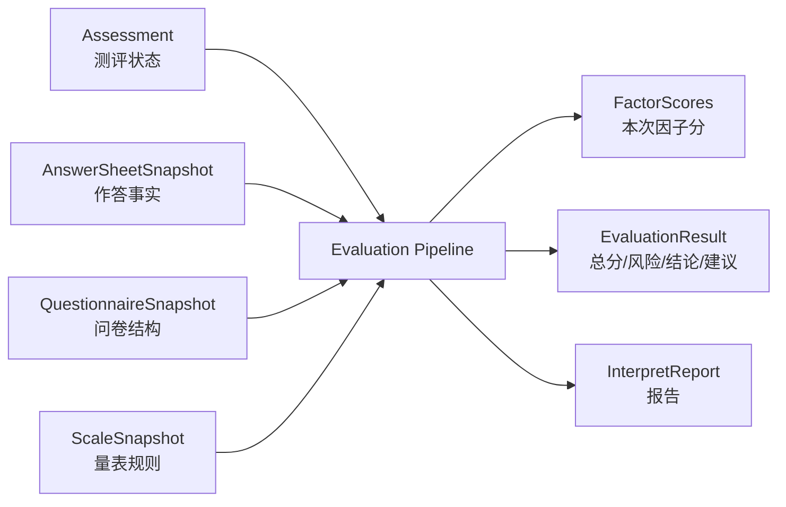
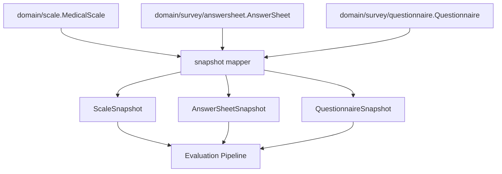
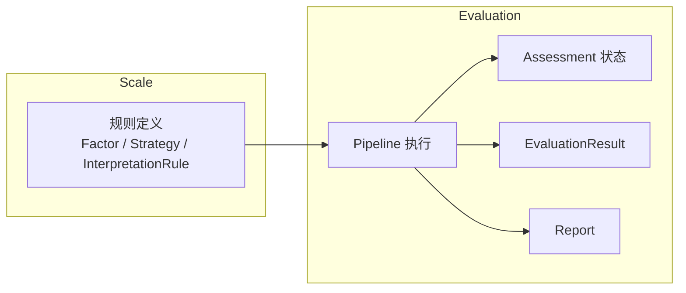

# 与 Evaluation 衔接

**本文回答**：`scale` 模块如何被 `evaluation` 模块消费；Scale 为什么只作为规则权威源，不直接推进 Assessment 状态或生成 Report；Evaluation pipeline 如何通过 snapshot、FactorScore、InterpretationRule 将量表规则转化为本次测评结果。

---

## 30 秒结论

| 维度 | 结论 |
| ---- | ---- |
| 调用方向 | Evaluation 读取 Scale 规则，Scale 不调用 Evaluation |
| 数据形态 | Evaluation 运行时消费的是 `ScaleSnapshot / FactorSnapshot / InterpretRuleSnapshot`，不是直接修改 `MedicalScale` 聚合 |
| 核心输入 | `Assessment + AnswerSheetSnapshot + QuestionnaireSnapshot + ScaleSnapshot` |
| 核心输出 | `EvaluationResult + Assessment 状态变更 + InterpretReport` |
| 规则归属 | Factor、ScoringStrategy、InterpretationRule 属于 Scale |
| 执行归属 | FactorScoreHandler、InterpretationHandler、Report 保存属于 Evaluation pipeline |
| 事件边界 | `scale.changed` 是规则变更通知，不是历史测评重算命令 |
| 缓存边界 | Scale 列表缓存是读优化，Evaluation 执行应以规则快照和 repository 结果为准 |
| 历史语义 | 已生成的 Assessment/Report 是历史产出事实，Scale 变更不应自动改写历史结果 |

一句话概括：

> **Scale 定义规则，Evaluation 在一次测评上下文中读取规则快照并产出结果；二者是单向消费关系，不是双向状态耦合。**

---

## 1. 为什么要单独说明 Scale 与 Evaluation 的衔接

Scale 和 Evaluation 最容易混淆，因为它们都和“分数、风险、报告”有关。

但它们关注的问题完全不同：

| 问题 | Scale | Evaluation |
| ---- | ----- | ---------- |
| 有哪些因子 | 定义规则 | 消费规则 |
| 因子怎么算 | 定义策略 | 执行策略 |
| 分数区间怎么解释 | 定义 InterpretationRule | 匹配规则并产出本次解释 |
| 本次测评是否完成 | 不关心 | 负责 |
| 报告是否生成 | 不关心 | 负责 |
| 历史结果是否重算 | 不自动决定 | 需要单独补偿机制 |

如果 Scale 直接知道 Assessment 或 Report，就会出现规则模型反向依赖结果模型；如果 Evaluation 直接硬编码 Scale 规则，Scale 就失去规则权威意义。

所以当前边界应该是：

```text
Evaluation -> 读取 Scale 规则
Scale      -> 不调用 Evaluation
```

---

## 2. 全局协作图



这里的关键不是“Evaluation 拿到了 Scale”，而是它拿到的是**运行时规则快照**。这样 pipeline 可以稳定执行，同时不把领域聚合直接暴露给每个 handler 修改。

---

## 3. evaluationinput 快照边界

Evaluation 执行前会把多个模块的数据转换成 snapshot。



### 3.1 ScaleSnapshot

`ScaleSnapshot` 包含：

| 字段 | 说明 |
| ---- | ---- |
| `ID` | 量表 ID |
| `Code` | 量表编码 |
| `Title` | 量表标题 |
| `QuestionnaireCode` | 绑定问卷编码 |
| `QuestionnaireVersion` | 绑定问卷版本 |
| `Status` | 状态 |
| `Factors` | 因子快照列表 |

`ScaleSnapshot.IsPublished()` 用于判断当前规则是否是可用发布状态。

### 3.2 FactorSnapshot

`FactorSnapshot` 包含：

| 字段 | 说明 |
| ---- | ---- |
| `Code` | 因子编码 |
| `Title` | 因子标题 |
| `IsTotalScore` | 是否总分因子 |
| `QuestionCodes` | 关联题目编码 |
| `ScoringStrategy` | sum / avg / cnt 等 |
| `ScoringParams` | 计分参数 |
| `MaxScore` | 最大分 |
| `InterpretRules` | 解读规则快照 |

### 3.3 InterpretRuleSnapshot

`InterpretRuleSnapshot` 包含：

| 字段 | 说明 |
| ---- | ---- |
| `Min / Max` | 分数区间 |
| `RiskLevel` | 风险等级 |
| `Conclusion` | 结论 |
| `Suggestion` | 建议 |

它同样使用左闭右开区间：

```text
score >= Min && score < Max
```

---

## 4. Evaluation pipeline 如何消费 Scale

典型顺序是：

```text
Validation
  -> FactorScore
  -> RiskLevel
  -> Interpretation
  -> WaiterNotify / 后续动作
```

Scale 主要参与两个阶段：

| Pipeline 阶段 | 消费 Scale 的什么 |
| ------------- | ---------------- |
| FactorScore | `Factors`、`questionCodes`、`scoringStrategy`、`scoringParams` |
| Interpretation | `InterpretRules`、`riskLevel`、`conclusion`、`suggestion` |

### 4.1 FactorScore 阶段

`FactorScoreHandler` 做的是：

1. 检查 Assessment 和 MedicalScale 是否存在。
2. 调用 `FactorScoreCalculator.Calculate(...)`。
3. 将结果写入 `evalCtx.FactorScores` 和 `evalCtx.TotalScore`。
4. 继续下一个 handler。

`FactorScoreCalculator` 根据 factor strategy 取值：

| 策略 | 取值 |
| ---- | ---- |
| `sum / avg` | 从 AnswerSheetSnapshot 中按 `questionCodes` 收集 answer.Score |
| `cnt` | 从 AnswerSheetSnapshot 中取 answer value，再借助 QuestionnaireSnapshot option content 判断是否命中 |

然后调用：

```text
ScaleFactorScorer.ScoreFactor(ctx, factor.Code, values, factor.ScoringStrategy, nil)
```

### 4.2 Interpretation 阶段

`InterpretationHandler` 做的是：

1. 根据 factor scores 和 risk level 生成结论与建议。
2. 构建 `EvaluationResult`。
3. 将结果应用到 Assessment。
4. 构建并保存 InterpretReport。
5. 继续后续 handler。

这里要注意：Scale 只提供规则，真正写 Assessment 和 Report 的是 Evaluation finalizer。

---

## 5. Scale 与 Evaluation 的职责边界



| 事项 | Scale | Evaluation |
| ---- | ----- | ---------- |
| 定义因子 | 是 | 否 |
| 定义计分策略 | 是 | 否 |
| 定义风险区间 | 是 | 否 |
| 加载本次 Assessment | 否 | 是 |
| 计算本次因子分 | 提供规则 | 执行并保存结果 |
| 生成本次结论 | 提供规则文案 | 匹配规则并组装结果 |
| 保存 Assessment 状态 | 否 | 是 |
| 保存 Report | 否 | 是 |
| 处理评估失败 | 否 | 是 |

### 5.1 Scale 不应该依赖 Evaluation

Scale 不能 import Evaluation 的 Assessment、Report 或 Pipeline 类型。否则会产生：

```text
规则模型 -> 结果模型 -> 规则模型
```

这样的循环依赖。

### 5.2 Evaluation 不应该硬编码 Scale 规则

Evaluation 不应该写：

```go
if scaleCode == "ADHD" && score > 30 {
    risk = "high"
}
```

这种逻辑必须沉淀到 Scale 的 Factor / InterpretationRule / strategy 中。

---

## 6. scale.changed 与 Evaluation 事件的边界

Scale 会发布 `scale.changed`。但这个事件和 Evaluation 的测评事件不是一类东西。

| 事件 | 所属 | 语义 |
| ---- | ---- | ---- |
| `scale.changed` | Scale | 规则变更通知 |
| `answersheet.submitted` | Survey | 答卷已提交，后续可创建测评 |
| `assessment.submitted` | Evaluation | 测评已提交，后续可执行评估 |
| `assessment.interpreted` | Evaluation | 测评已解读 |
| `report.generated` | Evaluation | 报告已生成 |

`scale.changed` 不能替代 `assessment.submitted`。它不应该直接触发大量历史测评重算，除非未来显式设计“规则变更补偿/重算任务”。

---

## 7. 为什么不自动重算历史 Assessment

规则变更后自动重算历史测评，看似方便，但语义复杂：

| 问题 | 风险 |
| ---- | ---- |
| 历史报告是否应保留当时规则 | 医学/审计口径不清 |
| 用户是否应该看到报告变化 | 产品语义不清 |
| 重算失败怎么补偿 | 需要任务、幂等、回滚、告警 |
| 风险等级变更是否触发通知 | 可能造成误通知 |
| 统计报表是否重算 | 成本和口径复杂 |
| 是否影响已打标签受试者 | 标签回滚/更新困难 |

所以当前保守设计是：

```text
scale.changed = 规则变更通知
不等于 durable re-evaluate command
```

如果未来需要重算，应新增独立能力，例如：

```text
scale.re_evaluation.requested
assessment.recalculate.command
```

并配套任务、幂等、进度、审计和告警。

---

## 8. Scale 与 Questionnaire 版本的衔接

Scale 规则通常绑定某个 Questionnaire 版本：

```text
MedicalScale.questionnaireCode
MedicalScale.questionnaireVersion
```

Evaluation 执行时还会加载：

```text
AnswerSheetSnapshot.questionnaireCode/version
QuestionnaireSnapshot.code/version
ScaleSnapshot.questionnaireCode/version
```

这里需要保持一致性：

| 检查点 | 原因 |
| ------ | ---- |
| Scale 绑定问卷版本 | 确保 Factor questionCodes 对应正确题目结构 |
| AnswerSheet 引用问卷版本 | 确保历史答卷可按提交时版本解释 |
| QuestionnaireSnapshot 参与 cnt 策略 | cnt 需要 option content |
| Evaluation input resolver 校验版本 | 避免错用新问卷解释旧答卷 |

如果 Scale 绑定的是 A 版本问卷，而 AnswerSheet 来自 B 版本问卷，后续因子计分可能缺题、错题或错选项。

---

## 9. Scale 与 Report 的衔接

Scale 不生成报告，但它影响报告内容。

```text
Scale InterpretationRule
  -> Evaluation InterpretationResult
  -> Report Builder
  -> InterpretReport
```

| Scale 提供 | Report 决定 |
| ---------- | ----------- |
| 风险等级 | 是否展示风险徽章 |
| 结论文案 | 放在哪个章节 |
| 建议文案 | 是否合并、排序、裁剪 |
| 因子标题 | 展示名称 |
| maxScore | 是否展示进度条或百分比 |

Report 可以组织内容，但不应该重定义风险区间。

---

## 10. 修改 Scale 规则对 Evaluation 的影响

### 10.1 修改 Factor questionCodes

可能影响：

- 因子 raw score。
- totalScore。
- interpretation 匹配。
- 报告因子结果。
- 历史报告是否需要解释说明。

### 10.2 修改 ScoringStrategy

可能影响：

- 因子分计算方式。
- 风险区间是否仍适配。
- totalScore 语义。
- Evaluation pipeline 测试。

### 10.3 修改 InterpretationRule

可能影响：

- 风险等级。
- 结论文案。
- 建议文案。
- 标签/统计/通知。
- 报告内容。

### 10.4 修改 questionnaire binding

可能影响：

- 是否能找到题目。
- cnt 策略是否能找到 option content。
- AnswerSheet 与 Questionnaire 版本是否匹配。
- Evaluation input resolver 是否失败。

---

## 11. 设计模式与实现意图

| 模式 | 当前实现 | 意图 |
| ---- | -------- | ---- |
| Anti-corruption Snapshot | `ScaleSnapshot / FactorSnapshot / InterpretRuleSnapshot` | Evaluation 运行时消费稳定数据，不直接操作 Scale 聚合 |
| Pipeline | `FactorScoreHandler / InterpretationHandler` | 分离因子计分、风险解释、结果保存 |
| Strategy | `ScaleFactorScorer` | 因子计分策略统一调用 |
| Value Object | `InterpretRuleSnapshot` / `ScoreRange` | 风险规则可测试、可序列化 |
| Event Notification | `scale.changed` | 规则变更通知，不承诺重算 |
| Finalizer | `InterpretationFinalizer` | 明确结果生成和结果保存的边界 |

---

## 12. 设计取舍

| 设计 | 收益 | 代价 |
| ---- | ---- | ---- |
| Evaluation 使用 snapshot | 隔离聚合修改，运行上下文稳定 | 需要 mapper 和版本一致性检查 |
| Scale 不自动重算历史测评 | 保留历史报告可追溯性 | 规则修正后需要额外补偿机制 |
| cnt 策略需要 QuestionnaireSnapshot | 能按 option content 解释 | Evaluation input 更多，排障更复杂 |
| `scale.changed` best-effort | 规则通知成本低 | 不适合作为强一致命令 |
| Report 不重定义规则 | 风险口径统一 | Report 模板自由度降低 |

---

## 13. 常见误区

### 13.1 “Scale 发布后应该主动触发所有相关测评”

当前不是。Scale 发布只是规则变更，测评执行由 Assessment 事件驱动。

### 13.2 “Evaluation pipeline 可以直接写死规则”

不应该。规则写死在 pipeline 会让 Scale 失去权威，并导致新增量表时频繁改 pipeline。

### 13.3 “ScaleSnapshot 可以回写 MedicalScale”

不应该。Snapshot 是 Evaluation input，不是修改命令。

### 13.4 “Report 文案可以覆盖 InterpretationRule”

可以做展示层加工，但不能改变风险语义。风险规则应来自 Scale。

### 13.5 “Questionnaire 版本不重要，只要 code 一样就行”

错误。Factor questionCodes、option content、AnswerSheet answer value 都可能随版本变化，必须关注 version。

---

## 14. 代码锚点

### Scale

- MedicalScale：[../../../internal/apiserver/domain/scale/medical_scale.go](../../../internal/apiserver/domain/scale/medical_scale.go)
- Factor：[../../../internal/apiserver/domain/scale/factor.go](../../../internal/apiserver/domain/scale/factor.go)
- InterpretationRule：[../../../internal/apiserver/domain/scale/interpretation_rule.go](../../../internal/apiserver/domain/scale/interpretation_rule.go)
- Scale lifecycle application：[../../../internal/apiserver/application/scale/lifecycle_service.go](../../../internal/apiserver/application/scale/lifecycle_service.go)
- Factor application：[../../../internal/apiserver/application/scale/factor_service.go](../../../internal/apiserver/application/scale/factor_service.go)

### Evaluation Input

- evaluationinput port：[../../../internal/apiserver/port/evaluationinput/input.go](../../../internal/apiserver/port/evaluationinput/input.go)
- snapshot mappers：[../../../internal/apiserver/infra/evaluationinput/snapshot_mappers.go](../../../internal/apiserver/infra/evaluationinput/snapshot_mappers.go)

### Evaluation Pipeline

- FactorScoreHandler：[../../../internal/apiserver/application/evaluation/engine/pipeline/factor_score.go](../../../internal/apiserver/application/evaluation/engine/pipeline/factor_score.go)
- FactorScoreCalculator：[../../../internal/apiserver/application/evaluation/engine/pipeline/factor_score_calculator.go](../../../internal/apiserver/application/evaluation/engine/pipeline/factor_score_calculator.go)
- InterpretationHandler：[../../../internal/apiserver/application/evaluation/engine/pipeline/interpretation.go](../../../internal/apiserver/application/evaluation/engine/pipeline/interpretation.go)
- interpretengine port：[../../../internal/apiserver/port/interpretengine/interpretengine.go](../../../internal/apiserver/port/interpretengine/interpretengine.go)

### Event

- Event catalog：[../../../configs/events.yaml](../../../configs/events.yaml)

---

## 15. Verify

```bash
go test ./internal/apiserver/domain/scale
go test ./internal/apiserver/application/scale
go test ./internal/apiserver/port/evaluationinput
go test ./internal/apiserver/infra/evaluationinput
go test ./internal/apiserver/application/evaluation/engine/pipeline
```

如果修改了 Scale 事件：

```bash
go test ./internal/pkg/eventcatalog
go test ./internal/worker/handlers
```

如果修改了接口契约：

```bash
make docs-rest
make docs-verify
```

---

## 16. 下一跳

| 目标 | 下一篇 |
| ---- | ------ |
| 回看 Scale 整体模型 | [00-整体模型.md](./00-整体模型.md) |
| 理解因子计分 | [01-规则与因子计分.md](./01-规则与因子计分.md) |
| 理解风险文案 | [02-解读规则与风险文案.md](./02-解读规则与风险文案.md) |
| 新增量表规则 | [04-新增量表规则SOP.md](./04-新增量表规则SOP.md) |
| 深入 Evaluation pipeline | [../evaluation/02-EnginePipeline.md](../evaluation/02-EnginePipeline.md) |
