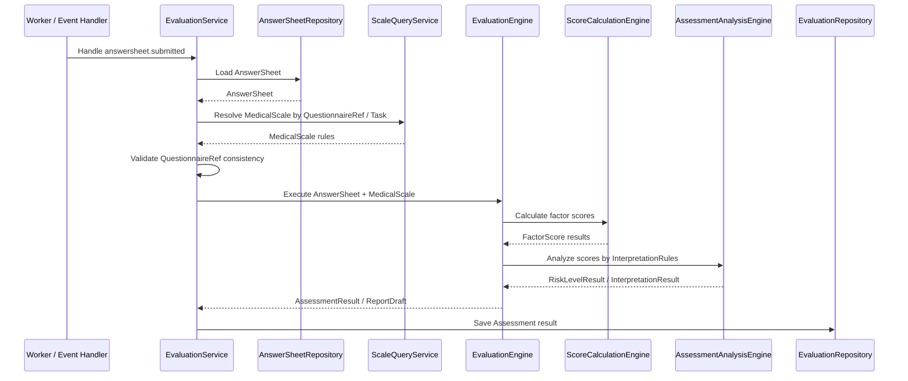

# 量表与测评链路：分数计算引擎与测评分析引擎

> 本文是 Scale 模块文档的第四篇。
>
> 前两篇已经说明：`MedicalScale` 是医学量表规则聚合根，`Factor / ScoringSpec / InterpretationRules` 定义量表内部规则；`MedicalScale` 通过 `QuestionnaireCode + QuestionnaireVersion` 与 Survey 问卷版本建立稳定绑定。
>
> 本文聚焦 Scale 与 Evaluation 的执行协作：Evaluation 如何加载并消费 MedicalScale 规则；分数计算引擎如何使用 `Factor / QuestionCodes / ScoringSpec` 计算因子分；测评分析引擎如何使用 `InterpretationRules / RiskLevel / Conclusion / Suggestion` 生成解释结果；为什么 `FactorScore / RiskLevelResult / InterpretationResult / InterpretReport` 属于 Evaluation；以及未来如何通过 `EvaluationModelRef / Evaluator` 将 MedicalScale 与 MBTI 等规则模型并列接入。

---

## 1. 结论先行

Scale 与 Evaluation 的关系不是父子模块，而是：

```text
Scale       规则输入
Evaluation  执行引擎与结果事实
```

Scale 负责定义规则：

```text
MedicalScale；
Factor；
ScoringSpec；
InterpretationRules；
InterpretationRule；
RiskLevel；
QuestionnaireRef。
```

Evaluation 负责执行规则并保存结果：

```text
Assessment；
FactorScore；
TotalScore；
RiskLevelResult；
InterpretationResult；
InterpretReport。
```

一句话概括：

> **Scale 定义“怎么算、怎么解释”，Evaluation 负责“这一次实际算出了什么、解释成什么、生成了什么报告”。**

因此：

```text
Scale 不读取 AnswerSheet；
Scale 不推进 Assessment 状态机；
Scale 不保存 FactorScore；
Scale 不生成 InterpretReport。
```

Evaluation 也不应该重新定义 `Factor / ScoringSpec / InterpretationRules`，否则规则会散落在执行流程中，Scale 会失去规则事实源地位。

---

## 2. 本文边界

本文只讲 Scale 与 Evaluation 的执行协作链路。

本文重点：

```text
Evaluation 如何加载 MedicalScale；
Evaluation 如何校验 AnswerSheet 与 MedicalScale 的 QuestionnaireRef 一致；
分数计算引擎如何消费 Factor / QuestionCodes / ScoringSpec；
测评分析引擎如何消费 InterpretationRules / RiskLevel / Conclusion / Suggestion；
FactorScore / RiskLevelResult / InterpretationResult / Report 的归属；
MedicalScaleEvaluator 的执行步骤；
EvaluationModelRef 与 Evaluator 插件化；
Worker / Outbox / Evaluation 幂等边界。
```

本文不展开：

```text
MedicalScale 内部聚合模型细节；
Scale 与 Survey 的问卷绑定防腐层；
AnswerSheet 提交事实模型；
Survey Outbox 出站实现；
ReportBuilder 的完整排版与内容生成细节。
```

这些分别由以下文档承接：

```text
01-MedicalScale模型-MedicalScale-Factor-Interpretation.md
02-问卷与量表链路-问卷绑定.md
../survey/02-AnswerSheet模型-AnswerSheet-Answer-AnswerValue.md
../survey/04-测评提交事件幂等与Outbox出站链路.md
04-Scale模块分层架构与事实源索引.md
```

---

## 3. Scale 与 Evaluation 的职责边界

| 概念 | 归属 | 说明 |
| --- | --- | --- |
| MedicalScale | Scale | 医学量表规则聚合根 |
| Factor | Scale | 因子规则实体 |
| ScoringSpec | Scale | 计分规格定义 |
| InterpretationRules | Scale | 解读规则集合 |
| InterpretationRule | Scale | 单条分数区间解释规则 |
| RiskLevel | Scale | 规则中可命中的风险等级枚举 |
| Assessment | Evaluation | 一次测评执行聚合 |
| FactorScore | Evaluation | 某次执行中的因子得分 |
| TotalScore | Evaluation | 某次执行中的总分 |
| RiskLevelResult | Evaluation | 某次执行命中的风险等级 |
| InterpretationResult | Evaluation | 某次执行命中的解读结果 |
| InterpretReport | Evaluation | 某次测评报告 |

核心原则：

```text
Scale 中只有规则定义；
Evaluation 中才有某次执行结果。
```

这条边界必须守住。

如果 Scale 保存 `FactorScore`，会污染规则域。

如果 Evaluation 自己定义 `Factor / ScoringSpec / InterpretationRules`，会让规则散落，Scale 失去规则事实源地位。

---

## 4. Evaluation 为什么需要 Scale

Survey 只告诉系统：

```text
用户提交了什么答案。
```

但 Survey 不知道这些答案如何计算、如何解释。

例如 AnswerSheet 中有：

```text
Q001 = A
Q002 = B
Q003 = C
```

Evaluation 不能直接凭这些答案生成报告。

它还需要 Scale 提供：

```text
哪些题属于注意力因子；
哪些题属于总分因子；
这些答案如何计分；
总分如何计算；
分数落入哪个区间；
区间对应什么风险等级、结论和建议。
```

因此，医学量表 Evaluation 的核心输入至少有两类：

```text
AnswerSheet   作答事实输入；
MedicalScale  规则事实输入。
```

---

## 5. 执行链路总览

一次医学量表 Evaluation 可以概括为：



这条链路中：

```text
ScaleQueryService 提供规则；
EvaluationService 编排执行；
EvaluationEngine 组织执行流程；
ScoreCalculationEngine 执行分数计算；
AssessmentAnalysisEngine 执行测评分析；
EvaluationRepository 保存执行结果。
```

Scale 不参与执行状态机。

---

## 6. 执行前的一致性校验

Evaluation 执行前必须校验 AnswerSheet 与 MedicalScale 是否基于同一问卷版本。

至少需要检查：

```text
AnswerSheet.QuestionnaireCode == MedicalScale.QuestionnaireCode；
AnswerSheet.QuestionnaireVersion == MedicalScale.QuestionnaireVersion。
```

原因是：

```text
Factor.QuestionCodes 的解释上下文是 MedicalScale 绑定的 QuestionnaireVersion；
AnswerSheet.Answers 的解释上下文是答卷提交时的 QuestionnaireVersion；
二者必须一致，才能确保题目引用和答案事实匹配。
```

错误示例：

```text
AnswerSheet 基于 ADHD_PARENT v1.0.0 提交；
MedicalScale 绑定 ADHD_PARENT v2.0.0；
Factor.QuestionCodes 在 v2.0.0 中指向的题目结构可能已经变化。
```

这种情况下继续计算是不安全的。

Evaluation 应该拒绝执行，或者将 Assessment 标记为明确失败状态。

---

## 7. 分数计算引擎的职责

分数计算引擎负责把 `AnswerSheet` 中的答案事实，按照 `MedicalScale` 中的计分规格，转换为因子分和总分。

可以抽象为：

```text
ScoreCalculationEngine
├── Select factor answers
├── Read Answer.Score / AnswerValue
├── Execute ScoringSpec.Strategy
├── Apply ScoringSpec.Params
├── Validate max score / score range
└── Produce FactorScore
```

它消费的是 Scale 规则，但产出的是 Evaluation 结果。

```text
输入：Factor / QuestionCodes / ScoringSpec / AnswerSheet
输出：FactorScore / TotalScore
```

---

## 8. Factor 如何被分数计算引擎消费

Factor 在 Scale 中定义规则。

分数计算引擎消费 Factor 的过程可以抽象为：

```text
for each factor in medicalScale.Factors:
    answers = answerSheet.GetAnswers(factor.QuestionCodes)
    score = scoreCalculator.Calculate(factor.ScoringSpec, answers)
    factorScore = BuildFactorScore(factor.FactorCode, score)
```

这里有三个关键输入。

### 8.1 Factor.QuestionCodes

`Factor.QuestionCodes` 告诉计算引擎：

```text
这个因子需要读取 AnswerSheet 中哪些题目的答案。
```

它不是 Question 对象。

Evaluation 应该用 questionCode 从 AnswerSheet 中取 Answer。

### 8.2 Answer.Score / AnswerValue

计算引擎可以使用：

```text
Answer.Score；
AnswerValue；
QuestionType。
```

其中 `Answer.Score` 是 Survey 保存的单题基础分。

`AnswerValue` 是类型化答案值。

不同计分策略可能需要不同输入。

例如：

```text
sum 策略：使用 Answer.Score 求和；
average 策略：使用 Answer.Score 求平均；
weighted 策略：使用 Answer.Score + Params.weight；
custom 策略：可能需要读取 AnswerValue。
```

### 8.3 Factor.ScoringSpec

`ScoringSpec` 告诉计算引擎：

```text
这些答案如何计算成一个 score。
```

Evaluation 执行策略，而 Scale 定义策略。

---

## 9. ScoringSpec 与 ScoreCalculator 的边界

`ScoringSpec` 属于 Scale。

它定义：

```text
Strategy；
Params；
MaxScore。
```

`ScoreCalculator` 属于 Evaluation。

它负责：

```text
读取 AnswerValue / Answer.Score；
按 ScoringStrategy 执行计算；
应用 ScoringParams；
产出 FactorScore。
```

边界如下。

| 概念 | 归属 | 说明 |
| --- | --- | --- |
| ScoringStrategyCode | Scale | 策略定义 |
| ScoringParams | Scale | 策略参数定义 |
| MaxScore | Scale | 理论最大分定义 |
| ScoreCalculator | Evaluation | 执行计分 |
| FactorScore | Evaluation | 计分结果 |

### 9.1 为什么策略定义和策略执行要分离

如果 Scale 直接执行计分，会导致：

```text
Scale 读取 AnswerSheet；
Scale 产生 FactorScore；
Scale 参与 Assessment 状态机；
规则域与执行域混杂。
```

如果 Evaluation 自己定义计分规则，会导致：

```text
规则散落在执行流程中；
后台配置的 MedicalScale 失效；
规则不可审计；
报告结果难追溯。
```

正确分工是：

```text
Scale 定义规则；
Evaluation 执行规则。
```

---

## 10. 测评分析引擎的职责

测评分析引擎负责把分数计算结果解释成风险等级、结论、建议和报告输入。

可以抽象为：

```text
AssessmentAnalysisEngine
├── Read FactorScore
├── Match InterpretationRules
├── Build RiskLevelResult
├── Build InterpretationResult
├── Select display factors
├── Prepare report sections
└── Produce ReportDraft / AnalysisResult
```

它消费的是：

```text
FactorScore；
InterpretationRules；
InterpretationRule；
RiskLevel；
Conclusion；
Suggestion。
```

它产出的是：

```text
RiskLevelResult；
InterpretationResult；
ReportDraft / InterpretReport。
```

---

## 11. InterpretationRules 与 InterpretationResult 的边界

`InterpretationRules` 属于 Scale。

它定义：

```text
分数区间 -> RiskLevel / Conclusion / Suggestion。
```

`InterpretationResult` 属于 Evaluation。

它表达：

```text
某次 FactorScore 命中了哪条 InterpretationRule。
```

边界如下。

| 概念 | 归属 | 说明 |
| --- | --- | --- |
| InterpretationRule | Scale | 单条规则定义 |
| InterpretationRules | Scale | 规则集合与匹配能力 |
| Match(score) | Scale 规则能力 | 根据分数返回规则 |
| MatchedRule | Evaluation | 某次执行命中的规则 |
| InterpretationResult | Evaluation | 命中结果快照 |

Evaluation 调用 Match 后，不应该只保存 RiskLevel。

更稳妥的是保存命中规则的快照：

```text
FactorCode；
Score；
ScoreRange；
RiskLevel；
Conclusion；
Suggestion。
```

这样即使未来 Scale 规则迁移或归档，历史报告仍能解释当时结果。

---

## 12. RiskLevel 的双重语义

RiskLevel 在不同模块中语义不同。

在 Scale 中：

```text
RiskLevel 是 InterpretationRule 中定义的可命中等级。
```

在 Evaluation 中：

```text
RiskLevelResult 是某次 score 命中规则后的结果。
```

在 Report / Frontend 中：

```text
RiskLevel 可能被展示为颜色、标签、优先级、建议顺序。
```

因此，不应该在 Scale 的 Factor 查询结果中给 Factor 一个固定 RiskLevel。

因为：

```text
Factor 本身没有固定风险等级；
风险等级取决于本次 Evaluation 的 score。
```

---

## 13. Report 为什么不属于 Scale

Scale 中的 `Conclusion` 和 `Suggestion` 是规则文案模板。

但 Report 不是简单拼接模板。

ReportBuilder 可能要处理：

```text
选择哪些因子展示；
按风险等级排序；
合并重复建议；
补充总评；
生成章节结构；
根据受试者年龄、角色、场景调整表达；
结合多个因子给出综合建议。
```

这些都是 Evaluation / ReportBuilder 的职责。

所以边界是：

```text
Scale 定义可命中的文案模板；
Evaluation 产生命中结果；
ReportBuilder 组织最终报告。
```

---

## 14. Assessment 与 MedicalScale 的关系

`Assessment` 是一次测评执行聚合。

它可以引用 MedicalScale，但不应该拥有 MedicalScale。

推荐引用方式：

```text
Assessment
├── AnswerSheetRef
├── QuestionnaireRef
├── EvaluationModelRef / MedicalScaleRef
├── Status
├── Scores
└── ReportRef
```

如果当前系统还只支持 MedicalScale，可以先保存：

```text
MedicalScaleCode；
MedicalScaleTitle；
QuestionnaireCode；
QuestionnaireVersion。
```

但演进方向应该是：

```text
EvaluationModelRef
```

而不是把 Assessment 永久绑定死到 MedicalScale。

---

## 15. ScaleQueryService 在 Evaluation 中的角色

Evaluation 不应该直接访问 Scale repository 的底层实现。

更合理的是通过应用层查询服务或专用端口获取规则上下文。

例如：

```text
ResolveAssessmentScaleContext(questionnaireCode, questionnaireVersion)
GetPublishedByCode(scaleCode)
GetByQuestionnaireCode(questionnaireCode)
```

这些方法的职责是：

```text
根据 AnswerSheet 的 QuestionnaireRef 找到可用 MedicalScale；
提供 Evaluation 执行所需的规则信息；
避免 Evaluation 依赖 Scale 内部持久化结构。
```

但要注意：

```text
ResolveAssessmentScaleContext 是 MedicalScale 专属解析；
未来多模型时应升级为 EvaluationModelResolver。
```

---

## 16. MedicalScaleEvaluator 的执行步骤

一个 MedicalScaleEvaluator 可以按以下步骤执行。

```text
1. 校验 AnswerSheet.QuestionnaireRef 与 MedicalScale.QuestionnaireRef 一致；
2. 遍历 MedicalScale.FactorSnapshots；
3. 根据 Factor.QuestionCodes 从 AnswerSheet 中取答案；
4. 根据 ScoringSpec 计算 FactorScore；
5. 根据 InterpretationRules.Match(score) 命中解读规则；
6. 构造 FactorScoreResult；
7. 汇总 total score；
8. 构造 AssessmentResult；
9. 生成或触发 ReportBuilder。
```

这套流程属于 Evaluation。

Scale 只提供第 2、4、5 步需要的规则输入。

---

## 17. EvaluationEngine 的推荐抽象

未来 Evaluation 可以抽象为：

```text
EvaluationEngine
├── ResolveEvaluationModel
├── LoadAnswerSheet
├── ValidateInputConsistency
├── SelectEvaluator
├── ExecuteEvaluator
├── SaveAssessmentResult
└── PublishEvaluationEvents
```

其中：

```text
EvaluationEngine 负责通用执行框架；
Evaluator 负责具体模型执行；
MedicalScaleEvaluator 只是 Evaluator 的一种实现。
```

MedicalScaleEvaluator 消费：

```text
MedicalScale；
Factor；
ScoringSpec；
InterpretationRules；
AnswerSheet。
```

MBTIEvaluator 未来可以消费：

```text
MBTIModel；
MBTIDimensionRules；
AnswerSheet。
```

这样 Scale 与 Evaluation 的关系会更清晰：

```text
Scale 是一种 EvaluationModel 的规则来源；
EvaluationEngine 是通用执行框架；
Evaluator 是具体模型执行器。
```

---

## 18. EvaluationModelRef：未来通用衔接点

当前系统的规则模型主要是 MedicalScale。

未来可能支持：

```text
MBTI；
Big Five；
DISC；
职业兴趣测评；
其他心理测评模型。
```

这些不应该全部塞进 Scale。

更合理的方向是引入：

```text
EvaluationModelRef
├── Type
├── Code
├── Version
└── Title
```

其中：

```text
MedicalScale -> Type = medical_scale
MBTI         -> Type = mbti
BigFive      -> Type = big_five
```

Evaluation 根据 Type 选择不同 Evaluator：

```text
medical_scale -> MedicalScaleEvaluator
mbti          -> MBTIEvaluator
big_five      -> BigFiveEvaluator
```

这样 Scale 仍然保持医学量表规则域，不会变成所有测评模型的大杂烩。

---

## 19. 与 Outbox / Worker 的关系

答卷提交后，Survey 通过 Outbox 发布：

```text
answersheet.submitted
```

Worker 消费事件后，不应该直接写 Evaluation 业务表。

推荐链路是：

```text
Worker
  -> internal gRPC / application service
  -> EvaluationService
  -> Load AnswerSheet
  -> Load EvaluationModel / MedicalScale
  -> Execute Evaluation
  -> Save Result
```

原因是：

```text
apiserver application service 才是业务状态机入口；
worker 只是异步驱动器；
Evaluation 状态机和幂等逻辑应该集中在应用服务。
```

---

## 20. 一致性与幂等

Evaluation 通常由 `answersheet.submitted` 事件触发。

消息系统常见语义是至少一次投递；这意味着同一条事件可能被重复消费。消费者需要以幂等方式处理重复消息，例如记录已处理消息 ID，或者在业务实体中保存已处理事件标识。

Scale 本身不负责 Evaluation 幂等。

Evaluation 应该保证：

```text
同一 AnswerSheet 不重复创建多个 Assessment；
同一 Assessment 不重复生成冲突结果；
重复事件可以安全忽略或返回已有结果；
规则加载失败时可以重试；
规则与答卷版本不一致时进入明确失败状态。
```

Scale 只需保证：

```text
published MedicalScale 规则稳定；
规则字段被冻结；
查询到的规则可以被安全消费。
```

---

## 21. 当前链路成熟度评价

| 方面 | 评价 |
| --- | --- |
| 职责边界 | Scale 定义规则，Evaluation 执行规则 |
| 输入一致性 | AnswerSheet 与 MedicalScale 需要校验 QuestionnaireRef 一致 |
| 分数计算 | Factor / QuestionCodes / ScoringSpec 可作为 ScoreCalculationEngine 输入 |
| 测评分析 | InterpretationRules / RiskLevel / 文案模板可作为 AssessmentAnalysisEngine 输入 |
| 结果归属 | FactorScore / RiskLevelResult / Report 明确属于 Evaluation |
| Worker 边界 | Worker 是异步驱动器，不是 Evaluation 状态机本体 |
| 多模型扩展 | EvaluationModelRef / Evaluator 可支持 MBTI 等同级模型接入 |

综合判断：

```text
Scale 与 Evaluation 的衔接边界是清楚的：Scale 提供稳定规则输入，Evaluation 负责执行、幂等、状态推进和结果保存。
```

---

## 22. 后续演进方向

### 22.1 RuleSnapshot

Evaluation 应保存规则快照或规则版本引用。

建议至少保存：

```text
MedicalScaleRef；
QuestionnaireRef；
FactorRuleSnapshot；
ScoringSpecSnapshot；
MatchedInterpretationSnapshot。
```

这样历史报告可以解释当时使用的规则。

### 22.2 EvaluationModelRef

将当前 MedicalScale 解析升级为通用模型解析：

```text
ResolveEvaluationModel(answerSheet.QuestionnaireRef, taskRef)
  -> EvaluationModelRef
```

再由不同 Evaluator 处理不同模型。

### 22.3 Evaluator 插件化

可以引入：

```text
Evaluator interface
├── Supports(modelType)
└── Evaluate(ctx, input) -> result
```

MedicalScaleEvaluator 是其中一个实现。

### 22.4 ScaleVersion

MedicalScale 未来需要版本化。

Evaluation 最好引用：

```text
MedicalScaleCode + MedicalScaleVersion
```

而不是只引用 MedicalScaleCode。

---

## 23. 不建议做的事情

| 不建议 | 原因 |
| --- | --- |
| Scale 直接读取 AnswerSheet 计算分数 | Scale 会变成执行域，污染规则边界 |
| Evaluation 自己定义 Factor / ScoringSpec | 规则散落，Scale 失去事实源地位 |
| 只保存 RiskLevel，不保存命中规则快照 | 历史报告可追溯性弱 |
| Factor 查询结果携带固定 RiskLevel | Factor 没有固定风险等级，风险取决于本次 score |
| ReportBuilder 重新解释 ScoreRange | 解释规则散落，结果不一致 |
| Worker 直接写 Assessment 表 | 业务状态机分散，幂等难保证 |
| Evaluation 永久依赖 MedicalScaleID | 未来接入 MBTI / Big Five 会被绑死 |
| 把 MBTI 规则塞进 Scale | MBTI 应作为同级规则模型接入 Evaluation |

---

## 24. 代码锚点

| 主题 | 路径 |
| --- | --- |
| MedicalScale 聚合根 | `internal/apiserver/domain/scale/medical_scale.go` |
| Factor 规则实体 | `internal/apiserver/domain/scale/factor.go` |
| ScoringSpec | `internal/apiserver/domain/scale/scoring_spec.go` |
| InterpretationRules | `internal/apiserver/domain/scale/interpretation_rules.go` |
| Scale 查询服务 | `internal/apiserver/application/scale/query_service.go` |
| Scale DTO 转换 | `internal/apiserver/application/scale/converter.go` |
| QuestionnaireBindingResolver | `internal/apiserver/application/scale/questionnaire_binding_resolver.go` |
| AnswerSheet 聚合 | `internal/apiserver/domain/survey/answersheet/answersheet.go` |
| Survey 提交事件 | `internal/apiserver/domain/survey/answersheet/events.go` |
| Evaluation 应用服务 | `internal/apiserver/application/evaluation` |
| Evaluation 领域模型 | `internal/apiserver/domain/evaluation` |
| Worker 消费链路 | `internal/worker` |
| Evaluation 文档 | `docs/02-业务模块/evaluation` |

---

## 25. Verify

修改 Scale 与 Evaluation 衔接逻辑后，建议执行：

```bash
go test ./internal/apiserver/domain/scale/...
go test ./internal/apiserver/application/scale/...
go test ./internal/apiserver/application/evaluation/...
```

如果改动涉及 AnswerSheet 加载和版本一致性：

```bash
go test ./internal/apiserver/domain/survey/answersheet/...
go test ./internal/apiserver/application/survey/answersheet/...
go test ./internal/apiserver/application/evaluation/...
```

如果改动涉及 worker：

```bash
go test ./internal/worker/...
```

如果改动涉及文档链接或事件契约：

```bash
make docs-hygiene
```

全量质量入口：

```bash
make test
make lint
make docs-hygiene
```

---

## 26. 面试与宣讲口径

### 26.1 30 秒版本

```text
Scale 和 Evaluation 的边界是：Scale 定义规则，Evaluation 执行规则。
Scale 提供 MedicalScale、Factor、ScoringSpec 和 InterpretationRules；Evaluation 加载 AnswerSheet 和 MedicalScale，校验二者的 QuestionnaireRef 一致，然后根据 Factor.QuestionCodes 取答案、根据 ScoringSpec 计算 FactorScore、根据 InterpretationRules 命中 RiskLevel 和解读结果。
Factor 是规则，FactorScore 才是某次测评结果。
```

### 26.2 3 分钟版本

```text
Scale 与 Evaluation 很容易混在一起，因为它们都涉及计分和解释。但我会严格区分：Scale 定义“怎么算、怎么解释”，Evaluation 负责“这一次实际算出了什么、解释成什么”。

Scale 中的 MedicalScale 是规则聚合根，包含 Factor、ScoringSpec 和 InterpretationRules。Factor 定义某个测量维度关联哪些题；ScoringSpec 定义这些题如何计分；InterpretationRules 定义分数区间对应什么风险等级、结论和建议。

Evaluation 被 answersheet.submitted 事件驱动后，会加载 AnswerSheet，再根据 AnswerSheet 的 QuestionnaireRef 找到对应 MedicalScale。执行前必须校验 AnswerSheet 和 MedicalScale 绑定的是同一个 QuestionnaireCode + Version，否则题目引用和答案事实可能不匹配。

执行时，Evaluation 遍历 Factor，根据 QuestionCodes 从 AnswerSheet 中取答案，根据 ScoringSpec 计算 FactorScore，再调用 InterpretationRules.Match(score) 得到命中的解读规则，最后保存 FactorScore、RiskLevelResult、InterpretationResult 和 Report。

所以 Scale 不保存 FactorScore，不生成 Report，不推进 Assessment 状态机。未来如果支持 MBTI 或 Big Five，也不应该塞进 Scale，而应该通过 EvaluationModelRef 和不同 Evaluator 接入。
```

### 26.3 高频追问

| 追问 | 回答要点 |
| --- | --- |
| Scale 和 Evaluation 最大区别是什么？ | Scale 定义规则，Evaluation 执行规则并保存结果 |
| FactorScore 属于 Scale 吗？ | 不属于，FactorScore 是某次 Evaluation 的执行结果 |
| Evaluation 执行前为什么校验 QuestionnaireRef？ | 确保 AnswerSheet 和 MedicalScale 基于同一问卷版本 |
| ScoringSpec 谁执行？ | Scale 定义 ScoringSpec，Evaluation 的 ScoreCalculator 执行它 |
| InterpretationRules.Match 属于哪里？ | 匹配能力属于规则模型，但命中结果属于 Evaluation |
| Report 为什么不属于 Scale？ | Scale 只是文案模板来源，ReportBuilder 负责组织最终报告 |
| Worker 能否直接写 Assessment？ | 不建议，Worker 应回调 application service，由 Evaluation 维护状态机 |
| 未来 MBTI 是否放进 Scale？ | 不应该。MBTI 应作为同级规则模型，通过 EvaluationModelRef 接入 |

---

## 27. 下一篇文档

下一篇建议维护：

```text
04-Scale模块分层架构与事实源索引.md
```

重点回答：

```text
Scale 的 Domain / Application / Infra / Survey binding / Evaluation input / Event / Test 事实源分别在哪里；
MedicalScale / Factor / ScoringSpec / InterpretationRules / QuestionnaireBindingResolver / ScaleQueryService 的代码事实源如何索引；
修改 Scale 模块时应同步检查哪些代码、测试、事件契约和文档。
```
