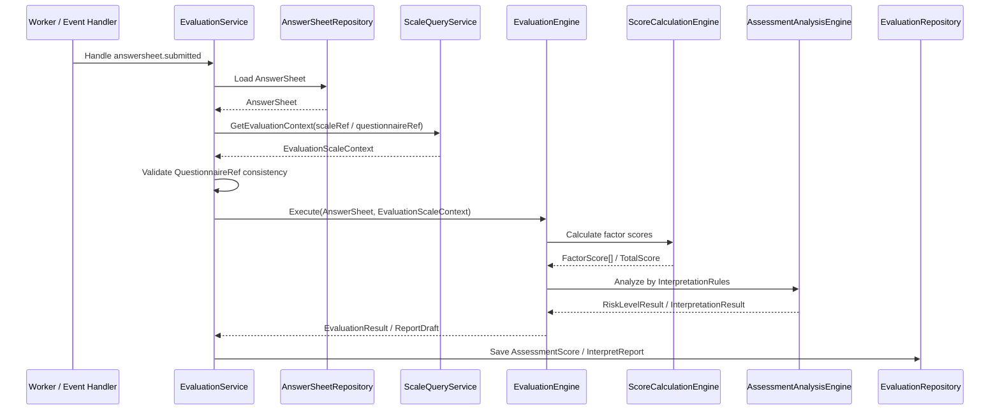
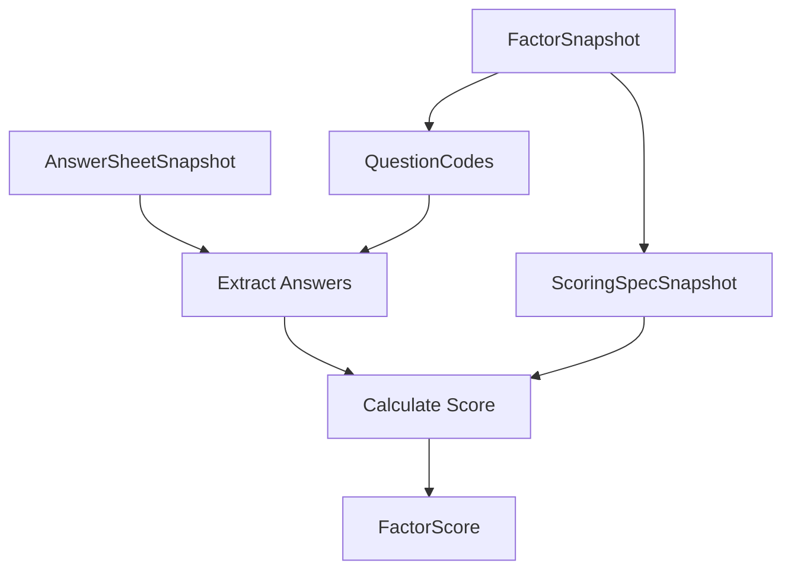
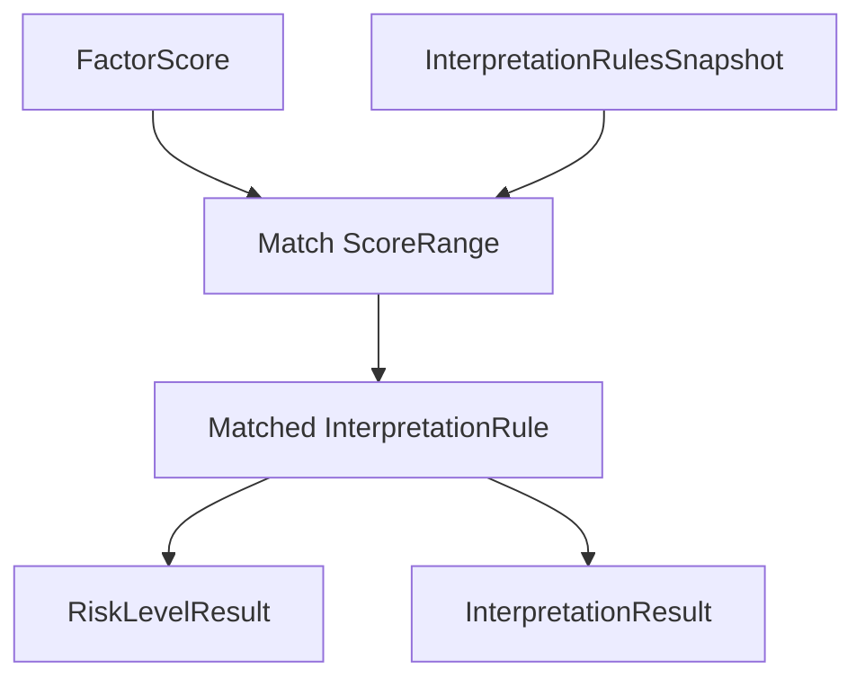

# 04-Scale 测评链路：Scale 与 Evaluation 联动详解

> 本文是 Scale 模块文档的第四篇，聚焦 **Scale 与 Evaluation 的测评执行协作链路**。
>
> 前三篇已经说明：`MedicalScale` 是医学量表解释规则聚合根；Scale 维护链路负责规则创建、发布、冻结和问卷绑定；Scale 查询链路负责向不同调用方提供只读视图与规则快照。
>
> 本文继续回答：当用户提交答卷之后，Evaluation 如何加载并消费 Scale 规则，如何校验答卷与量表绑定的一致性，如何完成因子得分计算、解释规则命中与报告结果持久化。

---

## 1. 结论先行

Scale 与 Evaluation 的关系不是父子关系，而是 **规则模型与执行引擎** 的关系。

```text
Scale       提供医学量表解释规则
Evaluation 负责执行一次测评并保存结果
```

Scale 负责定义规则：

```text
MedicalScale
Factor
ScoringSpec
InterpretationRules
InterpretationRule
RiskLevel
QuestionnaireRef
```

Evaluation 负责执行和结果：

```text
Assessment
EvaluationTask / EvaluationRun
FactorScore
TotalScore
RiskLevelResult
InterpretationResult
InterpretReport
Failure / Retry
```

一句话概括：

> **Scale 定义“医学量表如何解释答卷”，Evaluation 负责“这一次答卷如何被执行、算出什么、解释成什么、保存成什么报告”。**

因此必须守住边界：

```text
Scale 不读取 AnswerSheet；
Scale 不推进 Assessment 状态机；
Scale 不保存 FactorScore；
Scale 不生成 InterpretReport；
Scale 不处理失败重试；
Evaluation 不重新定义 Factor / ScoringSpec / InterpretationRules；
Evaluation 只消费 Scale 提供的规则快照。
```

---

## 2. 本文边界

本文重点：

```text
Scale 与 Evaluation 的职责边界；
Evaluation 如何加载 Scale 规则；
AnswerSheet 与 MedicalScale 的 QuestionnaireRef 一致性校验；
医学量表测评链路的执行步骤；
ScoreCalculationEngine 如何消费 ScoringSpec；
AssessmentAnalysisEngine 如何消费 InterpretationRules；
Evaluation 结果对象为何属于 Evaluation；
Scale 在多解释模型体系中的位置；
Scale 与未来 MBTI 的同级关系。
```

本文不展开：

```text
MedicalScale 聚合内部模型细节；
Scale 生命周期与因子维护写侧流程；
Scale 查询服务的 DTO / ReadModel 设计；
AnswerSheet 提交流程；
Assessment 状态机完整设计；
ReportBuilder 具体排版逻辑；
Worker / Outbox / Retry 的基础设施实现。
```

这些由其它文档承接：

```text
01-Scale模型--MedicalScale-Factor-Interpretion 模型设计.md
02-Scale 维护链路--生命周期-因子维护-问卷绑定.md
03-Scale 查询链路--查询服务与读模型.md
../evaluation/README.md
../evaluation/01-Assessment状态机.md
../evaluation/02-EnginePipeline.md
```

---

## 3. Scale 与 Evaluation 的职责边界

Scale 与 Evaluation 的对象边界如下：

| 概念 | 归属 | 语义 |
| --- | --- | --- |
| MedicalScale | Scale | 医学量表规则聚合根 |
| Factor | Scale | 因子规则实体 |
| ScoringSpec | Scale | 因子计分规格 |
| InterpretationRules | Scale | 因子解释规则集合 |
| InterpretationRule | Scale | 单条分数区间解释规则 |
| RiskLevel | Scale | 规则中的等级定义 |
| Assessment | Evaluation | 一次测评执行聚合 |
| FactorScore | Evaluation | 某次执行中的因子得分 |
| TotalScore | Evaluation | 某次执行中的总分 |
| RiskLevelResult | Evaluation | 某次执行命中的等级结果 |
| InterpretationResult | Evaluation | 某次执行命中的解释结果 |
| InterpretReport | Evaluation | 某次测评报告 |

核心原则：

```text
Scale 中只有规则定义；
Evaluation 中才有某次执行结果。
```

如果 Scale 保存 `FactorScore`，会污染规则域。

如果 Evaluation 自己定义 `Factor / ScoringSpec / InterpretationRules`，会让规则散落，Scale 失去医学量表规则事实源地位。

---

## 4. 为什么 Evaluation 需要 Scale

Survey 只告诉系统：

```text
用户提交了什么答案。
```

但 Survey 不知道这些答案如何计分、如何解释。

例如 AnswerSheet 中有：

```text
Q001 = A
Q002 = B
Q003 = C
```

这些只是答卷事实。

Evaluation 不能直接凭这些答案生成报告。

它还需要 Scale 提供医学量表规则：

```text
哪些题属于注意力因子；
哪些题属于总分因子；
每个题目的答案如何换算成分数；
因子分如何计算；
总分如何计算；
分数落入哪个解释区间；
区间对应什么风险等级、结论和建议。
```

因此，医学量表 Evaluation 的核心输入至少包括两类：

```text
AnswerSheet   作答事实输入
MedicalScale  医学量表规则输入
```

Evaluation 的职责是把这两类输入组合起来，执行一次可追溯的测评。

---

## 5. 医学量表测评链路总览

一次基于 Scale 的医学量表测评可以概括为：



这条链路中：

```text
Worker 是异步驱动器；
EvaluationService 是应用层编排者；
ScaleQueryService 提供规则快照；
EvaluationEngine 组织执行流程；
ScoreCalculationEngine 负责计算得分；
AssessmentAnalysisEngine 负责解释得分；
EvaluationRepository 保存结果事实；
Scale 不参与状态推进和结果保存。
```

---

## 6. Evaluation 如何定位要使用的 Scale

Evaluation 要执行一次测评，必须知道要使用哪套解释规则。

在医学量表场景下，这套规则就是 MedicalScale。

Scale 的定位方式通常有几种：

```text
通过 Assessment 中保存的 MedicalScaleRef；
通过测评任务 Plan 中的 ScaleRef；
通过 AnswerSheet 的 QuestionnaireRef 反查绑定 Scale；
通过前台测评入口显式传入 ScaleCode；
通过业务配置指定默认 Scale。
```

推荐优先使用显式引用：

```text
Assessment.ModelRef / ScaleRef
```

而不是在执行时临时猜测。

原因是：

```text
同一份 Questionnaire 可能绑定多份 Scale；
同一个 Scale 可能存在多个版本；
测评任务应明确知道使用哪套规则；
执行结果需要能追溯到当时使用的规则。
```

因此，Evaluation 创建 Assessment 时，最好已经确定：

```text
ModelType = scale
ModelCode = xxx
ModelVersion = xxx
QuestionnaireCode = xxx
QuestionnaireVersion = xxx
AnswerSheetID = xxx
```

---

## 7. Scale 规则加载：EvaluationScaleContext

Evaluation 不应直接持有 `MedicalScale` 可变聚合对象。

它应通过 Scale 查询服务加载只读规则上下文。

可以抽象为：

```text
EvaluationScaleContext
├── ScaleRef
│   ├── ScaleID
│   ├── ScaleCode
│   └── ScaleVersion
├── QuestionnaireRef
│   ├── QuestionnaireCode
│   └── QuestionnaireVersion
├── FactorSnapshots
│   ├── FactorCode
│   ├── IsTotalScore
│   ├── IsShow
│   ├── QuestionCodes
│   ├── ScoringSpecSnapshot
│   └── InterpretationRulesSnapshot
├── RuleStatus
├── PublishedAt
└── UpdatedAt
```

这个上下文应满足：

```text
只读；
深拷贝；
可缓存；
可用于执行；
可用于日志追溯；
不包含任何运行时得分结果。
```

Evaluation 加载规则时必须校验：

```text
Scale 存在；
Scale 状态是 published；
QuestionnaireRef 明确；
Factors 非空；
ScoringSpec 完整；
InterpretationRules 完整；
规则快照可执行。
```

---

## 8. AnswerSheet 与 MedicalScale 的一致性校验

这是 Scale 与 Evaluation 联动中最重要的前置校验之一。

MedicalScale 绑定了：

```text
QuestionnaireCode
QuestionnaireVersion
```

AnswerSheet 也必须记录：

```text
QuestionnaireCode
QuestionnaireVersion
```

执行前必须校验：

```text
AnswerSheet.QuestionnaireCode == MedicalScale.QuestionnaireCode
AnswerSheet.QuestionnaireVersion == MedicalScale.QuestionnaireVersion
```

如果不一致，不能继续执行。

原因是：

```text
Factor.QuestionCodes 是基于特定 QuestionnaireVersion 设计的；
不同版本的题目、选项、基础分可能不同；
答卷与规则版本不一致，会导致得分和解释不可追溯；
历史报告无法说明到底按哪套规则生成。
```

不一致时，Evaluation 应将测评标记为失败，并记录明确失败原因。

例如：

```text
expected questionnaire = ADHD_PARENT@1.0.0
actual answerSheet questionnaire = ADHD_PARENT@1.1.0
reason = questionnaire version mismatch
```

---

## 9. ScoreCalculationEngine：消费 ScoringSpec

ScoreCalculationEngine 是 Evaluation 内部的计算组件。

它消费 Scale 提供的：

```text
Factor.QuestionCodes
Factor.ScoringSpec
```

同时读取 AnswerSheet 中对应题目的答案。

其输入可以抽象为：

```text
ScoreCalculationInput
├── AnswerSheetSnapshot
└── FactorSnapshot
    ├── QuestionCodes
    └── ScoringSpecSnapshot
```

输出是 Evaluation 结果对象：

```text
FactorScore
├── FactorCode
├── Score
├── MaxScore
├── RawItems
└── CalculatedAt
```

注意边界：

```text
ScoringSpec 属于 Scale；
ScoreCalculationEngine 属于 Evaluation；
FactorScore 属于 Evaluation。
```

Scale 只定义“如何算”，不亲自执行计算。

---

## 10. 因子分计算流程

因子分计算可以概括为：



步骤：

```text
1. 遍历 FactorSnapshots；
2. 根据 Factor.QuestionCodes 从 AnswerSheet 中取出答案；
3. 将 AnswerValue 转换为可计分项；
4. 根据 ScoringSpec.Strategy 执行计算；
5. 生成 FactorScore；
6. 如果存在 IsTotalScore 因子，生成 TotalScore 或整体得分；
7. 将所有得分交给分析引擎。
```

异常场景包括：

```text
AnswerSheet 缺少某个 QuestionCode；
QuestionType 与 ScoringSpec 不兼容；
AnswerValue 无法换算为分数；
ScoringSpec 参数不完整；
总分因子不存在或存在多个；
计算结果超过 MaxScore。
```

这些异常属于 Evaluation 执行失败，应由 Evaluation 失败处理链路接管。

---

## 11. AssessmentAnalysisEngine：消费 InterpretationRules

AssessmentAnalysisEngine 是 Evaluation 内部的解释组件。

它消费 Scale 提供的：

```text
Factor.InterpretationRules
InterpretationRule.ScoreRange
InterpretationRule.RiskLevel
InterpretationRule.Conclusion
InterpretationRule.Suggestion
```

同时读取 Evaluation 计算得到的：

```text
FactorScore
TotalScore
```

其输出是 Evaluation 结果对象：

```text
InterpretationResult
RiskLevelResult
ReportDraft
```

注意边界：

```text
InterpretationRules 属于 Scale；
AssessmentAnalysisEngine 属于 Evaluation；
InterpretationResult 属于 Evaluation；
InterpretReport 属于 Evaluation。
```

Scale 定义“分数落在哪个区间时如何解释”。

Evaluation 负责“这一次分数实际命中了哪条规则”。

---

## 12. 解释规则命中流程

解释规则命中可以概括为：



步骤：

```text
1. 遍历 FactorScore；
2. 找到对应 FactorSnapshot；
3. 读取该因子的 InterpretationRules；
4. 使用 score 匹配 ScoreRange；
5. 生成 RiskLevelResult；
6. 生成 InterpretationResult；
7. 聚合成 EvaluationResult；
8. 交给 ReportBuilder 生成报告草稿。
```

异常场景包括：

```text
某个 FactorScore 找不到对应规则；
InterpretationRules 为空；
Score 没有命中任何区间；
Score 同时命中多个区间；
RiskLevel 不合法；
解释文案缺失。
```

这些异常不应该由 Scale 在执行时处理。

Scale 应在发布前尽量校验规则完整性；执行时如果仍然异常，由 Evaluation 记录失败。

---

## 13. EvaluationResult 的归属

医学量表执行完成后，可能产生：

```text
FactorScore[]
TotalScore
RiskLevelResult[]
InterpretationResult[]
ReportDraft
InterpretReport
```

这些全部属于 Evaluation。

原因是它们都是“某次执行”的事实。

例如：

```text
Factor 是规则；
FactorScore 是某次执行中的分数。

InterpretationRule 是规则；
InterpretationResult 是某次命中的解释。

RiskLevel 是规则中的等级；
RiskLevelResult 是某次测评命中的等级。

MedicalScale 是规则聚合；
Assessment 是执行聚合。
```

如果把结果放到 Scale，会导致：

```text
一份 MedicalScale 被多个用户的结果污染；
规则聚合无法保持稳定；
历史报告追溯困难；
Evaluation 无法成为通用测评引擎；
未来 MBTI / BigFive 等模型难以接入。
```

---

## 14. Assessment 状态推进

Assessment 状态推进属于 Evaluation。

Scale 不参与状态机。

典型状态流转：

```text
pending -> submitted -> interpreted
submitted -> failed
failed -> submitted
```

Scale 只影响执行能否成功。

例如：

```text
Scale 不存在 -> Evaluation failed
Scale 未发布 -> Evaluation failed
QuestionnaireVersion 不匹配 -> Evaluation failed
ScoringSpec 无法计算 -> Evaluation failed
InterpretationRules 无法命中 -> Evaluation failed
```

但这些失败状态仍然由 Evaluation 记录。

Scale 不应该调用：

```text
assessment.MarkAsFailed(...)
assessment.ApplyEvaluation(...)
assessment.RetryFromFailed(...)
```

这些是 Evaluation 聚合行为。

---

## 15. InterpretReport 生成与可靠出站

InterpretReport 是某次测评报告。

它属于 Evaluation。

Scale 中的 Conclusion / Suggestion 是规则文案，ReportBuilder 会将它们组合为最终报告内容。

典型链路：

```text
InterpretationRule.Conclusion / Suggestion
-> InterpretationResult
-> ReportDraft
-> InterpretReport
-> assessment.interpreted event / report generated event
```

需要注意可靠性边界：

```text
ApplyEvaluation 只表示 Assessment 应用了执行结果；
报告保存成功后，才能可靠发布 interpreted/report 相关事件；
否则可能出现 Assessment 已 interpreted，但 Report 保存失败的状态漂移。
```

ScaleChangedEvent 不等于 AssessmentInterpretedEvent。

二者语义不同：

```text
ScaleChangedEvent            规则发生变化
AssessmentInterpretedEvent   某次测评完成解释
```

---

## 16. ScaleChangedEvent 与 Evaluation 的关系

ScaleChangedEvent 表达规则事实变化。

它可能影响 Evaluation，但不等于触发 Evaluation。

典型用途：

```text
刷新 Scale 查询缓存；
刷新 EvaluationScaleContext 缓存；
重建后台读模型；
提醒后台规则发生变化；
必要时触发规则审计。
```

它不应该默认做：

```text
重算所有历史 Assessment；
重写所有 InterpretReport；
改变历史 RiskLevelResult；
自动修改 AnswerSheet；
自动推进 Assessment 状态。
```

如果业务需要历史重算，应设计独立用例：

```text
ReEvaluationJob
RebuildReportTask
HistoricalAssessmentMigration
```

并且必须明确：

```text
重算范围；
使用旧规则还是新规则；
是否覆盖历史报告；
是否保留旧报告版本；
是否通知用户。
```

这些不是 ScaleChangedEvent 的基础职责。

---

## 17. 多解释模型视角：Scale 与 MBTI 同级

本文最重要的架构演进点是：Scale 不是 Evaluation 的专属规则模块。

Scale 只是解释模型的一种。

未来系统需要支持：

```text
Scale 医学量表解释模型；
MBTI 人格类型解释模型；
BigFive 五大人格解释模型；
CareerInterest 职业兴趣解释模型。
```

因此，Evaluation 不应该直接硬编码：

```text
LoadMedicalScale
CalculateFactorScore
AnalyzeRiskLevel
BuildScaleReport
```

而应该逐步演进为：

```text
ResolveInterpretationModel
LoadModelSpec
ExecuteModelEvaluator
BuildEvaluationResult
BuildReport
```

在这个体系中：

```text
ScaleProvider 负责加载 MedicalScale 规则；
MBTIProvider 负责加载 MBTI 规则；
EvaluationEngine 负责统一执行生命周期；
ReportBuilder 根据模型类型组合报告。
```

---

## 18. 推荐抽象：InterpretationModelRef

Evaluation 中应使用统一模型引用，而不是只写死 MedicalScaleRef。

可以抽象为：

```text
InterpretationModelRef
├── ModelType    scale / mbti / bigfive / career_interest
├── ModelCode
├── ModelVersion
└── ModelID
```

在当前 Scale 场景下：

```text
ModelType    = scale
ModelCode    = ADHD_PARENT
ModelVersion = 1.0.0
ModelID      = medical_scale_id
```

未来 MBTI 场景下：

```text
ModelType    = mbti
ModelCode    = MBTI_STANDARD
ModelVersion = 1.0.0
ModelID      = mbti_model_id
```

这样 Evaluation 可以保持通用。

---

## 19. 推荐抽象：InterpretationProvider / Evaluator

为了避免 Evaluation 直接依赖 Scale，可以引入解释模型提供者。

抽象示例：

```go
type InterpretationProvider interface {
    ModelType() ModelType
    LoadContext(ctx context.Context, ref InterpretationModelRef) (InterpretationContext, error)
    Evaluate(ctx context.Context, input EvaluationInput, context InterpretationContext) (EvaluationResult, error)
}
```

Scale 对应实现：

```text
ScaleInterpretationProvider
├── LoadContext -> ScaleQueryService.GetEvaluationContext
└── Evaluate    -> MedicalScaleEvaluator
```

MBTI 对应实现：

```text
MBTIInterpretationProvider
├── LoadContext -> MBTIQueryService.GetEvaluationContext
└── Evaluate    -> MBTIEvaluator
```

Evaluation 只依赖抽象：

```text
provider := registry.Resolve(modelRef.ModelType)
context := provider.LoadContext(modelRef)
result := provider.Evaluate(input, context)
```

这样 Scale 与 MBTI 就能同级接入。

---

## 20. 当前 Scale 链路到通用 Evaluation 的演进路径

建议不要一次性大改。

可以分三阶段演进。

### 20.1 第一阶段：明确边界，保留当前链路

先在文档和代码结构中明确：

```text
Scale 是规则提供方；
Evaluation 是执行方；
FactorScore / InterpretReport 属于 Evaluation；
ScaleQueryService 提供 EvaluationScaleContext。
```

这一阶段不强行引入复杂抽象。

### 20.2 第二阶段：抽出 ScaleProvider

将当前 Evaluation 直接加载 Scale 的逻辑封装为：

```text
ScaleProvider / MedicalScaleEvaluator
```

让 Evaluation 不再到处直接依赖 Scale 细节。

### 20.3 第三阶段：引入 InterpretationModelRegistry

当 MBTI 模块开始实现时，再引入统一注册表：

```text
InterpretationModelRegistry
├── scale -> ScaleProvider
├── mbti  -> MBTIProvider
└── ...
```

此时 Evaluation 可以根据 `ModelType` 分发。

---

## 21. Scale 测评链路中的错误处理

Scale 相关错误在 Evaluation 中通常表现为执行失败。

典型错误包括：

```text
ScaleNotFound
ScaleNotPublished
ScaleArchived
QuestionnaireVersionMismatch
FactorRuleMissing
ScoringSpecInvalid
AnswerValueNotScorable
InterpretationRuleNotMatched
MultipleInterpretationRulesMatched
```

处理原则：

```text
错误发生在规则加载阶段 -> Evaluation 标记失败；
错误发生在计算阶段 -> Evaluation 标记失败；
错误发生在报告保存阶段 -> Evaluation 标记失败或进入补偿；
Scale 不直接处理 Assessment 失败状态。
```

失败记录应包含：

```text
AssessmentID
AnswerSheetID
ScaleRef / ModelRef
QuestionnaireRef
FailedStage
Reason
RawError
OccurredAt
```

便于后续重试和排障。

---

## 22. 幂等与重试

Scale 查询和规则消费应是幂等的。

同一个 Assessment 重试时：

```text
加载同一 AnswerSheet；
加载同一 Scale 规则快照；
执行同一计分逻辑；
生成同一结果；
避免重复保存报告；
避免重复发布 interpreted 事件。
```

如果重试时 Scale 规则已经变化，需要明确策略。

推荐策略：

```text
Assessment 创建时固化 ModelRef / RuleSnapshotRef；
重试时使用原始 ModelRef；
如果原规则已归档，仍允许为历史 Assessment 加载；
如果原规则不可用，则失败并进入人工处理。
```

不要让重试自动使用最新 Scale。

否则同一 Assessment 多次执行可能得出不同结果。

---

## 23. 可观测性与排障字段

Scale 与 Evaluation 联动链路需要记录关键日志字段。

建议包含：

```text
assessment_id
answer_sheet_id
model_type
scale_id
scale_code
scale_version
questionnaire_code
questionnaire_version
factor_count
failed_stage
duration_ms
```

关键埋点：

```text
Scale context load duration；
QuestionnaireRef consistency check result；
Score calculation duration；
Interpretation analysis duration；
Report save duration；
Evaluation failure count by reason。
```

排障时可以快速回答：

```text
这次测评使用了哪份 Scale？
答卷和 Scale 是否绑定同一问卷版本？
哪个因子计算失败？
哪个解释规则没有命中？
报告是否保存成功？
是否因为缓存加载了旧规则？
```

---

## 24. 常见错误设计

### 24.1 Evaluation 硬编码 Scale 规则

错误方向：

```text
Evaluation pipeline 中直接写死 Factor / ScoreRange / RiskLevel。
```

正确方向：

```text
Evaluation 从 Scale 加载规则快照。
```

### 24.2 Scale 直接保存 FactorScore

错误方向：

```text
MedicalScale.FactorScores = []FactorScore
```

正确方向：

```text
FactorScore 属于 Evaluation 的某次执行结果。
```

### 24.3 AnswerSheet 与 Scale 版本不一致仍继续执行

错误方向：

```text
忽略 QuestionnaireVersion mismatch，继续算分。
```

正确方向：

```text
标记 Evaluation failed，并记录版本不一致原因。
```

### 24.4 重试时自动使用最新 Scale

错误方向：

```text
Assessment retry -> load latest MedicalScale
```

正确方向：

```text
Assessment retry -> load original ModelRef / RuleSnapshotRef
```

### 24.5 把 MBTI 塞进 Scale

错误方向：

```text
MedicalScale 增加 MBTI 字段，Factor 兼容人格维度。
```

正确方向：

```text
MBTI 是新的 Interpretation Model，与 Scale 同级接入 Evaluation。
```

---

## 25. 小结

Scale 测评链路可以用一句话总结：

> **Scale 提供医学量表解释规则，Evaluation 加载答卷事实和 Scale 规则快照，完成一次测评执行、结果保存、报告生成和失败重试；Scale 不参与执行状态机，也不保存任何一次测评结果。**

本文需要建立五个核心认知：

```text
第一，Scale 是规则模型，Evaluation 是执行引擎；
第二，Evaluation 必须校验 AnswerSheet 与 MedicalScale 的 QuestionnaireRef 一致；
第三，ScoringSpec / InterpretationRules 属于 Scale，FactorScore / InterpretationResult 属于 Evaluation；
第四，ScaleChangedEvent 不等于 AssessmentInterpretedEvent；
第五，Scale 是 Interpretation Model 的一种实现，未来应与 MBTI 同级接入 Evaluation。
```

守住这些边界，Scale 与 Evaluation 的协作才不会互相污染，也能支撑下一阶段 Evaluation 通用化与 MBTI 模型接入。
