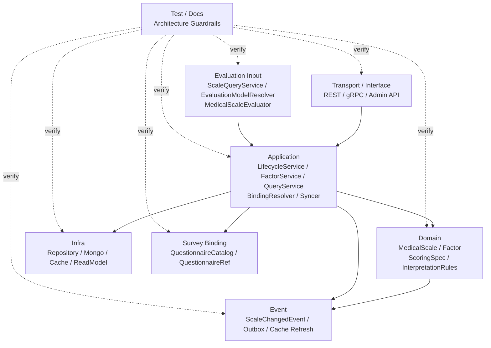

# Scale 模块分层架构与事实源索引

> 本文是 Scale 模块文档的收束篇。
>
> 前面几篇已经分别说明：Scale 是医学量表规则域；`MedicalScale / Factor / ScoringSpec / InterpretationRules` 是核心规则模型；Scale 通过 `QuestionnaireCode + QuestionnaireVersion` 与 Survey 问卷版本协作；Evaluation 通过分数计算引擎与测评分析引擎消费 Scale 规则。
>
> 本文不再重复业务模型细节，而是作为 Scale 模块的“维护地图”：索引 Domain / Application / Infra / Survey Binding / Evaluation Input / Event / Test / Docs 的事实源，明确每一层负责什么、修改 Scale 时应该同步检查哪里，避免代码、文档、事件契约和测试发生漂移。

---

## 1. 结论先行

Scale 模块的事实源不能只看某一个文件。

它由多层共同构成：

```text
Domain        定义 MedicalScale / Factor / ScoringSpec / InterpretationRules 的规则模型和不变量
Application   编排创建、编辑、发布、问卷绑定、查询和事件发布用例
Infra         实现持久化、缓存、读模型和外部基础设施适配
SurveyBinding 通过 QuestionnaireBindingResolver / Catalog 读取 Survey 问卷目录事实
EvaluationInput 向 Evaluation 提供 MedicalScale 规则上下文
Event         定义 ScaleChangedEvent 和规则变化出站边界
Test          验证规则模型、应用链路、问卷绑定、Evaluation 消费和事件契约
Docs          解释架构边界、模型语义、链路和维护规则
```

一句话概括：

> **Scale 的核心事实源是 Domain 规则模型；规则发布与维护事实源在 Application；问卷绑定事实源在 Survey Catalog 防腐层；Evaluation 消费事实源在 Scale Query / EvaluationModelResolver；事件契约事实源在领域事件与事件配置。**

后续修改 Scale 时，不能只改一个文件。

必须同步检查：

```text
领域模型；
应用服务；
持久化映射；
Survey 问卷绑定；
Evaluation 规则消费；
事件契约；
测试；
文档。
```

---

## 2. Scale 分层总览

Scale 的分层可以概括为：



核心原则：

```text
Transport 负责协议适配，不拥有规则事实；
Application 负责编排用例，不吞掉领域不变量；
Domain 负责规则语义和不变量；
Infra 负责存储和缓存实现，不决定业务语义；
Survey Binding 只读取问卷目录事实，不持有 Survey 聚合；
Evaluation Input 只消费规则，不重新定义规则；
Event 负责规则变化出站，不表达 Evaluation 已执行；
Test / Docs 负责防漂移。
```

---

## 3. Domain 层事实源

Domain 层是 Scale 的核心事实源。

它定义：

```text
什么是 MedicalScale；
什么是 Factor；
什么是 ScoringSpec；
什么是 InterpretationRules；
什么是 InterpretationRule；
什么是 RiskLevel；
什么是 ScaleChangedEvent。
```

DDD 中 aggregate 是一组可以作为整体处理的领域对象，aggregate root 负责保证聚合整体完整性，外部引用应指向 root，而不是直接指向聚合内部对象。

这正好对应 Scale 中的结构：

```text
MedicalScale 是聚合根；
Factor 是聚合内部规则实体；
ScoringSpec / InterpretationRules 是聚合内部规则值对象；
外部应通过 MedicalScale 行为修改规则。
```

---

## 3.1 MedicalScale 规则模型事实源

| 主题 | 代码事实源 |
| --- | --- |
| MedicalScale 聚合根 | `internal/apiserver/domain/scale/medical_scale.go` |
| MedicalScale 生命周期 | `internal/apiserver/domain/scale/lifecycle.go` |
| MedicalScale 基础信息 | `internal/apiserver/domain/scale/baseinfo.go` |
| Scale 类型和值对象 | `internal/apiserver/domain/scale/types.go` |
| Scale 领域错误 | `internal/apiserver/domain/scale/errors.go` |
| Scale 领域事件 | `internal/apiserver/domain/scale/events.go` |
| Scale 发布校验器 | `internal/apiserver/domain/scale/validator.go` |

MedicalScale 层应回答：

```text
这份量表规则是什么；
它基于哪份 QuestionnaireVersion；
它处于 draft / published / archived 哪种状态；
发布态规则是否冻结；
规则变化后产生什么领域事件。
```

MedicalScale 层不应回答：

```text
AnswerSheet 如何提交；
FactorScore 如何保存；
Report 如何生成；
Mongo 文档如何映射；
REST DTO 如何返回。
```

---

## 3.2 Factor / ScoringSpec / InterpretationRules 事实源

| 主题 | 代码事实源 |
| --- | --- |
| Factor 因子规则实体 | `internal/apiserver/domain/scale/factor.go` |
| ScoringSpec 计分规格 | `internal/apiserver/domain/scale/scoring_spec.go` |
| InterpretationRules 解读规则集 | `internal/apiserver/domain/scale/interpretation_rules.go` |
| InterpretationRule 单条规则 | `internal/apiserver/domain/scale/interpretation_rule.go` |

它们应回答：

```text
这个因子看哪些题；
这个因子是否是总分因子；
这个因子如何计分；
这个因子的分数如何解释；
规则区间是否合法；
给定 score 最多命中哪条规则。
```

它们不应回答：

```text
某次实际得分是多少；
某次命中了哪个风险等级；
报告如何展示；
Assessment 状态如何推进。
```

这些属于 Evaluation。

---

## 3.3 Domain 层维护原则

修改 Domain 层时要守住以下语义：

```text
MedicalScale 是规则聚合根；
Factor 是规则实体，不是 FactorScore；
ScoringSpec 是规则定义，不是 ScoreCalculator；
InterpretationRules 是规则集合，不是 InterpretationResult；
RiskLevel 是规则中的可命中等级，不是某次测评结果；
published / archived 下规则字段不可编辑；
规则变化应由领域行为产生 ScaleChangedEvent。
```

不建议：

```text
让 Domain 直接依赖 Mongo / Redis / MQ；
让 Domain 直接处理 REST/gRPC DTO；
让 MedicalScale 读取 AnswerSheet；
让 MedicalScale 保存 FactorScore；
让 Factor 暴露可变指针给外部绕过聚合修改。
```

---

## 4. Application 层事实源

Application 层是 Scale 的用例编排事实源。

它负责把外部命令组织为领域模型协作。

| 主题 | 代码事实源 |
| --- | --- |
| 生命周期应用服务 | `internal/apiserver/application/scale/lifecycle_service.go` |
| 生命周期创建流程 | `internal/apiserver/application/scale/lifecycle_creation_workflow.go` |
| 基础信息更新流程 | `internal/apiserver/application/scale/lifecycle_basic_info_workflow.go` |
| 因子应用服务 | `internal/apiserver/application/scale/factor_service.go` |
| 因子命令组装 | `internal/apiserver/application/scale/factor_command_assembler.go` |
| 查询服务 | `internal/apiserver/application/scale/query_service.go` |
| DTO 转换 | `internal/apiserver/application/scale/converter.go` |
| 问卷绑定解析 | `internal/apiserver/application/scale/questionnaire_binding_resolver.go` |
| 问卷绑定同步 | `internal/apiserver/application/scale/questionnaire_binding_syncer.go` |

Application 层应回答：

```text
如何创建 MedicalScale；
如何更新展示信息；
如何更新 Questionnaire binding；
如何添加 / 修改 / 删除 / 替换 Factor；
如何发布 / 下架 / 归档 MedicalScale；
如何查询 MedicalScale 给后台或 Evaluation 使用；
如何发布领域事件或刷新缓存。
```

Application 层不应回答：

```text
FactorCode 是否唯一的最终判断；
发布态规则能否编辑的最终判断；
InterpretationRules 区间是否重叠的最终判断；
Mongo 如何存储；
Evaluation 如何保存 FactorScore。
```

这些分别属于 Domain / Infra / Evaluation。

---

## 4.1 LifecycleService 事实源

LifecycleService 负责生命周期类用例：

```text
Create；
UpdateBasicInfo；
UpdateQuestionnaire；
Publish；
Unpublish；
Archive；
Delete。
```

它应保持编排角色：

```text
接收 command；
校验基础输入；
调用 QuestionnaireBindingResolver；
加载 MedicalScale；
调用领域行为；
保存聚合；
发布聚合事件；
刷新缓存或读模型。
```

它不应直接绕过 `MedicalScale` 修改内部规则字段。

---

## 4.2 FactorService 事实源

FactorService 负责因子规则维护用例：

```text
AddFactor；
UpdateFactor；
RemoveFactor；
ReplaceFactors；
UpdateFactorInterpretRules；
ReplaceInterpretRules。
```

它应负责：

```text
DTO -> Factor / ScoringSpec / InterpretationRules；
加载 MedicalScale；
调用 MedicalScale 的因子行为；
保存聚合；
发布事件；
刷新缓存。
```

规则可编辑性、总分因子唯一、FactorCode 唯一等，应由 MedicalScale 保护。

---

## 4.3 QueryService 事实源

QueryService 负责查询输出。

它可以服务于：

```text
后台管理；
前台量表展示；
Evaluation 规则解析；
热门量表；
绑定问卷查询。
```

查询输出应优先使用：

```text
FactorSnapshot；
MedicalScaleSnapshot；
ScaleQueryDTO；
EvaluationScaleContext。
```

不建议对外暴露可变领域实体指针。

---

## 5. Infra 层事实源

Infra 层负责 Scale 的持久化实现和基础设施适配。

| 主题 | 代码事实源 |
| --- | --- |
| Scale Repository 实现 | `internal/apiserver/infra` |
| Mongo 映射 | `internal/apiserver/infra/mongo` |
| Cache / ReadModel | `internal/apiserver/infra` |
| EventPublisher 实现 | `internal/apiserver/infra` |

Infra 层应回答：

```text
MedicalScale 如何保存；
Factor / ScoringSpec / InterpretationRules 如何映射到存储；
查询 DTO 如何从存储读取；
缓存如何刷新或失效；
领域事件如何出站。
```

Infra 层不应回答：

```text
MedicalScale 是否允许发布；
Factor 是否合法；
InterpretationRules 是否重叠；
Evaluation 如何计算得分；
Survey 问卷是否适合绑定。
```

这些属于 Domain / Application / Survey Binding / Evaluation。

---

## 6. Survey Binding 事实源

Scale 与 Survey 的协作通过防腐层完成。

| 主题 | 事实源 |
| --- | --- |
| QuestionnaireBindingResolver | `internal/apiserver/application/scale/questionnaire_binding_resolver.go` |
| QuestionnaireBindingSyncer | `internal/apiserver/application/scale/questionnaire_binding_syncer.go` |
| Survey Questionnaire 模型 | `internal/apiserver/domain/survey/questionnaire` |
| Survey SubmissionSpec | `internal/apiserver/domain/survey/questionnaire/submission_spec.go` |
| Survey 文档 | `docs/02-业务模块/survey` |

Survey Binding 层应回答：

```text
QuestionnaireCode 是否存在；
QuestionnaireVersion 是否存在；
Questionnaire 类型是否适合绑定 MedicalScale；
Factor.QuestionCodes 是否存在于绑定版本；
draft scale 是否可同步最新 QuestionnaireVersion；
published / archived scale 是否禁止自动同步。
```

它不应回答：

```text
Questionnaire 内部如何维护；
AnswerSheet 如何提交；
AnswerValue 如何校验；
Evaluation 如何执行。
```

---

## 6.1 Survey Binding 修改检查清单

修改问卷绑定逻辑时，要同步检查：

```text
MedicalScale.QuestionnaireCode / QuestionnaireVersion 字段；
BaseInfo.UpdateQuestionnaire；
QuestionnaireBindingResolver；
QuestionnaireBindingSyncer；
Factor.QuestionCodes 发布前校验；
Survey QuestionnaireCatalog；
02-问卷与量表链路-问卷绑定.md；
Evaluation 执行前 QuestionnaireRef 一致性校验；
相关测试。
```

---

## 7. Evaluation Input 事实源

Scale 是 Evaluation 的规则输入源。

| 主题 | 事实源 |
| --- | --- |
| Scale 查询服务 | `internal/apiserver/application/scale/query_service.go` |
| Scale DTO / Snapshot 转换 | `internal/apiserver/application/scale/converter.go` |
| Evaluation 应用服务 | `internal/apiserver/application/evaluation` |
| Evaluation 领域模型 | `internal/apiserver/domain/evaluation` |
| Worker 消费链路 | `internal/worker` |
| Evaluation 文档 | `docs/02-业务模块/evaluation` |

Evaluation Input 层应回答：

```text
Evaluation 如何加载 MedicalScale；
如何校验 AnswerSheet 与 MedicalScale 的 QuestionnaireRef 一致；
如何读取 Factor / QuestionCodes / ScoringSpec；
如何读取 InterpretationRules；
如何为 MedicalScaleEvaluator 提供规则上下文。
```

它不应回答：

```text
MedicalScale 内部规则如何编辑；
Scale 如何持久化；
Survey 如何提交答卷；
Report 如何排版。
```

---

## 7.1 Evaluation Input 修改检查清单

修改 Scale 被 Evaluation 消费的方式时，要同步检查：

```text
ScaleQueryService；
Evaluation application service；
MedicalScaleEvaluator / EvaluationEngine；
AnswerSheet.QuestionnaireRef 校验；
FactorScore 生成逻辑；
InterpretationResult 生成逻辑；
RuleSnapshot / MatchedInterpretationSnapshot；
03-量表与测评链路-分数计算引擎与测评分析引擎.md；
Evaluation 文档；
测试。
```

---

## 8. Event / Outbox 事实源

Scale 的规则变化可以产生领域事件。

| 主题 | 事实源 |
| --- | --- |
| ScaleChangedEvent | `internal/apiserver/domain/scale/events.go` |
| 聚合事件收集 | `internal/apiserver/domain/scale/medical_scale.go` |
| 应用层事件发布 | `internal/apiserver/application/scale` |
| 事件契约 | `configs/events.yaml` |
| Outbox / EventPublisher | `internal/apiserver/infra` |
| Worker / Cache consumer | `internal/worker` / cache refresh runtime |

事件语义必须稳定：

```text
ScaleChangedEvent 表达规则事实发生变化；
它不表达 Evaluation 已经重新执行；
它不表达历史报告已经刷新；
它不表达 AnswerSheet 已提交。
```

如果 ScaleChangedEvent 需要跨进程可靠出站，应使用 Outbox 思路：业务数据与待发布消息在同一可靠边界落库，再由 relay 异步发布。这样可以避免数据库更新成功但消息丢失，或消息发布成功但数据库事务失败的双写不一致问题。

同时，消息 relay 或 broker 可能重复投递，因此消费者必须幂等。

---

## 8.1 Event 修改检查清单

修改 Scale 事件时，要同步检查：

```text
ScaleChangedEvent 字段；
领域行为是否正确收集事件；
application service 是否发布聚合事件；
configs/events.yaml；
Outbox payload；
cache refresh consumer；
Evaluation 是否需要响应规则变化；
事件契约测试；
04-Scale模块分层架构与事实源索引.md。
```

不要只改事件结构而不改消费者。

---

## 9. Test 事实源

Scale 测试应覆盖六类。

| 测试类型 | 应覆盖内容 |
| --- | --- |
| Domain tests | MedicalScale 生命周期、规则冻结、FactorCode 唯一、总分因子唯一、ScoringSpec、InterpretationRules |
| Application tests | LifecycleService、FactorService、QueryService、QuestionnaireBindingResolver、Syncer |
| Infra tests | Repository 映射、Mongo 持久化、缓存刷新、事件出站 |
| Survey binding tests | QuestionnaireVersion 绑定、draft 同步、published 不同步、QuestionCodes 校验 |
| Evaluation input tests | MedicalScale 加载、QuestionnaireRef 一致性、FactorScore 输入、InterpretationRules 命中 |
| Event tests | ScaleChangedEvent、configs/events.yaml、消费者幂等 |

建议测试命令：

```bash
go test ./internal/apiserver/domain/scale/...
go test ./internal/apiserver/application/scale/...
go test ./internal/apiserver/application/evaluation/...
go test ./internal/worker/...
```

---

## 10. Docs 事实源

Scale 文档分成五篇。

| 文档 | 事实主题 |
| --- | --- |
| `README.md` | Scale 定位、职责边界、文档导航 |
| `01-MedicalScale模型-MedicalScale-Factor-Interpretation.md` | 规则模型、生命周期、Factor、ScoringSpec、InterpretationRules |
| `02-问卷与量表链路-问卷绑定.md` | Survey 绑定、防腐层、问卷版本引用、QuestionCodes 一致性 |
| `03-量表与测评链路-分数计算引擎与测评分析引擎.md` | Evaluation 消费 Scale、计算引擎、分析引擎、Evaluator 演进 |
| `04-Scale模块分层架构与事实源索引.md` | 分层事实源、维护清单、防漂移索引 |

相关外部文档索引：

```text
docs/02-业务模块/survey/README.md
docs/02-业务模块/evaluation/README.md
docs/03-基础设施/resilience/README.md
```

---

## 11. 修改场景与同步检查清单

### 11.1 修改 MedicalScale 字段

需要检查：

```text
MedicalScale 聚合；
BaseInfo / Lifecycle；
Repository mapper；
Query DTO / converter；
ScaleChangedEvent payload；
后台 API；
README / 01 文档；
测试。
```

### 11.2 修改 Factor 模型

需要检查：

```text
Factor；
MedicalScale factor behavior；
FactorSnapshot；
FactorCommandAssembler；
ScoringSpec；
InterpretationRules；
Query DTO；
Evaluation 计算输入；
01 文档；
03 文档；
测试。
```

### 11.3 修改 ScoringSpec

需要检查：

```text
ScoringSpec value object；
Factor 构造 / 更新；
FactorCommandAssembler；
Evaluation ScoreCalculator；
FactorScore 生成；
01 文档；
03 文档；
测试。
```

### 11.4 修改 InterpretationRules

需要检查：

```text
InterpretationRules；
InterpretationRule；
RiskLevel；
FactorSnapshot；
Evaluation analysis engine；
InterpretationResult / ReportBuilder；
01 文档；
03 文档；
测试。
```

### 11.5 修改问卷绑定

需要检查：

```text
MedicalScale.QuestionnaireRef；
QuestionnaireBindingResolver；
QuestionnaireBindingSyncer；
Survey QuestionnaireCatalog；
Factor.QuestionCodes 发布前校验；
Evaluation QuestionnaireRef 一致性校验；
02 文档；
测试。
```

### 11.6 修改 Scale 与 Evaluation 衔接

需要检查：

```text
ScaleQueryService；
EvaluationModelResolver；
MedicalScaleEvaluator；
ScoreCalculationEngine；
AssessmentAnalysisEngine；
RuleSnapshot；
Evaluation 文档；
03 文档；
测试。
```

### 11.7 修改 Scale 事件

需要检查：

```text
ScaleChangedEvent；
领域行为事件收集；
application event publish；
configs/events.yaml；
Outbox / EventPublisher；
worker / cache consumer；
事件契约测试；
04 文档。
```

---

## 12. 架构边界护栏

### 12.1 Domain 不依赖 Infra

不允许：

```text
domain/scale -> infra/mongo
domain/scale -> redis
domain/scale -> mq
domain/scale -> transport dto
```

Domain 只能表达规则模型和端口。

### 12.2 Application 不直接改聚合内部字段

不建议：

```text
scale.Factors[i].ScoringSpec = xxx
scale.Status = published
scale.QuestionnaireVersion = latest
```

应通过：

```text
MedicalScale.UpdateFactor；
MedicalScale.Publish；
MedicalScale.UpdateQuestionnaire；
MedicalScale.ReplaceFactors。
```

### 12.3 Scale 不读取 AnswerSheet

不允许：

```text
scale service -> answersheet repository -> calculate score
```

读取 AnswerSheet 并计算结果属于 Evaluation。

### 12.4 Evaluation 不重新定义规则

不建议：

```text
evaluation pipeline 中硬编码 Factor / ScoreRange / RiskLevel 规则。
```

Evaluation 应消费 Scale 规则。

### 12.5 published scale 不自动同步问卷版本

不允许：

```text
Questionnaire 发布新版本 -> 自动修改 published MedicalScale.QuestionnaireVersion。
```

published 是规则事实，必须冻结。

### 12.6 Outbox owner 不应漂移

如果 ScaleChangedEvent 需要可靠出站，Outbox owner 应是创建规则变化事实的服务边界。

在 Scale 中就是：

```text
qs-apiserver Scale application / repository transaction boundary
```

不是 Survey，也不是 Worker。

---

## 13. 常用 Verify 命令

Scale 模块基础验证：

```bash
go test ./internal/apiserver/domain/scale/...
go test ./internal/apiserver/application/scale/...
```

Survey 绑定：

```bash
go test ./internal/apiserver/domain/survey/...
go test ./internal/apiserver/application/survey/...
go test ./internal/apiserver/application/scale/...
```

Evaluation 消费：

```bash
go test ./internal/apiserver/application/evaluation/...
go test ./internal/worker/...
```

事件契约与文档：

```bash
make docs-hygiene
```

全量质量入口：

```bash
make test
make lint
make docs-hygiene
```

---

## 14. 面试与宣讲口径

### 14.1 30 秒版本

```text
Scale 模块的分层很清楚：Domain 定义 MedicalScale、Factor、ScoringSpec 和 InterpretationRules；Application 编排创建、编辑、发布、问卷绑定和查询；Infra 实现持久化与缓存；Survey Binding 通过 QuestionnaireBindingResolver 读取问卷目录事实；Evaluation 通过 ScaleQueryService 消费规则。
Scale 是规则事实源，Evaluation 是执行结果源。修改 Scale 时要同步检查领域模型、应用服务、Survey 绑定、Evaluation 消费、事件契约、测试和文档，避免规则事实漂移。
```

### 14.2 3 分钟版本

```text
Scale 是医学量表规则域，所以它的事实源分布在多个层次。

Domain 层是最核心的事实源。MedicalScale 是规则聚合根，Factor 是规则实体，ScoringSpec 定义计分规格，InterpretationRules 定义分数区间到风险等级、结论和建议的映射。发布态规则必须冻结，防止历史 Evaluation 被后台编辑污染。

Application 层负责编排用例。LifecycleService 负责创建、更新基础信息、绑定问卷、发布、下架和归档；FactorService 负责因子规则维护；QueryService 负责后台查询和 Evaluation 规则解析；QuestionnaireBindingResolver 负责和 Survey 的防腐协作。

Infra 层负责持久化和缓存实现，不决定规则语义。Survey Binding 层只读取问卷目录事实，不持有 Survey 聚合。Evaluation Input 层只消费 Scale 规则，不重新定义规则。

事件方面，ScaleChangedEvent 只表达规则事实变化，不表达 Evaluation 已重新执行。如果需要可靠出站，应使用 Outbox 思路，并要求消费者幂等。

所以后续修改 Scale 时，不能只改一个模型文件。比如改 ScoringSpec，要同步检查 Factor、命令组装、Evaluation ScoreCalculator、文档和测试；改 InterpretationRules，要同步检查测评分析引擎、报告输入和规则快照。
```

### 14.3 高频追问

| 追问 | 回答要点 |
| --- | --- |
| Scale 的核心事实源在哪里？ | Domain 层的 MedicalScale / Factor / ScoringSpec / InterpretationRules |
| LifecycleService 做什么？ | 编排创建、更新、发布、归档等生命周期用例 |
| FactorService 做什么？ | 编排因子和解读规则维护用例 |
| QuestionnaireBindingResolver 属于哪层？ | Application 层防腐组件，连接 Scale 与 Survey Catalog |
| ScaleQueryService 为什么重要？ | 它是后台查询和 Evaluation 消费 Scale 规则的入口 |
| Outbox owner 是谁？ | 如果 ScaleChangedEvent 可靠出站，owner 是 qs-apiserver Scale 事务边界 |
| 修改题型绑定要检查什么？ | Survey Catalog、Factor.QuestionCodes、发布前校验、Evaluation 一致性校验 |
| 修改 ScoringSpec 要检查什么？ | Domain value object、assembler、Evaluation ScoreCalculator、测试和文档 |
| 修改 InterpretationRules 要检查什么？ | 规则集合、RiskLevel、AnalysisEngine、ReportBuilder、测试和文档 |
| Scale 和 Evaluation 怎么防止职责混淆？ | Scale 定义规则，Evaluation 执行规则并保存结果 |

---

## 15. 最终判断

Scale 模块的新文档体系可以按以下方式维护：

```text
README 说明模块定位；
01 说明 MedicalScale 规则模型；
02 说明 Survey 问卷绑定链路；
03 说明 Evaluation 执行消费链路；
04 说明分层事实源和防漂移索引。
```

后续维护重点不是继续扩大 Scale，而是守住边界：

```text
Scale 管规则；
Survey 管作答事实；
Evaluation 管执行结果；
QuestionnaireBindingResolver 管防腐协作；
ScaleQueryService 管规则输入；
Outbox / EventPublisher 管规则变化出站。
```

一句话收束：

> **Scale 的价值是提供稳定、可发布、可冻结、可追溯的医学量表规则；事实源索引的价值是保证这套语义在代码、测试、事件契约和文档中长期不漂移。**
