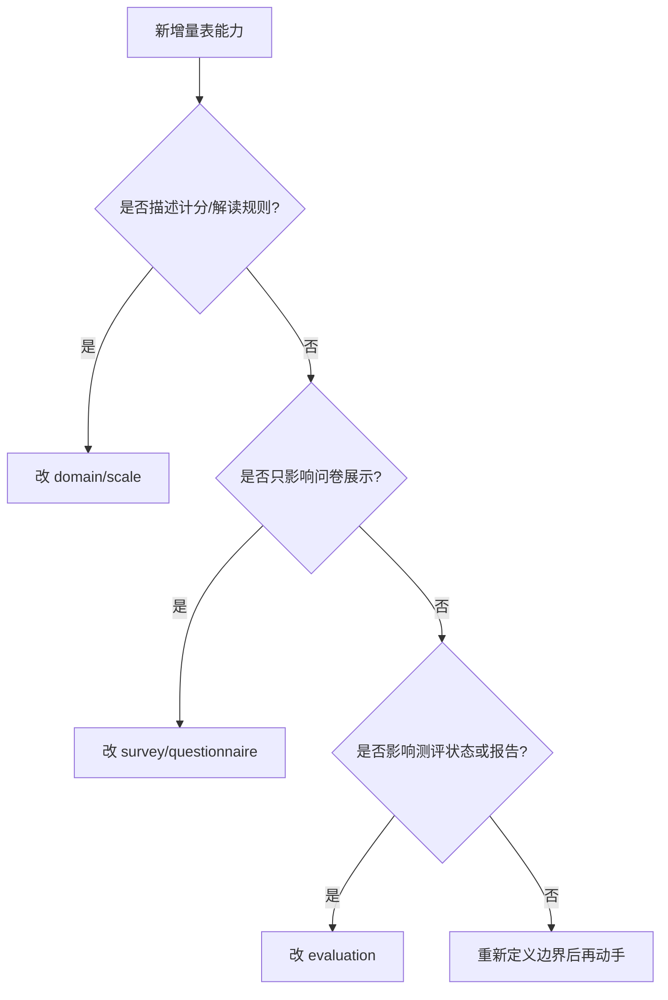

# 新增量表能力 SOP

**本文回答**：新增量表字段、因子类型、计分策略或解读规则时，应该按什么顺序补模型、测试和文档。

## 30 秒结论

| 步骤 | 必做事项 |
| ---- | -------- |
| 1 | 判断能力属于 Scale 规则域、Survey 展示域，还是 Evaluation 产出域 |
| 2 | 先改领域模型和值对象，再改 DTO / repository / REST |
| 3 | 如果影响列表读性能，确认是否需要更新 `ScaleListCache` rebuild/get-page 语义 |
| 4 | 如果产生事件，确认 `configs/events.yaml` 中 delivery class 和 handler 边界 |
| 5 | 补领域测试、应用服务测试、接口契约和本文档回链 |

## SOP 要解决什么问题

Scale 的变更通常看起来只是“加一个字段”或“加一种算法”，但它可能同时影响规则持久化、答卷展示、Evaluation pipeline、报告输出、缓存和事件。SOP 的目的不是增加流程，而是避免把一个规则变更错误地落到 Survey、Evaluation 或 Report 中。

新增能力前先回答四个问题：

| 问题 | 如果答案是“是” | 落点 |
| ---- | -------------- | ---- |
| 它定义量表规则吗 | 因子、题目引用、计分、解读、生命周期 | `domain/scale` |
| 它影响作答结构吗 | 题型、展示、答案校验 | `domain/survey` |
| 它影响测评状态或报告吗 | pipeline、Assessment、Report | `domain/evaluation` |
| 它只是读性能优化吗 | 列表、分页、缓存 | `application/scale` / cache |

## 决策树



## 设计审查清单

| 审查项 | 必须说明 |
| ------ | -------- |
| 架构边界 | 为什么这个能力属于 Scale，而不是 Survey/Evaluation |
| 领域模型 | 新增的是聚合字段、实体、值对象，还是领域服务策略 |
| 设计模式 | 是否扩展现有策略模式、领域服务或 Builder；没有模式时不要硬套 |
| 事件语义 | 是否需要 `scale.changed`，是否仍是 best-effort |
| 缓存语义 | 是否影响 `ScaleListCache` 的重建和分页 |
| 兼容性 | 旧量表、旧报告和历史 Assessment 是否受影响 |

## 变更清单

| 变更类型 | 代码锚点 | 测试要求 |
| -------- | -------- | -------- |
| 新增量表基础字段 | [internal/apiserver/domain/scale/medical_scale.go](../../../internal/apiserver/domain/scale/medical_scale.go) | 聚合构造、校验、repository 映射 |
| 新增因子字段 | [internal/apiserver/domain/scale/factor.go](../../../internal/apiserver/domain/scale/factor.go) | 因子构造、FactorManager、DTO 转换 |
| 新增计分策略 | [internal/apiserver/domain/scale/scoring_service.go](../../../internal/apiserver/domain/scale/scoring_service.go) | 正常、缺失答案、非法参数、边界分数 |
| 新增解读规则字段 | [internal/apiserver/domain/scale/interpretation_rule.go](../../../internal/apiserver/domain/scale/interpretation_rule.go) | 匹配语义、风险枚举、报告消费 |
| 影响列表读 | [internal/apiserver/application/scale/global_list_cache.go](../../../internal/apiserver/application/scale/global_list_cache.go) | compressed round-trip、miss、empty delete、memory hit |

## 为什么按这个顺序做

先改领域模型是为了把规则不变量写在最靠近业务语义的地方；再改 DTO、repository 和 REST，是为了让外部接口只暴露已经被领域模型验证过的能力；最后改缓存和事件，是为了避免把异步通知或读优化误当成业务权威。这个顺序和 Redis/Event/Resilience 的维护原则一致：**先模型，后适配，再观测和文档**。

## 常见取舍

| 场景 | 推荐选择 | 不推荐 |
| ---- | -------- | ------ |
| 新计分算法 | 扩展 `ScoringService` 策略并补测试 | 在 Evaluation handler 里临时 if/else |
| 新风险文案 | 扩展 `InterpretationRule` 或其 DTO | 在 Report Builder 中硬编码区间文案 |
| 新列表字段 | 先确认是否来自规则聚合，再更新缓存投影 | 只改缓存结构不改 repository 权威 |
| 规则变更影响历史 | 单独设计补偿/重算方案 | 让 `scale.changed` 隐式触发重算 |

## 文档同步

新增能力完成后至少同步：

| 文档 | 同步内容 |
| ---- | -------- |
| [README.md](./README.md) | 如果新增能力改变模块定位或阅读路径 |
| [00-整体模型.md](./00-整体模型.md) | 如果新增聚合、实体或边界 |
| [01-规则与因子计分.md](./01-规则与因子计分.md) | 如果新增计分策略或参数 |
| [02-解读规则与风险文案.md](./02-解读规则与风险文案.md) | 如果新增风险/文案字段 |
| [03-与Evaluation衔接.md](./03-与Evaluation衔接.md) | 如果改变 Evaluation 消费方式 |

## Verify

```bash
go test ./internal/apiserver/domain/scale ./internal/apiserver/application/scale
python scripts/check_docs_hygiene.py
```
