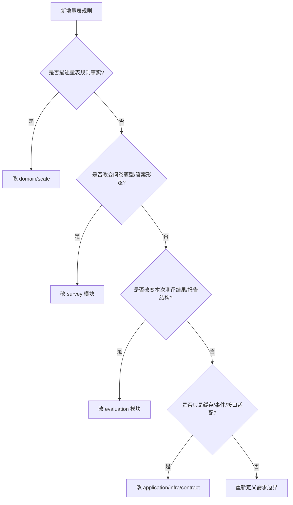

# 新增量表规则 SOP

**本文回答**：当 Scale 模块需要新增或调整量表规则时，应该按什么顺序判断边界、修改领域模型、更新因子/计分/解读规则、同步 Evaluation 消费链路、补齐测试与文档，避免把规则变更错误地落到 Survey、Evaluation 或 Report 中。

---

## 30 秒结论

新增量表规则前，先判断它属于哪一类变化：

| 变化类型 | 示例 | 主要落点 |
| -------- | ---- | -------- |
| 量表基础规则 | 新增适用人群、主类、标签、填报人 | `domain/scale.MedicalScale` |
| 因子规则 | 新增因子字段、因子类型、总分因子规则 | `domain/scale.Factor` |
| 计分规则 | 新增 `weighted_avg`、分段计分、反向计分 | `domain/scale` + `ruleengine.ScaleFactorScorer` + Evaluation pipeline |
| 解读规则 | 新增风险等级、文案字段、区间规则 | `InterpretationRule` + Evaluation interpretation/report |
| 与问卷绑定规则 | 新增问卷版本同步策略 | Scale application + Questionnaire catalog |
| 与历史评估关系 | 是否重算历史 Assessment / Report | 需要独立补偿机制，不应隐式塞进 `scale.changed` |

最小执行顺序：

```text
边界判断
  -> 领域模型
  -> DTO / repository / mapper
  -> 应用服务
  -> ruleengine / Evaluation 消费
  -> 事件 / 缓存
  -> 测试
  -> 文档
```

一句话原则：

> **规则先进入 Scale 领域模型；Evaluation 只消费规则；Report 只组织结果；Survey 只保存作答事实。**

---

## 1. 新增规则前的边界判断

开始写代码前，必须先回答四个问题。

| 问题 | 如果答案是“是” | 应落在哪 |
| ---- | -------------- | -------- |
| 它定义量表规则吗 | 因子、题目引用、计分、风险区间、解读文案、生命周期 | `domain/scale` |
| 它影响作答结构吗 | 题型、选项、前端 value、答案校验 | `survey/questionnaire` / `survey/answersheet` |
| 它影响测评状态或报告落库吗 | Assessment 状态、EvaluationResult、Report 保存 | `evaluation` |
| 它只是读性能优化吗 | 列表缓存、分页、预热、投影 | `application/scale` / cache |

不要把所有和“量表”有关的东西都放进 Scale。Scale 只负责规则事实，不负责作答事实、测评状态和报告结构。

---

## 2. 决策树



判断不清时，先不要动代码。Scale 规则一旦进入报告、统计、标签和通知链路，后续迁移成本很高。

---

## 3. 常见新增规则类型

### 3.1 新增量表基础字段

例如：

```text
适用年龄段
评估阶段
填报人
标签
临床场景
适用疾病谱
```

修改路径：

| 层 | 修改 |
| -- | ---- |
| Domain | `MedicalScale` 字段和值对象 |
| Domain | 构造参数、getter、校验 |
| Application | Create/Update DTO 转换 |
| Repository | PO / mapper |
| Query | 列表和详情返回 |
| Cache | ScaleListCache 投影结构 |
| Contract | REST / gRPC |
| Docs | `00-整体模型.md` |

注意：如果字段只服务前端筛选，不一定要进入 Evaluation snapshot；如果字段影响规则执行，必须进入 snapshot。

### 3.2 新增因子字段

例如：

```text
因子权重
是否展示
因子层级
因子解释分组
反向计分标记
```

修改路径：

| 层 | 修改 |
| -- | ---- |
| Domain | `Factor` 字段、构造 option、getter |
| Domain | `MedicalScale.ReplaceFactors` 相关不变量 |
| Application | `FactorService` DTO 转 domain |
| Repository | factor PO / mapper |
| EvaluationInput | `FactorSnapshot` 是否需要携带 |
| Evaluation | factor score / report 是否消费 |
| Docs | `01-规则与因子计分.md` / `02-解读规则与风险文案.md` |

### 3.3 新增计分策略

例如：

```text
weighted_avg
reverse_sum
percentile
threshold_count
normalized_score
```

修改路径：

| 层 | 修改 |
| -- | ---- |
| Domain | `ScoringStrategyCode` |
| Domain | `ScoringParams` |
| Application | DTO 转换与参数校验 |
| RuleEngine | `ScaleFactorScorer.ScoreFactor` |
| Evaluation | `collectFactorValues` 是否需要新增取值逻辑 |
| Tests | ruleengine / pipeline / factor service |
| Docs | `01-规则与因子计分.md` |

### 3.4 新增解读规则字段

例如：

```text
clinical_note
family_advice
training_suggestion
severity_label
followup_interval
```

修改路径：

| 层 | 修改 |
| -- | ---- |
| Domain | `InterpretationRule` |
| Application | `FactorService` 解读规则 DTO |
| Repository | mapper |
| EvaluationInput | `InterpretRuleSnapshot` |
| Interpretation | `InterpretationHandler` / interpretengine |
| Report | Report Builder |
| Contract | REST/gRPC 输出 |
| Docs | `02-解读规则与风险文案.md` |

### 3.5 新增风险等级

例如新增：

```text
critical
warning
borderline
```

修改路径：

| 层 | 修改 |
| -- | ---- |
| Domain | `RiskLevel` 常量、`IsValid`、`DisplayName` |
| DTO / Contract | 枚举或说明 |
| Evaluation | risk level 映射和排序 |
| Actor | 标签/重点关注规则 |
| Statistics | 风险聚合口径 |
| Report | 展示样式和文案 |
| Docs | Scale、Evaluation、接口文档 |

风险等级属于跨模块稳定语义，不能随意改名。展示文案可以改，枚举值要慎重。

---

## 4. 领域模型修改顺序

### 4.1 先改 Domain

先把规则语义落实到领域模型：

```text
MedicalScale
Factor
InterpretationRule
ScoreRange
RiskLevel
ScoringStrategyCode
ScoringParams
```

不要先改 REST handler 或数据库字段。否则外部接口会先暴露一个领域还不能保证不变量的能力。

### 4.2 再改 Application

应用层负责把外部输入变成领域对象，并在变更后完成：

```text
repo.Update
event publish
cache rebuild
```

Scale 里常见落点：

```text
application/scale/lifecycle_service.go
application/scale/factor_service.go
application/scale/query_service.go
```

### 4.3 再改 Infrastructure

包括：

```text
Repository
PO
mapper
cache projection
event adapter
```

Infrastructure 不能定义规则语义，只能保存和转译领域模型。

---

## 5. 与 Survey 的联动检查

Scale 规则常常引用 Questionnaire 中的题目。

修改规则时必须检查：

| 检查点 | 说明 |
| ------ | ---- |
| `questionCodes` 是否存在 | Factor 引用的题必须在绑定问卷版本中存在 |
| 题目是否可计分 | 文本/展示题通常不适合作为因子分输入 |
| option code/content 是否稳定 | `cnt` 策略可能依赖 option content |
| 问卷版本是否绑定 | Scale 应明确绑定 questionnaireVersion |
| 新问卷版本发布后 Scale 是否同步 | 避免规则引用旧题结构 |

如果规则变更实际是“题型/答案形态变更”，应先改 Survey，不要把它伪装成 Scale 规则。

---

## 6. 与 Evaluation 的联动检查

Scale 规则最终会被 Evaluation 消费。每次规则变更都要检查它是否影响：

| Evaluation 点位 | 检查内容 |
| --------------- | -------- |
| `ScaleSnapshot` | 新字段是否需要进入 snapshot |
| `FactorSnapshot` | 新因子字段是否需要进入 pipeline |
| `InterpretRuleSnapshot` | 新文案/风险字段是否需要进入解释阶段 |
| `FactorScoreCalculator` | 新计分策略是否需要新的取值逻辑 |
| `ScaleFactorScorer` | 新策略是否已实现 |
| `InterpretationHandler` | 新解读字段是否进入 EvaluationResult / Report |
| `Report Builder` | 报告是否展示新字段 |
| `Assessment` | 是否影响状态或总风险 |

如果 Evaluation 不需要消费某字段，不要强行塞进 snapshot。

---

## 7. 与事件和缓存的联动检查

### 7.1 scale.changed

Scale 规则变更后，通常会发布 `scale.changed`。

但要明确：

```text
scale.changed 是规则变更通知
不是历史评估重算命令
```

如果新增规则需要重算历史 Assessment，不要复用 `scale.changed`，应设计独立 command/event。

### 7.2 ScaleListCache

如果新增字段影响列表页或热门量表：

| 场景 | 是否影响 cache |
| ---- | -------------- |
| 新增详情字段 | 不一定 |
| 新增列表筛选字段 | 是 |
| 新增排序字段 | 是 |
| 新增展示标签 | 可能 |
| 新增 Evaluation-only 字段 | 不一定 |

缓存变更要同步测试：

```text
cache rebuild
cache miss
cache hit
empty result
serialization round-trip
```

---

## 8. 新增计分策略 SOP

以新增 `weighted_avg` 为例。

### 8.1 设计说明

先写清楚：

```text
策略名：weighted_avg
输入：questionCodes 对应的题目分数
参数：questionCode -> weight
空值处理：缺失答案跳过 / 按 0 处理
输出：加权平均分
是否影响 maxScore：是/否
```

### 8.2 修改步骤

1. 在 `ScoringStrategyCode` 中新增策略。
2. 扩展 `ScoringParams`，不要用无语义 map 糊弄过去。
3. 更新 Factor DTO 和 mapper。
4. 更新 `ScaleFactorScorer.ScoreFactor`。
5. 如果需要按 questionCode 对齐权重，更新 `collectFactorValues` 或新增输入结构。
6. 补 ruleengine 测试。
7. 补 Evaluation pipeline 测试。
8. 更新 `01-规则与因子计分.md`。
9. 更新接口文档。

### 8.3 验收标准

| 标准 | 说明 |
| ---- | ---- |
| 正常计算 | 多题权重计算正确 |
| 缺失答案 | 行为符合设计 |
| 权重缺失 | 返回错误还是默认 1，必须明确 |
| 空题集合 | 返回 0 还是错误，必须明确 |
| Evaluation pipeline | 能生成正确 FactorScore |
| Report | 展示结果符合预期 |

---

## 9. 新增解读规则字段 SOP

以新增 `clinical_note` 为例。

### 9.1 设计说明

先判断它是不是规则字段：

| 判断 | 结论 |
| ---- | ---- |
| 是否随分数区间变化 | 是，倾向 Scale |
| 是否只是报告章节标题 | 否，倾向 Report |
| 是否需要进入统计/标签 | 可能，需要评估 |
| 是否需要多语言 | 可能，需要 i18n 设计 |

### 9.2 修改步骤

1. 修改 `InterpretationRule`。
2. 修改 DTO 和 mapper。
3. 修改 `InterpretRuleSnapshot`。
4. 修改 interpretengine `RuleSpec / Result`。
5. 修改 `InterpretationHandler` 或 Report Builder。
6. 修改 OpenAPI/proto。
7. 补 domain/application/evaluation/report 测试。
8. 更新 `02-解读规则与风险文案.md`。

### 9.3 验收标准

| 标准 | 说明 |
| ---- | ---- |
| 规则可保存 | FactorService 能保存新字段 |
| 规则可读取 | QueryService 能返回新字段 |
| pipeline 可消费 | Evaluation 能拿到 snapshot 字段 |
| report 可展示 | Report 中有明确位置 |
| 兼容旧规则 | 旧数据字段为空时不崩溃 |

---

## 10. 新增风险等级 SOP

### 10.1 修改步骤

1. 修改 `RiskLevel` 常量。
2. 修改 `RiskLevel.IsValid()`。
3. 修改 `RiskLevel.DisplayName()`。
4. 更新 DTO / OpenAPI / proto。
5. 检查 Evaluation risk level 计算。
6. 检查 Actor 标签逻辑。
7. 检查 Statistics 风险聚合。
8. 检查 Report 展示。
9. 补测试和文档。

### 10.2 兼容要求

风险等级是跨模块字段。新增可以，重命名和删除要非常谨慎。

如果确实要重命名，建议：

```text
新增新枚举
兼容旧枚举读取
迁移历史数据
更新统计口径
最终废弃旧枚举
```

不要直接把旧枚举删掉。

---

## 11. 新增因子字段 SOP

例如新增 `weight`。

### 11.1 修改步骤

1. `Factor` 增加字段。
2. 增加构造 option 和 getter。
3. 修改 `toFactorDomain` DTO 转换。
4. 修改 repository mapper。
5. 修改 `FactorSnapshot`，如果 Evaluation 需要消费。
6. 修改 Report 展示，如果需要。
7. 修改测试。
8. 修改 `01-规则与因子计分.md`。

### 11.2 判断是否进入 Snapshot

| 问题 | 结论 |
| ---- | ---- |
| Evaluation 需要用它算分吗 | 进入 `FactorSnapshot` |
| Report 需要展示它吗 | 进入 Report DTO 或 snapshot |
| 只是后台管理字段吗 | 不一定需要进入 Evaluation |

---

## 12. 自动重算历史测评的单独设计

默认规则：

```text
Scale 规则变更不自动重算历史 Assessment
```

如果业务要求重算，应作为独立能力设计，不要塞进 Scale 更新流程。

需要新增：

| 能力 | 说明 |
| ---- | ---- |
| 重算命令 | 指定 scale、version、assessment 范围 |
| 幂等 | 同一个 assessment 不重复重算 |
| 进度 | pending / running / done / failed |
| 审计 | 谁发起、为什么重算 |
| 回滚 | 是否保留旧报告 |
| 通知 | 用户是否看到报告变化 |
| 统计修复 | 风险分布是否重算 |

可能的事件不是 `scale.changed`，而是类似：

```text
scale.re_evaluation.requested
assessment.recalculate.requested
```

这应归入 Evaluation/operations 能力，而不是 Scale 普通规则更新。

---

## 13. 合并前检查清单

| 检查项 | 是否完成 |
| ------ | -------- |
| 已明确能力属于 Scale 而不是 Survey/Evaluation | ☐ |
| 已更新领域模型和值对象 | ☐ |
| 已更新 DTO / OpenAPI / proto | ☐ |
| 已更新 repository / mapper | ☐ |
| 已更新 application service | ☐ |
| 如影响计分，已更新 ruleengine / pipeline | ☐ |
| 如影响解释，已更新 interpretengine / report | ☐ |
| 如影响缓存，已更新 ScaleListCache | ☐ |
| 如产生事件，已核对 `configs/events.yaml` | ☐ |
| 已补 domain 测试 | ☐ |
| 已补 application 测试 | ☐ |
| 已补 Evaluation 消费测试 | ☐ |
| 已补接口/契约测试 | ☐ |
| 已更新 Scale 文档组 | ☐ |
| 已运行 docs hygiene | ☐ |

---

## 14. 推荐测试命令

```bash
go test ./internal/apiserver/domain/scale
go test ./internal/apiserver/application/scale
go test ./internal/apiserver/infra/ruleengine
go test ./internal/apiserver/infra/evaluationinput
go test ./internal/apiserver/application/evaluation/engine/pipeline
```

如果修改了接口契约：

```bash
make docs-rest
make docs-verify
```

如果修改了事件配置：

```bash
go test ./internal/pkg/eventcatalog
go test ./internal/worker/handlers
```

如果修改了缓存：

```bash
go test ./internal/apiserver/infra/cache
go test ./internal/pkg/cacheplane
```

---

## 15. 文档同步

| 变更类型 | 至少同步 |
| -------- | -------- |
| 新增 Scale 聚合字段 | [00-整体模型.md](./00-整体模型.md) |
| 新增计分策略 | [01-规则与因子计分.md](./01-规则与因子计分.md) |
| 新增风险/文案字段 | [02-解读规则与风险文案.md](./02-解读规则与风险文案.md) |
| 改变 Evaluation 消费方式 | [03-与Evaluation衔接.md](./03-与Evaluation衔接.md) |
| 改变接口 | `docs/04-接口与运维/` |
| 改变事件 | `docs/03-基础设施/event/` |
| 改变缓存 | `docs/03-基础设施/redis/` |

---

## 16. 代码锚点

### Scale Domain

- MedicalScale：[../../../internal/apiserver/domain/scale/medical_scale.go](../../../internal/apiserver/domain/scale/medical_scale.go)
- Factor：[../../../internal/apiserver/domain/scale/factor.go](../../../internal/apiserver/domain/scale/factor.go)
- InterpretationRule：[../../../internal/apiserver/domain/scale/interpretation_rule.go](../../../internal/apiserver/domain/scale/interpretation_rule.go)
- Scale types：[../../../internal/apiserver/domain/scale/types.go](../../../internal/apiserver/domain/scale/types.go)
- Lifecycle：[../../../internal/apiserver/domain/scale/lifecycle.go](../../../internal/apiserver/domain/scale/lifecycle.go)

### Application

- LifecycleService：[../../../internal/apiserver/application/scale/lifecycle_service.go](../../../internal/apiserver/application/scale/lifecycle_service.go)
- FactorService：[../../../internal/apiserver/application/scale/factor_service.go](../../../internal/apiserver/application/scale/factor_service.go)
- QueryService：[../../../internal/apiserver/application/scale/query_service.go](../../../internal/apiserver/application/scale/query_service.go)

### Evaluation / RuleEngine

- ruleengine port：[../../../internal/apiserver/port/ruleengine/ruleengine.go](../../../internal/apiserver/port/ruleengine/ruleengine.go)
- ScaleFactorScorer：[../../../internal/apiserver/infra/ruleengine/scoring.go](../../../internal/apiserver/infra/ruleengine/scoring.go)
- evaluationinput：[../../../internal/apiserver/port/evaluationinput/input.go](../../../internal/apiserver/port/evaluationinput/input.go)
- snapshot mappers：[../../../internal/apiserver/infra/evaluationinput/snapshot_mappers.go](../../../internal/apiserver/infra/evaluationinput/snapshot_mappers.go)
- FactorScoreCalculator：[../../../internal/apiserver/application/evaluation/engine/pipeline/factor_score_calculator.go](../../../internal/apiserver/application/evaluation/engine/pipeline/factor_score_calculator.go)
- InterpretationHandler：[../../../internal/apiserver/application/evaluation/engine/pipeline/interpretation.go](../../../internal/apiserver/application/evaluation/engine/pipeline/interpretation.go)

### Contract / Event

- REST contracts：[../../../api/rest/](../../../api/rest/)
- gRPC proto：[../../../internal/apiserver/interface/grpc/proto/](../../../internal/apiserver/interface/grpc/proto/)
- Event catalog：[../../../configs/events.yaml](../../../configs/events.yaml)

---

## 17. 下一跳

| 目标 | 文档 |
| ---- | ---- |
| 回看 Scale 整体模型 | [00-整体模型.md](./00-整体模型.md) |
| 修改计分策略 | [01-规则与因子计分.md](./01-规则与因子计分.md) |
| 修改风险文案 | [02-解读规则与风险文案.md](./02-解读规则与风险文案.md) |
| 修改 Evaluation 消费链路 | [03-与Evaluation衔接.md](./03-与Evaluation衔接.md) |
| 涉及 Survey 题型 | [../survey/05-新增题型SOP.md](../survey/05-新增题型SOP.md) |
