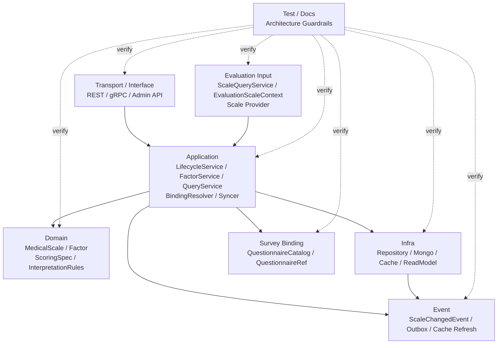

# 05-Scale 模块分层架构与事实源索引

> 本文是 Scale 模块文档的收束篇，聚焦 **Scale 模块的分层架构、事实源索引、修改检查清单与架构护栏**。
>
> 前四篇已经分别说明：Scale 的领域模型、维护链路、查询链路，以及 Scale 与 Evaluation 的测评协作链路。本文不再重复模型细节，而是作为后续维护 Scale 模块时的“地图”：当你修改 Scale 的领域对象、应用服务、查询输出、问卷绑定、测评联动、事件契约或测试时，应该同步检查哪些代码与文档。
>
> 本文的目标不是介绍某一个功能，而是防止 **代码、文档、事件契约、测试和运行时行为发生漂移**。

---

## 1. 结论先行

Scale 模块的事实源不能只看某一个文件。

它由多层共同构成：

```text
Domain        定义 MedicalScale / Factor / ScoringSpec / InterpretationRules 的规则模型和不变量
Application   编排生命周期、因子维护、问卷绑定、查询、事件发布和缓存刷新
Infra         实现持久化、缓存、读模型、事件出站和外部基础设施适配
SurveyBinding 通过 QuestionnaireBindingResolver / QuestionnaireCatalog 读取 Survey 问卷目录事实
EvaluationInput 向 Evaluation 提供 MedicalScale 规则上下文
Event         定义 ScaleChangedEvent 和规则变化出站边界
Test          验证规则模型、应用链路、问卷绑定、测评联动、事件契约和缓存刷新
Docs          解释架构边界、模型语义、链路和维护规则
```

一句话概括：

> **Scale 的核心事实源是 Domain 规则模型；规则维护事实源在 Application；问卷绑定事实源在 Survey Catalog 防腐层；Evaluation 消费事实源在 Scale Query / Evaluation Context；事件契约事实源在 ScaleChangedEvent 与事件配置；测试和文档负责防漂移。**

后续修改 Scale 时，不能只改一个文件。

必须同步检查：

```text
领域模型；
应用服务；
持久化映射；
查询 DTO / Snapshot / ReadModel；
Survey 问卷绑定；
Evaluation 规则消费；
事件契约；
缓存刷新；
测试；
文档。
```

---

## 2. 本文边界

本文重点：

```text
Scale 模块分层架构；
Domain / Application / Infra / Binding / Evaluation / Event / Test / Docs 的事实源索引；
常见修改场景的同步检查清单；
架构护栏；
文档维护规范；
与 interpretation-model 抽象层的关系。
```

本文不展开：

```text
MedicalScale / Factor / ScoringSpec / InterpretationRules 的完整模型解释；
生命周期、因子维护、问卷绑定的详细流程；
Scale 查询服务与读模型细节；
Evaluation 如何执行计分和解释；
Outbox / MQ / Cache 的具体基础设施实现。
```

这些分别由以下文档承接：

```text
01-Scale模型--MedicalScale-Factor-Interpretion 模型设计.md
02-Scale 维护链路--生命周期-因子维护-问卷绑定.md
03-Scale 查询链路--查询服务与读模型.md
04-Scale 测评链路--Scale与Evaluation联动详解.md
../interpretation-model/README.md
../evaluation/README.md
```

---

## 3. Scale 分层总览

Scale 模块可以按以下层次理解：



核心原则：

```text
Transport 负责协议适配，不拥有规则事实；
Application 负责编排用例，不吞掉领域不变量；
Domain 负责规则语义和不变量；
Infra 负责存储、缓存和出站实现，不决定业务语义；
Survey Binding 只读取问卷目录事实，不持有 Survey 聚合；
Evaluation Input 只消费规则，不重新定义规则；
Event 负责规则变化出站，不表达 Evaluation 已执行；
Test / Docs 负责防漂移。
```

---

## 4. Domain 层事实源

Domain 层是 Scale 的核心事实源。

它定义：

```text
什么是 MedicalScale；
什么是 Factor；
什么是 ScoringSpec；
什么是 InterpretationRules；
什么是 InterpretationRule；
什么是 RiskLevel；
什么是 ScaleChangedEvent；
什么规则可以修改；
什么规则必须冻结；
什么状态可以流转；
发布前必须满足哪些不变量。
```

Domain 层应回答：

```text
这份量表规则是什么？
它基于哪份 QuestionnaireVersion？
它处于 draft / published / archived 哪种状态？
是否允许修改规则？
FactorCode 是否唯一？
总分因子是否唯一？
InterpretationRules 是否合法？
规则变化后产生什么领域事件？
```

Domain 层不应回答：

```text
REST DTO 如何返回；
Mongo 文档如何映射；
Redis 缓存如何刷新；
AnswerSheet 如何提交；
FactorScore 如何保存；
Report 如何生成；
Worker 如何重试。
```

---

## 5. Domain 层代码事实源

Domain 层代码应重点关注以下文件或目录。

```text
internal/apiserver/domain/ruleset/scale/definition/medical_scale.go
internal/apiserver/domain/ruleset/scale/definition/lifecycle.go
internal/apiserver/domain/ruleset/scale/definition/baseinfo.go
internal/apiserver/domain/ruleset/scale/definition/factor.go
internal/apiserver/domain/ruleset/scale/definition/scoring_spec.go
internal/apiserver/domain/ruleset/scale/definition/interpretation_rules.go
internal/apiserver/domain/ruleset/scale/definition/interpretation_rule.go
internal/apiserver/domain/ruleset/scale/definition/types.go
internal/apiserver/domain/ruleset/scale/definition/errors.go
internal/apiserver/domain/ruleset/scale/definition/events.go
internal/apiserver/domain/ruleset/scale/definition/validator.go
```

如果当前代码文件名与上面不完全一致，应以实际代码为准。

但事实源归类不变：

```text
MedicalScale 聚合根与行为；
Factor 规则实体；
ScoringSpec 计分值对象；
InterpretationRules 解读规则集合；
RiskLevel 与类型枚举；
ScaleChangedEvent；
发布校验器；
领域错误。
```

---

## 6. Domain 层维护原则

修改 Domain 层时必须守住以下原则。

### 6.1 MedicalScale 是聚合根

外部只能通过 MedicalScale 行为修改规则。

不建议：

```go
scale.Factors[i].ScoringSpec = newSpec
scale.Factors = append(scale.Factors, factor)
scale.Status = StatusPublished
```

应通过：

```go
scale.AddFactor(factor)
scale.UpdateFactor(factorCode, updatedFactor)
scale.ReplaceFactors(factors)
scale.Publish(now)
scale.Archive(now)
```

### 6.2 Factor 是规则，不是结果

`Factor` 是规则实体。

`FactorScore` 才是某次测评结果。

Scale 不应出现 `FactorScore` 存储字段。

### 6.3 ScoringSpec 是规则，不是计算器

`ScoringSpec` 定义如何计算。

`ScoreCalculationEngine` 才执行计算。

Scale 不应该读取 AnswerSheet 计算得分。

### 6.4 InterpretationRules 是规则，不是解释结果

`InterpretationRules` 定义区间和解释文案。

`InterpretationResult` 是某次测评命中的结果。

Scale 不应保存运行时命中结果。

### 6.5 published / archived 规则冻结

发布态和归档态不能修改规则字段。

包括：

```text
QuestionnaireCode；
QuestionnaireVersion；
Factors；
Factor.QuestionCodes；
Factor.ScoringSpec；
Factor.InterpretationRules；
RiskLevel。
```

---

## 7. Application 层事实源

Application 层是 Scale 的用例编排事实源。

它负责把外部命令组织为领域模型协作。

Application 层应回答：

```text
如何创建 MedicalScale；
如何更新基础展示信息；
如何更新 Questionnaire binding；
如何添加 / 修改 / 删除 / 替换 Factor；
如何发布 / 取消发布 / 归档 / 删除 MedicalScale；
如何查询 MedicalScale 给后台或 Evaluation 使用；
如何发布聚合事件；
如何刷新缓存或读模型。
```

Application 层不应回答：

```text
FactorCode 是否唯一的最终判断；
发布态规则能否编辑的最终判断；
InterpretationRules 区间是否重叠的最终判断；
Mongo 如何存储；
Evaluation 如何保存 FactorScore；
Report 如何排版。
```

这些分别属于 Domain、Infra、Evaluation。

---

## 8. Application 层代码事实源

Application 层代码应重点关注以下文件或目录。

```text
internal/apiserver/application/scale/lifecycle_service.go
internal/apiserver/application/scale/lifecycle_creation_workflow.go
internal/apiserver/application/scale/lifecycle_basic_info_workflow.go
internal/apiserver/application/scale/factor_service.go
internal/apiserver/application/scale/factor_command_assembler.go
internal/apiserver/application/scale/query_service.go
internal/apiserver/application/scale/converter.go
internal/apiserver/application/scale/questionnaire_binding_resolver.go
internal/apiserver/application/scale/questionnaire_binding_syncer.go
```

如果实际代码文件名有所调整，应以实际仓库为准。

Application 层可按职责拆成：

```text
LifecycleService      生命周期与基础信息维护
FactorService         因子规则维护
QueryService          查询服务与只读视图输出
CommandAssembler      DTO / Command 到领域对象的组装
BindingResolver       问卷绑定校验与解析
BindingSyncer         draft 问卷版本同步
Converter             Snapshot / DTO / ReadModel 转换
EventPublisher        聚合事件发布与缓存刷新
```

---

## 9. LifecycleService 事实源

LifecycleService 负责：

```text
Create；
UpdateBasicInfo；
UpdateQuestionnaire；
Publish；
Unpublish；
Archive；
Delete。
```

它的典型编排步骤是：

```text
1. 接收 command；
2. 校验基础输入；
3. 如果涉及问卷绑定，调用 QuestionnaireBindingResolver；
4. 创建或加载 MedicalScale；
5. 调用领域行为；
6. 保存聚合；
7. 发布 ScaleChangedEvent；
8. 刷新缓存或读模型。
```

LifecycleService 不应该直接绕过 `MedicalScale` 修改内部规则字段。

---

## 10. FactorService 事实源

FactorService 负责：

```text
AddFactor；
UpdateFactor；
RemoveFactor；
ReplaceFactors；
UpdateFactorInterpretRules；
ReplaceInterpretRules。
```

它的典型编排步骤是：

```text
1. 接收 factor command；
2. 加载 MedicalScale；
3. 校验当前状态是否可编辑；
4. 如果 QuestionCodes 变化，调用 BindingResolver 校验；
5. 使用 CommandAssembler 组装 Factor / ScoringSpec / InterpretationRules；
6. 调用 MedicalScale 的因子行为；
7. 保存聚合；
8. 发布事件；
9. 刷新缓存或读模型。
```

规则可编辑性、总分因子唯一、FactorCode 唯一、解释区间合法性，必须由 MedicalScale 保护。

---

## 11. QueryService 事实源

QueryService 负责 Scale 读侧输出。

它服务于：

```text
后台管理；
前台量表展示；
Evaluation 规则解析；
统计与运营；
问卷绑定诊断。
```

查询输出应优先使用：

```text
MedicalScaleSnapshot；
FactorSnapshot；
ScaleQueryDTO；
ScaleListItemDTO；
ScaleDetailDTO；
EvaluationScaleContext；
QuestionnaireBindingView。
```

不建议对外暴露可变领域实体指针。

QueryService 的详细设计由《03-Scale 查询链路--查询服务与读模型.md》承接。

---

## 12. Infra 层事实源

Infra 层负责 Scale 的持久化、缓存、读模型和事件出站实现。

Infra 层应回答：

```text
MedicalScale 如何保存；
Factor / ScoringSpec / InterpretationRules 如何映射到存储；
查询 DTO 如何从存储读取；
缓存如何读写、刷新或失效；
领域事件如何可靠出站；
读模型如何重建。
```

Infra 层不应回答：

```text
MedicalScale 是否允许发布；
Factor 是否合法；
InterpretationRules 是否重叠；
Evaluation 如何计算得分；
Survey 问卷是否适合绑定。
```

这些属于 Domain / Application / Survey Binding / Evaluation。

---

## 13. Infra 层代码事实源

Infra 层代码可按实际仓库结构索引。

典型位置包括：

```text
internal/apiserver/infra/...
internal/apiserver/infra/mongo/...
internal/apiserver/infra/cache/...
internal/apiserver/infra/event/...
internal/apiserver/infra/repository/...
```

重点检查：

```text
Scale Repository 实现；
MedicalScale Mongo / MySQL mapper；
Factor / ScoringSpec / InterpretationRules 映射；
Scale 查询读模型；
Scale 缓存实现；
ScaleChangedEvent Outbox payload；
事件发布适配器。
```

如果代码采用统一 repository 或 store 包，应以实际目录为准，但事实源职责不变。

---

## 14. Survey Binding 事实源

Scale 与 Survey 的协作通过防腐层完成。

Scale 需要读取 Survey 的问卷目录事实，但不应持有 Survey 聚合对象。

Survey Binding 层应回答：

```text
QuestionnaireCode 是否存在；
QuestionnaireVersion 是否存在；
Questionnaire 类型是否适合绑定 MedicalScale；
绑定问卷是否已发布；
Factor.QuestionCodes 是否存在于绑定版本；
draft scale 是否可同步最新 QuestionnaireVersion；
published / archived scale 是否禁止自动同步。
```

Survey Binding 层不应回答：

```text
Questionnaire 内部如何维护；
AnswerSheet 如何提交；
AnswerValue 如何校验；
Evaluation 如何执行。
```

---

## 15. Survey Binding 代码事实源

Survey Binding 相关代码可重点关注：

```text
internal/apiserver/application/scale/questionnaire_binding_resolver.go
internal/apiserver/application/scale/questionnaire_binding_syncer.go
internal/apiserver/domain/survey/questionnaire/...
internal/apiserver/application/survey/...
```

其中 Scale 侧事实源是：

```text
QuestionnaireBindingResolver；
QuestionnaireBindingSyncer；
MedicalScale.QuestionnaireCode / QuestionnaireVersion；
Factor.QuestionCodes 发布前校验；
Scale 与 Survey 的目录查询端口。
```

Survey 侧事实源是：

```text
Questionnaire；
QuestionnaireVersion；
Question；
QuestionType；
SubmissionSpec；
QuestionnaireCatalog。
```

---

## 16. Evaluation Input 事实源

Scale 是 Evaluation 的规则输入源之一。

Evaluation Input 层应回答：

```text
Evaluation 如何加载 MedicalScale；
如何校验 AnswerSheet 与 MedicalScale 的 QuestionnaireRef 一致；
如何读取 Factor / QuestionCodes / ScoringSpec；
如何读取 InterpretationRules；
如何为 ScaleProvider / MedicalScaleEvaluator 提供规则上下文；
如何保证 Evaluation 不持有可变聚合对象。
```

它不应回答：

```text
MedicalScale 内部规则如何编辑；
Scale 如何持久化；
Survey 如何提交答卷；
Report 如何排版；
历史报告是否重算。
```

这些分别属于 Scale、Survey、Evaluation 的其它链路。

---

## 17. Evaluation Input 代码事实源

与 Evaluation 消费 Scale 相关的代码可重点关注：

```text
internal/apiserver/application/scale/query_service.go
internal/apiserver/application/scale/converter.go
internal/apiserver/application/evaluation/...
internal/apiserver/domain/evaluation/...
internal/worker/...
```

如果已经引入或计划引入解释模型抽象，还应关注：

```text
internal/apiserver/application/interpretation/...
internal/apiserver/domain/interpretation/...
internal/apiserver/application/evaluation/provider_registry.go
```

当前设计中，Scale 给 Evaluation 的推荐输出是：

```text
EvaluationScaleContext
MedicalScaleSnapshot
FactorSnapshot
ScoringSpecSnapshot
InterpretationRulesSnapshot
```

Evaluation 不应使用后台展示 DTO 执行测评。

---

## 18. Event / Outbox 事实源

Scale 的规则变化可以产生领域事件。

事件事实源包括：

```text
ScaleChangedEvent；
MedicalScale 聚合事件收集；
Application 层事件发布；
configs/events.yaml；
Outbox payload；
EventPublisher；
Cache refresh consumer；
ReadModel rebuild consumer。
```

事件语义必须稳定：

```text
ScaleChangedEvent 表达规则事实发生变化；
它不表达 Evaluation 已经重新执行；
它不表达历史 Report 已经刷新；
它不表达 AnswerSheet 已提交；
它不表达某个用户风险等级发生变化。
```

如果 ScaleChangedEvent 需要跨进程可靠出站，应使用 Outbox 思路：

```text
业务数据与待发布消息在同一可靠边界落库；
relay 异步发布消息；
消费者幂等处理。
```

这样可以避免双写不一致。

---

## 19. Event 修改检查清单

修改 Scale 事件时，要同步检查：

```text
ScaleChangedEvent 字段；
领域行为是否正确收集事件；
application service 是否发布聚合事件；
Outbox payload；
configs/events.yaml；
cache refresh consumer；
read model rebuild consumer；
Evaluation context cache 是否需要失效；
事件契约测试；
05-Scale模块分层架构与事实源索引.md。
```

不要只改事件结构而不改消费者。

也不要把 Evaluation 执行结果塞进 ScaleChangedEvent。

---

## 20. Cache / ReadModel 事实源

Scale 查询链路可能使用缓存和读模型。

缓存与读模型应服务于：

```text
后台列表查询；
后台详情查询；
前台 published 量表展示；
EvaluationScaleContext 加载；
QuestionnaireBindingView；
热门量表与统计聚合。
```

但缓存和读模型都不是事实源。

事实源仍然是：

```text
MedicalScale 聚合持久化数据。
```

如果缓存、读模型与聚合事实不一致，应以聚合为准，并通过事件或后台任务重建缓存和读模型。

---

## 21. Test 事实源

Scale 测试应覆盖六类。

| 测试类型 | 应覆盖内容 |
| --- | --- |
| Domain tests | MedicalScale 生命周期、规则冻结、FactorCode 唯一、总分因子唯一、ScoringSpec、InterpretationRules |
| Application tests | LifecycleService、FactorService、QueryService、QuestionnaireBindingResolver、Syncer |
| Infra tests | Repository 映射、Mongo / MySQL 持久化、缓存刷新、事件出站 |
| Survey binding tests | QuestionnaireVersion 绑定、draft 同步、published 不同步、QuestionCodes 校验 |
| Evaluation input tests | MedicalScale 加载、QuestionnaireRef 一致性、FactorScore 输入、InterpretationRules 命中 |
| Event tests | ScaleChangedEvent、configs/events.yaml、消费者幂等 |

建议基础测试命令：

```bash
go test ./internal/apiserver/domain/ruleset/scale/definition/...
go test ./internal/apiserver/application/scale/...
go test ./internal/apiserver/application/evaluation/...
go test ./internal/worker/...
```

实际命令以仓库目录为准。

---

## 22. Docs 事实源

重建后的 Scale 文档分为五篇。

```text
README.md
01-Scale模型--MedicalScale-Factor-Interpretion 模型设计.md
02-Scale 维护链路--生命周期-因子维护-问卷绑定.md
03-Scale 查询链路--查询服务与读模型.md
04-Scale 测评链路--Scale与Evaluation联动详解.md
05-Scale模块分层架构与事实源索引.md
```

各文档职责：

| 文档 | 事实主题 |
| --- | --- |
| README.md | Scale 定位、职责边界、文档导航 |
| 01 | MedicalScale / Factor / ScoringSpec / InterpretationRules 模型设计 |
| 02 | 生命周期、因子维护、问卷绑定写侧链路 |
| 03 | QueryService、Snapshot、DTO、ReadModel、缓存查询链路 |
| 04 | Scale 与 Evaluation 的测评执行协作链路 |
| 05 | 分层架构、事实源索引、修改检查清单、架构护栏 |

相关外部文档索引：

```text
docs/02-业务模块/survey/README.md
docs/02-业务模块/evaluation/README.md
docs/02-业务模块/interpretation-model/README.md
docs/03-基础设施/resilience/README.md
```

---

## 23. 修改场景与同步检查清单

以下清单用于防止修改 Scale 时遗漏相关事实源。

---

## 24. 修改 MedicalScale 字段

需要检查：

```text
MedicalScale 聚合；
BaseInfo / Lifecycle；
Repository mapper；
Query DTO / converter；
MedicalScaleSnapshot；
EvaluationScaleContext；
ScaleChangedEvent payload；
后台 API；
缓存 key 与失效逻辑；
README / 01 文档；
相关测试。
```

重点判断：

```text
这个字段是展示字段还是规则字段？
是否影响 Evaluation 执行？
published 下是否允许修改？
是否需要进入 Snapshot？
是否需要进入 ReadModel？
是否需要进入事件 payload？
```

---

## 25. 修改 Factor 模型

需要检查：

```text
Factor；
MedicalScale factor behavior；
FactorSnapshot；
FactorCommandAssembler；
ScoringSpec；
InterpretationRules；
Query DTO；
EvaluationScaleContext；
ScoreCalculationEngine 输入；
AssessmentAnalysisEngine 输入；
01 文档；
02 文档；
04 文档；
测试。
```

重点判断：

```text
FactorCode 唯一性是否受影响？
总分因子唯一性是否受影响？
QuestionCodes 语义是否变化？
Evaluation 是否需要新增字段？
前台是否需要隐藏该字段？
```

---

## 26. 修改 ScoringSpec

需要检查：

```text
ScoringSpec value object；
ScoringParams；
Factor 构造 / 更新；
FactorCommandAssembler；
MedicalScale 发布校验；
Repository mapper；
FactorSnapshot；
EvaluationScaleContext；
ScoreCalculationEngine；
FactorScore 生成逻辑；
01 文档；
02 文档；
04 文档；
测试。
```

重点判断：

```text
是否新增计分策略？
Params 是否需要版本化？
MaxScore 是否需要重新计算？
历史 Assessment 重试是否受影响？
缓存是否需要失效？
```

---

## 27. 修改 InterpretationRules

需要检查：

```text
InterpretationRules；
InterpretationRule；
RiskLevel；
MedicalScale 发布校验；
FactorCommandAssembler；
Repository mapper；
FactorSnapshot；
EvaluationScaleContext；
AssessmentAnalysisEngine；
InterpretationResult；
ReportBuilder；
01 文档；
02 文档；
04 文档；
测试。
```

重点判断：

```text
区间语义是否变化？
是否允许区间缺口？
是否允许默认规则？
同一 score 是否可能命中多条规则？
RiskLevel 是否兼容历史报告？
```

---

## 28. 修改 RiskLevel

需要检查：

```text
RiskLevel 类型定义；
InterpretationRule；
InterpretationRules 校验；
Repository mapper；
Evaluation analysis；
RiskLevelResult；
ReportBuilder；
前端展示颜色 / 文案；
01 文档；
04 文档；
测试。
```

重点判断：

```text
RiskLevel 是规则等级，不是结果；
RiskLevelResult 属于 Evaluation；
新增等级是否影响排序？
旧报告是否还能展示？
```

---

## 29. 修改问卷绑定逻辑

需要检查：

```text
MedicalScale.QuestionnaireCode / QuestionnaireVersion；
BaseInfo.UpdateQuestionnaire；
QuestionnaireBindingResolver；
QuestionnaireBindingSyncer；
Survey QuestionnaireCatalog；
Factor.QuestionCodes 发布前校验；
Evaluation QuestionnaireRef 一致性校验；
QuestionnaireBindingView；
03 文档；
02 文档；
04 文档；
测试。
```

重点判断：

```text
是否允许 latest version？
draft 是否自动同步？
published 是否仍然冻结？
Factor.QuestionCodes 是否仍然有效？
Evaluation 是否会加载错版本规则？
```

---

## 30. 修改 Scale 查询输出

需要检查：

```text
QueryService；
Converter；
ScaleListItemDTO；
ScaleDetailDTO；
PublishedScaleView；
MedicalScaleSnapshot；
EvaluationScaleContext；
ScaleReadModel；
Cache key；
前端调用；
Evaluation 调用；
03 文档；
测试。
```

重点判断：

```text
这个字段是后台展示字段，还是 Evaluation 执行字段？
是否会暴露敏感规则？
是否应该进入前台接口？
是否应该进入 Evaluation context？
是否需要缓存失效？
```

---

## 31. 修改 Scale 与 Evaluation 衔接

需要检查：

```text
ScaleQueryService；
EvaluationScaleContext；
MedicalScaleSnapshot；
ScaleProvider / MedicalScaleEvaluator；
Evaluation application service；
EvaluationEngine；
ScoreCalculationEngine；
AssessmentAnalysisEngine；
AnswerSheet.QuestionnaireRef 校验；
FactorScore 生成逻辑；
InterpretationResult 生成逻辑；
ReportBuilder；
04 文档；
Evaluation 文档；
测试。
```

重点判断：

```text
Evaluation 是否仍只依赖规则快照？
是否把 Scale 的规则复制到了 Evaluation？
是否影响 MBTI 等同级模型接入？
是否需要引入 InterpretationModelRef / Provider？
```

---

## 32. 修改 Scale 事件

需要检查：

```text
ScaleChangedEvent；
领域行为事件收集；
application event publish；
configs/events.yaml；
Outbox payload；
EventPublisher；
worker / cache consumer；
read model rebuild；
Evaluation context cache；
事件契约测试；
05 文档。
```

重点判断：

```text
事件是否仍只表达规则变化？
是否误表达 Evaluation 已执行？
是否影响历史报告？
消费者是否幂等？
事件版本是否需要升级？
```

---

## 33. 修改缓存或读模型

需要检查：

```text
QueryService；
ScaleReadModel；
Cache key；
Cache TTL；
ScaleChangedEvent consumer；
Publish / Unpublish / Archive 失效逻辑；
EvaluationScaleContext cache；
前台 published list cache；
03 文档；
测试。
```

重点判断：

```text
缓存是否可能返回已归档量表？
Evaluation 是否可能读到旧规则？
ReadModel 是否能从 MedicalScale 重建？
事件重复投递是否幂等？
```

---

## 34. 架构护栏

### 34.1 Domain 不依赖 Infra

不允许：

```text
domain/ruleset/scale/definition -> infra/mongo
domain/ruleset/scale/definition -> redis
domain/ruleset/scale/definition -> mq
domain/ruleset/scale/definition -> transport dto
```

Domain 只能表达规则模型、领域行为、领域错误、领域事件。

### 34.2 Application 不直接改聚合内部字段

不建议：

```go
scale.Factors[i].ScoringSpec = xxx
scale.Status = published
scale.QuestionnaireVersion = latest
```

应通过：

```go
MedicalScale.UpdateFactor(...)
MedicalScale.Publish(...)
MedicalScale.UpdateQuestionnaire(...)
MedicalScale.ReplaceFactors(...)
```

### 34.3 Scale 不读取 AnswerSheet

不允许：

```text
scale service -> answersheet repository -> calculate score
```

读取 AnswerSheet 并计算结果属于 Evaluation。

### 34.4 Evaluation 不重新定义规则

不建议：

```text
evaluation pipeline 中硬编码 Factor / ScoreRange / RiskLevel 规则。
```

Evaluation 应消费 Scale 规则快照。

### 34.5 前台不暴露 ScoringSpec

不建议：

```text
小程序接口返回完整 ScoringSpec / InterpretationRules。
```

前台只需要展示信息和问卷入口。

### 34.6 published scale 不自动同步问卷版本

不允许：

```text
Questionnaire 发布新版本 -> 自动修改 published MedicalScale.QuestionnaireVersion。
```

published 是规则事实，必须冻结。

### 34.7 Outbox owner 不应漂移

如果 ScaleChangedEvent 需要可靠出站，Outbox owner 应是创建规则变化事实的服务边界。

在 Scale 中就是：

```text
qs-apiserver Scale application / repository transaction boundary
```

不是 Survey，也不是 Worker。

### 34.8 不把 MBTI 塞进 Scale

不允许：

```text
MedicalScale 增加 MBTIType 字段；
Factor 强行兼容人格维度；
RiskLevel 表达人格类型；
InterpretationRules 生成 MBTI profile。
```

正确方向：

```text
Scale 与 MBTI 都是 Interpretation Model 的具体实现。
Evaluation 通过统一 ModelRef / Provider 接入。
```

---

## 35. 与 interpretation-model 文档的关系

Scale 文档负责解释医学量表模型。

interpretation-model 文档负责解释更高一层抽象：

```text
什么是解释模型；
Scale 与 MBTI 为什么同级；
Evaluation 如何通过 ModelRef 选择解释模型；
Provider / Registry 如何接入不同模型；
新增解释模型需要遵循哪些契约。
```

因此：

```text
Scale 文档不要膨胀成所有解释模型总览；
interpretation-model 文档不要深入 MedicalScale 内部细节；
Evaluation 文档不要复制 Scale 规则模型；
三者通过 ModelRef / Provider / Snapshot 建立边界。
```

建议关系：

```text
interpretation-model
    定义抽象和扩展协议

scale
    实现医学量表解释模型

mbti
    实现人格类型解释模型

evaluation
    消费解释模型并执行测评
```

---

## 36. 常用 Verify 命令

Scale 模块基础验证：

```bash
go test ./internal/apiserver/domain/ruleset/scale/definition/...
go test ./internal/apiserver/application/scale/...
```

Survey 绑定验证：

```bash
go test ./internal/apiserver/domain/survey/...
go test ./internal/apiserver/application/survey/...
go test ./internal/apiserver/application/scale/...
```

Evaluation 联动验证：

```bash
go test ./internal/apiserver/application/evaluation/...
go test ./internal/apiserver/domain/evaluation/...
go test ./internal/worker/...
```

全量验证：

```bash
go test ./...
```

如果仓库目录与命令不完全一致，应以实际 Makefile、CI 配置和模块路径为准。

---

## 37. 小结

Scale 模块分层架构可以用一句话总结：

> **Domain 保存规则语义，Application 编排维护和查询用例，Infra 实现存储与出站，Survey Binding 读取问卷目录事实，Evaluation Input 提供规则快照，Event 表达规则变化，Test / Docs 负责防漂移。**

本文需要建立五个核心认知：

```text
第一，Scale 的核心事实源是 MedicalScale 聚合，不是 DTO、缓存或读模型；
第二，Application 只能编排，不能绕过聚合根破坏领域不变量；
第三，Scale 与 Survey 通过 QuestionnaireCode + QuestionnaireVersion 协作；
第四，Scale 与 Evaluation 通过 EvaluationScaleContext / Snapshot 协作；
第五，Scale 是 Interpretation Model 的医学量表实现，不是所有解释模型的总包。
```

守住这些事实源和护栏，Scale 模块才能在继续演进时保持边界稳定，也能为后续 MBTI、BigFive 等解释模型接入打下清晰基础。
