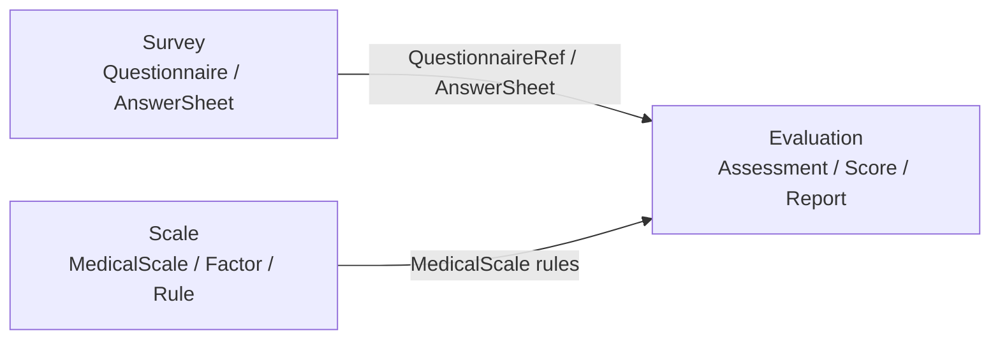
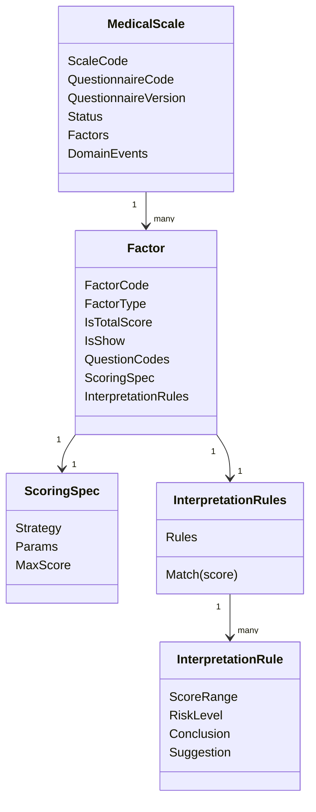

# Scale 模块文档

> Scale 是 qs-server 的医学量表规则域。
>
> 本目录用于说明 Scale 模块如何定义医学量表规则，如何绑定 Survey 问卷版本，如何作为 Evaluation 的规则输入被分数计算引擎与测评分析引擎消费，以及 Scale 模块在 Domain / Application / Infra / Event / Test / Docs 各层的事实源索引。
>
> 本文是 Scale 模块文档入口页，只做模块定位、文档导航、核心边界和阅读路径说明，不展开所有模型细节。

---

## 1. 结论先行

Scale 是 qs-server 的**医学量表规则域**。

它负责回答一个核心问题：

```text
一份医学量表，基于哪份问卷版本，按照什么因子、什么计分规则、什么解读规则来解释答案。
```

Scale 管的是规则事实。

```text
MedicalScale；
Factor；
ScoringSpec；
InterpretationRules；
InterpretationRule；
RiskLevel；
QuestionnaireRef；
ScaleChangedEvent。
```

Scale 不管作答事实，也不管执行结果。

```text
Questionnaire 不属于 Scale；
AnswerSheet 不属于 Scale；
Assessment 不属于 Scale；
FactorScore 不属于 Scale；
RiskLevelResult 不属于 Scale；
InterpretReport 不属于 Scale。
```

一句话概括：

> **Scale 是 MedicalScale 规则事实源，负责定义“怎么算、怎么解释”，不负责保存答卷，也不负责执行测评。**

---

## 2. Scale 在 qs-server 中的位置

qs-server 的测评主线可以拆成三段：

```text
Survey      管“填什么”和“实际填了什么”
Scale       管“怎么算”和“怎么解释”
Evaluation  管“这一次测评执行后的结果”
```

Scale 位于 Survey 与 Evaluation 之间。



Scale 的关键边界是：

```text
从 Survey 读取问卷版本引用；
向 Evaluation 提供规则输入；
自身不保存答卷，也不保存本次测评结果。
```

---

## 3. 文档目录

Scale 模块文档重新整理为五篇。

```text
README.md
01-MedicalScale模型-MedicalScale-Factor-Interpretation.md
02-问卷与量表链路-问卷绑定.md
03-量表与测评链路-分数计算引擎与测评分析引擎.md
04-Scale模块分层架构与事实源索引.md
```

各篇职责如下。

| 文档 | 定位 | 核心问题 |
| --- | --- | --- |
| `README.md` | 模块入口 | Scale 是什么、管什么、不管什么、文档如何阅读 |
| `01-MedicalScale模型-MedicalScale-Factor-Interpretation.md` | 规则模型 | MedicalScale 聚合根、Factor 因子、ScoringSpec、InterpretationRules |
| `02-问卷与量表链路-问卷绑定.md` | Survey 协作链路 | Scale 为什么绑定 QuestionnaireCode + QuestionnaireVersion，Factor.QuestionCodes 如何引用题目 |
| `03-量表与测评链路-分数计算引擎与测评分析引擎.md` | Evaluation 协作链路 | Evaluation 如何消费 MedicalScale，分数计算引擎与测评分析引擎如何使用 Scale 规则 |
| `04-Scale模块分层架构与事实源索引.md` | 维护索引 | Domain / Application / Infra / Event / Test / Docs 的代码事实源和防漂移清单 |

推荐阅读顺序：

```text
README -> 01 -> 02 -> 03 -> 04
```

如果只想快速理解模块：

```text
README.md
04-Scale模块分层架构与事实源索引.md
```

如果要理解主链路：

```text
01-MedicalScale模型-MedicalScale-Factor-Interpretation.md
02-问卷与量表链路-问卷绑定.md
03-量表与测评链路-分数计算引擎与测评分析引擎.md
```

---

## 4. 01 篇：MedicalScale 模型

`01-MedicalScale模型-MedicalScale-Factor-Interpretation.md` 负责说明 Scale 的规则模型。

这一篇聚焦：

```text
MedicalScale 聚合根；
MedicalScale 生命周期；
Factor 因子规则实体；
ScoringSpec 计分规格；
InterpretationRules 解读规则集合；
RiskLevel 规则等级；
规则发布与冻结。
```

核心句子：

> **MedicalScale 是规则聚合根，Factor 定义测量维度，ScoringSpec 定义如何计分，InterpretationRules 定义分数如何解释。**

这一篇不重点讲：

```text
Questionnaire 如何查询；
AnswerSheet 如何提交；
Evaluation 如何执行 pipeline；
Worker 如何消费事件。
```

这些分别由 Survey / Evaluation 文档承接。

---

## 5. 02 篇：问卷与量表链路

`02-问卷与量表链路-问卷绑定.md` 负责说明 Scale 与 Survey 的协作。

这一篇聚焦：

```text
为什么 Scale 必须绑定 QuestionnaireCode + QuestionnaireVersion；
QuestionnaireBindingResolver 如何作为 Survey 防腐层；
Factor.QuestionCodes 如何引用 Survey 中的题目；
draft / published / archived 下问卷版本同步策略；
发布前如何校验 Factor.QuestionCodes 与 QuestionnaireVersion 的一致性。
```

核心句子：

> **Scale 不拥有 Questionnaire，只保存基于确定 QuestionnaireVersion 的规则引用。**

边界：

```text
Survey 管问卷模板和答卷事实；
Scale 管基于问卷版本的量表规则；
二者通过 QuestionnaireRef 协作，不互相持有聚合对象。
```

---

## 6. 03 篇：量表与测评链路

`03-量表与测评链路-分数计算引擎与测评分析引擎.md` 负责说明 Scale 与 Evaluation 的协作。

这一篇聚焦：

```text
Evaluation 如何加载 MedicalScale 规则；
Evaluation 如何校验 AnswerSheet 与 MedicalScale 的 QuestionnaireRef 一致；
分数计算引擎如何消费 Factor / ScoringSpec / QuestionCodes；
测评分析引擎如何消费 InterpretationRules / RiskLevel / Conclusion / Suggestion；
FactorScore / RiskLevelResult / InterpretationResult / Report 为什么属于 Evaluation；
未来 EvaluationModelRef 如何让 MedicalScale 与 MBTI 等模型并列接入。
```

核心句子：

> **Scale 定义规则，Evaluation 执行规则；Factor 是规则，FactorScore 才是结果。**

边界：

```text
ScoringSpec 属于 Scale；
ScoreCalculator 属于 Evaluation；
InterpretationRules 属于 Scale；
InterpretationResult 属于 Evaluation；
Report 属于 Evaluation / ReportBuilder。
```

---

## 7. 04 篇：Scale 模块分层架构与事实源索引

`04-Scale模块分层架构与事实源索引.md` 是维护索引。

这一篇不重复业务模型，而是索引：

```text
Domain 事实源；
Application 事实源；
Infra 事实源；
Survey binding 事实源；
Evaluation input 事实源；
Event / Outbox 事实源；
Test 事实源；
Docs 事实源。
```

核心句子：

> **04 篇不是业务讲解，而是 Scale 模块的维护地图。**

它的目标是防止：

```text
代码改了，文档没改；
规则模型改了，Evaluation 消费没同步；
Questionnaire 绑定改了，Survey 边界没同步；
事件契约改了，Outbox / Worker 没同步。
```

---

## 8. 核心模型关系



模型语义：

```text
MedicalScale 定义一份量表规则；
Factor 定义一个测量维度；
ScoringSpec 定义这个维度如何计分；
InterpretationRules 定义这个维度的分数如何解释；
Evaluation 使用这些规则产出本次测评结果。
```

---

## 9. 与 Survey 的边界

Scale 与 Survey 通过稳定版本引用协作：

```text
MedicalScale.QuestionnaireCode
MedicalScale.QuestionnaireVersion
Factor.QuestionCodes
```

Scale 不直接持有 Survey 的 `Questionnaire / Question / Option` 对象。

原因是：

```text
Questionnaire 是 Survey 聚合；
MedicalScale 是 Scale 聚合；
二者生命周期不同；
发布后的规则必须基于确定问卷版本可追溯。
```

---

## 10. 与 Evaluation 的边界

Evaluation 消费 Scale 规则，但不应该把规则定义散落在执行流程中。

边界表：

| 概念 | Scale | Evaluation |
| --- | --- | --- |
| Factor | 规则定义 | 使用规则 |
| ScoringSpec | 规则定义 | 执行计算 |
| InterpretationRules | 规则定义 | 匹配结果 |
| RiskLevel | 可命中等级 | 本次命中结果 |
| Conclusion / Suggestion | 文案模板 | 本次报告内容来源 |
| FactorScore | 不拥有 | 结果事实 |
| Report | 不生成 | 结果输出 |

---

## 11. 后续演进方向

Scale 后续重点不是继续扩大职责，而是增强规则事实源的可追溯性和多模型接入能力。

建议演进：

```text
ScaleVersion：让 MedicalScale 发布版本成为明确规则事实；
RuleSnapshot：让 Evaluation 保存当时使用的规则快照；
QuestionCode 发布前校验增强：确保 Factor.QuestionCodes 存在于绑定 QuestionnaireVersion；
EvaluationModelRef：让 MedicalScale 与 MBTI / Big Five / DISC 等模型并列接入；
Evaluator 插件化：MedicalScaleEvaluator 只是 Evaluation 的一种执行器。
```

---

## 12. 不建议做的事情

| 不建议 | 原因 |
| --- | --- |
| 把 MBTI 直接塞进 MedicalScale | MBTI 是同级规则模型，不是医学量表子类型 |
| 让 Scale 保存 AnswerSheet | 作答事实属于 Survey |
| 让 Scale 保存 FactorScore | 执行结果属于 Evaluation |
| 让 Scale 生成 Report | 报告属于 Evaluation / ReportBuilder |
| 只绑定 QuestionnaireCode | 无法追溯具体问卷版本 |
| published scale 自动同步问卷版本 | 会破坏已发布规则稳定性 |
| 在 Evaluation 里重新定义 Factor / ScoringSpec | 会让规则散落，Scale 失去事实源地位 |

---

## 13. Verify

Scale 模块常用验证命令：

```bash
go test ./internal/apiserver/domain/scale/...
go test ./internal/apiserver/application/scale/...
```

涉及 Survey 绑定：

```bash
go test ./internal/apiserver/domain/survey/...
go test ./internal/apiserver/application/survey/...
go test ./internal/apiserver/application/scale/...
```

涉及 Evaluation 消费 Scale：

```bash
go test ./internal/apiserver/application/evaluation/...
go test ./internal/worker/...
```

全量质量入口：

```bash
make test
make lint
make docs-hygiene
```

---

## 14. 宣讲口径

### 14.1 30 秒版本

```text
Scale 是 qs-server 的医学量表规则域，不保存答卷，也不生成报告。
它以 MedicalScale 为聚合根，内部包含 Factor、ScoringSpec 和 InterpretationRules。
Factor 定义测量维度和题目映射，ScoringSpec 定义如何计分，InterpretationRules 定义分数区间如何解释。
Scale 通过 QuestionnaireCode + QuestionnaireVersion 绑定 Survey 问卷版本，并作为 Evaluation 的规则输入。
```

### 14.2 3 分钟版本

```text
Scale 模块解决的是“量表规则可信”的问题。

在 qs-server 中，Survey 负责作答事实，Scale 负责医学量表规则，Evaluation 负责执行规则并产出结果。所以 Scale 不保存 AnswerSheet，也不保存 FactorScore 或 Report。

Scale 的聚合根是 MedicalScale。一份 MedicalScale 绑定一个确定的 QuestionnaireCode 和 QuestionnaireVersion，内部包含多个 Factor。Factor 是规则实体，定义这个维度关联哪些题、是否是总分因子、如何计分、如何解释。

计分规则由 ScoringSpec 收口，它包含 Strategy、Params 和 MaxScore。解读规则由 InterpretationRules 收口，它不是普通数组，而是有集合级不变量的规则集，保证分数区间不重叠，并能根据 score 匹配唯一规则。

Evaluation 会加载 AnswerSheet 和 MedicalScale，先校验二者基于同一 QuestionnaireVersion，再根据 Factor.QuestionCodes 取答案，根据 ScoringSpec 计算 FactorScore，根据 InterpretationRules 命中 RiskLevel 和解读结果，最后生成报告。
```

### 14.3 高频追问

| 追问 | 回答要点 |
| --- | --- |
| Scale 的核心职责是什么？ | 定义医学量表规则，作为 Evaluation 的规则输入 |
| MedicalScale 是什么？ | Scale 的规则聚合根 |
| Factor 是什么？ | MedicalScale 内部的因子规则实体 |
| ScoringSpec 是什么？ | 计分规格，定义策略、参数和最大分 |
| InterpretationRules 是什么？ | 解读规则集合，定义分数区间到风险等级和建议的映射 |
| 为什么绑定 QuestionnaireVersion？ | 保证规则基于确定问卷版本，可追溯 |
| FactorScore 属于 Scale 吗？ | 不属于，FactorScore 是 Evaluation 结果 |
| MBTI 应该放进 Scale 吗？ | 不应该，应作为同级规则模型通过 EvaluationModelRef 接入 |

---

## 15. 最终判断

Scale 模块的新文档结构应围绕四条主线展开：

```text
规则模型；
问卷绑定链路；
测评执行链路；
分层事实源索引。
```

这样比旧的多篇细拆更清楚。

它能稳定表达：

```text
Scale 自己是什么；
Scale 如何绑定 Survey；
Scale 如何被 Evaluation 消费；
Scale 后续如何维护不漂移。
```

一句话收束：

> **Scale 的边界守住了，Evaluation 才能成为通用测评执行引擎；Scale 文档收束后，MBTI、Big Five 等新模型也能以同级规则域接入，而不是把 MedicalScale 改成大而全的规则中心。**
