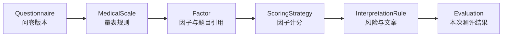
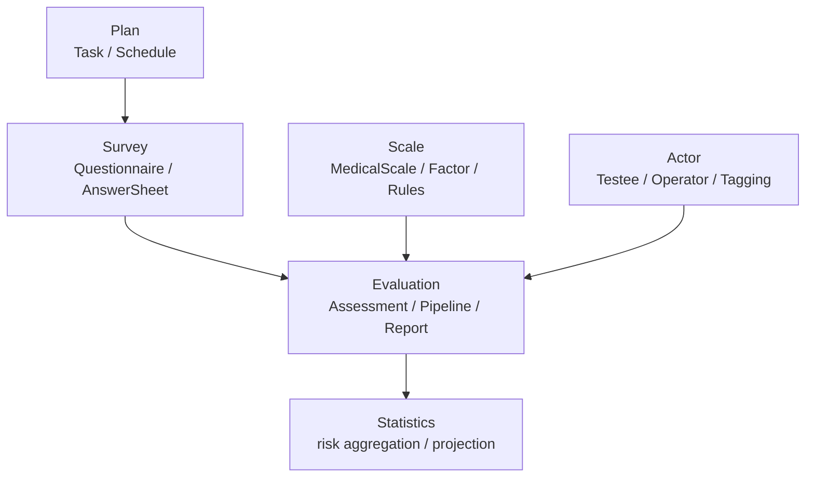

# Scale 深讲阅读地图

**本文回答**：`scale` 子目录这一组文档应该如何阅读；Scale 模块负责什么、不负责什么；`MedicalScale`、`Factor`、`InterpretationRule`、因子计分、Evaluation 衔接和新增规则 SOP 分别应该去哪里看。

---

## 30 秒结论

| 维度 | 结论 |
| ---- | ---- |
| 模块定位 | `scale` 是 qs-server 的**量表规则域**，负责量表基本信息、分类、问卷绑定、因子、计分策略、解读规则和风险文案 |
| 核心聚合 | `MedicalScale` 是聚合根，`Factor` 是量表内计分维度，`InterpretationRule` 是分数区间到风险/结论/建议的规则值对象 |
| 主链关系 | Survey 产生答卷事实，Scale 提供规则，Evaluation 在 pipeline 中组合二者产出测评结果 |
| 规则边界 | Scale 定义“怎么算、怎么解释”，但不保存某次测评结果，不推进 Assessment 状态，不生成 Report |
| 事件边界 | `scale.changed` 是规则变更通知，不是历史测评自动重算命令 |
| 缓存边界 | Scale 列表缓存只优化读，不是规则权威源 |
| 推荐读法 | 先读整体模型，再读因子计分、风险文案、Evaluation 衔接，最后读新增规则 SOP |
| 事实锚点 | `internal/apiserver/domain/scale`、`application/scale`、`evaluationinput`、`evaluation/engine/pipeline`、`configs/events.yaml` |

一句话概括：

> **Scale 负责维护量表规则事实；Evaluation 在一次测评中消费这些规则；Survey 只提供作答事实。**

---

## 1. Scale 模块负责什么

Scale 模块负责“量表规则”这一类事实。

它要回答：

```text
这个量表是什么？
它适用于什么类别、阶段、人群和填报人？
它绑定哪份问卷、哪个问卷版本？
它有哪些因子？
每个因子关联哪些题目？
每个因子如何计分？
每个分数区间对应什么风险、结论和建议？
```

核心对象如下：

| 对象 | 角色 | 说明 |
| ---- | ---- | ---- |
| `MedicalScale` | 聚合根 | 量表规则集合，一套量表规则的整体一致性入口 |
| `Factor` | 实体 | 量表内的计分维度，持有 questionCodes、scoringStrategy、interpretRules |
| `InterpretationRule` | 值对象 | 分数区间到风险等级、结论、建议的映射 |
| `ScoreRange` | 值对象 | 左闭右开 `[min, max)` 的分数区间 |
| `RiskLevel` | 枚举 | `none / low / medium / high / severe` |
| `ScoringStrategyCode` | 枚举 | 当前包含 `sum / avg / cnt` |
| `ScoringParams` | 值对象 | 计分策略参数，例如 `CntOptionContents` |

---

## 2. Scale 不负责什么

Scale 的边界必须守住。

| 不属于 Scale 的内容 | 应归属 |
| -------------------- | ------ |
| 问卷题型、选项展示、答卷提交、答案值形态 | `survey` |
| 某次 AnswerSheet 的作答事实 | `survey/answersheet` |
| 单题答案级分数计算 | `survey` 的 AnswerSheet scoring |
| 本次 Assessment 状态、失败、重试 | `evaluation` |
| 本次 factor score、total score、risk result | `evaluation` 产出 |
| InterpretReport 的生成和保存 | `evaluation/report` |
| 受试者标签、操作者、治疗师、监护关系 | `actor` |
| 任务开放、过期、完成、通知 | `plan` |
| 风险分布统计、行为投影 | `statistics` |

一句话边界：

```text
Scale 定义规则；
Evaluation 执行规则；
Report 组织结果；
Survey 保存作答事实。
```

---

## 3. 本目录文档地图

```text
scale/
├── README.md
├── 00-整体模型.md
├── 01-规则与因子计分.md
├── 02-解读规则与风险文案.md
├── 03-与Evaluation衔接.md
└── 04-新增量表规则SOP.md
```

| 顺序 | 文档 | 先回答什么 |
| ---- | ---- | ---------- |
| 1 | [00-整体模型.md](./00-整体模型.md) | Scale 的规则域定位、核心模型、生命周期、与 Survey/Evaluation 的边界 |
| 2 | [01-规则与因子计分.md](./01-规则与因子计分.md) | Factor 如何引用题目、如何表达 `sum / avg / cnt` 等因子计分策略 |
| 3 | [02-解读规则与风险文案.md](./02-解读规则与风险文案.md) | 因子分如何映射为风险等级、结论和建议 |
| 4 | [03-与Evaluation衔接.md](./03-与Evaluation衔接.md) | Evaluation 如何通过 snapshot 和 pipeline 消费 Scale 规则 |
| 5 | [04-新增量表规则SOP.md](./04-新增量表规则SOP.md) | 新增因子、计分策略、风险等级、解读字段时按什么流程改 |

---

## 4. 推荐阅读路径

### 4.1 第一次理解 Scale

按顺序读：

```text
00-整体模型
  -> 01-规则与因子计分
  -> 02-解读规则与风险文案
```

读完后应能回答：

1. `MedicalScale` 为什么是聚合根？
2. `Factor` 为什么不是 Evaluation 的临时对象？
3. `InterpretationRule` 为什么属于 Scale 而不是 Report？
4. Scale 为什么不保存本次测评结果？

### 4.2 要改因子或计分策略

读：

```text
01-规则与因子计分
  -> 03-与Evaluation衔接
  -> 04-新增量表规则SOP
```

重点看：

- `questionCodes` 如何与 AnswerSheet / Questionnaire snapshot 对齐。
- `sum / avg / cnt` 当前如何取值。
- `ScaleFactorScorer` 如何被 Evaluation pipeline 调用。
- 新策略是否需要修改 `ScoringParams` 和 `FactorSnapshot`。

### 4.3 要改风险等级或解读文案

读：

```text
02-解读规则与风险文案
  -> 03-与Evaluation衔接
  -> 04-新增量表规则SOP
```

重点看：

- `ScoreRange` 左闭右开区间。
- `RiskLevel` 稳定枚举。
- `InterpretationRule` 与 Report 的边界。
- 修改风险等级是否影响 Actor / Statistics / Notification。

### 4.4 要理解 Scale 与 Evaluation 的关系

读：

```text
03-与Evaluation衔接
  -> ../evaluation/02-EnginePipeline.md
```

重点看：

- Evaluation 运行时使用的是 `ScaleSnapshot`，不是直接修改 `MedicalScale`。
- `FactorScoreHandler` 负责因子分计算。
- `InterpretationHandler` 负责解释生成、Assessment 应用和 Report 保存。
- `scale.changed` 不等于历史评估重算命令。

### 4.5 要新增一个完整量表规则

读：

```text
00-整体模型
  -> 01-规则与因子计分
  -> 02-解读规则与风险文案
  -> 04-新增量表规则SOP
```

并同时检查：

```text
Survey 题目和问卷版本
Evaluation snapshot 和 pipeline
REST/gRPC 契约
Scale repository / mapper
事件和缓存
```

---

## 5. Scale 的主业务轴线



这条轴线说明：

1. Scale 绑定一份 Questionnaire 版本。
2. Scale 通过 Factor 引用题目。
3. Factor 定义如何把题目分数聚合成因子分。
4. InterpretationRule 定义因子分如何解释。
5. Evaluation 消费这些规则并保存本次结果。

---

## 6. 与其它模块的协作



| 方向 | 协作方式 | 边界 |
| ---- | -------- | ---- |
| Survey -> Scale | Scale 绑定 Questionnaire code/version，Factor 引用 questionCodes | Scale 不复制问卷完整结构 |
| Survey -> Evaluation | AnswerSheet 提供作答事实和答案级分数 | Scale 不保存答卷 |
| Scale -> Evaluation | Evaluation 加载 ScaleSnapshot 计算因子分和解释 | Scale 不推进 Assessment 状态 |
| Evaluation -> Report | 使用 Scale 规则输出组织报告 | Report 不重定义风险规则 |
| Evaluation -> Actor | 高风险标签、关注对象 | Scale 不直接打标签 |
| Evaluation -> Statistics | 风险结果进入统计 | Scale 不维护统计读模型 |

---

## 7. Scale 的三条关键链路

### 7.1 量表生命周期链路

```text
Create / Update
  -> Publish
  -> scale.changed
  -> rebuild ScaleListCache
```

对应文档：

- [00-整体模型.md](./00-整体模型.md)
- [03-与Evaluation衔接.md](./03-与Evaluation衔接.md)

### 7.2 因子计分链路

```text
Factor.questionCodes
  -> AnswerSheetSnapshot answer.Score
  -> ScaleFactorScorer
  -> FactorScoreResult
  -> Evaluation totalScore
```

对应文档：

- [01-规则与因子计分.md](./01-规则与因子计分.md)

### 7.3 风险解读链路

```text
FactorScoreResult.rawScore
  -> InterpretRuleSnapshot
  -> riskLevel / conclusion / suggestion
  -> EvaluationResult
  -> InterpretReport
```

对应文档：

- [02-解读规则与风险文案.md](./02-解读规则与风险文案.md)
- [03-与Evaluation衔接.md](./03-与Evaluation衔接.md)

---

## 8. Scale 的事实源

| 事实 | 事实源 |
| ---- | ------ |
| 量表基本信息 | `MedicalScale` |
| 量表状态 | `MedicalScale.status` |
| 问卷绑定 | `questionnaireCode + questionnaireVersion` |
| 因子定义 | `Factor` |
| 计分策略 | `ScoringStrategyCode + ScoringParams` |
| 解读规则 | `InterpretationRule` |
| 风险等级 | `RiskLevel` |
| Scale 事件 | `configs/events.yaml` 中的 `scale.changed` |
| Evaluation 运行输入 | `ScaleSnapshot / FactorSnapshot / InterpretRuleSnapshot` |
| 列表缓存 | `ScaleListCache`，只做读优化 |

原则：

```text
Scale 领域模型是规则事实源；
Evaluation snapshot 是运行时输入；
Redis/cache 是读优化；
Report 是产出，不是规则源。
```

---

## 9. 维护原则

### 9.1 一个事实只在一个地方讲透

| 事实 | 主文档 |
| ---- | ------ |
| Scale 总体边界 | [00-整体模型.md](./00-整体模型.md) |
| 因子和计分策略 | [01-规则与因子计分.md](./01-规则与因子计分.md) |
| 风险文案和解读规则 | [02-解读规则与风险文案.md](./02-解读规则与风险文案.md) |
| Evaluation 消费规则 | [03-与Evaluation衔接.md](./03-与Evaluation衔接.md) |
| 新增/修改规则流程 | [04-新增量表规则SOP.md](./04-新增量表规则SOP.md) |

其它文档只摘要并回链。

### 9.2 规则变更不能绕过 Scale

不要在以下位置硬编码量表规则：

```text
REST handler
worker handler
Evaluation pipeline if/else
Report template
Frontend
Statistics projector
```

规则应先进入 Scale，再由其它模块消费。

### 9.3 scale.changed 不是重算命令

`scale.changed` 是规则变更通知。它可以用于缓存、治理和外部感知，但不能默认为历史 Assessment 重算命令。

历史重算应作为独立能力设计，具备任务、幂等、进度、审计和失败补偿。

---

## 10. 常见误区

### 10.1 “Scale 是 Survey 的附属配置”

错误。Survey 是采集事实，Scale 是规则事实。二者通过 questionnaire code/version 协作。

### 10.2 “FactorScore 属于 Scale”

不准确。Factor 定义属于 Scale；某次 FactorScoreResult 属于 Evaluation 产出。

### 10.3 “InterpretationRule 就是报告文案”

不完全对。InterpretationRule 是规则输出，Report 决定如何组织和展示它。

### 10.4 “修改 Scale 后历史报告应该自动变化”

不一定。历史报告是历史产出事实，是否重算要单独设计补偿机制。

### 10.5 “ScaleListCache 可以作为 Evaluation 的规则输入”

不建议。列表缓存是读优化，不是规则权威输入。Evaluation 应使用 repository / snapshot 解析出的规则。

---

## 11. 代码锚点

### Domain

- MedicalScale：[../../../internal/apiserver/domain/scale/medical_scale.go](../../../internal/apiserver/domain/scale/medical_scale.go)
- Factor：[../../../internal/apiserver/domain/scale/factor.go](../../../internal/apiserver/domain/scale/factor.go)
- InterpretationRule：[../../../internal/apiserver/domain/scale/interpretation_rule.go](../../../internal/apiserver/domain/scale/interpretation_rule.go)
- Scale types：[../../../internal/apiserver/domain/scale/types.go](../../../internal/apiserver/domain/scale/types.go)
- Lifecycle：[../../../internal/apiserver/domain/scale/lifecycle.go](../../../internal/apiserver/domain/scale/lifecycle.go)

### Application

- LifecycleService：[../../../internal/apiserver/application/scale/lifecycle_service.go](../../../internal/apiserver/application/scale/lifecycle_service.go)
- FactorService：[../../../internal/apiserver/application/scale/factor_service.go](../../../internal/apiserver/application/scale/factor_service.go)
- QueryService：[../../../internal/apiserver/application/scale/query_service.go](../../../internal/apiserver/application/scale/query_service.go)

### Evaluation 协作

- evaluationinput：[../../../internal/apiserver/port/evaluationinput/input.go](../../../internal/apiserver/port/evaluationinput/input.go)
- snapshot mapper：[../../../internal/apiserver/infra/evaluationinput/snapshot_mappers.go](../../../internal/apiserver/infra/evaluationinput/snapshot_mappers.go)
- FactorScoreCalculator：[../../../internal/apiserver/application/evaluation/engine/pipeline/factor_score_calculator.go](../../../internal/apiserver/application/evaluation/engine/pipeline/factor_score_calculator.go)
- InterpretationHandler：[../../../internal/apiserver/application/evaluation/engine/pipeline/interpretation.go](../../../internal/apiserver/application/evaluation/engine/pipeline/interpretation.go)

### Contract / Event

- REST contracts：[../../../api/rest/](../../../api/rest/)
- gRPC proto：[../../../internal/apiserver/interface/grpc/proto/](../../../internal/apiserver/interface/grpc/proto/)
- Event catalog：[../../../configs/events.yaml](../../../configs/events.yaml)

---

## 12. Verify

```bash
go test ./internal/apiserver/domain/scale
go test ./internal/apiserver/application/scale
go test ./internal/apiserver/infra/ruleengine
go test ./internal/apiserver/infra/evaluationinput
go test ./internal/apiserver/application/evaluation/engine/pipeline
```

如果修改了 REST/gRPC 契约：

```bash
make docs-rest
make docs-verify
```

如果修改了文档链接或标题：

```bash
make docs-hygiene
```

---

## 13. 下一跳

| 目标 | 文档 |
| ---- | ---- |
| 理解 Scale 整体设计 | [00-整体模型.md](./00-整体模型.md) |
| 理解因子和计分 | [01-规则与因子计分.md](./01-规则与因子计分.md) |
| 理解风险文案 | [02-解读规则与风险文案.md](./02-解读规则与风险文案.md) |
| 理解 Evaluation 消费 Scale | [03-与Evaluation衔接.md](./03-与Evaluation衔接.md) |
| 新增量表规则 | [04-新增量表规则SOP.md](./04-新增量表规则SOP.md) |
| 回看业务模块入口 | [../README.md](../README.md) |
| 理解 Survey 作答事实 | [../survey/README.md](../survey/README.md) |
