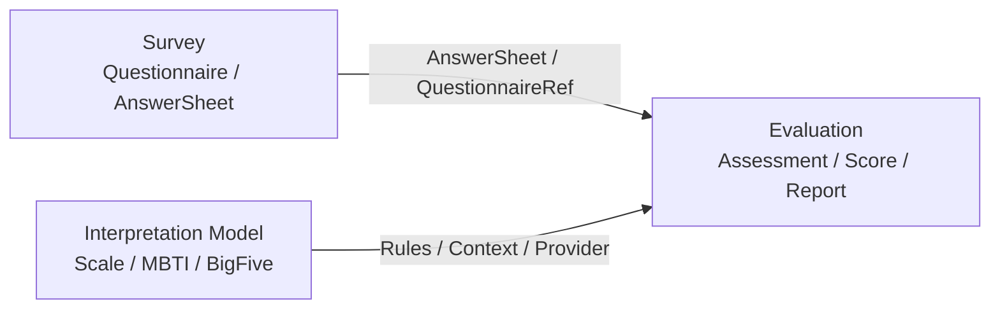
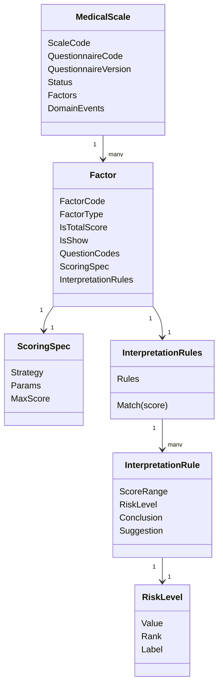

# Scale 模块文档

> Scale 是 qs-server 中的 **医学量表解释模型模块**。
>
> 它负责维护 `MedicalScale` 规则事实：一份医学量表基于哪份问卷版本、包含哪些因子、每个因子如何计分、分数区间如何解释、规则如何发布和冻结。
>
> Scale 不负责答卷提交，不负责测评执行，也不保存测评结果。答卷事实属于 Survey，执行状态与结果事实属于 Evaluation。

---

## 1. 结论先行

Scale 的核心定位是：

> **Scale 是 Interpretation Model 的医学量表实现，是 Evaluation 的规则输入源，不是测评执行引擎。**

在当前 qs-server 中，Scale 负责医学量表规则。

它回答：

```text
这是一份什么医学量表？
它基于哪份 QuestionnaireVersion？
它包含哪些 Factor？
每个 Factor 读取哪些 QuestionCode？
每个 Factor 如何根据答案计分？
每个 Factor 的分数如何命中解释规则？
发布后的规则如何冻结和追溯？
```

它不回答：

```text
用户提交了什么答案？
某次测评实际算出了多少分？
某次测评命中了什么风险等级？
某次测评报告如何保存？
某次测评失败后如何重试？
```

这些分别属于 Survey 与 Evaluation。

---

## 2. Scale 在 qs-server 中的位置

从完整测评链路看，qs-server 可以拆成三段：

```text
Survey      管“问卷如何定义、用户提交了什么答卷事实”
Scale       管“医学量表如何根据答卷进行计分和解释”
Evaluation  管“一次测评如何执行、如何保存结果、如何生成报告”
```

更面向未来的表达是：

```text
Survey                作答事实层
Interpretation Model  解释模型层
Evaluation            通用测评执行层
```

在这个体系里：

```text
Scale 是医学量表解释模型；
MBTI 是未来的人格类型解释模型；
BigFive / 职业兴趣测评也可以作为新的解释模型；
Evaluation 通过统一 ModelRef / Provider 加载不同解释模型。
```

关系可以表示为：



Scale 只是 `Interpretation Model` 的一种具体实现，不应该膨胀成所有解释模型的总包。

---

## 3. Scale 管什么

Scale 管的是医学量表规则事实。

核心对象包括：

```text
MedicalScale          医学量表规则聚合根
Factor                因子规则实体
ScoringSpec           因子计分规格
ScoringParams         计分参数
InterpretationRules   因子解读规则集合
InterpretationRule    单条分数区间解读规则
RiskLevel             规则中的风险等级
QuestionnaireRef      问卷版本引用
ScaleChangedEvent     规则变化领域事件
```

一句话概括：

> **MedicalScale 定义一份医学量表规则；Factor 定义测量维度；ScoringSpec 定义如何计分；InterpretationRules 定义分数如何解释。**

---

## 4. Scale 不管什么

Scale 不保存作答事实。

```text
Questionnaire 不属于 Scale；
Question 不属于 Scale；
Option 不属于 Scale；
AnswerSheet 不属于 Scale；
Answer 不属于 Scale；
AnswerValue 不属于 Scale。
```

这些属于 Survey。

Scale 也不保存执行结果。

```text
Assessment 不属于 Scale；
EvaluationRun 不属于 Scale；
FactorScore 不属于 Scale；
TotalScore 不属于 Scale；
RiskLevelResult 不属于 Scale；
InterpretationResult 不属于 Scale；
InterpretReport 不属于 Scale。
```

这些属于 Evaluation。

必须记住：

```text
Factor 是规则，FactorScore 才是结果；
ScoringSpec 是规则，ScoreCalculationEngine 才执行计算；
InterpretationRule 是规则，InterpretationResult 才是命中结果；
RiskLevel 是规则等级，RiskLevelResult 才是某次命中事实；
MedicalScale 是规则聚合，Assessment 是执行聚合。
```

---

## 5. 文档目录

Scale 模块文档重建为五篇。

```text
README.md
01-Scale模型--MedicalScale-Factor-Interpretion 模型设计.md
02-Scale 维护链路--生命周期-因子维护-问卷绑定.md
03-Scale 查询链路--查询服务与读模型.md
04-Scale 测评链路--Scale与Evaluation联动详解.md
05-Scale模块分层架构与事实源索引.md
```

各篇职责如下：

| 文档 | 核心主题 |
| --- | --- |
| `README.md` | Scale 定位、边界、文档导航 |
| `01` | MedicalScale / Factor / ScoringSpec / InterpretationRules 模型设计 |
| `02` | 生命周期、因子维护、问卷绑定写侧链路 |
| `03` | QueryService、Snapshot、DTO、ReadModel、缓存查询链路 |
| `04` | Scale 与 Evaluation 的测评执行协作链路 |
| `05` | 分层架构、事实源索引、修改检查清单、架构护栏 |

推荐阅读顺序：

```text
READM -> 01 -> 02 -> 03 -> 04 -> 05
```

如果只想快速理解 Scale 的边界：

```text
README.md
01-Scale模型--MedicalScale-Factor-Interpretion 模型设计.md
04-Scale 测评链路--Scale与Evaluation联动详解.md
```

如果要维护 Scale 代码：

```text
02-Scale 维护链路--生命周期-因子维护-问卷绑定.md
03-Scale 查询链路--查询服务与读模型.md
05-Scale模块分层架构与事实源索引.md
```

---

## 6. 01 篇：Scale 模型设计

`01-Scale模型--MedicalScale-Factor-Interpretion 模型设计.md` 负责讲清楚 Scale 的领域模型。

这一篇聚焦：

```text
MedicalScale 聚合根；
MedicalScale 生命周期；
QuestionnaireRef 稳定绑定；
Factor 因子规则实体；
ScoringSpec 计分规格；
InterpretationRules 解读规则集合；
InterpretationRule 单条规则；
RiskLevel 风险等级；
ScaleChangedEvent 领域事件；
Scale 作为 Interpretation Model 的定位。
```

核心句子：

> **Scale 是医学量表解释规则域，MedicalScale 是规则聚合根，Factor / ScoringSpec / InterpretationRules 是其内部规则对象，Evaluation 只消费规则并保存执行结果。**

这一篇解决的是：

```text
Scale 内部到底有哪些模型？
为什么 MedicalScale 是聚合根？
Factor 和 FactorScore 有什么区别？
RiskLevel 和 RiskLevelResult 有什么区别？
为什么 Scale 不能保存测评结果？
```

---

## 7. 02 篇：Scale 维护链路

`02-Scale 维护链路--生命周期-因子维护-问卷绑定.md` 负责讲清楚 Scale 的写侧维护流程。

这一篇聚焦：

```text
Create / UpdateBasicInfo / Publish / Unpublish / Archive / Delete；
AddFactor / UpdateFactor / RemoveFactor / ReplaceFactors；
UpdateInterpretRules / ReplaceInterpretRules；
QuestionnaireBindingResolver；
QuestionnaireBindingSyncer；
draft / published / archived 下的维护规则差异；
ScaleChangedEvent 与缓存刷新；
写侧事务边界。
```

核心句子：

> **Application 编排生命周期、因子维护和问卷绑定流程；Domain 通过 MedicalScale 聚合保护规则一致性。**

这一篇解决的是：

```text
如何创建一份 MedicalScale？
发布前要校验什么？
为什么 published scale 不能自动同步问卷版本？
为什么不能在 application service 中直接修改 scale.Factors？
FactorService 与 MedicalScale 聚合如何协作？
```

---

## 8. 03 篇：Scale 查询链路

`03-Scale 查询链路--查询服务与读模型.md` 负责讲清楚 Scale 的读侧设计。

这一篇聚焦：

```text
Scale QueryService；
MedicalScaleSnapshot；
FactorSnapshot；
ScaleQueryDTO；
ScaleListItemDTO；
ScaleDetailDTO；
PublishedScaleView；
EvaluationScaleContext；
ScaleReadModel；
缓存与读模型刷新。
```

核心句子：

> **QueryService 根据调用场景输出不同的只读视图：后台管理使用 DTO，前台展示使用 Published View，Evaluation 使用规则快照，统计运营使用 ReadModel。**

这一篇解决的是：

```text
为什么不直接返回 MedicalScale 聚合？
Snapshot / DTO / ReadModel 有什么区别？
后台管理、前台展示、Evaluation 分别需要什么查询输出？
Evaluation 为什么不能使用后台 DTO 执行测评？
缓存和读模型为什么不是事实源？
```

---

## 9. 04 篇：Scale 测评链路

`04-Scale 测评链路--Scale与Evaluation联动详解.md` 负责讲清楚 Scale 如何被 Evaluation 消费。

这一篇聚焦：

```text
Scale 与 Evaluation 的职责边界；
Evaluation 如何定位 Scale；
EvaluationScaleContext；
AnswerSheet 与 MedicalScale 的 QuestionnaireRef 一致性校验；
ScoreCalculationEngine 如何消费 ScoringSpec；
AssessmentAnalysisEngine 如何消费 InterpretationRules；
FactorScore / RiskLevelResult / InterpretationResult / InterpretReport 的归属；
ScaleChangedEvent 与 AssessmentInterpretedEvent 的区别；
Scale 与 MBTI 作为 Interpretation Model 的同级关系。
```

核心句子：

> **Scale 提供医学量表解释规则，Evaluation 加载答卷事实和 Scale 规则快照，完成一次测评执行、结果保存、报告生成和失败重试。**

这一篇解决的是：

```text
Evaluation 为什么需要 Scale？
Evaluation 执行前为什么要校验问卷版本一致？
ScoringSpec 属于谁？
FactorScore 属于谁？
ScaleChangedEvent 是否触发历史报告重算？
MBTI 为什么不应该塞进 Scale？
```

---

## 10. 05 篇：Scale 分层架构与事实源索引

`05-Scale模块分层架构与事实源索引.md` 是 Scale 模块的维护地图。

这一篇聚焦：

```text
Domain 事实源；
Application 事实源；
Infra 事实源；
Survey Binding 事实源；
Evaluation Input 事实源；
Event / Outbox 事实源；
Cache / ReadModel 事实源；
Test 事实源；
Docs 事实源；
修改场景同步检查清单；
架构护栏。
```

核心句子：

> **Domain 保存规则语义，Application 编排维护和查询用例，Infra 实现存储与出站，Survey Binding 读取问卷目录事实，Evaluation Input 提供规则快照，Event 表达规则变化，Test / Docs 负责防漂移。**

这一篇解决的是：

```text
修改 MedicalScale 字段要同步检查什么？
修改 Factor 要同步检查什么？
修改 ScoringSpec / InterpretationRules 要同步检查什么？
修改问卷绑定、查询输出、事件、缓存要同步检查什么？
Scale 模块有哪些架构护栏？
Scale 文档与 interpretation-model 文档如何分工？
```

---

## 11. 核心模型关系



模型语义：

```text
MedicalScale 定义一份医学量表规则；
Factor 定义一个测量维度；
ScoringSpec 定义这个维度如何计分；
InterpretationRules 定义这个维度的分数如何解释；
RiskLevel 定义规则命中后的风险等级；
Evaluation 使用这些规则产出本次测评结果。
```

---

## 12. 与 Survey 的边界

Scale 与 Survey 通过稳定版本引用协作：

```text
MedicalScale.QuestionnaireCode
MedicalScale.QuestionnaireVersion
Factor.QuestionCodes
```

Scale 不直接持有 Survey 的：

```text
Questionnaire；
Question；
Option；
SubmissionSpec；
AnswerSheet。
```

原因是：

```text
Questionnaire 是 Survey 聚合；
MedicalScale 是 Scale 聚合；
二者生命周期不同；
发布后的 Scale 规则必须基于确定问卷版本可追溯。
```

如果 Survey 发布新问卷版本：

```text
draft scale 可以经过校验后同步；
published scale 不能自动同步；
archived scale 只用于历史追溯。
```

---

## 13. 与 Evaluation 的边界

Evaluation 消费 Scale 规则，但不拥有 Scale 规则。

边界表：

| 概念 | Scale | Evaluation |
| --- | --- | --- |
| MedicalScale | 规则聚合 | 规则输入 |
| Factor | 规则实体 | 执行输入 |
| ScoringSpec | 计分规则 | 执行计算 |
| InterpretationRules | 解读规则 | 匹配结果 |
| RiskLevel | 规则等级 | 命中等级结果 |
| FactorScore | 不拥有 | 结果事实 |
| InterpretationResult | 不拥有 | 结果事实 |
| InterpretReport | 不生成 | 结果输出 |

关键边界：

```text
Scale 不读取 AnswerSheet；
Scale 不推进 Assessment 状态机；
Scale 不保存 FactorScore；
Scale 不生成 InterpretReport；
Evaluation 不重新定义 Factor / ScoringSpec / InterpretationRules；
Evaluation 只消费 Scale 的规则快照。
```

---

## 14. 与 interpretation-model 的边界

Scale 文档只负责医学量表模型。

`interpretation-model` 文档负责更高层抽象：

```text
什么是解释模型；
Scale 与 MBTI 为什么同级；
Evaluation 如何通过 ModelRef 选择解释模型；
Provider / Registry 如何接入不同模型；
新增解释模型需要遵循哪些契约。
```

推荐关系：

```text
interpretation-model
    定义解释模型抽象和扩展协议

scale
    实现医学量表解释模型

mbti
    实现人格类型解释模型

evaluation
    消费解释模型并执行测评
```

因此，不要把 MBTI 塞进 Scale。

正确方向是：

```text
Scale 与 MBTI 都是 Interpretation Model 的具体实现；
Evaluation 通过统一 ModelRef / Provider 加载不同模型；
各模型只维护自己的规则语义。
```

---

## 15. 核心架构护栏

### 15.1 Scale 不保存答卷事实

```text
AnswerSheet 属于 Survey。
```

### 15.2 Scale 不保存执行结果

```text
FactorScore / RiskLevelResult / InterpretationResult / InterpretReport 属于 Evaluation。
```

### 15.3 Application 不绕过聚合根

不建议：

```go
scale.Factors[i].ScoringSpec = xxx
scale.Status = published
scale.QuestionnaireVersion = latest
```

应通过：

```go
scale.UpdateFactor(...)
scale.Publish(...)
scale.UpdateQuestionnaire(...)
```

### 15.4 published scale 规则冻结

不允许：

```text
Questionnaire 发布新版本 -> 自动修改 published MedicalScale.QuestionnaireVersion。
```

### 15.5 Evaluation 不复制 Scale 规则

不建议：

```text
Evaluation pipeline 中硬编码 Factor / ScoreRange / RiskLevel 规则。
```

Evaluation 应通过 Snapshot / EvaluationScaleContext 消费规则。

### 15.6 前台不暴露 ScoringSpec

前台只需要展示信息和问卷入口，不应暴露完整计分权重和解释区间。

### 15.7 Cache / ReadModel 不是事实源

事实源仍然是持久化的 MedicalScale 聚合。

缓存和读模型必须可以被重建。

---

## 16. 后续演进方向

Scale 模块后续演进重点不是扩大职责，而是增强规则事实源的稳定性和可追溯性。

建议方向：

```text
ScaleVersion：让 MedicalScale 发布版本成为明确规则事实；
RuleSnapshot：让 Evaluation 保存当时使用的规则快照；
QuestionCode 发布前校验增强：确保 Factor.QuestionCodes 存在于绑定 QuestionnaireVersion；
EvaluationScaleContext 标准化：统一 Evaluation 消费规则的输入结构；
InterpretationModelRef：让 Scale 与 MBTI / BigFive 等模型并列接入；
Provider 插件化：ScaleProvider 只是 Evaluation 的一种解释模型提供者。
```

---

## 17. Verify

Scale 模块基础验证：

```bash
go test ./internal/apiserver/domain/authoring/scale/...
go test ./internal/apiserver/domain/evaluation/scaleinterpretation/...
go test ./internal/apiserver/application/scale/...
```

涉及 Survey 绑定：

```bash
go test ./internal/apiserver/domain/survey/...
go test ./internal/apiserver/application/survey/...
go test ./internal/apiserver/application/scale/...
```

涉及 Evaluation 消费 Scale：

```bash
go test ./internal/apiserver/application/evaluation/...
go test ./internal/apiserver/domain/evaluation/...
go test ./internal/worker/...
```

全量验证：

```bash
go test ./...
make test
make lint
```

具体命令以仓库 Makefile 和 CI 配置为准。

---

## 18. 宣讲口径

### 18.1 30 秒版本

```text
Scale 是 qs-server 的医学量表解释模型模块，不保存答卷，也不保存测评结果。
它以 MedicalScale 为聚合根，内部包含 Factor、ScoringSpec 和 InterpretationRules。
Factor 定义测量维度和题目映射，ScoringSpec 定义如何计分，InterpretationRules 定义分数区间如何解释。
Scale 通过 QuestionnaireCode + QuestionnaireVersion 绑定 Survey 问卷版本，并作为 Evaluation 的规则输入。
```

### 18.2 3 分钟版本

```text
Scale 模块解决的是“医学量表规则可信、可追溯”的问题。

在 qs-server 中，Survey 负责问卷和答卷事实，Scale 负责医学量表规则，Evaluation 负责执行测评并产出结果。所以 Scale 不保存 AnswerSheet，也不保存 FactorScore 或 InterpretReport。

Scale 的聚合根是 MedicalScale。一份 MedicalScale 绑定一个确定的 QuestionnaireCode 和 QuestionnaireVersion，内部包含多个 Factor。Factor 是规则实体，定义这个维度关联哪些题、是否是总分因子、如何计分、如何解释。

计分规则由 ScoringSpec 收口，它包含计分策略和参数。解读规则由 InterpretationRules 收口，它不是普通数组，而是有集合级不变量的规则集，保证分数区间合法，并能根据 score 匹配解释规则。

Evaluation 会加载 AnswerSheet 和 MedicalScale 规则快照，先校验二者基于同一 QuestionnaireVersion，再根据 Factor.QuestionCodes 取答案，根据 ScoringSpec 计算 FactorScore，根据 InterpretationRules 命中 RiskLevel 和解释结果，最后生成报告。

下一阶段支持 MBTI 时，不应该把 MBTI 塞进 Scale，而应该抽象 interpretation-model，让 Scale 和 MBTI 作为同级解释模型接入 Evaluation。
```

### 18.3 高频追问

| 追问 | 回答要点 |
| --- | --- |
| Scale 的核心职责是什么？ | 定义医学量表解释规则，作为 Evaluation 的规则输入 |
| MedicalScale 是什么？ | Scale 的规则聚合根 |
| Factor 是什么？ | MedicalScale 内部的因子规则实体 |
| ScoringSpec 是什么？ | 计分规格，定义计分策略和参数 |
| InterpretationRules 是什么？ | 解读规则集合，定义分数区间到风险等级和建议的映射 |
| 为什么绑定 QuestionnaireVersion？ | 保证规则基于确定问卷版本，可追溯 |
| FactorScore 属于 Scale 吗？ | 不属于，FactorScore 是 Evaluation 的执行结果 |
| ScaleChangedEvent 表示测评完成了吗？ | 不表示，它只表示规则发生变化 |
| MBTI 应该放进 Scale 吗？ | 不应该，应作为同级解释模型通过 InterpretationModelRef / Provider 接入 |

---

## 19. 最终判断

Scale 模块文档的目标不是把 Scale 写成一个大而全的测评中心，而是守住它作为医学量表解释模型的边界。

它的文档主线是：

```text
模型设计；
维护链路；
查询链路；
测评联动；
事实源索引。
```

这样可以稳定表达：

```text
Scale 自己是什么；
Scale 如何维护规则；
Scale 如何提供查询视图；
Scale 如何被 Evaluation 消费；
Scale 后续如何维护不漂移。
```

一句话收束：

> **Scale 的边界守住了，Evaluation 才能成为通用测评执行引擎；Scale 与 MBTI 等解释模型也才能以同级模型接入，而不是把 MedicalScale 改成大而全的规则中心。**
