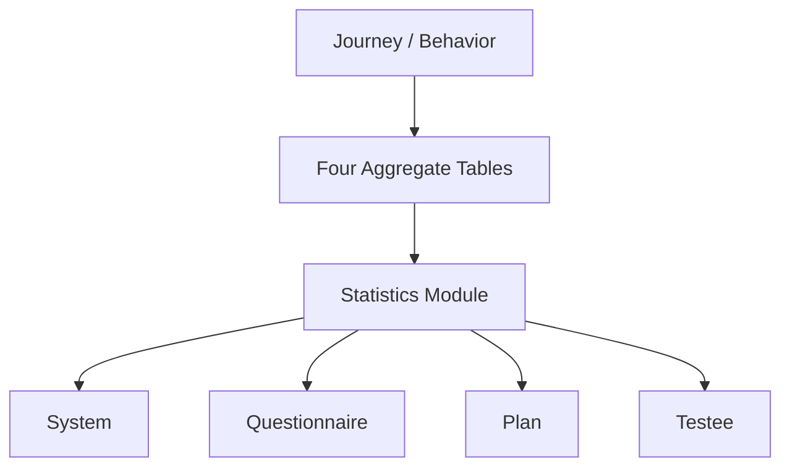
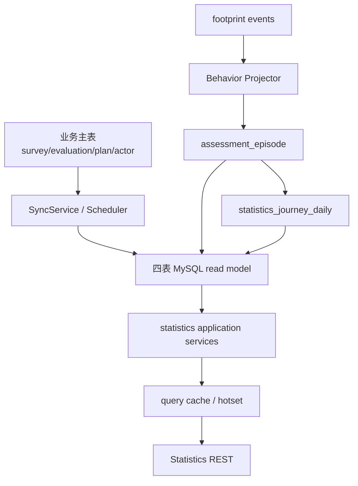

# Statistics 整体模型

**本文回答**：statistics 模块负责哪些读侧统计，不负责哪些业务写事实。

## 30 秒结论

| 类型 | 当前说明 |
| ---- | -------- |
| System statistics | 机构级系统概览 |
| Questionnaire statistics | 问卷维度统计 |
| Plan statistics | 计划与任务执行统计 |
| Testee statistics | 受试者统计和周期统计 |
| Journey / behavior | 行为足迹和投影提供分析输入 |
| Aggregates | 四张 MySQL 聚合表承载运行时统计读模型 |



## 边界

- statistics 不是业务写模型，不能替代 survey/evaluation/plan 的主状态。
- statistics query cache 不是统计事实来源。
- worker 不再写 Redis daily/window/accumulated 统计中转。
- 当前 MySQL 聚合层收敛为 `statistics_journey_daily`、`statistics_content_daily`、`statistics_plan_daily`、`statistics_org_snapshot` 四张表；旧 `statistics_daily / statistics_accumulated / statistics_plan` 和拆散的 `analytics_*_daily` 不再作为运行时读写入口，并由 `000028_drop_legacy_statistics_read_models` 物理删表。

## 模块要解决什么问题

Statistics 解决的是“高频读侧聚合”问题。主业务表适合承载权威写入，但不适合每次请求都跨 Survey、Evaluation、Plan、Actor 做实时聚合。因此 Statistics 以 read model、同步服务和 query cache 组成读侧模型。

| 问题 | 当前设计 |
| ---- | -------- |
| 系统首页需要快速展示总量和趋势 | `SystemStatisticsService` + `statistics_org_snapshot / statistics_journey_daily` |
| 问卷、计划、受试者统计口径不同 | 拆成 questionnaire / plan / testee services |
| 行为路径需要跨事件归因 | behavior projection 生成 `assessment_episode` 并更新 `statistics_journey_daily` |
| 热点查询不能频繁回源 | `cachequery` query cache + hotset governance |

## 架构设计



## 领域服务和模式

| 设计点 | 代码位置 | 为什么用 |
| ------ | -------- | -------- |
| Read Model | `application/statistics/read_model_port.go` | 把查询模型从业务写模型拆开，四表聚合降低跨表实时聚合成本 |
| Aggregator | `domain/statistics/aggregator.go` | 完成率、参与率、每日计数等纯计算集中复用 |
| TrendAnalyzer | `domain/statistics/trend_analyzer.go` | 趋势计算和窗口截取独立于应用服务 |
| Scheduler + Leader Lock | `runtime/scheduler/statistics_sync.go` | 多实例下只让一个 apiserver 执行重建任务 |
| Query Cache | `infra/statistics/cache.go` | 高频统计查询先读缓存，miss 后回 read model |

取舍是：统计读模型会有同步延迟；但换来查询稳定性和主写链路隔离。文档和接口必须明确 statistics 不是业务写模型。

## 代码锚点

- Read service：[read_service.go](../../../internal/apiserver/application/statistics/read_service.go)
- Aggregator：[aggregator.go](../../../internal/apiserver/domain/statistics/aggregator.go)
- Types：[types.go](../../../internal/apiserver/domain/statistics/types.go)

## Verify

```bash
go test ./internal/apiserver/domain/statistics ./internal/apiserver/application/statistics
```
