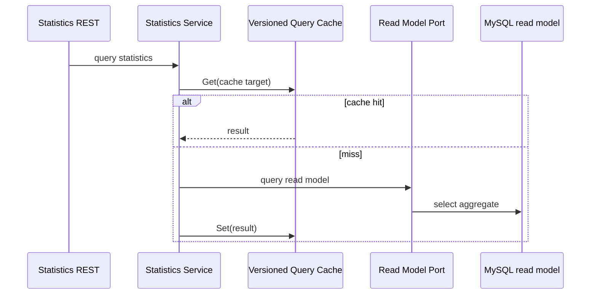

# Statistics 查询读模型

**本文回答**：统计查询如何从业务事实进入 MySQL read model，再对外提供 REST 查询。

## 30 秒结论

| 查询面 | 当前路径 |
| ------ | -------- |
| 系统统计 | `SystemStatisticsService` |
| 问卷统计 | `QuestionnaireStatisticsService` |
| 计划统计 | `PlanStatisticsService` |
| 受试者统计 | `TesteeStatisticsService` / periodic |
| 通用读取 | `ReadService` 与 read model port |


## 维护规则

- 新增查询口径先定义 read model 和服务边界，再决定是否加 query cache。
- 不要把 query cache 的 key 当作统计事实。
- 周期统计当前归属 Statistics 路由，不应回写到 Actor REST 主表。

## 模型设计方案

查询读模型把“口径”显式化：应用服务负责组织参数、权限和响应 DTO，read model port 负责读取已经同步或聚合好的数据，query cache 只包住稳定的查询结果。



## 设计取舍

| 方案 | 当前选择 | 理由 |
| ---- | -------- | ---- |
| 实时扫主业务表 | 不作为主路径 | 查询放大会影响写模型，且跨域口径难稳定 |
| Redis 作为统计事实 | 不采用 | 旧式 Redis 增量统计已退出运行时，Redis 只做 query cache |
| MySQL read model | 采用 | 易查询、可重建、可被同步任务维护 |
| 每个查询都缓存 | 不强制 | 只有高频且可明确失效/版本化的查询进入 query cache |

## 设计模式应用

| 模式 | 位置 | 说明 |
| ---- | ---- | ---- |
| Read Model | MySQL statistics tables | 用查询口径组织数据，而不是直接扫主业务写模型 |
| Port / Adapter | `ReadModelPort` | 应用服务依赖读模型接口，不关心 SQL 实现 |
| Query Cache | `cachequery` / `infra/statistics/cache.go` | 对高频稳定查询做读优化 |
| Application Service | statistics services | 组合参数、权限、cache 和 read model |

## 代码锚点

- Read model port：[read_model_port.go](../../../internal/apiserver/application/statistics/read_model_port.go)
- Read service：[read_service.go](../../../internal/apiserver/application/statistics/read_service.go)
- Periodic service：[periodic_service.go](../../../internal/apiserver/application/statistics/periodic_service.go)
- REST routes：[routes_statistics.go](../../../internal/apiserver/transport/rest/routes_statistics.go)

## Verify

```bash
go test ./internal/apiserver/application/statistics
```
