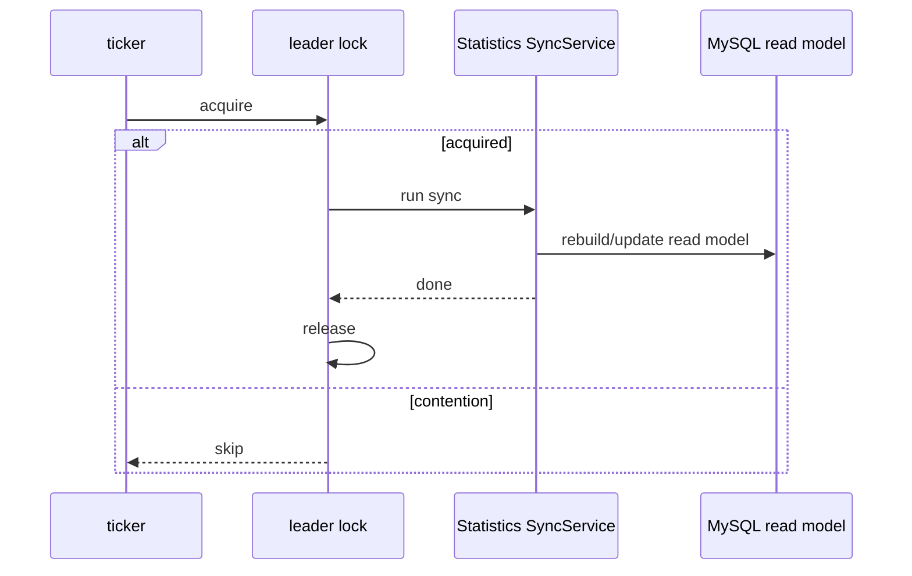

# Statistics 同步调度

**本文回答**：统计同步什么时候运行，leader lock 如何保护多实例，哪些内容不属于同步器。

## 30 秒结论

| 主题 | 当前事实 |
| ---- | -------- |
| 触发 | apiserver 内部 scheduler / 手工运维入口 |
| 多实例 | scheduler leader lock 抢不到则跳过本轮 |
| 内容 | daily / accumulated / plan 等同步服务 |
| 边界 | 同步器不消费 MQ，不替代 worker handler |



## 架构设计与状态边界

同步调度不是 MQ consumer，而是 apiserver runtime 内部的周期任务。它用 Redis leader lock 做多实例互斥，用应用层 `SyncService` 重建或更新读模型。锁竞争时跳过本轮，不阻塞业务请求。

| 组件 | 职责 | 不负责 |
| ---- | ---- | ------ |
| scheduler runner | 定时触发、抢 leader lock、记录 skip/release | 不计算统计口径 |
| `SyncService` | 执行读模型同步 | 不处理 MQ Ack/Nack |
| MySQL read model | 保存统计查询所需聚合 | 不是 Survey/Evaluation 主写模型 |
| cache warmup | 同步后可预热热点查询 | 不保证统计事实强一致 |

## 为什么这样设计


如果每个实例都跑同步，会出现重复写和资源放大；如果把同步放进 worker 事件消费，则会混淆“事件投影”和“周期重建”两种语义。

## 设计模式应用

| 模式 / 技法 | 位置 | 说明 |
| ----------- | ---- | ---- |
| Leader lease | scheduler runner | 多实例部署下同一轮同步只由一个实例执行 |
| Application Service | `SyncService` | 统计口径计算不放在 runtime runner 中 |
| Read Model Rebuilder | sync service -> MySQL read model | 可从业务表重建或刷新统计读模型 |
| Observer outcome | scheduler / resilience metrics | 让 skip、error、degraded 可被观测 |

## 取舍与边界

周期同步不会保证统计结果和主业务写入实时一致；它换来的是读模型可重建和主业务写入低耦合。需要更接近实时的口径时，优先评估 behavior projection，而不是把所有同步任务改成 MQ consumer。

## 代码锚点

- Scheduler：[statistics_sync.go](../../../internal/apiserver/runtime/scheduler/statistics_sync.go)
- Sync service：[sync_service.go](../../../internal/apiserver/application/statistics/sync_service.go)
- Leader lock：[redis/06-Redis分布式锁层](../../03-基础设施/redis/06-Redis分布式锁层.md)
- 调度文档：[04-调度与后台任务](../../04-接口与运维/04-调度与后台任务.md)

## Verify

```bash
go test ./internal/apiserver/runtime/scheduler ./internal/apiserver/application/statistics
```
