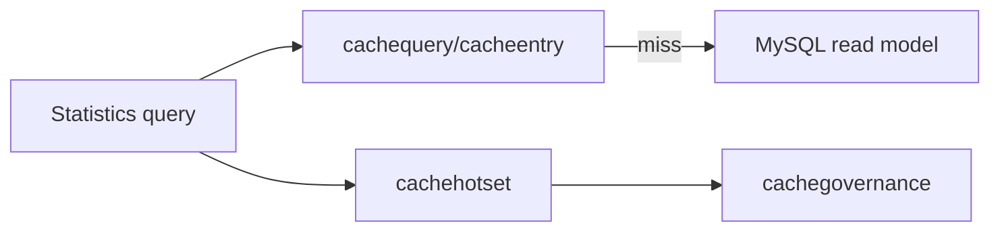

# Statistics Query Cache 与治理

**本文回答**：统计查询缓存与缓存治理如何协作，以及它们不承担什么。

## 30 秒结论

| 主题 | 当前事实 |
| ---- | -------- |
| Query cache | 使用 `cacheentry` / `cachequery` 主路径 |
| Hotset | 记录 query target 热点，供治理 warmup 使用 |
| Governance | internal REST 提供 status / hotset / repair-complete |
| 不变量 | 缓存不是统计事实来源，失效后可由 read model 重建 |



## 设计模式和取舍

| 设计点 | 代码位置 | 为什么用 |
| ------ | -------- | -------- |
| Versioned Query Cache | `infra/cachequery` | 查询结果按 version token 失效，避免只靠 TTL 猜一致性 |
| Payload Store | `infra/cacheentry` | 统一 Redis payload、压缩、指标和 nil 行为 |
| Hotset Recorder | `cachetarget` + `cachehotset` | 统计热点查询可被治理层采样和 warmup |
| Governance Facade | `application/statistics/governance_facade.go` | 让统计服务暴露治理能力而不直接依赖 Redis 细节 |

取舍是：cache 增加了查询路径复杂度，但所有缓存 miss 都应能回到 read model；因此缓存故障只影响性能，不应改变统计语义。

## 当前不变量

- cache key、warmup target 和 hotset scope 以 `cachetarget` 为准。
- `StatisticsCache` 不能生成新的统计事实，只缓存 application service 结果。
- governance 的 repair-complete 只修复缓存完成标记，不重写业务 read model。

## 代码锚点

- Statistics cache：[cache.go](../../../internal/apiserver/infra/statistics/cache.go)
- Query cache：[infra/cachequery](../../../internal/apiserver/infra/cachequery/)
- Cache entry：[infra/cacheentry](../../../internal/apiserver/infra/cacheentry/)
- Cache target：[cachetarget](../../../internal/apiserver/cachetarget/)
- Cache governance：[application/cachegovernance](../../../internal/apiserver/application/cachegovernance/)

## Verify

```bash
go test ./internal/apiserver/infra/statistics ./internal/apiserver/infra/cachequery ./internal/apiserver/cachetarget ./internal/apiserver/application/cachegovernance
```
