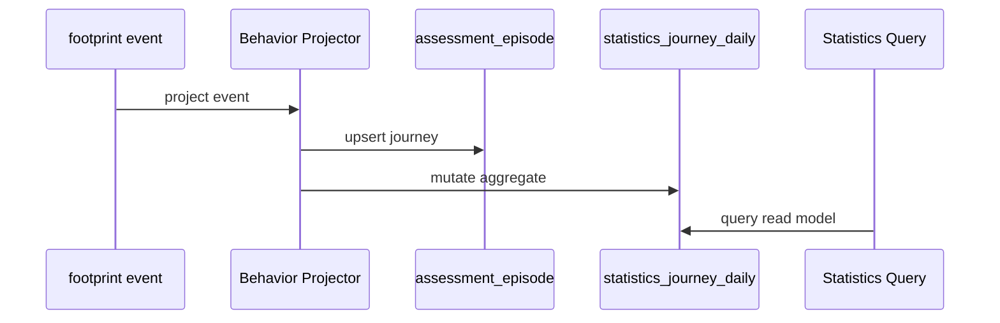

# Statistics 与行为投影关系

**本文回答**：statistics 与 behavior projection / `assessment_episode` 的关系是什么。

## 30 秒结论

| 概念 | 与 statistics 的关系 |
| ---- | -------------------- |
| `behavior_footprint` | 行为事实输入，可供后续分析 |
| `assessment_episode` | 将一次答卷、测评、报告归并为可分析 episode |
| projector | 把事件转换为读侧投影，不是写侧主状态 |
| statistics | 消费读侧事实和业务表，提供聚合查询 |


## 维护边界

- behavior projector 的乱序、pending、reconcile 细节归 [behavior-projection 深讲](../../05-专题分析/behavior-projection/README.md)。
- statistics 只维护统计口径与查询读模型，不直接承担事件乱序补偿。

## 为什么需要单独的投影层

行为事件和统计查询之间不是一一对应关系。一次 `answersheet_submitted` 可能缺少 clinician/entry 归因，`report_generated` 也可能晚于 assessment 创建。因此 projector 需要先把事件归并成 `assessment_episode`，再更新面向查询的 projection。

| 层 | 职责 | 取舍 |
| -- | ---- | ---- |
| footprint | 保存原始行为事实 | 数据更完整，但不适合直接查询统计 |
| assessment_episode | 串联一次测评旅程 | 需要 pending/reconcile 处理乱序 |
| journey daily aggregate | 面向统计接口的日聚合读模型 | 查询快，但依赖异步投影最终一致 |
| statistics service | 对外组织统计口径 | 不直接承担事件补偿 |

## 设计模式应用

| 模式 | 位置 | 作用 |
| ---- | ---- | ---- |
| Projector | behavior projection | 将事件事实转成 episode / journey daily aggregate |
| Read Model | statistics 四表聚合层 | 支撑高效统计查询 |
| Pending state machine | pending/reconcile | 显式处理乱序和归因缺失 |
| 防腐边界 | Statistics service 消费 projection | 统计查询不直接依赖 worker 或 MQ 细节 |



## 代码锚点

- Journey service：[journey.go](../../../internal/apiserver/application/statistics/journey.go)
- Domain journey：[journey.go](../../../internal/apiserver/domain/statistics/journey.go)
- 专题入口：[行为投影与 assessment_episode](../../05-专题分析/04-行为投影与assessment_episode：当前projector方案.md)

## Verify

```bash
go test ./internal/apiserver/application/statistics ./internal/apiserver/domain/statistics
```
