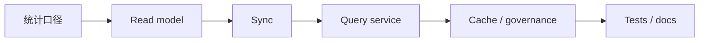
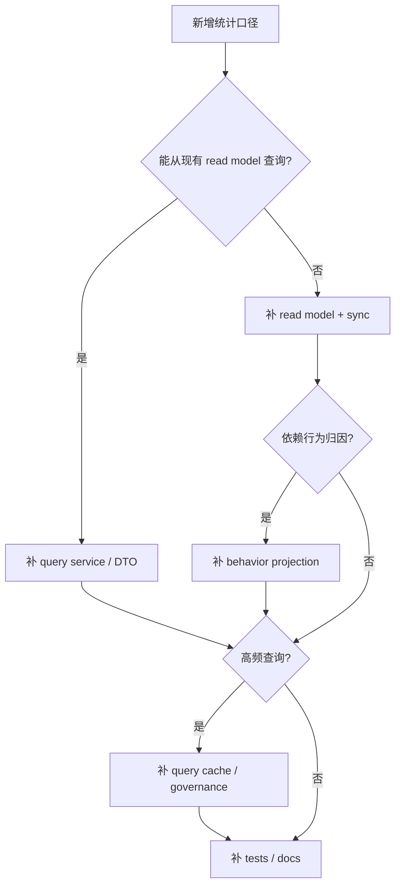

# 新增统计口径 SOP

**本文回答**：新增统计查询、同步字段或读模型时，应按什么顺序补模型、同步、缓存、测试和文档。

## 30 秒结论

新增统计能力按 `口径定义 -> read model -> sync -> query service -> cache/governance -> tests/docs` 执行。



## 操作清单

| 步骤 | 必做 |
| ---- | ---- |
| 1. 口径 | 明确统计对象、时间窗、维度、过滤条件 |
| 2. Read model | 明确是否需要新表、新字段或现有聚合 |
| 3. Sync | 补同步逻辑与 scheduler/手工触发边界 |
| 4. Query | 补 application service、REST handler、DTO |
| 5. Cache | 若是高频查询，补 query cache target、hotset、warmup 测试 |
| 6. Docs | 更新本目录、Resilience/Redis/Event 回链，如有行为事件则更新 behavior projection |

## 设计判断清单

新增统计口径前先判断它属于哪类变化，避免把读侧需求误写回主业务模型：

| 判断 | 是则优先做什么 |
| ---- | -------------- |
| 只改变查询展示 | 改 application service / DTO，不改 sync |
| 需要跨表聚合 | 先扩 read model 和 sync，再考虑 cache |
| 依赖行为事件归因 | 先扩 behavior projection，再改 statistics query |
| 是高频 dashboard 查询 | 加 query cache target、hotset 和 warmup 测试 |
| 改变业务写事实 | 停止在 Statistics 内修改，回到对应业务模块 |



## 设计模式检查

| 模式 | 什么时候需要 |
| ---- | ------------ |
| Read Model | 新口径无法从现有读模型高效查询 |
| Projector | 新口径依赖 footprint 或跨事件归因 |
| Query Cache | 新口径高频、结果可版本化或 TTL 化 |
| Application Service | 所有对外统计查询都应经过应用服务组织参数和权限 |

## 代码与测试锚点

| 能力 | 锚点 |
| ---- | ---- |
| 查询服务 | [internal/apiserver/application/statistics](../../../internal/apiserver/application/statistics/) |
| 统计领域模型 | [internal/apiserver/domain/statistics](../../../internal/apiserver/domain/statistics/) |
| Query cache | [internal/apiserver/infra/statistics/cache.go](../../../internal/apiserver/infra/statistics/cache.go) |
| Scheduler sync | [internal/apiserver/runtime/scheduler/statistics_sync.go](../../../internal/apiserver/runtime/scheduler/statistics_sync.go) |
| Behavior projection | [docs/05-专题分析/behavior-projection/README.md](../../05-专题分析/behavior-projection/README.md) |

## Verify

```bash
go test ./internal/apiserver/application/statistics ./internal/apiserver/infra/statistics ./internal/apiserver/runtime/scheduler
python scripts/check_docs_hygiene.py
```
