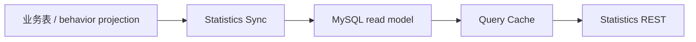

# Statistics 深讲阅读地图

**本文回答**：`statistics` 深讲目录如何阅读；当前统计读模型、同步调度、query cache 与行为投影分别在哪里维护。

## 30 秒结论

| 维度 | 当前事实 |
| ---- | -------- |
| 模块定位 | statistics 是读侧聚合模块，服务系统、问卷、计划、受试者等统计查询 |
| 事实来源 | 业务主表与行为投影，不是 worker Redis 增量写入 |
| 运行方式 | apiserver 内部 scheduler 触发同步，查询侧使用 MySQL read model + query cache |
| Redis 边界 | 只做 query cache、hotset、warmup，不做旧式统计中转事实 |



## 阅读顺序

1. [00-整体模型](./00-整体模型.md)
2. [01-查询读模型](./01-查询读模型.md)
3. [02-同步调度](./02-同步调度.md)
4. [03-QueryCache与治理](./03-QueryCache与治理.md)
5. [04-行为投影关系](./04-行为投影关系.md)
6. [05-新增统计口径SOP](./05-新增统计口径SOP.md)

## 代码锚点

- Application：[application/statistics](../../../internal/apiserver/application/statistics/)
- Domain：[domain/statistics](../../../internal/apiserver/domain/statistics/)
- Infra cache：[infra/statistics/cache.go](../../../internal/apiserver/infra/statistics/cache.go)
- Scheduler：[runtime/scheduler/statistics_sync.go](../../../internal/apiserver/runtime/scheduler/statistics_sync.go)

## Verify

```bash
go test ./internal/apiserver/domain/statistics ./internal/apiserver/application/statistics ./internal/apiserver/infra/statistics
```
