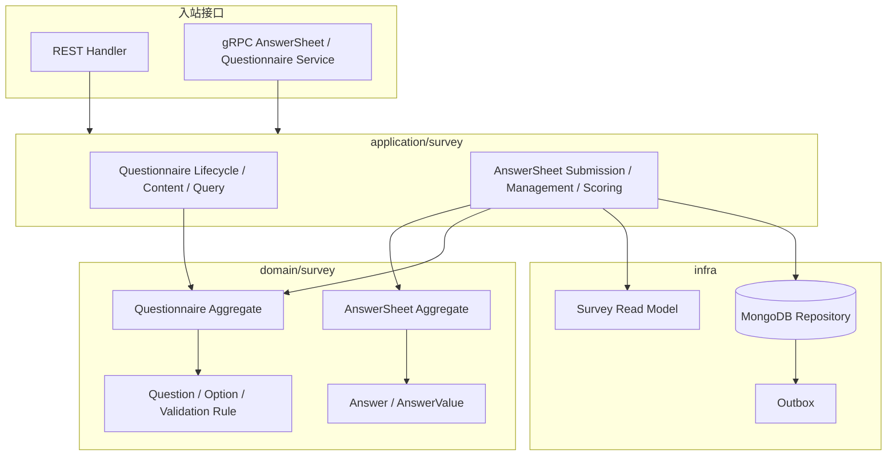
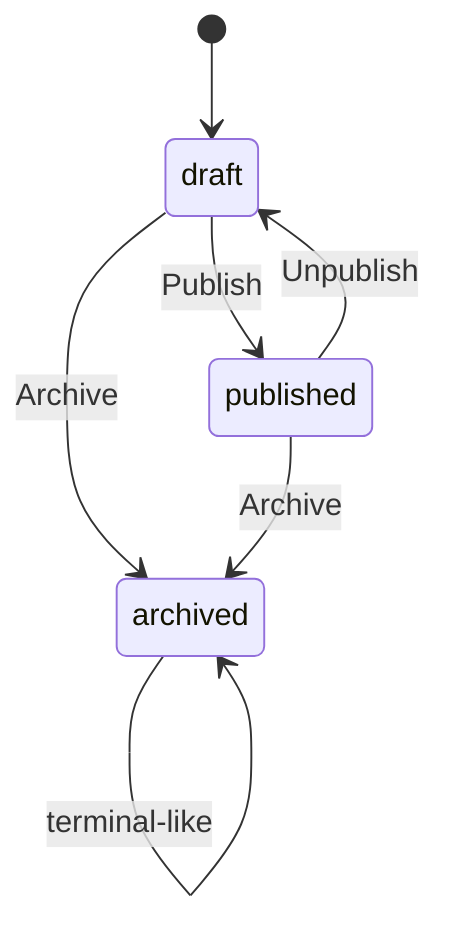
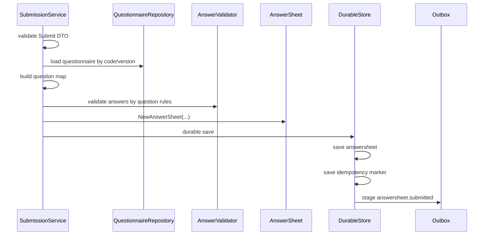
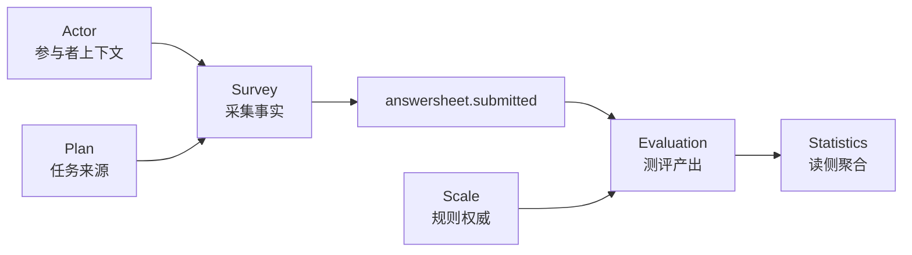

# Survey 整体模型

**本文回答**：`survey` 模块要解决什么问题，为什么拆成 `Questionnaire` 与 `AnswerSheet` 两个聚合，提交链路如何在应用层编排，以及它和 `scale / evaluation / actor / plan / statistics` 的边界在哪里。

---

## 30 秒结论

| 维度 | 结论 |
| ---- | ---- |
| 模块定位 | `survey` 是采集事实域，负责问卷定义、题目结构、答卷事实、答案值与提交校验 |
| 核心拆分 | `Questionnaire` 管“可被填写的模板”，`AnswerSheet` 管“某次已经发生的作答事实” |
| 关键边界 | `survey` 不负责医学量表因子、风险等级、报告文案和测评状态机 |
| 主链路位置 | `collection-server` 接收前台提交，`qs-apiserver` 的 `survey` 完成问卷加载、答案校验、答卷创建、durable submit 和 `answersheet.submitted` outbox |
| 设计重点 | 用两个聚合隔离“模板变化”和“作答事实”，用应用服务编排提交，用 durable store 关闭“答卷保存成功但事件丢失”的窗口 |
| 读者收益 | 读完本文后，应能判断：某个需求应该改 `survey`，还是应该去 `scale / evaluation / actor / plan / statistics` |

一句话概括：

> **Survey 只回答“谁基于哪份问卷版本提交了什么答案”，不回答“这些答案说明了什么”。**

---

## 1. Survey 要解决什么问题

Survey 解决的是**采集事实可信**问题。

在 qs-server 中，问卷与量表测评链路可以拆成三类事实：

```text
Survey      采集事实：问卷长什么样、答案是什么
Scale       规则事实：量表因子、计分规则、解读规则是什么
Evaluation 产出事实：测评状态、分数、风险等级、报告是什么
```

Survey 的职责是保证前两件事稳定成立：

1. 后台维护出来的问卷结构是可发布、可填写、可校验的。
2. 前台提交上来的答卷是基于某个确定问卷版本产生的不可随意篡改的作答事实。

它不应该在提交时直接决定风险等级、报告文案或受试者标签。那些能力属于下游的 `scale` 与 `evaluation`。

---

## 2. 为什么 Survey 要拆成两个聚合

Survey 内部最核心的拆分是：

```text
Questionnaire：问卷模板
AnswerSheet：答卷事实
```

这不是为了“类多一点”，而是因为二者变化原因完全不同。

| 变化原因 | 聚合 | 典型动作 | 为什么不能混在一起 |
| -------- | ---- | -------- | ------------------ |
| 后台编辑问卷结构 | `Questionnaire` | 新建、编辑题目、发布、下线、归档 | 问卷是模板，生命周期允许变化 |
| 前台提交作答 | `AnswerSheet` | 提交、保存答案、保存填写人、保存问卷引用 | 答卷是事实，创建后不应该被后台模板变更污染 |
| 题目规则变化 | `Questionnaire / Question` | 修改选项、校验规则、题型 | 规则属于模板版本，不能反向改写已提交答卷 |
| 评估结果产生 | 不属于 Survey | 创建测评、计算因子分、生成报告 | 这些是 Evaluation 的产出事实 |

如果把问卷和答卷塞进一个聚合，会出现两个问题：

1. **模板变化污染历史事实**：后台修改题目后，旧答卷到底按哪个题目结构解释会变得含糊。
2. **聚合职责膨胀**：提交、校验、计分、报告、统计会都往同一个对象里堆，最后无法判断边界。

所以 Survey 采用“模板聚合 + 事实聚合”的结构。

---

## 3. 模块整体结构



这张图里有三个关键点：

1. **transport 不做业务判断**：REST/gRPC 负责 DTO、认证上下文、错误映射和调用应用服务。
2. **application 负责编排**：提交答卷不是简单 CRUD，需要加载问卷、构造答案、校验、创建答卷、durable save。
3. **domain 负责不变量**：`Questionnaire` 保护模板一致性，`AnswerSheet` 保护提交事实一致性。

---

## 4. Questionnaire 聚合

`Questionnaire` 是问卷模板聚合根。它负责描述一份可以被填写的问卷结构。

核心字段可以抽象为：

| 字段/概念 | 含义 |
| --------- | ---- |
| `id` | 内部标识 |
| `code` | 问卷业务编码 |
| `typ` | 问卷类型，如普通问卷或医学量表问卷 |
| `title / desc / imgUrl` | 基本展示信息 |
| `version` | 问卷版本 |
| `status` | `draft / published / archived` |
| `recordRole` | 记录角色，如 head / published snapshot |
| `questions` | 题目列表 |
| `events` | 生命周期变更产生的领域事件 |

### 4.1 状态语义



状态含义：

| 状态 | 语义 |
| ---- | ---- |
| `draft` | 草稿态，可维护题目结构和基础信息 |
| `published` | 已发布，可被提交使用 |
| `archived` | 已归档，不应再回到正常发布链路 |

生命周期服务 `Lifecycle` 负责执行发布、下线和归档。发布时会校验问卷是否可发布，并递增大版本；下线要求当前处于已发布状态；归档后不能再按普通状态流转。

### 4.2 题目结构

`Question` 是问卷聚合内的题目抽象。题型目前包括：

```text
Section
Radio
Checkbox
Text
Textarea
Number
```

题型的意义不只是展示控件不同，还决定：

1. 答案值的结构；
2. 可选项是否合法；
3. 是否能计分；
4. 校验规则如何解释；
5. 新增题型时要补哪些 DTO、值对象和校验策略。

### 4.3 版本语义

`Questionnaire` 的版本不是装饰字段，而是连接“模板”和“答卷事实”的关键引用。

答卷保存的是：

```text
QuestionnaireCode + QuestionnaireVersion
```

这意味着后续 Evaluation 要解释答卷时，应该知道答卷来自哪一版问卷。Survey 文档必须持续强调这一点，否则很容易把“当前最新问卷”误当成“历史答卷对应问卷”。

---

## 5. AnswerSheet 聚合

`AnswerSheet` 是一次作答事实的聚合根。源码注释已经明确：答卷一旦创建就是已提交状态，不存在后端草稿；草稿在前端 localStorage；答卷是不可变对象。

它的核心字段可以抽象为：

| 字段/概念 | 含义 |
| --------- | ---- |
| `id` | 答卷标识 |
| `filler` | 填写者引用 |
| `filledAt` | 填写时间 |
| `questionnaireRef` | 问卷 code/version/title 引用 |
| `answers` | 答案列表 |
| `score` | 总分，初始为 0，可在后续计分后更新 |
| `events` | 领域事件集合 |

### 5.1 创建即提交

`AnswerSheet` 没有 draft / editing / submitted 这样的复杂状态机。

原因很直接：

| 设计 | 说明 |
| ---- | ---- |
| 前端草稿 | 用户填写过程中的临时状态，属于前端本地体验 |
| 后端答卷 | 只有提交成功后才成为业务事实 |
| 后端修改 | 不支持把答卷当作可反复编辑对象 |

这能避免一种典型混乱：后端既保存草稿，又保存正式答卷，最后“到底是否提交成功”语义变得不稳定。

### 5.2 答案唯一性

创建答卷时会校验同一题目不能有重复答案。也就是说：

```text
同一 AnswerSheet 内，QuestionCode 应该唯一
```

这属于 AnswerSheet 聚合的不变量。即使上游接口传入重复题目，领域对象也不应该接受。

### 5.3 得分字段的边界

`AnswerSheet` 有 `score`，也有 `UpdateScores`。这不表示 Survey 拥有完整 Evaluation 逻辑。

这里的边界应理解为：

| 能力 | 归属 |
| ---- | ---- |
| 单题答案值、单题分数、总分写回答卷 | Survey 可承载 |
| 因子分、风险等级、解释规则、报告 | Evaluation / Scale 承载 |

换句话说，Survey 可以保存“答卷被计出的基础分数”，但不负责解释这个分数意味着什么。

---

## 6. 提交链路的应用层编排

答卷提交链路不是简单的 `InsertOne`。在 `qs-apiserver` 内，`application/survey/answersheet/submission_service.go` 负责把一次提交拆成多个阶段：



应用层要做的事情包括：

| 阶段 | 职责 |
| ---- | ---- |
| DTO 校验 | 问卷编码、填写人、受试者、答案列表、题目编码、题型不能为空 |
| 问卷加载 | 找到提交所依据的问卷 code/version |
| 题目映射 | 将题目结构转成校验所需的 question map |
| 答案值构造 | 根据题型将 raw value 转成领域值对象 |
| 批量校验 | 通过 `AnswerValidator` 按规则校验答案 |
| 聚合创建 | 调用 `NewAnswerSheet` 形成答卷事实 |
| durable save | 保存答卷、业务幂等记录、outbox 事件 |

这说明 `SubmissionService` 是一个**用例编排服务**，不是普通 CRUD service。

---

## 7. Durable Submit 与事件起点

Survey 最关键的工程边界之一是 durable submit。

答卷提交成功后，系统要保证：

```text
答卷保存成功
业务幂等记录保存成功
answersheet.submitted 事件进入 outbox
```

这三件事应该在一个持久化边界内完成。这样可以避免：

```text
答卷已经保存
但 MQ publish 失败
后续 worker 永远不知道这份答卷
```

所以 Survey 的 `answersheet.submitted` 不应该理解成“handler 里直接发 MQ”，而应该理解成：

```text
AnswerSheet 领域事件
  -> durable store stage outbox
  -> apiserver outbox relay
  -> MQ
  -> worker
```

这也是 Survey 和 Evaluation 的连接点：Survey 只发出“答卷已提交”的事实，后续测评创建、评估、报告生成由下游事件链推进。

---

## 8. Survey 与其它模块的边界



### 8.1 与 Actor 的边界

`actor` 提供受试者、填写者、监护关系等上下文。Survey 只在答卷里保存必要引用，不应该拥有参与者完整生命周期。

| 问题 | 归属 |
| ---- | ---- |
| 受试者是否存在 | Actor |
| 当前用户是否能为某个受试者提交答卷 | collection / IAM / Actor 协作 |
| 答卷由谁填写 | Survey 保存引用 |
| 受试者标签如何更新 | Actor / Evaluation 后处理 |

### 8.2 与 Scale 的边界

`scale` 是医学量表规则权威源。Survey 不维护因子、阈值和解读文案。

| 问题 | 归属 |
| ---- | ---- |
| 题目是什么 | Survey |
| 某个选项多少分 | Survey 可保存基础计分信息 |
| 因子如何聚合 | Scale / Evaluation |
| 风险区间如何解释 | Scale |

### 8.3 与 Evaluation 的边界

`evaluation` 把答卷事实和量表规则组合成测评结果。

| 问题 | 归属 |
| ---- | ---- |
| 答卷是否提交成功 | Survey |
| 是否创建 Assessment | Evaluation |
| 是否执行评估 | Evaluation Engine |
| 报告是否生成 | Evaluation Report |
| 失败是否可重试 | Evaluation 状态机 |

### 8.4 与 Plan 的边界

Plan 负责计划和任务。Survey 只接受提交时携带的 `task_id` 等来源信息，不负责调度任务。

| 问题 | 归属 |
| ---- | ---- |
| 任务何时开放 | Plan |
| 任务是否完成 | Plan + Evaluation/Assessment |
| 提交答卷时 task_id 如何透传 | Survey 提交 DTO / durable meta |
| 任务通知 | Plan / Worker / Notification |

### 8.5 与 Statistics 的边界

Statistics 是读侧聚合。Survey 不直接维护统计视图，但提交答卷可以产生行为足迹事件，供后续统计投影。

---

## 9. 设计模式与实现意图

| 模式 | 在 Survey 中的体现 | 作用 |
| ---- | ------------------ | ---- |
| 聚合根 | `Questionnaire`、`AnswerSheet` | 分别保护模板一致性和答卷事实一致性 |
| 值对象 | `Version`、`QuestionnaireRef`、`AnswerValue` 等 | 降低字符串/裸 JSON 在业务层乱传的风险 |
| 状态机 | `Questionnaire` 生命周期 | 控制 draft/published/archived 的合法迁移 |
| 领域服务 | `Lifecycle` | 生命周期逻辑不塞进应用服务，也不暴露聚合内部方法 |
| 策略模式 | 答案校验 / 题型处理 | 新增规则或题型时减少对主流程的侵入 |
| 端口/适配器 | Repository、DurableStore、AnswerValidator | 应用层依赖抽象，基础设施实现 Mongo/outbox/规则引擎 |
| Outbox | durable submit | 保证答卷事实和异步起点一致 |

---

## 10. 为什么这样设计

### 10.1 不把问卷和答卷放进同一个聚合

问卷是模板，答卷是事实。模板可以编辑、发布、归档；事实应该稳定、可追溯、可解释。两者生命周期不同，必须拆开。

### 10.2 不在 Survey 内直接生成报告

报告需要量表规则、因子聚合、风险等级、文案匹配，这些都不是采集事实。把报告生成放进 Survey 会导致边界污染，也会使提交链路变慢。

### 10.3 不把校验逻辑写死在 handler

handler 只应该处理 HTTP/gRPC 入站、DTO、错误映射。答案校验依赖题型和题目规则，属于应用服务和规则引擎协作，不应该塞进接口层。

### 10.4 不把提交成功等同于评估完成

提交答卷是同步主链路，评估与报告是异步慢链路。用户提交成功只意味着答卷事实已保存、事件起点已进入 outbox，不意味着报告已经生成。

---

## 11. 当前模型的取舍

| 收益 | 代价 |
| ---- | ---- |
| 模板和事实分离，历史答卷更可追溯 | 需要在答卷里显式保存问卷 code/version 引用 |
| 提交链路稳定，只做采集事实与 outbox | 用户需要通过状态查询或报告查询感知异步结果 |
| 校验策略可扩展 | 新增题型要改 DTO、领域值对象、校验、存储映射和文档 |
| Survey 不被报告/风险语义污染 | 读者必须理解 Survey -> Event -> Evaluation 的跨模块协作 |
| durable submit 降低事件丢失风险 | 需要额外维护 outbox relay、失败重试和事件状态观测 |

---

## 12. 常见误区

### 12.1 “Survey 就是问卷 CRUD”

不准确。Survey 同时包含问卷模板和答卷事实，尤其答卷提交链路涉及校验、幂等、durable store 和 outbox，是主链路的起点。

### 12.2 “AnswerSheet 应该有草稿状态”

当前设计不是这样。答卷一旦进入后端就是提交事实，草稿在前端本地维护。

### 12.3 “Questionnaire 当前版本可以解释所有历史答卷”

错误。答卷需要携带提交时的问卷 code/version。历史答卷不应默认按当前最新问卷解释。

### 12.4 “answersheet.submitted 是 worker 发出来的”

错误。`answersheet.submitted` 是 Survey 提交成功后的领域事件，经 durable store 进入 outbox，再由 apiserver relay 出站。worker 是消费者。

### 12.5 “Survey 可以直接决定风险等级”

错误。风险等级属于 Evaluation/Scale 结合后的产出，不属于 Survey。

---

## 13. 代码与契约锚点

| 类型 | 路径 |
| ---- | ---- |
| Questionnaire 聚合 | `internal/apiserver/domain/survey/questionnaire/questionnaire.go` |
| Questionnaire 类型与版本 | `internal/apiserver/domain/survey/questionnaire/types.go` |
| Questionnaire 生命周期 | `internal/apiserver/domain/survey/questionnaire/lifecycle.go` |
| Question 模型 | `internal/apiserver/domain/survey/questionnaire/question.go` |
| AnswerSheet 聚合 | `internal/apiserver/domain/survey/answersheet/answersheet.go` |
| Answer 模型 | `internal/apiserver/domain/survey/answersheet/answer.go` |
| AnswerSheet 提交应用服务 | `internal/apiserver/application/survey/answersheet/submission_service.go` |
| durable submit 实现 | `internal/apiserver/infra/mongo/answersheet/durable_submit.go` |
| 事件契约 | `configs/events.yaml` 中 `answersheet.submitted` |
| collection 提交入口 | `internal/collection-server/transport/rest/handler/answersheet_handler.go` |
| internal gRPC 后续链路 | `internal/apiserver/interface/grpc/proto/internalapi/internal.proto` |

---

## 14. Verify

建议至少执行：

```bash
go test ./internal/apiserver/domain/survey/...
go test ./internal/apiserver/application/survey/...
go test ./internal/apiserver/infra/mongo/answersheet
```

如果改动涉及提交链路，还要补充：

```bash
go test ./internal/collection-server/application/answersheet
go test ./internal/collection-server/transport/rest/handler
```

如果改动涉及文档链接：

```bash
make docs-hygiene
```

---

## 15. 下一跳

| 目标 | 下一篇 |
| ---- | ------ |
| 理解问卷发布、版本和 snapshot | [01-Questionnaire生命周期与版本.md](./01-Questionnaire生命周期与版本.md) |
| 理解答卷提交、校验、幂等和 outbox | [02-AnswerSheet提交与校验.md](./02-AnswerSheet提交与校验.md) |
| 理解题型和值对象扩展 | [03-题型校验与计分扩展.md](./03-题型校验与计分扩展.md) |
| 理解 Mongo、事件、缓存边界 | [04-存储事件缓存边界.md](./04-存储事件缓存边界.md) |
| 新增题型时按步骤执行 | [05-新增题型SOP.md](./05-新增题型SOP.md) |
