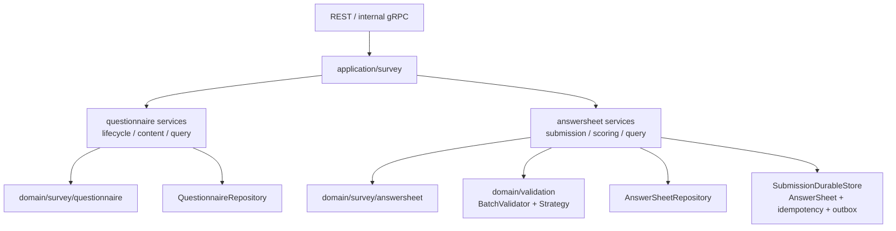
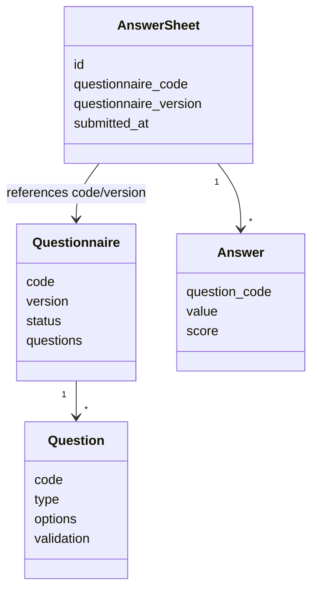
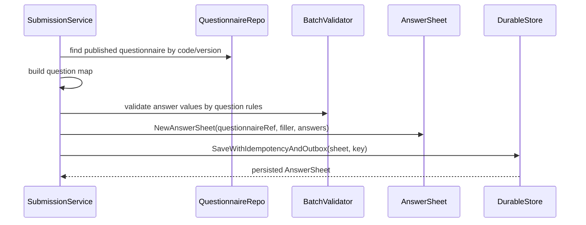

# Survey 整体模型

**本文回答**：`survey` 要解决什么问题、为什么拆成 `Questionnaire` 和 `AnswerSheet` 两个聚合、应用层如何编排提交链路，以及它和 `scale / evaluation / actor` 的边界在哪里。

## 30 秒结论

| 概念 | 归属 | 不变量 |
| ---- | ---- | ------ |
| `Questionnaire` | `survey/questionnaire` | 问卷 code、version、题目结构和生命周期是一组一致事实 |
| `Question` | `survey/questionnaire` | 题型决定答案形态和校验方式 |
| `AnswerSheet` | `survey/answersheet` | 一次提交后的答卷事实不可被解读结论污染 |
| `Answer` | `survey/answersheet` | 保存作答值、题目编码和提交上下文 |

## 模块要解决什么问题

Survey 解决的是“采集事实可信”问题，而不是“解释结果”问题。它需要同时支撑后台配置问卷和前台提交答卷，所以模型里有两个变化原因：

| 变化原因 | 对应模型 | 为什么不能混在一起 |
| -------- | -------- | ------------------ |
| 问卷结构变化 | `Questionnaire`、`Question`、`Option`、`Version` | 后台可以编辑、发布、下线、归档；它描述的是可提交的模板 |
| 答卷事实产生 | `AnswerSheet`、`Answer`、`AnswerValue`、`FillerRef` | 前台提交后应成为不可随意修改的事实；它记录“某人按某版本问卷提交了什么” |
| 答案校验 | `validation` 领域、`Question` validation rules | 校验规则依附问卷题目，但执行时只需要抽象值和规则，不需要知道整份答卷 |
| 异步起点 | `answersheet.submitted` | 提交成功后只固化后续链路的起点，不在 Survey 内完成 Evaluation |

如果把问卷模板和答卷事实合成一个大对象，后台修改题目结构会直接影响已提交答卷的解释；如果把测评结果也放进 Survey，答卷事实会被风险等级、报告文案等产出语义污染。

## 架构设计

Survey 在 `qs-apiserver` 内部按 DDD 分层：领域层只表达问卷和答卷的不变量，应用层负责编排仓储、校验、durable store 和事件。



这张图里的关键取舍是：`SubmissionService` 不是贫血 CRUD，它要把 DTO 校验、问卷版本解析、答案值对象构造、批量校验、答卷聚合创建和 durable store 串起来；但它不持有计分规则或测评状态，那些属于 Scale/Evaluation。

## 领域模型设计



| 类型 | 角色 | 设计意图 |
| ---- | ---- | -------- |
| `Questionnaire` | 聚合根 | 约束 code、version、status、questions 是一组一致事实 |
| `Question` | 聚合内实体 / 接口形态 | 题型决定 value 形态、选项、校验规则和展示控制 |
| `QuestionManager` | 领域服务 | 负责添加、替换、删除、排序题目；通过包内方法维护聚合完整性 |
| `Lifecycle` | 领域服务 | 负责 Publish/Unpublish/Archive 的状态检查、发布校验、版本递增和事件触发 |
| `AnswerSheet` | 聚合根 | 创建即提交，保存问卷引用、填写人、答案和总分，不存在后端草稿态 |
| `AnswerValue` | 值对象接口族 | 把不同题型的答案值封装起来，供 validation 和 scoring 使用 |
| `SubmissionDurableStore` | 应用层端口 | 把答卷、业务幂等记录、`answersheet.submitted` outbox 收进一个持久化边界 |

## 设计模式应用

| 模式 | 代码位置 | 为什么用 |
| ---- | -------- | -------- |
| 状态机 | `questionnaire.Lifecycle` + `Questionnaire` status | 发布、下线、归档必须按状态推进，避免 archived 再发布或未发布下线 |
| 领域服务 | `QuestionManager`、`Lifecycle` | 题目集合操作和生命周期操作需要访问聚合内部并执行跨字段不变量 |
| 策略模式 | `domain/validation` 的 `ValidationStrategy` | required、min length 等规则按类型扩展，不让 Submit 服务堆 switch |
| 工厂 / 构造函数 | `NewQuestionnaire`、`NewAnswerSheet`、`CreateAnswerValueFromRaw` | 创建时集中校验必填字段、唯一性和题型值对象 |
| Repository / Port | `questionnaire.Repository`、`answersheet.Repository`、`SubmissionDurableStore` | 领域不依赖 Mongo/MySQL/outbox 细节，应用层通过端口编排 |

## 提交链路



该链路把“提交时必须稳定完成的事”限制在采集事实边界内：提交参数、问卷版本、题目存在性、答案形态、答案规则、幂等和 outbox 起点。后续评估不在这里执行。

## 边界

- `survey` 保存“采集事实”：问卷结构、题目、选项、答卷、答案。
- `scale` 保存“解释规则”：因子、阈值、风险文案、解读区间。
- `evaluation` 保存“产出结果”：测评状态、得分、风险等级、报告。
- `actor` 提供 testee / filler / clinician 等参与者上下文，不反向拥有答卷事实。

## 为什么这样设计

| 替代方案 | 没有选择的原因 |
| -------- | -------------- |
| 一个 `Survey` 聚合同时保存问卷和答卷 | 问卷可编辑、答卷应不可变，两者生命周期冲突 |
| 在提交答卷时同步创建测评和报告 | 提交入口会被重计算链路拖慢，也会把 Evaluation 状态机塞进 Survey |
| 校验规则直接写在 SubmissionService 中 | 题型和规则扩展会让应用服务变成大 switch，难以复用和测试 |
| 答卷保存后直接 publish MQ | 写库成功但 MQ 失败会丢异步起点；durable store 用 outbox 收口这个窗口 |

## 取舍与边界

| 收益 | 代价 |
| ---- | ---- |
| 问卷模板和答卷事实边界清楚，历史答卷可按提交版本解释 | 应用层需要显式传递 questionnaire code/version 和参与者上下文 |
| validation 可独立扩展策略 | 新题型需要同时补 `AnswerValue`、question DTO、校验规则和文档 |
| durable submit 让答卷和事件起点一致 | outbox relay 引入最终一致性，不能把提交成功等同于评估完成 |
| Survey 不拥有测评状态，避免模型污染 | 读者必须理解 Survey -> Event -> Evaluation 的跨模块链路 |

## 代码锚点

- `Questionnaire` 聚合：[questionnaire.go](../../../internal/apiserver/domain/survey/questionnaire/questionnaire.go)
- 题目与校验：[question.go](../../../internal/apiserver/domain/survey/questionnaire/question.go)、[validator.go](../../../internal/apiserver/domain/survey/questionnaire/validator.go)
- `AnswerSheet` 聚合：[answersheet.go](../../../internal/apiserver/domain/survey/answersheet/answersheet.go)
- 答案模型：[answer.go](../../../internal/apiserver/domain/survey/answersheet/answer.go)
- 领域服务：[lifecycle.go](../../../internal/apiserver/domain/survey/questionnaire/lifecycle.go)、[question_manager.go](../../../internal/apiserver/domain/survey/questionnaire/question_manager.go)
- 提交应用服务：[submission_service.go](../../../internal/apiserver/application/survey/answersheet/submission_service.go)
- durable store 端口：[durable_store.go](../../../internal/apiserver/application/survey/answersheet/durable_store.go)
- validation 策略：[domain/validation](../../../internal/apiserver/domain/validation/)

## Verify

```bash
go test ./internal/apiserver/domain/survey/questionnaire ./internal/apiserver/domain/survey/answersheet
```
