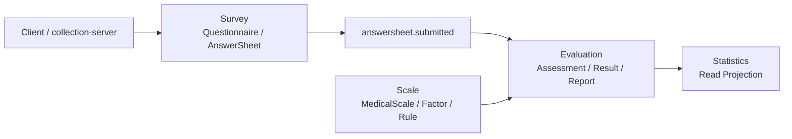
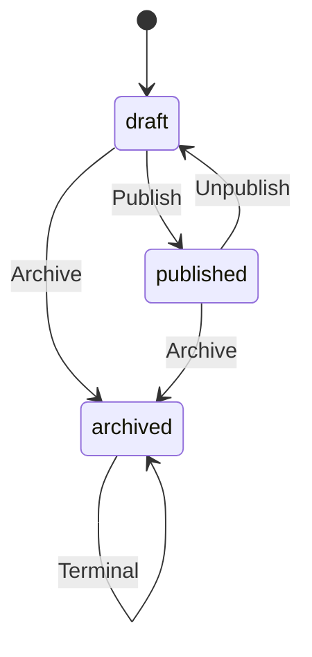
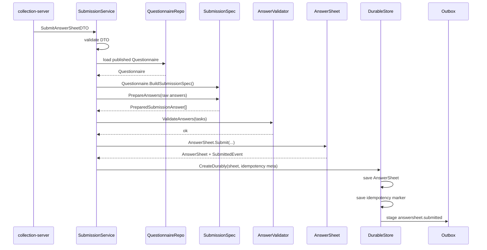

# Survey 模型总览

> 本文是 Survey 模块文档重建的入口文档。
>
> 本文不追求覆盖所有实现细节，而是先回答：Survey 模块在 qs-server 中到底负责什么？它为什么拆成 Questionnaire 与 AnswerSheet 两个核心聚合？最新强模型重构后，Questionnaire.SubmissionSpec、AnswerSheet.Submit、SubmissionContext、AnswerSheetSubmittedEvent 分别解决了什么问题？Survey 与 Scale / Evaluation / Actor / Plan / Statistics 的边界在哪里？

---

## 1. 结论先行

Survey 是 qs-server 的**作答事实域**。

它只回答一类问题：

```text
谁，在什么业务上下文中，基于哪份问卷版本，提交了什么答案。
```

它不回答：

```text
这些答案意味着什么；
这些答案对应什么因子分；
这些答案属于什么风险等级；
这些答案应该生成什么报告；
这次测评执行到了什么状态。
```

这些问题分别属于 Scale 与 Evaluation。

一句话概括：

> **Survey 管“可填写的问卷结构”和“已经发生的作答事实”，不管“测评解释结果”。**

---

## 2. Survey 在 qs-server 中的位置

qs-server 的核心业务链路可以抽象为：

```text
Survey      作答事实：问卷长什么样，用户提交了什么答案
Scale       规则事实：量表因子、计分规则、解读规则是什么
Evaluation 产出事实：这次测评如何执行，结果和报告是什么
```

Survey 是整条链路的事实入口。



在运行时上，前台请求通常先进入 `collection-server`，再通过 gRPC 调用 `qs-apiserver` 保存答卷；真正的 Survey 聚合与持久化边界在 `qs-apiserver` 内部。

```text
Client
  -> collection-server
  -> qs-apiserver Survey application service
  -> Survey domain model
  -> durable store
  -> outbox answersheet.submitted
```

---

## 3. Survey 的核心职责

Survey 模块主要负责五件事。

| 职责 | 说明 |
| --- | --- |
| 问卷模板建模 | 管理 Questionnaire、Question、Option、ValidationRule 等结构 |
| 问卷版本与发布 | 确保只有已发布问卷版本可以被提交 |
| 提交规格生成 | 通过 SubmissionSpec 暴露“这份问卷如何被提交”的规格 |
| 答卷事实建模 | 通过 AnswerSheet 表达一次完整提交事实 |
| 提交事件出站 | 通过 AnswerSheetSubmittedEvent + durable store + outbox 驱动后续评估 |

Survey 不负责以下事情。

| 不负责 | 应由谁负责 |
| --- | --- |
| 量表因子和计分规则 | Scale |
| 风险等级和解读规则 | Scale / Evaluation |
| Assessment 生命周期 | Evaluation |
| 报告生成 | Evaluation Report / ReportBuilder |
| 受试者完整生命周期 | Actor |
| 测评任务调度 | Plan |
| 统计视图维护 | Statistics |

---

## 4. 为什么拆成 Questionnaire 与 AnswerSheet 两个聚合

Survey 内部最核心的模型拆分是：

```text
Questionnaire：问卷模板聚合
AnswerSheet：答卷提交事实聚合
```

这个拆分不是为了“类更多”，而是因为二者的业务性质完全不同。

| 维度 | Questionnaire | AnswerSheet |
| --- | --- | --- |
| 本质 | 模板 | 事实 |
| 生命周期 | 可新建、编辑、发布、下线、归档 | 创建即提交，后端不维护草稿 |
| 是否允许变化 | 草稿态可变，发布后受控 | 提交后应尽量不可变 |
| 核心问题 | 可以填什么 | 实际填了什么 |
| 版本语义 | 产生版本 | 引用确定版本 |
| 下游关系 | 为提交提供结构规格 | 触发 Evaluation 链路 |

如果把二者混在一个聚合里，会出现两个问题：

1. **模板变化污染历史事实**：后台修改题目后，旧答卷到底基于哪版问卷提交会变得含糊。
2. **聚合职责膨胀**：模板编辑、提交校验、作答保存、计分、报告、统计全部堆在一个模型里，边界失控。

所以 Survey 采用“模板聚合 + 事实聚合”的结构。

---

## 5. Questionnaire：问卷模板聚合

Questionnaire 负责描述一份可维护、可发布、可提交的问卷结构。

它不是简单的问题列表，而是一个有生命周期、有版本、有提交规格的模板聚合。

### 5.1 核心概念

| 概念 | 说明 |
| --- | --- |
| `id` | 内部标识 |
| `code` | 问卷业务编码，跨版本保持稳定 |
| `version` | 问卷版本，答卷必须引用确定版本 |
| `title / desc / imgUrl` | 展示信息 |
| `typ` | 问卷类型 |
| `status` | draft / published / archived 等生命周期状态 |
| `questions` | 题目集合 |
| `events` | 生命周期变化事件 |

### 5.2 状态语义



状态含义：

| 状态 | 语义 |
| --- | --- |
| `draft` | 草稿态，可维护结构 |
| `published` | 已发布，可作为提交规格来源 |
| `archived` | 已归档，不应再进入正常提交链路 |

Survey 提交链路只允许使用已发布问卷。

这不是接口层规则，而是 Questionnaire 模型语义：

```text
只有 published Questionnaire 才能 BuildSubmissionSpec。
```

### 5.3 题目结构

Questionnaire 内部包含题目结构。题型至少包括：

```text
Section
Radio
Checkbox
Text
Textarea
Number
```

题型不只是前端展示控件，它还决定：

1. raw answer 如何被转换为 AnswerValue；
2. 选项值是否合法；
3. 校验规则如何解释；
4. 是否能够参与基础计分；
5. 新增题型时需要扩展哪些 DTO、值对象、校验策略和存储映射。

### 5.4 版本语义

Questionnaire 的版本是 Survey 与下游 Evaluation 之间最重要的事实锚点之一。

AnswerSheet 保存的不是“当前问卷”，而是：

```text
QuestionnaireCode + QuestionnaireVersion
```

这意味着历史答卷永远应该能够回答：

```text
这份答卷当时是基于哪一版问卷结构提交的？
```

后续 Scale / Evaluation 在解释答卷时，也不应该默认使用“当前最新问卷”。

---

## 6. SubmissionSpec：Questionnaire 的可提交规格

最新 Survey 强模型重构中，一个关键变化是引入 `SubmissionSpec`。

它的作用是：

> 把“已发布问卷如何被提交”从 application helper 中收回到 Questionnaire 模型侧。

### 6.1 为什么需要 SubmissionSpec

旧式提交流程中，application service 往往会自己做这些事情：

```text
把 questions 拼成 map；
判断 question_code 是否存在；
判断客户端传入的 question_type 是否可信；
从 question 中提取 validation rules；
拼装校验任务；
再创建 AnswerValue。
```

这些逻辑虽然可以运行，但问题是：

```text
application service 过度理解 Questionnaire 内部结构；
提交规则散落在流程代码中；
客户端 DTO 有机会污染业务事实；
“可提交问卷”的领域语义不集中。
```

SubmissionSpec 解决的就是这个问题。

### 6.2 SubmissionSpec 的职责

SubmissionSpec 至少应该负责：

| 职责 | 说明 |
| --- | --- |
| 固化问卷引用 | 保存 QuestionnaireCode / QuestionnaireVersion / Title |
| 固化题目规格 | 保存可提交题目、题型、校验规则 |
| 校验题目归属 | 拒绝不存在于问卷中的 question_code |
| 校验题型一致性 | 客户端提交题型必须与问卷规格一致 |
| 输出准备结果 | 生成 PreparedSubmissionAnswer，供后续 AnswerValue 和 ValidationTask 构造 |

### 6.3 SubmissionSpec 的边界

SubmissionSpec 不直接做完整答案校验。

它负责：

```text
答案属于哪道题；
这道题是什么题型；
这道题有哪些校验规则。
```

真正执行规则校验的是 `AnswerValidator`。

所以链路应该是：

```text
Questionnaire.BuildSubmissionSpec()
  -> SubmissionSpec.PrepareAnswers(rawAnswers)
  -> AnswerValidator.ValidateAnswers(tasks)
```

这个边界是合理的：

| 对象 | 职责 |
| --- | --- |
| SubmissionSpec | 提供问卷侧提交规格 |
| AnswerValidator | 执行规则校验策略 |
| AnswerSheet | 接收已通过规格准备与规则校验的答案事实 |

---

## 7. AnswerSheet：答卷提交事实聚合

AnswerSheet 表达一次已经发生的提交事实。

它不是草稿，不是临时表单，不是测评结果，也不是报告。

它表达的是：

```text
某个填写人在某个业务上下文中，基于某个问卷版本，提交了一组答案。
```

### 7.1 核心概念

| 概念 | 说明 |
| --- | --- |
| `id` | 答卷标识，提交事实的唯一 ID |
| `questionnaireRef` | 问卷 code / version / title 引用 |
| `submissionContext` | 提交上下文，包括填写人、受试者、组织、任务等 |
| `answers` | 答案集合 |
| `filledAt` | 填写/提交时间 |
| `score` | 基础分数字段，可用于保存单题/总分结果 |
| `events` | 领域事件集合 |

### 7.2 创建即提交

后端 AnswerSheet 没有草稿状态。

```text
前端草稿：用户填写过程中的临时体验，可在 localStorage 等前端机制中保存；
后端答卷：只有真正提交成功后才成为业务事实。
```

因此，AnswerSheet 的核心构造入口不应该是普通 `NewAnswerSheet`，而应该是具有业务语义的：

```text
AnswerSheet.Submit(...)
```

它表达的是一次提交动作，而不是随便 new 一个对象。

### 7.3 AnswerSheet.Submit 的意义

`AnswerSheet.Submit(...)` 应该同时完成四件事：

1. 校验 QuestionnaireRef 合法；
2. 校验 SubmissionContext 合法；
3. 校验 answers 非空且题目不重复；
4. 产生 AnswerSheetSubmittedEvent。

这使得提交事实、提交上下文和提交事件被收口到同一个领域行为中。

旧模型里常见的问题是：

```text
AnswerSheet 只保存答案；
Testee / Org / Task 散落在 DTO 或 durable meta 中；
SubmittedEvent 由外部传参拼装；
AnswerSheet 本身无法完整表达提交事实。
```

新模型应该避免这种割裂。

---

## 8. SubmissionContext：提交上下文值对象

SubmissionContext 是 AnswerSheet 提交事实的一部分。

它用于回答：

```text
这份答卷是谁填的？
是为谁填的？
属于哪个组织？
是否来自某个计划任务？
```

典型字段包括：

| 字段 | 说明 |
| --- | --- |
| `Filler` | 填写人引用 |
| `Testee` | 受试者引用 |
| `OrgID` | 组织 / 机构 ID |
| `TaskID` | 测评任务 ID，可选或按业务要求校验 |

### 8.1 为什么 SubmissionContext 应该入模

如果没有 SubmissionContext，完整提交事实会被拆散：

```text
AnswerSheet 保存答案；
DTO 保存 testee_id / org_id / task_id；
DurableMeta 保存幂等和部分上下文；
Event 再由外部传参拼 payload。
```

这会导致一个问题：

```text
AnswerSheet 自己并不能完整说明“这次提交发生在什么业务上下文中”。
```

SubmissionContext 入模后，AnswerSheetSubmittedEvent 可以直接从 AnswerSheet 自身导出。

这让模型语义更完整，也让后续 Evaluation / Plan / Statistics 更容易消费提交事实。

---

## 9. Answer 与 AnswerValue

Answer 是 AnswerSheet 内部的答案值对象。

它至少包含：

| 概念 | 说明 |
| --- | --- |
| `questionCode` | 题目编码 |
| `questionType` | 题型，来自 Questionnaire / SubmissionSpec |
| `value` | 答案值 |
| `score` | 单题分数，可后续更新 |

AnswerValue 则用于表达不同题型下的答案结构。

典型类型包括：

```text
StringValue
NumberValue
OptionValue
OptionsValue
```

这些值对象的意义是：

```text
不要让 map[string]any 或 interface{} 在业务层到处流动；
在领域层尽早把 raw value 转成有语义的答案值；
让题型、校验和计分有明确输入。
```

### 9.1 AnswerValue 的边界

AnswerValue 可以为了持久化和规则引擎适配保留 `Raw()`，但领域层不应该把 `Raw() any` 当成唯一语义。

后续可以逐步补强：

```text
Kind()
IsEmpty()
String()
Number()
OptionCode()
OptionCodes()
```

这属于后续小步增强，不影响当前主模型成立。

---

## 10. AnswerSheetSubmittedEvent：Survey 到 Evaluation 的事件起点

Survey 提交成功后，最关键的领域事件是：

```text
answersheet.submitted
```

它表达的是：

```text
一份答卷事实已经被提交。
```

它不表达：

```text
应该使用哪份 Scale；
应该生成什么报告；
Assessment 一定已经创建；
Evaluation 一定已经完成。
```

### 10.1 事件 payload 的语义

事件 payload 应该能让下游知道：

```text
AnswerSheetID
QuestionnaireCode
QuestionnaireVersion
Filler
Testee
OrgID
TaskID
SubmittedAt
```

这些信息应该来自 AnswerSheet 自身，而不是由 application / worker 临时拼装。

### 10.2 为什么事件要进入 Outbox

答卷保存和事件出站之间必须有可靠边界。

不能出现：

```text
答卷保存成功；
但事件发布失败；
后续 Evaluation 永远不知道这份答卷。
```

所以 Survey 提交链路应该是：

```text
AnswerSheet.Submit
  -> 产生 AnswerSheetSubmittedEvent
  -> DurableStore 保存 AnswerSheet
  -> DurableStore stage outbox
  -> Outbox Relay 发布 MQ
  -> Worker 消费并回调 apiserver
```

这就是 durable submit 的价值。

---

## 11. 提交链路总览

一次 AnswerSheet 提交可以概括为以下流程。



这条链路中，每一层都有明确职责。

| 层次 | 职责 |
| --- | --- |
| transport / collection | 接收请求、身份上下文、限流、提交保护、调用 apiserver |
| application | 编排提交用例、加载问卷、调用规格、调用校验器、调用 durable store |
| Questionnaire | 暴露可提交规格 |
| SubmissionSpec | 约束题目归属、题型一致性、校验规则来源 |
| AnswerValidator | 执行答案规则校验 |
| AnswerSheet | 创建完整提交事实并产生领域事件 |
| DurableStore | 事务写入、幂等记录、outbox staging |

---

## 12. Survey 与其他模块的边界

### 12.1 与 Scale 的边界

Survey 不知道量表因子和风险等级。

| 问题 | 归属 |
| --- | --- |
| 题目是什么 | Survey |
| 答案是什么 | Survey |
| 题目基础分值如何保存 | Survey 可以承载基础 score |
| 因子如何聚合 | Scale / Evaluation |
| 风险区间如何解释 | Scale |
| 报告文案如何生成 | Evaluation / Report |

Scale 可以引用 QuestionnaireRef，但 Survey 不应该依赖 Scale。

### 12.2 与 Evaluation 的边界

Survey 只发出 `answersheet.submitted`。

Evaluation 负责：

```text
创建 Assessment；
推进 Assessment 状态；
执行评估；
保存结果；
生成报告；
处理失败和重试。
```

| 问题 | 归属 |
| --- | --- |
| 答卷是否提交成功 | Survey |
| 是否需要创建 Assessment | Evaluation / Plan Resolver |
| Assessment 状态是什么 | Evaluation |
| 是否已经出报告 | Evaluation |

### 12.3 与 Actor 的边界

Actor 负责参与者模型。

Survey 只保存提交所需引用。

| 问题 | 归属 |
| --- | --- |
| 用户身份认证 | IAM |
| 受试者是否存在 | Actor |
| 填写人与受试者关系 | Actor / collection / IAM 协作 |
| 答卷是谁填的 | Survey 保存引用 |
| 答卷是为谁填的 | Survey 保存引用 |

### 12.4 与 Plan 的边界

Plan 负责测评计划和任务。

Survey 可以保存 `TaskID` 作为提交上下文，但不负责判断任务全生命周期。

| 问题 | 归属 |
| --- | --- |
| 任务是否开放 | Plan |
| 任务绑定哪份问卷 | Plan |
| 任务未来绑定哪种 EvaluationModel | Plan / EvaluationModelResolver |
| 答卷提交时来自哪个任务 | Survey 保存 TaskID |

### 12.5 与 Statistics 的边界

Statistics 是读侧投影。

Survey 不直接维护统计表，但 Survey 事件可以成为统计输入。

| 问题 | 归属 |
| --- | --- |
| 答卷提交事实 | Survey |
| 提交量统计 | Statistics |
| 任务完成率 | Statistics / Plan / Evaluation |
| 风险等级分布 | Statistics + Scale/Evaluation Result |

---

## 13. 当前实现评价

### 13.1 已经完成得比较好的部分

| 方面 | 评价 |
| --- | --- |
| 聚合拆分 | Questionnaire 与 AnswerSheet 边界清楚 |
| SubmissionSpec | 已将可提交规格从 application 流程中抽出 |
| AnswerSheet.Submit | 已将提交行为建模为领域入口 |
| SubmissionContext | 已将填写人、受试者、组织、任务上下文纳入提交事实 |
| SubmittedEvent | 事件可以从 AnswerSheet 提交事实中产生 |
| durable submit | 答卷保存、幂等记录、outbox staging 的边界清楚 |
| 模块边界 | Survey 没有侵入 Scale / Evaluation 解释逻辑 |

### 13.2 仍可继续增强的部分

这些不是大方向问题，而是强模型细节补强。

| 问题 | 建议 |
| --- | --- |
| 部分 getter 可能暴露内部 slice | 返回 clone 或 snapshot |
| AnswerValue 仍以 Raw() 为中心 | 增加 Kind / IsEmpty / 强类型访问方法 |
| SubmissionContext 内部引用可变性 | 尽量值对象化，避免暴露内部指针 |
| DurableStore nil 入参 | 编程错误应返回 error，不应静默成功 |
| 文档与代码事实同步 | 文档中明确源码锚点与 verify 命令 |

### 13.3 不建议做的事情

| 不建议 | 原因 |
| --- | --- |
| 在 Survey 中加入因子、风险、报告 | 会污染作答事实域 |
| 把 AnswerSheet 做成复杂状态机 | 后端答卷创建即提交，不需要草稿状态 |
| 让 Survey 决定 EvaluationModel | Survey 只知道问卷与答卷，不知道测评模型选择策略 |
| 把 Questionnaire 与 AnswerSheet 合并 | 模板和事实生命周期不同 |
| 为未来 MBTI 修改 Survey | MBTI 是新测评规则模型，不是 Survey 的职责变化 |

---

## 14. 代码锚点

| 类型 | 路径 |
| --- | --- |
| Questionnaire 聚合 | `internal/apiserver/domain/survey/questionnaire/questionnaire.go` |
| SubmissionSpec | `internal/apiserver/domain/survey/questionnaire/submission_spec.go` |
| Questionnaire 生命周期 | `internal/apiserver/domain/survey/questionnaire/lifecycle.go` |
| Question 模型 | `internal/apiserver/domain/survey/questionnaire/question.go` |
| AnswerSheet 聚合 | `internal/apiserver/domain/survey/answersheet/answersheet.go` |
| SubmissionContext / QuestionnaireRef | `internal/apiserver/domain/survey/answersheet/types.go` |
| Answer / AnswerValue | `internal/apiserver/domain/survey/answersheet/answer.go` |
| AnswerSheet 领域事件 | `internal/apiserver/domain/survey/answersheet/events.go` |
| 提交应用服务 | `internal/apiserver/application/survey/answersheet/submission_service.go` |
| 答案准备与校验任务 | `internal/apiserver/application/survey/answersheet/submission_answer_assembler.go` |
| durable store 接口 | `internal/apiserver/application/survey/answersheet/durable_store.go` |
| transactional durable store | `internal/apiserver/application/survey/answersheet/transactional_durable_store.go` |
| durable submit infra | `internal/apiserver/infra/mongo/answersheet/durable_submit.go` |
| 事件契约 | `configs/events.yaml` |
| collection 提交入口 | `internal/collection-server/transport/rest/handler/answersheet_handler.go` |
| internal gRPC 契约 | `internal/apiserver/interface/grpc/proto/internalapi/internal.proto` |

---

## 15. Verify

修改 Survey 模型或提交链路后，建议至少执行：

```bash
go test ./internal/apiserver/domain/survey/...
go test ./internal/apiserver/application/survey/...
go test ./internal/apiserver/infra/mongo/answersheet
```

如果改动涉及 collection-server 提交入口：

```bash
go test ./internal/collection-server/application/answersheet/...
go test ./internal/collection-server/transport/rest/handler/...
```

如果改动涉及事件契约或文档链接：

```bash
make docs-hygiene
```

---

## 16. 面试与宣讲口径

### 16.1 30 秒版本

```text
Survey 是 qs-server 的作答事实域，不负责报告和风险解释。
我把它拆成 Questionnaire 和 AnswerSheet 两个聚合：Questionnaire 管可提交的问卷模板和版本，AnswerSheet 管一次已经发生的提交事实。
最新重构里，我引入了 SubmissionSpec、SubmissionContext 和 AnswerSheet.Submit，让问卷规格、提交上下文和 SubmittedEvent 都收口到模型里，application service 主要负责用例编排和 durable submit。
```

### 16.2 3 分钟版本

```text
Survey 模块解决的是采集事实可信问题。
在测评系统里，问卷只是入口，真正的解释规则在 Scale，执行生命周期在 Evaluation。所以 Survey 的边界是：定义可填写的问卷结构，保存用户基于某个问卷版本提交的答案，并通过 answersheet.submitted 事件驱动后续异步评估。

我把 Survey 拆成两个聚合。Questionnaire 是模板聚合，管理题目、题型、选项、校验规则、版本和发布状态。AnswerSheet 是事实聚合，表达某个填写人在某个受试者、组织、任务上下文中，基于某个问卷版本提交了一组答案。

这次重构的重点是把提交语义从 application 流程里收回模型。Questionnaire 通过 BuildSubmissionSpec 暴露可提交规格，SubmissionSpec 负责校验题目归属和题型一致性；AnswerValidator 负责执行具体规则校验；AnswerSheet.Submit 创建完整提交事实，并产生 AnswerSheetSubmittedEvent；最后 durable store 在一个持久化边界内保存答卷、幂等记录并 stage outbox，避免答卷保存成功但事件丢失。
```

### 16.3 高频追问

| 追问 | 回答要点 |
| --- | --- |
| 为什么 AnswerSheet 没有草稿状态？ | 后端只保存提交成功后的业务事实，草稿属于前端体验 |
| 为什么要保存 QuestionnaireVersion？ | 历史答卷必须能追溯提交时的问卷结构 |
| 为什么不在 Survey 里直接生成报告？ | 报告依赖 Scale 规则和 Evaluation 生命周期，不属于采集事实 |
| SubmissionSpec 解决了什么？ | 把可提交规格从 application helper 收回 Questionnaire 模型侧 |
| SubmissionContext 为什么重要？ | 它让 AnswerSheet 自己能完整表达提交业务上下文 |
| 为什么需要 Outbox？ | 避免答卷保存成功但后续评估事件丢失 |

---

## 17. 下一篇文档

建议 Survey 模块后续文档按以下顺序继续重建：

```text
01-Questionnaire模型与SubmissionSpec.md
02-AnswerSheet提交事实模型.md
03-答卷提交链路分析.md
04-事务幂等与Outbox出站.md
05-Survey模块总结与后续演进.md
```

其中下一篇应重点写：

> Questionnaire 如何从“问卷模板”升级为“可发布、可提交、可生成 SubmissionSpec 的模板聚合”。
