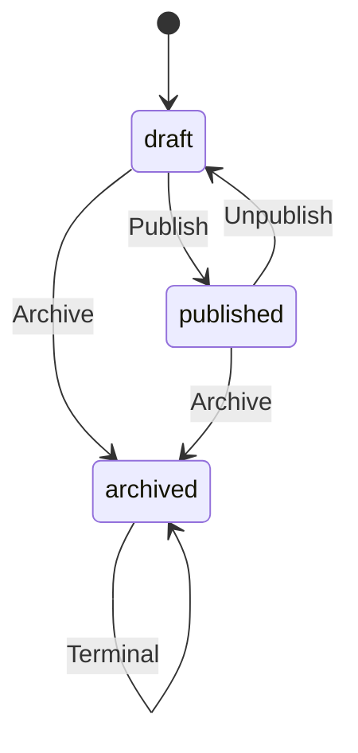
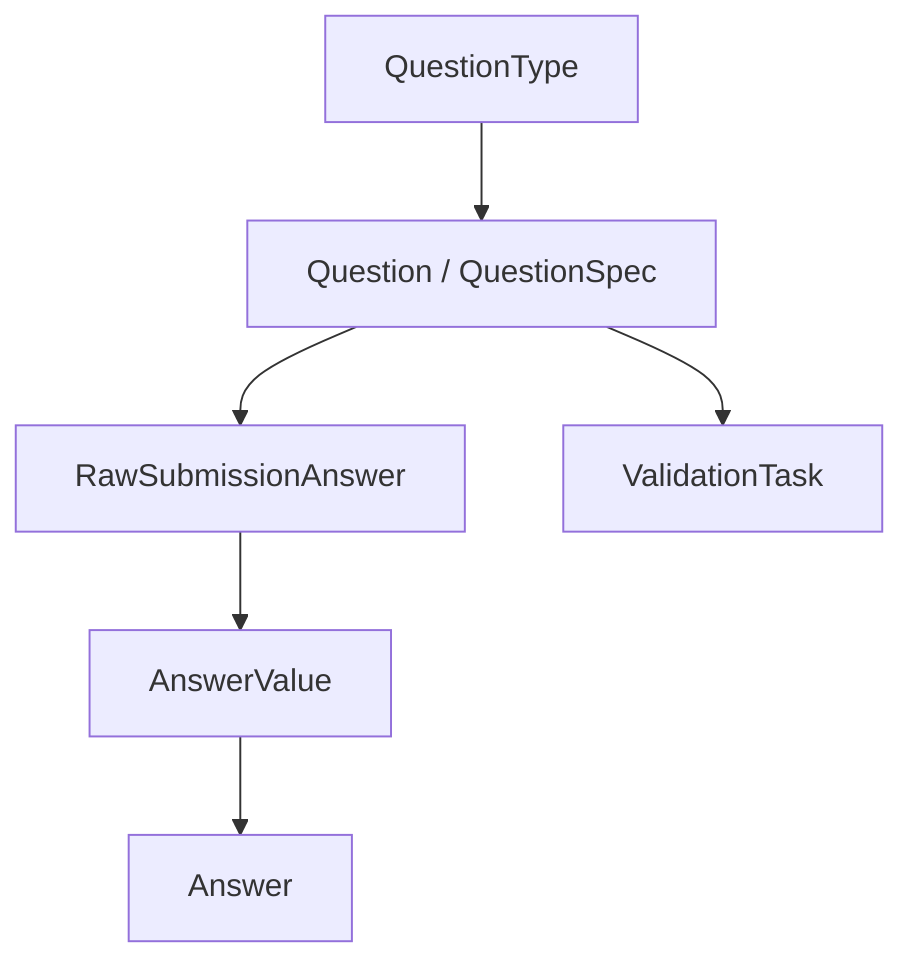
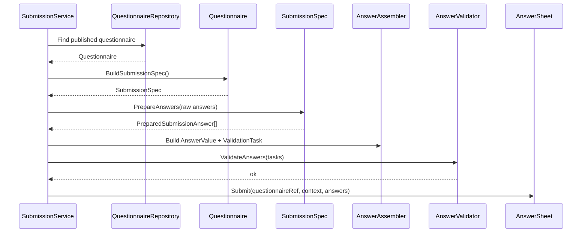

# Questionnaire 模型：Questionnaire / Question / SubmissionSpec

> 本文是 Survey 模块文档的第二篇。
>
> 上一篇《00-模块总览》说明了 Survey 的模块定位：Survey 是作答事实域，负责问卷模板与答卷事实，不负责测评解释。
>
> 本文聚焦模板侧模型，围绕三个核心问题展开：
>
> 1. `Questionnaire` 如何作为问卷模板聚合根组织模型、版本与生命周期；
> 2. `Question / QuestionType / AnswerValue / Validator` 如何共同支撑题型扩展；
> 3. `SubmissionSpec` 如何表达“已发布问卷的可提交规格”，并服务于后续 AnswerSheet 提交链路。

---

## 1. 结论先行

`Questionnaire` 是 Survey 模块中的问卷模板聚合根。

它负责回答：

```text
这份问卷是什么？
当前版本是多少？
有哪些题目？
每道题是什么题型？
每道题有哪些选项和校验规则？
这份问卷当前是否允许被正式提交？
```

`Question` 是 `Questionnaire` 聚合内部的题目模型。

它负责表达：

```text
题目编码；
题型；
题干；
选项；
基础分值；
提交校验规则；
题型相关元数据。
```

`SubmissionSpec` 是 `Questionnaire` 面向答卷提交链路暴露的**可提交规格**。

它负责表达：

```text
这份已发布问卷基于哪个 QuestionnaireCode + QuestionnaireVersion；
允许提交哪些 question_code；
每道题的 question_type 是什么；
每道题有哪些 validation rules；
客户端提交的答案是否属于当前问卷规格。
```

一句话概括：

> **Questionnaire 管“可提交的问卷模板”，Question 管“题目结构与题型语义”，SubmissionSpec 管“这份已发布问卷如何被提交”。**

---

## 2. 本文边界

本文只讨论模板侧模型。

本文重点：

```text
Questionnaire 聚合根；
Question 题目模型；
QuestionType 题型语义；
Option / ValidationRule；
题型扩展 SOP；
SubmissionSpec。
```

本文不展开：

```text
AnswerSheet 提交事实模型；
collection-server 到 qs-apiserver 的提交服务链路；
DurableStore / Outbox；
Evaluation 执行与报告生成。
```

这些分别由后续文档承接：

```text
02-AnswerSheet模型-AnswerSheet-Answer-AnswerValue.md
03-测评服务查询与提交链路.md
04-测评提交事件幂等与Outbox出站链路.md
```

---

# 第一部分：Questionnaire 聚合根的模型设计与生命周期

---

## 3. Questionnaire 的模型定位

`Questionnaire` 是问卷模板聚合根。

DDD 中的聚合是可以作为整体处理的一组领域对象；聚合根负责保护聚合整体一致性，外部引用通常应指向聚合根，而不是直接指向内部对象。这个原则适合用来理解 `Questionnaire` 与内部 `Question / Option / ValidationRule` 的关系。

`Questionnaire` 的核心职责不是保存一组题目字段，而是管理一份可维护、可发布、可提交、可追溯的问卷模板。

它负责：

```text
维护问卷业务编码；
维护问卷版本；
维护问卷生命周期；
维护题目集合；
维护题型、选项、校验规则；
发布后提供 SubmissionSpec；
产生问卷生命周期事件。
```

它不负责：

```text
保存某次用户提交的答案；
计算因子分；
判断风险等级；
生成报告；
推进 Assessment 状态机。
```

这些分别属于 AnswerSheet、Scale、Evaluation。

---

## 4. Questionnaire 的核心结构

`Questionnaire` 可以抽象为：

```text
Questionnaire
├── ID
├── Code
├── Version
├── Type
├── Title / Description / ImgURL
├── Status
├── RecordRole
├── Questions
└── DomainEvents
```

字段可以分成四类。

| 类型 | 字段 | 说明 |
| --- | --- | --- |
| 标识信息 | ID / Code / Version | 标识一份问卷及其具体版本 |
| 展示信息 | Title / Description / ImgURL | 用于后台管理和前台展示 |
| 模板规则 | Type / RecordRole / Questions | 决定问卷如何被填写 |
| 治理信息 | Status / DomainEvents | 生命周期、发布、归档和事件出站 |

其中最关键的是：

```text
Code + Version + Status + Questions
```

因为它们共同决定：

```text
这份问卷当前能不能提交；
提交时有哪些题；
每道题如何接收答案；
历史答卷应该引用哪版模板。
```

---

## 5. Code 与 Version

`Code` 与 `Version` 是 Questionnaire 最重要的业务标识组合。

| 字段 | 语义 |
| --- | --- |
| Code | 问卷业务编码，跨版本保持稳定 |
| Version | 问卷版本，标识一个确定模板快照 |

`AnswerSheet` 不能只引用 `QuestionnaireCode`。

它必须引用：

```text
QuestionnaireCode + QuestionnaireVersion
```

原因是：

```text
Questionnaire 是会演进的模板；
AnswerSheet 是已经发生的历史事实；
历史事实必须能够追溯提交时使用的是哪版模板。
```

如果只保存 QuestionnaireCode，会导致：

```text
后台修改问卷后，历史答卷不知道基于哪版题目提交；
Scale 无法确认量表规则基于哪版问卷设计；
Evaluation 无法安全判断答卷和规则是否匹配。
```

所以，在 Survey 中：

```text
Code 解决“是哪一份问卷”；
Version 解决“是哪一版问卷”。
```

---

## 6. Questionnaire.Type 与 EvaluationModel.Type 的边界

`Questionnaire.Type` 表示问卷模板类型。

它回答的是：

```text
这份问卷模板在采集侧属于什么类型？
```

例如：

```text
medical_scale；
general_survey；
screening；
其他采集模板类型。
```

但它不能替代 `EvaluationModel.Type`。

| 概念 | 回答的问题 | 归属 |
| --- | --- | --- |
| Questionnaire.Type | 这份问卷模板是什么类型 | Survey |
| EvaluationModel.Type | 这份答卷后续用什么模型解释 | Evaluation / ModelResolver |

在医学量表场景中，二者可能暂时看起来一致。

```text
Questionnaire.Type = medical_scale
EvaluationModel.Type = medical_scale
```

但未来支持 MBTI、Big Five、DISC 等模型时，Survey 不应该直接知道所有测评解释模型。

Survey 的稳定职责是：

```text
提供 QuestionnaireRef；
保存 AnswerSheet；
发布 answersheet.submitted。
```

具体使用哪种测评模型解释，应由 Plan / EvaluationModelResolver / Evaluation 决定。

---

## 7. Questionnaire 生命周期

Questionnaire 生命周期用于控制模板何时可编辑、何时可提交、何时退出正常业务链路。

状态可以抽象为：

```text
draft；
published；
archived。
```



### 7.1 Draft

`draft` 表示问卷仍在维护中。

允许：

```text
编辑标题和描述；
调整题目；
调整选项；
调整校验规则；
保存草稿；
发布。
```

不应该允许：

```text
作为正式提交规格；
生成正式 AnswerSheet；
被 Evaluation 当成正式模板解释历史答卷。
```

### 7.2 Published

`published` 表示问卷结构已经可以作为提交规格来源。

发布态问卷应该能够：

```text
BuildSubmissionSpec；
接收 AnswerSheet 提交；
被 AnswerSheet.QuestionnaireRef 引用；
被 Scale 作为 QuestionnaireVersion 绑定对象；
被 Evaluation 用于版本一致性校验。
```

发布态不应该被随意修改结构。

如果要修改题目、题型、选项、校验规则，应该产生新版本，而不是直接覆盖已发布版本。

### 7.3 Archived

`archived` 表示问卷退出正常业务链路。

归档不等于删除。

历史 AnswerSheet 仍可能引用这个问卷版本，因此归档后的模板仍需要能够被查询、审计和追溯。

---

## 8. Questionnaire 的聚合不变量

`Questionnaire` 至少需要保护以下不变量。

| 不变量 | 说明 |
| --- | --- |
| Code 不能为空 | 问卷必须有稳定业务编码 |
| Version 不能为空 | 问卷必须有确定版本 |
| Title 不能为空 | 问卷必须有基本展示名称 |
| QuestionCode 不能重复 | 同一问卷版本内题目编码必须唯一 |
| QuestionType 必须合法 | 题型是提交规格和 AnswerValue 的基础 |
| Published 才能提交 | 只有发布态问卷可以生成正式 SubmissionSpec |
| Archived 不再维护 | 归档问卷退出正常编辑和提交链路 |

这些不变量决定了：

```text
Questionnaire 不应该被当成普通 DTO 或普通表记录直接更新。
```

应用层服务应通过聚合行为或领域服务完成修改，而不是绕过模型直接修改内部题目结构。

---

# 第二部分：Question 与 AnswerValue 的题型扩展设计

---

## 9. Question 的模型定位

`Question` 是 `Questionnaire` 聚合内部的题目模型。

它负责表达：

```text
这道题在模板中是什么；
它是什么题型；
它有哪些选项；
它有哪些提交校验规则；
它是否有基础分值或题型元数据。
```

它不负责表达：

```text
某次用户实际提交了什么答案；
某次答案是否命中风险等级；
某次报告应该展示什么结论。
```

这些属于 AnswerSheet / Evaluation。

`Question` 可以抽象为：

```text
Question
├── QuestionCode
├── QuestionType
├── Title / Content
├── Options
├── ValidationRules
├── Score / Weight / Meta
└── DisplayMeta
```

不同题型会使用其中不同字段。

---

## 10. 当前题型模型

Survey 常见题型可以抽象为：

```text
Section；
Radio；
Checkbox；
Text；
Textarea；
Number。
```

它们的语义差异如下。

| QuestionType | AnswerValue | 典型 Raw 输入 | 典型校验 |
| --- | --- | --- | --- |
| Section | EmptyValue / StringValue | nil / string | 通常不参与正式答案校验 |
| Radio | OptionValue | string | required / option exists |
| Checkbox | OptionsValue | []string | required / min_selected / max_selected / options exist |
| Text | StringValue | string | required / min_length / max_length / pattern |
| Textarea | StringValue | string | required / min_length / max_length |
| Number | NumberValue | number | required / min / max |

核心关系是：

```text
QuestionType 决定 AnswerValue 类型；
AnswerValue 类型决定校验器如何读取值；
ValidationRule 决定这个值必须满足哪些约束。
```

---

## 11. Question 与 AnswerValue 的配对关系

Question 是模板侧语义，AnswerValue 是事实侧语义。



可以按下面方式理解。

| QuestionType | AnswerValue | 说明 |
| --- | --- | --- |
| Radio | OptionValue | 一个选项编码 |
| Checkbox | OptionsValue | 多个选项编码 |
| Text / Textarea | StringValue | 文本值 |
| Number | NumberValue | 数值 |
| Section | EmptyValue / StringValue | 分组说明类内容，通常不参与正式作答 |

后续新增题型时，必须同时回答：

```text
模板侧如何描述它？
提交侧 raw value 如何表示？
领域侧 AnswerValue 如何表示？
校验器如何校验？
持久化如何保存？
查询 DTO 如何返回？
前端如何渲染？
Evaluation 是否需要消费它？
```

---

## 12. 题型校验与基础分值边界

题型校验属于 Survey。

原因是它回答：

```text
用户提交的答案是否符合这份问卷模板的作答要求？
```

题型校验分两层。

第一层是规格校验：

```text
question_code 是否属于当前问卷版本；
question_type 是否与模板一致；
raw value 是否能被当前题型接受；
提交答案是否能转换成对应 AnswerValue。
```

第二层是规则校验：

```text
required；
min_length / max_length；
min_value / max_value；
min_selected / max_selected；
option exists；
pattern。
```

边界是：

```text
SubmissionSpec 管“这份答案是否属于当前问卷规格”；
AnswerValidator 管“这份答案是否满足题目校验规则”。
```

### 12.1 基础分值边界

Questionnaire 模板中可以定义基础分值。

例如：

```text
Radio 题：
  A 选项 = 0 分
  B 选项 = 1 分
  C 选项 = 2 分
```

这些基础分值属于模板侧配置，可以由 Question / Option / Meta 表达。

它们的语义是：

```text
某个答案在当前问卷模板下对应的单题基础分。
```

Survey 可以提供：

```text
选项基础分；
单题基础分；
Answer.Score 的输入来源。
```

Survey 不应该提供：

```text
FactorScore；
ScaleTotalScore；
RiskLevel；
InterpretationResult；
ReportConclusion。
```

一句话：

> **Survey 可以保存基础分值，但不能解释测评结果。**

---

## 13. 题型扩展设计原则

### 13.1 QuestionType 是模板侧事实

`QuestionType` 属于 Questionnaire / QuestionSpec。

它说明：

```text
这道题在模板上是什么题型。
```

客户端提交的 question_type 只能作为待校验输入，不是事实源。

### 13.2 AnswerValue 是事实侧语义

`AnswerValue` 属于 Answer / AnswerSheet。

它说明：

```text
这次提交中，用户对某道题实际提交了什么类型化答案。
```

RawValue 进入系统后，应尽早被转成 AnswerValue。

### 13.3 ValidationRule 是提交约束语义

ValidationRule 说明：

```text
这个 AnswerValue 需要满足哪些提交约束。
```

例如：

```text
required；
min_length；
max_length；
min_value；
max_value；
min_selected；
max_selected；
pattern；
option_exists。
```

### 13.4 不要让 Question 承担所有职责

不建议让 Question 同时负责：

```text
题目展示；
答案解析；
答案校验；
答案持久化；
答案计分；
报告解释。
```

合理拆分是：

| 对象 | 负责 |
| --- | --- |
| Question | 模板结构 |
| SubmissionSpec | 提交规格 |
| AnswerValueFactory / Assembler | RawValue 到 AnswerValue 的转换 |
| AnswerValidator | 提交规则校验 |
| AnswerSheet | 提交事实保存 |
| Scale / Evaluation | 计分与解释 |

---

## 14. 新增题型 SOP

新增题型不是只加一个枚举。

假设新增 `Rating` 题型，建议按以下步骤执行。

### Step 1：定义 QuestionType

新增：

```text
QuestionTypeRating
```

并明确业务语义：

```text
Rating 表示评分题，用户在指定范围内选择一个等级值。
```

### Step 2：扩展 Question / Option / Meta

如果 Rating 需要最小值、最大值、步长、展示标签，应明确这些配置放在哪里。

例如：

```text
min = 1
max = 5
step = 1
labels = {1: 很不同意, 5: 非常同意}
```

这些属于模板配置，不属于 AnswerSheet。

### Step 3：扩展 SubmissionSpec

SubmissionSpec 需要暴露 Rating 的提交规格。

例如：

```text
question_code = Q001
question_type = rating
validation_rules = [...]
meta = min/max/step
```

### Step 4：扩展 RawValue -> AnswerValue

Rating 的答案值可以设计成：

```text
NumberValue
```

也可以设计成专属：

```text
RatingValue
```

取舍标准：

| 方案 | 适用场景 |
| --- | --- |
| 复用 NumberValue | Rating 只是普通数值输入的展示变体 |
| 新增 RatingValue | Rating 有专属语义、标签、等级、计分差异 |

如果 Rating 后续会被 Scale / Evaluation 强依赖，建议使用专属值对象，避免语义丢失。

### Step 5：扩展 AnswerValidator

新增或复用校验规则：

```text
required；
min_value；
max_value；
step。
```

如果 Rating 使用 NumberValue，可以复用数值校验。

如果使用 RatingValue，需要扩展 adapter。

### Step 6：扩展存储与查询映射

确认 AnswerSheet 持久化时如何保存：

```text
value type；
raw value；
question type；
score。
```

查询返回时，也要确保前端能知道：

```text
这道题是 rating；
提交值是多少；
展示标签如何还原。
```

### Step 7：补测试

至少补三类测试：

```text
Questionnaire.BuildSubmissionSpec 包含 rating 题；
SubmissionSpec.PrepareAnswers 能处理 rating raw value；
AnswerValidator 能校验 rating 范围。
```

---

# 第三部分：SubmissionSpec 的设计与使用

---

## 15. 为什么需要 SubmissionSpec

如果没有 SubmissionSpec，提交链路通常会变成：

```text
application service 加载 Questionnaire；
application service 遍历 questions；
application service 拼 questionMap；
application service 判断 question_code 是否存在；
application service 从 question 里拿 question_type；
application service 提取 validation_rules；
application service 拼 validation task；
application service 再创建 AnswerValue。
```

这种写法的问题是：

```text
application service 过度理解 Questionnaire 内部结构；
Questionnaire 没有显式表达“我如何被提交”；
提交规格是流程代码临时拼出来的；
题型事实容易被客户端 DTO 污染；
后续新增题型时改动范围不清楚。
```

`SubmissionSpec` 的目标是：

```text
让 Questionnaire 显式暴露“可提交规格”；
让 application service 不再直接拆 Questionnaire 内部结构；
让题目归属、题型一致性、校验规则来源在规格层完成；
让 AnswerSheet.Submit 只接收已经准备好的答案事实。
```

换句话说：

> **SubmissionSpec 是 Questionnaire 到 AnswerSheet 之间的提交规格边界。**

---

## 16. SubmissionSpec 的核心结构

`SubmissionSpec` 可以抽象为：

```text
SubmissionSpec
├── QuestionnaireRef
├── QuestionSpecs
└── PrepareAnswers(rawAnswers)
```

其中：

```text
QuestionnaireRef = Code + Version + Title
QuestionSpecs = 可提交题目规格集合
```

QuestionSpec 是 Question 的提交侧视图。

它通常包含：

```text
QuestionCode；
QuestionType；
ValidationRules；
Options / Meta；
Score / Weight。
```

它不一定等同于完整 Question 模型。

因为提交链路只需要关注：

```text
这道题能不能提交；
提交值应该是什么类型；
提交值需要满足哪些规则。
```

---

## 17. SubmissionSpec 的核心职责

SubmissionSpec 至少承担五个职责。

| 职责 | 说明 |
| --- | --- |
| 固化 QuestionnaireRef | 保存 code / version / title，作为 AnswerSheet 引用来源 |
| 固化 QuestionSpec | 将可提交题目转换成提交侧题目规格 |
| 校验题目归属 | 拒绝不属于当前问卷版本的 question_code |
| 校验题型一致性 | 客户端提交题型必须与问卷规格一致 |
| 输出准备结果 | 生成 PreparedSubmissionAnswer，供后续构造 AnswerValue 与 ValidationTask |

### 17.1 固化 QuestionnaireRef

SubmissionSpec 必须携带 QuestionnaireRef。

```text
QuestionnaireRef
├── Code
├── Version
└── Title
```

这样 `AnswerSheet.Submit` 可以直接使用这个引用，而不是由 application service 临时拼接。

### 17.2 固化 QuestionSpec

QuestionSpec 是题目的提交侧规格。

它只需要表达提交链路关心的内容：

```text
QuestionCode；
QuestionType；
ValidationRules；
Options；
Meta；
Score。
```

好处是：

```text
提交链路不依赖完整 Questionnaire 内部结构；
Questionnaire 可以保护自身聚合内部不被外部随意修改；
提交规格可以按需要裁剪。
```

### 17.3 校验题目归属

提交时，客户端可能传入不存在的 question_code。

SubmissionSpec 应该直接拒绝：

```text
这道题不属于当前问卷版本。
```

这是模板规格问题，不是 AnswerSheet 聚合问题。

### 17.4 校验题型一致性

客户端提交 DTO 中可能包含 question_type。

但客户端不是题型事实源。

真正的题型事实源是：

```text
Questionnaire -> SubmissionSpec -> QuestionSpec
```

因此 SubmissionSpec 要确保：

```text
客户端提交的 question_type 与问卷规格一致。
```

长期更理想的方向是：

```text
提交 DTO 只提交 question_code + value；
question_type 完全由 SubmissionSpec 推导。
```

当前阶段保留 question_type 也可以，但必须把它当成待校验输入，而不是业务事实。

### 17.5 输出 PreparedSubmissionAnswer

SubmissionSpec.PrepareAnswers 应该输出规格化结果：

```text
PreparedSubmissionAnswer
├── QuestionCode
├── QuestionType
├── RawValue
└── ValidationRules
```

这个结果会继续流向：

```text
AnswerValue factory / assembler；
ValidationTask assembler；
AnswerValidator；
AnswerSheet.Submit。
```

---

## 18. SubmissionSpec 与 AnswerValidator 的边界

SubmissionSpec 不应该变成完整规则引擎。

它负责：

```text
这份答案是否属于当前问卷规格。
```

AnswerValidator 负责：

```text
这份答案是否满足题目的校验规则。
```

区别如下。

| 问题 | 归属 |
| --- | --- |
| question_code 是否存在 | SubmissionSpec |
| question_type 是否与模板一致 | SubmissionSpec |
| raw value 是否能转换成 AnswerValue | AnswerValueFactory / Validator adapter |
| required 是否满足 | AnswerValidator |
| min/max 是否满足 | AnswerValidator |
| radio 选项是否合法 | AnswerValueFactory / AnswerValidator |
| checkbox 数量是否合法 | AnswerValidator |
| 文本长度是否合法 | AnswerValidator |

这种分工避免两个问题：

```text
SubmissionSpec 膨胀成规则引擎；
AnswerValidator 反过来依赖完整 Questionnaire 聚合。
```

---

## 19. SubmissionSpec 在提交流程中的位置

完整提交链路如下。



核心约束：

```text
只有 published Questionnaire 能生成 SubmissionSpec；
只有通过 SubmissionSpec 准备过的答案才能进入 AnswerValue 构造；
只有通过 AnswerValidator 的答案才能进入 AnswerSheet.Submit；
AnswerSheet.Submit 只表达提交事实，不解释答案含义。
```

---

## 20. SubmissionSpec 与 AnswerSheet.Submit 的协作边界

Questionnaire 与 AnswerSheet 不是父子关系。

更准确地说：

```text
Questionnaire 产生可提交规格；
AnswerSheet 引用 QuestionnaireRef；
AnswerSheet 不拥有 Questionnaire；
AnswerSheet 不反向修改 Questionnaire。
```

提交时：

```text
Questionnaire.BuildSubmissionSpec()
  -> SubmissionSpec.PrepareAnswers()
  -> AnswerSheet.Submit(spec.QuestionnaireRef(), submissionContext, answers, filledAt)
```

这样设计的好处是：

| 好处 | 说明 |
| --- | --- |
| 模板与事实分离 | 后续修改 Questionnaire 不影响历史 AnswerSheet |
| 提交规格稳定 | AnswerSheet 基于明确 QuestionnaireRef 提交 |
| 下游可追溯 | Evaluation 可以知道答卷来自哪个问卷版本 |
| 扩展题型更清晰 | 题型扩展从 QuestionType 到 AnswerValue 有明确路径 |

---

## 21. 与 Scale / Evaluation 的边界

### 21.1 Questionnaire 与 Scale

Scale 可以引用 QuestionnaireRef。

例如：

```text
MedicalScale
  -> QuestionnaireCode
  -> QuestionnaireVersion
```

这表示：

```text
这份量表规则是基于哪份问卷版本设计的。
```

但 Questionnaire 不应该引用 Scale。

原因是：

```text
Survey 不应该知道答案后续如何被解释；
Scale 是规则域，Questionnaire 是采集模板域；
同一份问卷模板未来可能用于不同测评模型。
```

### 21.2 Questionnaire 与 Evaluation

Evaluation 可以读取 AnswerSheet 的 QuestionnaireRef，并结合 Plan 或 ModelResolver 找到 EvaluationModelRef。

但 Questionnaire 不直接参与 Assessment 状态机。

```text
Questionnaire 负责“能不能提交”；
Evaluation 负责“提交后如何评估”。
```

---

## 22. 当前模型成熟度评价

| 方面 | 评价 |
| --- | --- |
| Questionnaire 聚合边界 | 与 AnswerSheet 分离，模板和事实职责清楚 |
| 生命周期语义 | draft / published / archived 边界清楚 |
| 版本引用 | Code + Version 为 AnswerSheet 和 Scale 提供追溯锚点 |
| Question 模型 | 支撑题型、选项、校验规则和基础分值表达 |
| SubmissionSpec | 已将可提交规格显式建模 |
| 题型事实源 | 以 Question / SubmissionSpec 为准，不以客户端 DTO 为准 |
| 题型校验边界 | 区分 SubmissionSpec 的规格校验与 AnswerValidator 的规则校验 |
| 基础分值边界 | Question / Option 只表达基础分值，不表达因子分、风险等级和报告结论 |
| 模块边界 | Questionnaire 不依赖 Scale / Evaluation |

综合判断：

```text
Questionnaire 模型能够承担 Survey 模板侧的核心职责：定义可提交问卷结构、保护版本语义，并为 AnswerSheet 提交提供稳定 SubmissionSpec。
```

---

## 23. 后续演进方向

### 23.1 题型扩展矩阵

建议为每种题型补充矩阵文档：

```text
QuestionType -> QuestionSpec -> AnswerValue -> ValidationRule -> Storage -> Query DTO -> Frontend Renderer
```

这会让新增题型有清晰路径。

### 23.2 SubmissionSpec 测试增强

建议覆盖：

```text
未知 question_code；
question_type 不一致；
重复 question_code；
空答案；
选项不存在；
required 失败；
多选数量边界；
数值边界。
```

### 23.3 DTO question_type 收敛

长期可以考虑：

```text
客户端只提交 question_code + value；
question_type 完全由 SubmissionSpec 推导。
```

这样可以进一步减少客户端对题型事实源的影响。

### 23.4 QuestionSnapshot / QuestionSpec 强化

如果 `QuestionSpec` 还暴露完整 Question 内部结构，可以继续收敛为只读提交规格。

目标是：

```text
application 只能使用提交需要的信息；
不能绕过 Questionnaire 聚合修改题目内部结构。
```

---

## 24. 不建议做的事情

| 不建议 | 原因 |
| --- | --- |
| 让 Questionnaire 直接生成 AnswerSheet | 会让模板聚合承担事实聚合职责 |
| 让 Questionnaire 依赖 Scale | 会污染 Survey 边界 |
| 让 SubmissionSpec 执行所有校验规则 | 它会膨胀成规则引擎 |
| 让客户端 question_type 成为事实源 | 客户端输入不可信，题型事实应来自模板 |
| 新增题型只加枚举 | 题型扩展是 Question + AnswerValue + Validator + Storage 的系统性改动 |
| 在 Survey 中计算因子分和风险等级 | 会把 Scale / Evaluation 的解释职责塞回作答事实域 |
| 把 Option score 等同于测评结果 | Option score 只是模板基础分，不是 FactorScore / RiskLevel |
| 为未来 MBTI 修改 Questionnaire 主模型 | MBTI 是新的测评规则模型，不是 Survey 模板职责变化 |

---

## 25. 代码锚点

| 类型 | 路径 |
| --- | --- |
| Questionnaire 聚合 | `internal/apiserver/domain/survey/questionnaire/questionnaire.go` |
| Questionnaire 生命周期 | `internal/apiserver/domain/survey/questionnaire/lifecycle.go` |
| Questionnaire 类型 | `internal/apiserver/domain/survey/questionnaire/types.go` |
| Question 模型 | `internal/apiserver/domain/survey/questionnaire/question.go` |
| SubmissionSpec | `internal/apiserver/domain/survey/questionnaire/submission_spec.go` |
| 提交应用服务 | `internal/apiserver/application/survey/answersheet/submission_service.go` |
| 答案准备 | `internal/apiserver/application/survey/answersheet/submission_answer_assembler.go` |
| AnswerValue | `internal/apiserver/domain/survey/answersheet/answer.go` |
| AnswerSheet.Submit | `internal/apiserver/domain/survey/answersheet/answersheet.go` |
| 校验适配 | `internal/apiserver/domain/survey/answersheet/validation_adapter.go` |

---

## 26. Verify

修改 Questionnaire、SubmissionSpec 或题型扩展逻辑后，建议执行：

```bash
go test ./internal/apiserver/domain/survey/questionnaire/...
go test ./internal/apiserver/domain/survey/answersheet/...
go test ./internal/apiserver/application/survey/answersheet/...
```

如果改动涉及 DTO、REST 或 gRPC 契约：

```bash
go test ./internal/apiserver/interface/...
go test ./internal/collection-server/...
```

如果改动涉及文档链接或事件契约：

```bash
make docs-hygiene
```

---

## 27. 面试与宣讲口径

### 27.1 30 秒版本

```text
Questionnaire 在 Survey 域里不是简单题目列表，而是可发布、可提交的问卷模板聚合。
它管理问卷 code、version、状态、题目、选项和校验规则，并通过 SubmissionSpec 暴露“已发布问卷如何被提交”。
SubmissionSpec 负责固化问卷版本、题目规格、题型一致性和校验规则来源，让 application service 不再直接拆 Questionnaire 内部结构，也避免客户端 DTO 成为题型事实源。
```

### 27.2 3 分钟版本

```text
在 Survey 模块里，我把模板和事实拆开：Questionnaire 管可提交模板，AnswerSheet 管已经发生的提交事实。

Questionnaire 的核心不是保存一组题目，而是管理问卷 code、version、发布状态、题目结构和提交规格。只有 published 状态的 Questionnaire 才能 BuildSubmissionSpec。

SubmissionSpec 是 Questionnaire 到 AnswerSheet 之间的提交规格边界，用来表达“这份已发布问卷如何被提交”。它会校验 question_code 是否属于当前问卷版本，校验客户端传入的 question_type 是否与模板一致，并输出 PreparedSubmissionAnswer，供后续构造 AnswerValue 和 ValidationTask。

这样提交链路就更清楚：application service 只负责加载问卷、调用 BuildSubmissionSpec、准备答案、调用 AnswerValidator，最后再调用 AnswerSheet.Submit。题型事实来自 Questionnaire，而不是客户端 DTO。

另外，题型扩展不是简单加枚举。新增题型会同时影响 Question、SubmissionSpec、AnswerValue、AnswerValidator、存储映射和前端渲染，所以题型扩展应该作为 Survey 域的核心扩展机制来设计。
```

### 27.3 高频追问

| 追问 | 回答要点 |
| --- | --- |
| 为什么 Questionnaire 是聚合根？ | 它保护问卷模板内部题目、题型、选项、校验规则和生命周期一致性 |
| 为什么需要 SubmissionSpec？ | 把可提交规格从 application helper 收回到 Questionnaire 模型侧 |
| 为什么客户端 question_type 不可信？ | 题型事实应来自已发布模板，客户端输入只能作为待校验数据 |
| SubmissionSpec 和 AnswerValidator 有什么区别？ | 前者管题目归属和规格，后者执行具体校验规则 |
| 为什么 AnswerSheet 不直接持有 Questionnaire？ | 答卷是历史事实，只引用确定问卷版本，不拥有模板聚合 |
| 新增题型为什么复杂？ | 题型会同时影响 Question、AnswerValue、校验、存储、DTO 和前端展示 |
| Questionnaire.Type 能否等于 EvaluationModel.Type？ | 不能。前者是模板类型，后者是测评解释模型类型 |

---

## 28. 下一篇文档

下一篇建议维护：

```text
02-AnswerSheet模型-AnswerSheet-Answer-AnswerValue.md
```

重点回答：

```text
AnswerSheet 如何表达一次完整提交事实；
SubmissionContext 为什么必须入模；
Answer / AnswerValue 如何承载答案值；
Answer.Score 的语义边界是什么；
AnswerSheetSubmittedEvent 如何从提交事实产生。
```