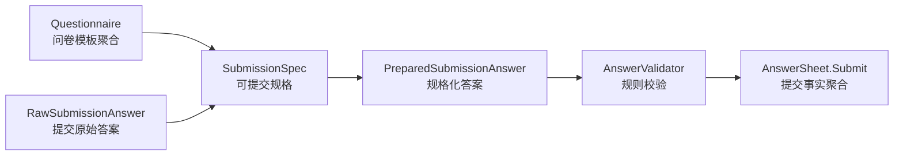
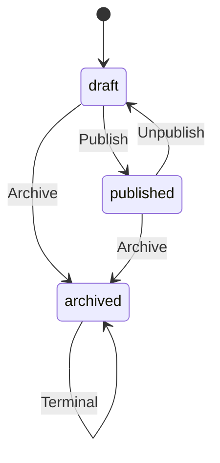
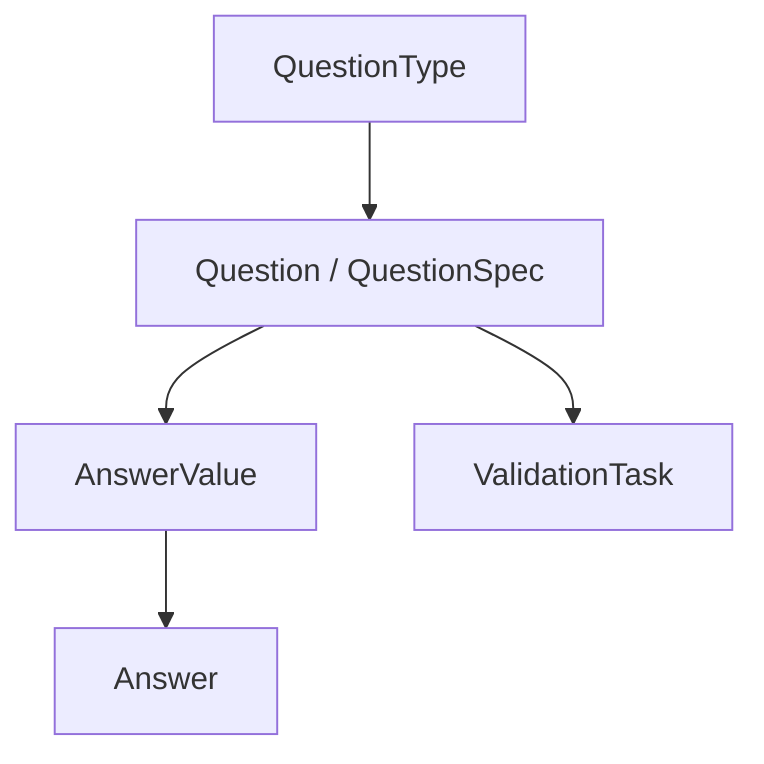
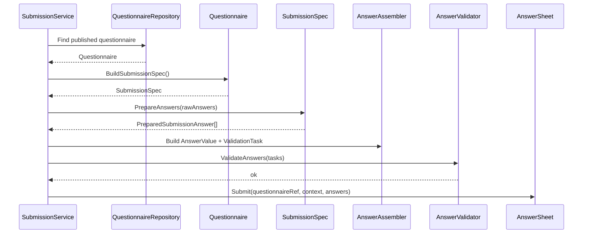

# Questionnaire 模型与 SubmissionSpec

> 本文是 Survey 模块文档重建的第二篇。
>
> 上一篇《00-模型总览》已经说明：Survey 是作答事实域，内部拆成 `Questionnaire` 与 `AnswerSheet` 两个核心聚合。
>
> 本文聚焦模板侧模型：`Questionnaire` 如何表达一份可维护、可发布、可提交的问卷模板；`SubmissionSpec` 如何把“已发布问卷的可提交规格”从 application 流程中收回到领域模型侧；以及题型扩展为什么必须同时考虑 `Question` 与 `AnswerValue`。

---

## 1. 结论先行

`Questionnaire` 不是简单的问题列表，也不是后台管理页上的表单配置。

它在 Survey 域中承担三个核心职责：

```text
1. 管理问卷模板结构；
2. 管理问卷版本与发布状态；
3. 为答卷提交提供稳定的 SubmissionSpec。
```

其中 `SubmissionSpec` 是这次 Survey 强模型重构中最关键的模板侧抽象。

它解决的问题是：

```text
application service 不应该自己理解 Questionnaire 内部结构；
客户端 DTO 不应该成为题型事实源；
答卷提交必须基于已发布问卷版本；
题目归属、题型一致性、校验规则来源应该由问卷规格统一约束。
```

一句话概括：

> **Questionnaire 管“可提交的问卷模板”，SubmissionSpec 管“这份已发布问卷如何被提交”。**

---

## 2. Questionnaire 在 Survey 模块中的位置

Survey 模块的核心链路是：

```text
Questionnaire
  -> BuildSubmissionSpec
  -> SubmissionSpec.PrepareAnswers
  -> AnswerValue / ValidationTask
  -> AnswerValidator
  -> AnswerSheet.Submit
```

其中 Questionnaire 处在提交链路的上游。



这个链路的重点是：

```text
Questionnaire 是提交规格的来源；
SubmissionSpec 是提交链路的模板侧边界；
AnswerSheet 只接收已经经过规格准备和规则校验的答案事实。
```

---

## 3. Questionnaire 的模型定位

Questionnaire 是问卷模板聚合根。

它负责回答：

```text
这份问卷叫什么？
业务编码是什么？
当前版本是多少？
处于什么状态？
有哪些题目？
每道题是什么题型？
每道题有哪些选项？
每道题有哪些提交校验规则？
这份问卷现在是否允许提交？
```

它不负责回答：

```text
用户提交了什么答案；
答案是否已经形成一次提交事实；
答案如何计算因子分；
答案如何解释成风险等级；
报告怎么生成。
```

这些分别属于 AnswerSheet、Scale、Evaluation。

---

## 4. Questionnaire 的核心属性

Questionnaire 可以抽象为以下结构。

```text
Questionnaire
├── ID
├── Code
├── Version
├── Type
├── Title / Desc / ImgURL
├── Status
├── RecordRole
├── Questions
└── DomainEvents
```

### 4.1 Code 与 Version

`Code` 与 `Version` 是 Questionnaire 最重要的业务标识组合。

| 字段 | 语义 |
| --- | --- |
| `Code` | 问卷业务编码，跨版本保持稳定 |
| `Version` | 问卷版本，标识某一个确定模板快照 |

答卷不能只保存 Questionnaire ID，也不能只保存 Questionnaire Code。

AnswerSheet 必须引用：

```text
QuestionnaireCode + QuestionnaireVersion
```

原因是：

```text
Questionnaire 是会演进的模板；
AnswerSheet 是已经发生的历史事实；
历史事实必须能追溯提交时的模板版本。
```

### 4.2 Type

`Type` 表示问卷类型。

它可以用于区分：

```text
普通问卷；
量表问卷；
未来可能的人格测评问卷；
其他业务问卷。
```

但要注意：

> Questionnaire.Type 不能替代 EvaluationModel.Type。

也就是说，一份问卷是什么类型，和这份问卷提交后使用哪种测评模型进行解释，不是同一个问题。

```text
Questionnaire.Type 解决：这份问卷的模板类型是什么；
EvaluationModel.Type 解决：这份答卷后续用什么测评模型解释。
```

当前阶段不需要让 Survey 知道 MBTI，也不应该把未来 MBTI 规则塞进 Questionnaire。

### 4.3 Status

Questionnaire 的状态控制模板生命周期。



状态含义：

| 状态 | 语义 |
| --- | --- |
| `draft` | 草稿态，可编辑题目结构和基础信息 |
| `published` | 已发布，可生成 SubmissionSpec 并接受提交 |
| `archived` | 已归档，不应再进入正常提交链路 |

### 4.4 Questions

`Questions` 是 Questionnaire 聚合内部最重要的子结构。

每道题至少需要表达：

```text
QuestionCode
QuestionType
Title / Content
Options
ValidationRules
Score / Weight / Meta
```

其中 `QuestionType` 是提交链路和题型扩展的关键锚点。

---

## 5. Questionnaire 生命周期

Questionnaire 生命周期不是简单更新字段，而是模板可用性的边界控制。

### 5.1 Draft

草稿态表示问卷仍在维护中。

允许做的事情包括：

```text
编辑标题；
编辑描述；
调整题目；
调整选项；
调整校验规则；
保存草稿；
发布。
```

不应该允许的事情：

```text
作为正式提交入口；
生成正式 AnswerSheet；
被 Evaluation 当作正式模板解释历史答卷。
```

### 5.2 Published

发布态表示问卷结构已经成为可提交规格来源。

发布态问卷应该能够：

```text
BuildSubmissionSpec；
接收 AnswerSheet 提交；
被 AnswerSheet.QuestionnaireRef 引用；
作为 Scale / Evaluation 的模板引用锚点。
```

发布态不应该被随意修改。

如果需要修改结构，应该通过版本机制产生新版本，而不是直接覆盖已发布版本。

### 5.3 Archived

归档态表示问卷退出正常业务链路。

归档不等于删除。

历史答卷仍然可能引用这个问卷版本，因此归档后的模板仍需要能够被历史查询或审计链路读取。

---

## 6. 为什么需要 SubmissionSpec

### 6.1 旧式提交流程的问题

如果没有 SubmissionSpec，提交链路通常会这样写：

```text
application service 加载 Questionnaire；
application service 遍历 questions；
application service 拼 questionMap；
application service 判断 question_code 是否存在；
application service 从 question 里拿 question_type；
application service 提取 validation_rules；
application service 拼 validation task；
application service 再创建 AnswerValue。
```

这种写法最大的问题是：

```text
application service 过度理解 Questionnaire 内部结构；
Questionnaire 没有显式表达“我如何被提交”；
提交规格是流程代码临时拼出来的；
题型事实容易被客户端 DTO 污染；
后续新增题型时改动范围不清楚。
```

### 6.2 SubmissionSpec 的设计目标

SubmissionSpec 的目标是：

```text
让 Questionnaire 显式暴露“可提交规格”；
让 application service 不再直接拆 Questionnaire 内部结构；
让题目归属、题型一致性、校验规则来源在规格层完成；
让 AnswerSheet.Submit 只接收已经准备好的答案事实。
```

换句话说：

> `SubmissionSpec` 是 Questionnaire 到 AnswerSheet 之间的防腐层。

---

## 7. SubmissionSpec 的核心职责

SubmissionSpec 至少承担五个职责。

| 职责 | 说明 |
| --- | --- |
| 固化 QuestionnaireRef | 保存 code / version / title，作为 AnswerSheet 引用来源 |
| 固化题目规格 | 将可提交问题转换成 QuestionSpec |
| 校验题目归属 | 拒绝不属于当前问卷版本的 question_code |
| 校验题型一致性 | 客户端提交题型必须与问卷规格一致 |
| 输出准备结果 | 生成 PreparedSubmissionAnswer，供后续构造 AnswerValue 与 ValidationTask |

### 7.1 固化 QuestionnaireRef

SubmissionSpec 必须携带 QuestionnaireRef。

```text
QuestionnaireRef
├── Code
├── Version
└── Title
```

这样后续 AnswerSheet.Submit 可以直接使用这个引用，而不是由 application service 自己拼接。

### 7.2 固化 QuestionSpec

QuestionSpec 是题目的提交侧规格。

它不一定等同于完整 Question 模型。

它只需要表达提交链路关心的内容：

```text
QuestionCode
QuestionType
ValidationRules
Options / Meta
```

这样做的好处是：

```text
提交链路不需要依赖完整 Questionnaire 内部结构；
Questionnaire 可以保护自身聚合内部不被外部随意修改；
提交规格可以按需要裁剪。
```

### 7.3 校验题目归属

提交时，客户端可能传入不存在的 question_code。

SubmissionSpec 应该直接拒绝：

```text
这道题不属于当前问卷版本。
```

注意：这是模板规格问题，不是 AnswerSheet 聚合问题。

AnswerSheet 不应该负责判断“某个 question_code 是否属于 Questionnaire”。

### 7.4 校验题型一致性

客户端提交 DTO 中可能包含 question_type。

但客户端不是题型事实源。

真正的题型事实源应该是：

```text
Questionnaire -> SubmissionSpec -> QuestionSpec
```

所以 SubmissionSpec 要确保：

```text
客户端提交的 question_type 与问卷规格一致。
```

或者在未来进一步优化为：

```text
提交 DTO 不再需要 question_type；
question_type 完全由 SubmissionSpec 推导。
```

当前阶段保留 question_type 也可以，但必须把它当成“待校验输入”，不能把它当成业务事实。

### 7.5 输出 PreparedSubmissionAnswer

SubmissionSpec.PrepareAnswers 应该输出规格化结果，例如：

```text
PreparedSubmissionAnswer
├── QuestionCode
├── QuestionType
├── RawValue
└── ValidationRules
```

这个结果会继续流向：

```text
AnswerValue factory
ValidationTask assembler
AnswerValidator
AnswerSheet.Submit
```

---

## 8. SubmissionSpec 与 AnswerValidator 的边界

SubmissionSpec 不应该变成完整规则引擎。

它负责的是：

```text
这份答案是否属于当前问卷规格。
```

AnswerValidator 负责的是：

```text
这份答案是否满足题目的校验规则。
```

区别如下：

| 问题 | 归属 |
| --- | --- |
| question_code 是否存在 | SubmissionSpec |
| question_type 是否与模板一致 | SubmissionSpec |
| required 是否满足 | AnswerValidator |
| min/max 是否满足 | AnswerValidator |
| radio 选项是否合法 | AnswerValidator 或 AnswerValue factory + Validator |
| checkbox 数量是否合法 | AnswerValidator |
| 文本长度是否合法 | AnswerValidator |

这种分工能避免两个问题：

1. SubmissionSpec 过度膨胀成规则引擎；
2. AnswerValidator 反过来依赖完整 Questionnaire 聚合。

---

## 9. 题型扩展为什么重要

你提到的判断是对的：

> 在 Survey 域中，题型扩展，包括 question 和 answer value，是非常重要的内容。

原因是题型不是一个孤立枚举。

新增一个题型，至少会影响下面这些位置：

```text
QuestionType
Question 模型
Question DTO / API 契约
SubmissionSpec
RawSubmissionAnswer
AnswerValue
AnswerValue factory
AnswerValidator / RuleEngine adapter
AnswerSheet 持久化映射
AnswerSheet 查询 DTO
前端渲染组件
文档与测试用例
```

所以题型扩展应该被视为 Survey 模块的核心扩展机制，而不是“加一个 enum 值”。

---

## 10. 当前题型模型

当前 Survey 常见题型可以抽象为：

```text
Section
Radio
Checkbox
Text
Textarea
Number
```

它们的语义差异如下。

| 题型 | 答案值类型 | 说明 |
| --- | --- | --- |
| Section | 通常无答案或文本占位 | 分组/说明类题目 |
| Radio | OptionValue | 单选题，答案为一个选项编码 |
| Checkbox | OptionsValue | 多选题，答案为多个选项编码 |
| Text | StringValue | 短文本 |
| Textarea | StringValue | 长文本 |
| Number | NumberValue | 数值输入 |

注意：

```text
QuestionType 决定 AnswerValue 类型；
AnswerValue 类型决定校验器如何读取值；
校验规则决定这个值是否满足提交要求。
```

因此，题型扩展必须同时考虑三层：

```text
Question 结构层
AnswerValue 值对象层
Validation 校验层
```

---

## 11. Question 与 AnswerValue 的配对关系

Survey 模块中，Question 与 AnswerValue 应该形成稳定配对关系。



可以按下面方式理解：

| QuestionType | AnswerValue | 典型 Raw 输入 | 典型校验 |
| --- | --- | --- | --- |
| Radio | OptionValue | string | required / option exists |
| Checkbox | OptionsValue | []string | required / min selected / max selected / options exist |
| Text | StringValue | string | required / min length / max length / pattern |
| Textarea | StringValue | string | required / min length / max length |
| Number | NumberValue | number | required / min / max |
| Section | StringValue 或 EmptyValue | string / nil | 通常不参与必填答案校验 |

后续如果新增题型，例如：

```text
Date
Time
Rating
MatrixRadio
MatrixCheckbox
Slider
FileUpload
```

不能只加 QuestionType，还必须明确：

```text
它对应什么 AnswerValue；
RawValue 如何解析；
ValidationRule 如何执行；
持久化如何存储；
查询 DTO 如何返回；
是否参与计分或下游 Evaluation。
```

---

## 12. 题型校验与基础分值的模板侧边界

题型校验和基础分值都应该在 Survey 文档中讲，但必须讲清楚边界。

Survey 负责的是：

```text
让 AnswerSheet 成为合法、类型化、可追溯、可作为后续评估输入的作答事实。
```

因此，Survey 应该讲：

```text
QuestionType；
QuestionSpec；
Option / Question 上的基础 score；
ValidationRule；
SubmissionSpec 如何暴露题型、选项、校验规则和基础分值信息。
```

Survey 不应该讲：

```text
因子分如何聚合；
量表总分如何计算；
风险等级如何匹配；
测评结果如何解释；
报告如何生成。
```

这些属于 Scale / Evaluation。

### 12.1 题型校验属于 Survey

题型校验属于 Survey，因为它回答的是：

```text
用户提交的答案是否符合这份问卷模板的作答要求？
```

它包括两层。

第一层是规格校验：

```text
question_code 是否属于当前问卷版本；
question_type 是否与模板一致；
raw value 是否能被当前题型接受；
提交答案是否能转换成对应 AnswerValue。
```

第二层是规则校验：

```text
required；
min_length / max_length；
min_value / max_value；
min_selected / max_selected；
option exists；
pattern。
```

前者主要由 `SubmissionSpec` 负责，后者主要由 `AnswerValidator` 负责。

也就是说：

```text
SubmissionSpec 管“这份答案是否属于当前问卷规格”；
AnswerValidator 管“这份答案是否满足题目校验规则”。
```

### 12.2 基础分值可以属于 Survey，但不能越界

Questionnaire 模板中可以定义基础分值。

例如：

```text
Radio 题：
  A 选项 = 0 分
  B 选项 = 1 分
  C 选项 = 2 分

Number / Rating 题：
  原始数值可以作为基础分
```

这些基础分值属于模板侧配置，可以被 `Question`、`Option` 或题目 meta 表达。

它们的语义是：

```text
某个答案在当前问卷模板下对应的基础分。
```

但这不是完整测评分数。

Survey 可以提供：

```text
选项基础分；
单题基础分；
Answer.Score 的输入来源。
```

Survey 不应该提供：

```text
FactorScore；
ScaleTotalScore；
RiskLevel；
InterpretationResult；
ReportConclusion。
```

### 12.3 为什么要在模板侧讲基础分值

基础分值虽然最终会服务于 Evaluation，但它的来源往往在问卷模板中。

例如单选题的每个选项天然可以有不同基础分：

```text
Q001：最近是否容易入睡？
  A：从不 = 0
  B：偶尔 = 1
  C：经常 = 2
  D：总是 = 3
```

这类基础分值需要跟随题目和选项版本一起固化。

否则后续会出现问题：

```text
用户提交的是旧版本问卷；
后台修改了选项分值；
历史答卷重新计算时到底应该使用哪个分值？
```

所以基础分值如果定义在 Question / Option 上，就必须跟随 QuestionnaireVersion 固化。

### 12.4 推荐边界表达

可以把 Survey 中的“分数”限定为：

```text
基础分值：Question / Option / Answer.Score
```

而把 Scale / Evaluation 中的“分数”限定为：

```text
聚合分值：FactorScore / TotalScore / RiskLevel / Interpretation
```

边界如下：

| 概念 | 是否属于 Survey | 说明 |
| --- | --- | --- |
| Option score | 是 | 模板侧基础分值 |
| Question score meta | 是 | 模板侧基础计分配置 |
| Answer.Score | 可以是 | 作答事实上的单题基础分 |
| FactorScore | 否 | Scale / Evaluation 聚合结果 |
| TotalScore | 否 | Scale / Evaluation 结果 |
| RiskLevel | 否 | Scale / Evaluation 解释结果 |
| ReportConclusion | 否 | Evaluation / Report 结果 |

## 13. 题型扩展的推荐设计原则

### 13.1 QuestionType 是模板侧语义

### 13.2 AnswerValue 是事实侧语义

AnswerValue 属于 Answer / AnswerSheet。

它说明：

```text
这次提交中，用户对某道题实际提交了什么类型化答案。
```

RawValue 进入系统后，应该尽早被转成 AnswerValue。

### 13.3 ValidationRule 是约束语义

ValidationRule 说明：

```text
这个 AnswerValue 需要满足哪些提交约束。
```

例如：

```text
required
min_length
max_length
min_value
max_value
min_selected
max_selected
pattern
option_exists
```

### 13.4 不要让一个对象承担所有职责

不建议让 Question 同时负责：

```text
题目展示；
答案解析；
答案校验；
答案持久化；
答案计分；
报告解释。
```

合理拆分应该是：

| 对象 | 负责 |
| --- | --- |
| Question | 模板结构 |
| SubmissionSpec | 提交规格 |
| AnswerValueFactory | RawValue 到 AnswerValue 的转换 |
| AnswerValidator | 提交规则校验 |
| AnswerSheet | 提交事实保存 |
| Scale / Evaluation | 计分与解释 |

---

## 14. 新增题型 SOP

如果未来要新增一个题型，例如 `Rating`，建议按以下步骤执行。

### Step 1：定义 QuestionType

在 Questionnaire 题型枚举中增加：

```text
QuestionTypeRating
```

同时明确它的业务语义：

```text
Rating 表示评分题，用户在指定范围内选择一个等级值。
```

### Step 2：扩展 Question / Option / Meta

如果 Rating 需要最小值、最大值、步长、展示标签，应明确这些配置放在哪里。

例如：

```text
min = 1
max = 5
step = 1
labels = {1: 很不同意, 5: 非常同意}
```

这些属于模板配置，不属于 AnswerSheet。

### Step 3：扩展 SubmissionSpec

SubmissionSpec 需要把 Rating 的提交规格暴露出去。

它至少要告诉后续链路：

```text
question_code = Q001
question_type = rating
validation_rules = [...]
meta = min/max/step
```

### Step 4：扩展 RawValue -> AnswerValue

Rating 的答案值可以设计成：

```text
NumberValue
```

也可以设计成专属：

```text
RatingValue
```

取舍标准：

| 方案 | 适用场景 |
| --- | --- |
| 复用 NumberValue | Rating 只是普通数值输入的展示变体 |
| 新增 RatingValue | Rating 有专属语义、标签、等级、计分差异 |

如果 Rating 后续会被 Scale / Evaluation 强依赖，建议使用专属值对象，避免语义丢失。

### Step 5：扩展 AnswerValidator

新增对应校验：

```text
required
min_value
max_value
step
```

如果 Rating 使用 NumberValue，可以复用数值校验。

如果使用 RatingValue，需要扩展 adapter。

### Step 6：扩展存储与查询映射

确认 AnswerSheet 持久化时如何保存：

```text
value type
raw value
question type
score
```

查询返回时，也要确保前端能知道：

```text
这道题是 rating；
提交值是多少；
展示标签如何还原。
```

### Step 7：补测试

至少补三类测试：

```text
Questionnaire.BuildSubmissionSpec 包含 rating 题；
SubmissionSpec.PrepareAnswers 能处理 rating raw value；
AnswerValidator 能校验 rating 范围。
```

---

## 15. SubmissionSpec 在提交流程中的位置

完整提交链路如下。



这条链路的核心约束：

```text
只有 published Questionnaire 能生成 SubmissionSpec；
只有通过 SubmissionSpec 准备过的答案才能进入 AnswerValue 构造；
只有通过 AnswerValidator 的答案才能进入 AnswerSheet.Submit；
AnswerSheet.Submit 只表达提交事实，不解释答案含义。
```

---

## 16. 与 AnswerSheet.Submit 的协作边界

Questionnaire 与 AnswerSheet 的关系不是父子关系。

更准确地说：

```text
Questionnaire 产生可提交规格；
AnswerSheet 引用 QuestionnaireRef；
AnswerSheet 不拥有 Questionnaire；
AnswerSheet 不反向修改 Questionnaire。
```

在提交时：

```text
Questionnaire.BuildSubmissionSpec()
  -> SubmissionSpec.PrepareAnswers()
  -> AnswerSheet.Submit(spec.QuestionnaireRef(), submissionContext, answers, filledAt)
```

这种设计的好处是：

| 好处 | 说明 |
| --- | --- |
| 模板与事实分离 | 后续修改 Questionnaire 不影响历史 AnswerSheet |
| 提交规格稳定 | AnswerSheet 基于明确 QuestionnaireRef 提交 |
| 下游可追溯 | Evaluation 可以知道答卷来自哪个问卷版本 |
| 扩展题型更清晰 | 题型扩展从 QuestionType 到 AnswerValue 有明确路径 |

---

## 17. 与 Scale / Evaluation 的边界

### 17.1 Questionnaire 与 Scale

Scale 可以引用 QuestionnaireRef。

例如：

```text
MedicalScale
  -> QuestionnaireCode
  -> QuestionnaireVersion
```

这表示：

```text
这份量表规则是基于哪份问卷版本设计的。
```

但 Questionnaire 不应该引用 Scale。

原因是：

```text
同一份问卷模板未来可能用于不同测评模型；
Survey 不应该知道答案后续如何被解释；
Scale 是规则域，Questionnaire 是采集模板域。
```

### 17.2 Questionnaire 与 Evaluation

Evaluation 在创建 Assessment 时，可能会读取 AnswerSheet 的 QuestionnaireRef，并结合 Plan 或 ModelResolver 找到 EvaluationModelRef。

但 Questionnaire 本身不应该直接参与 Assessment 状态机。

```text
Questionnaire 负责“能不能提交”；
Evaluation 负责“提交后如何评估”。
```

---

## 18. 当前实现评价

### 18.1 已完成得比较好的部分

| 方面 | 评价 |
| --- | --- |
| Questionnaire 聚合边界 | 已经与 AnswerSheet 分离 |
| 发布状态语义 | 已经具备 draft / published / archived 等生命周期表达 |
| SubmissionSpec | 已经把可提交规格从 application 流程中抽出 |
| 题型事实源 | 已经转向以 Question / SubmissionSpec 为准 |
| 题型校验边界 | 已区分 SubmissionSpec 的规格校验与 AnswerValidator 的规则校验 |
| 基础分值边界 | 已明确 Question / Option 只表达基础分值，不表达因子分、风险等级和报告结论 |
| 答案准备 | 已经通过 PreparedSubmissionAnswer 连接规格与 AnswerValue |
| 模块边界 | Questionnaire 不依赖 Scale / Evaluation |

### 18.2 仍可继续增强的部分

| 问题 | 建议 |
| --- | --- |
| QuestionSpec 是否足够独立 | 避免直接暴露 Question 聚合内部对象 |
| GetQuestions 等 getter | 尽量返回 clone 或 snapshot |
| 题型扩展文档 | 为每种题型补“QuestionType -> AnswerValue -> Validator -> Storage”映射表 |
| SubmissionSpec 测试 | 补充未知题目、题型不一致、重复题目、空答案等测试 |
| DTO question_type | 长期可以考虑移除或仅作为兼容字段 |

---

## 19. 不建议做的事情

| 不建议 | 原因 |
| --- | --- |
| 让 Questionnaire 直接生成 AnswerSheet | 会让模板聚合承担事实聚合职责 |
| 让 Questionnaire 依赖 Scale | 会污染 Survey 边界 |
| 让 SubmissionSpec 执行所有校验规则 | 它会膨胀成规则引擎 |
| 让客户端 question_type 成为事实源 | 客户端输入不可信，题型事实应来自模板 |
| 新增题型只加枚举 | 题型扩展是 Question + AnswerValue + Validator + Storage 的系统性改动 |
| 在 Survey 中计算因子分和风险等级 | 会把 Scale / Evaluation 的解释职责塞回作答事实域 |
| 把 Option score 等同于测评结果 | Option score 只是模板基础分，不是 FactorScore / RiskLevel |
| 为未来 MBTI 修改 Questionnaire 模型 | MBTI 是新的测评规则模型，不是 Survey 模板职责变化 |

---

## 20. 代码锚点

| 类型 | 路径 |
| --- | --- |
| Questionnaire 聚合 | `internal/apiserver/domain/survey/questionnaire/questionnaire.go` |
| Questionnaire 生命周期 | `internal/apiserver/domain/survey/questionnaire/lifecycle.go` |
| Questionnaire 类型 | `internal/apiserver/domain/survey/questionnaire/types.go` |
| Question 模型 | `internal/apiserver/domain/survey/questionnaire/question.go` |
| SubmissionSpec | `internal/apiserver/domain/survey/questionnaire/submission_spec.go` |
| 提交应用服务 | `internal/apiserver/application/survey/answersheet/submission_service.go` |
| 答案准备 | `internal/apiserver/application/survey/answersheet/submission_answer_assembler.go` |
| AnswerValue | `internal/apiserver/domain/survey/answersheet/answer.go` |
| AnswerSheet.Submit | `internal/apiserver/domain/survey/answersheet/answersheet.go` |
| 校验适配 | `internal/apiserver/domain/survey/answersheet/validation_adapter.go` |

---

## 21. Verify

修改 Questionnaire、SubmissionSpec 或题型扩展逻辑后，建议执行：

```bash
go test ./internal/apiserver/domain/survey/questionnaire/...
go test ./internal/apiserver/domain/survey/answersheet/...
go test ./internal/apiserver/application/survey/answersheet/...
```

如果改动涉及 DTO、REST 或 gRPC 契约：

```bash
go test ./internal/apiserver/interface/...
go test ./internal/collection-server/...
```

如果改动涉及文档链接或事件契约：

```bash
make docs-hygiene
```

---

## 22. 面试与宣讲口径

### 22.1 30 秒版本

```text
Questionnaire 在 Survey 域里不是简单题目列表，而是可发布、可提交的问卷模板聚合。
我通过 SubmissionSpec 把“已发布问卷如何被提交”显式建模出来：它负责固化问卷版本、题目规格、题型一致性和校验规则来源。
这样 application service 不再直接拆 Questionnaire 内部结构，客户端 DTO 也不再是题型事实源。
```

### 22.2 3 分钟版本

```text
在 Survey 模块里，我把模板和事实拆开：Questionnaire 管可提交模板，AnswerSheet 管已经发生的提交事实。

Questionnaire 的核心不是保存一组题目，而是管理问卷 code、version、发布状态、题目结构和提交规格。只有 published 状态的 Questionnaire 才能 BuildSubmissionSpec。

SubmissionSpec 是我这次重构的重点。它相当于 Questionnaire 到 AnswerSheet 之间的防腐层，用来表达“这份已发布问卷如何被提交”。它会校验 question_code 是否属于当前问卷版本，校验客户端传入的 question_type 是否与模板一致，并输出 PreparedSubmissionAnswer，供后续构造 AnswerValue 和 ValidationTask。

这样做以后，提交链路就更清楚：application service 只负责加载问卷、调用 BuildSubmissionSpec、准备答案、调用 AnswerValidator，最后再调用 AnswerSheet.Submit。题型事实来自 Questionnaire，而不是客户端 DTO。

另外，题型扩展不是简单加枚举。新增题型会同时影响 Question、SubmissionSpec、AnswerValue、AnswerValidator、存储映射和前端渲染，所以我把题型扩展当成 Survey 域的核心扩展机制来设计。
```

### 22.3 高频追问

| 追问 | 回答要点 |
| --- | --- |
| 为什么需要 SubmissionSpec？ | 把可提交规格从 application helper 收回到 Questionnaire 模型侧 |
| 为什么客户端 question_type 不可信？ | 题型事实应来自已发布模板，客户端输入只能作为待校验数据 |
| SubmissionSpec 和 AnswerValidator 有什么区别？ | 前者管题目归属和规格，后者执行具体校验规则 |
| 为什么 AnswerSheet 不直接持有 Questionnaire？ | 答卷是历史事实，只引用确定问卷版本，不拥有模板聚合 |
| 新增题型为什么复杂？ | 题型会同时影响 Question、AnswerValue、校验、存储、DTO 和前端展示 |
| Questionnaire.Type 能否等于 EvaluationModel.Type？ | 不能。前者是模板类型，后者是测评解释模型类型 |

---

## 23. 下一篇文档

下一篇建议编写：

```text
02-AnswerSheet提交事实模型.md
```

重点回答：

```text
AnswerSheet 如何表达一次完整提交事实；
SubmissionContext 为什么必须入模；
Answer / AnswerValue 如何承载答案值；
AnswerSheet.Submit 如何产生 AnswerSheetSubmittedEvent；
AnswerSheet 为什么不应该拥有复杂状态机。
```
