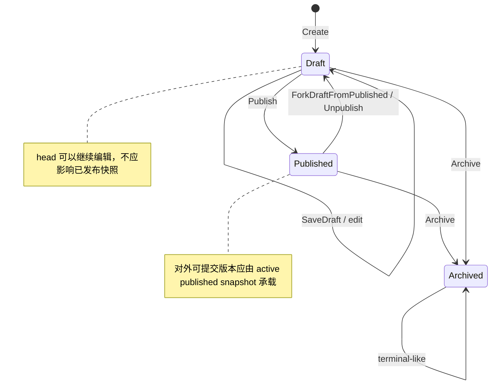
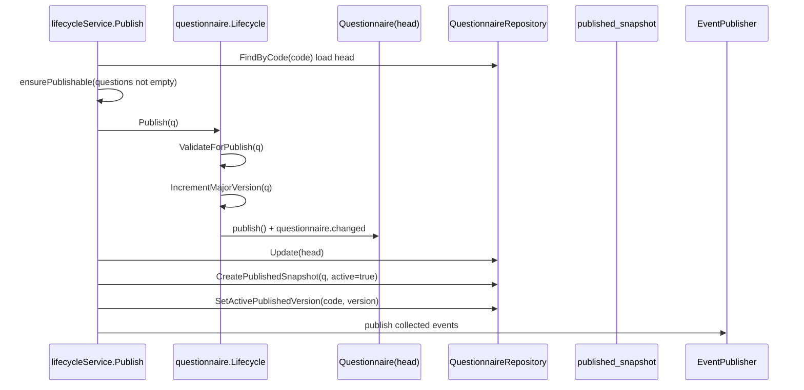

# Questionnaire 生命周期与版本

**本文回答**：`Questionnaire` 如何从创建、草稿编辑、发布、下架到归档；版本号如何变化；`head` 与 `published_snapshot` 如何共同保护“后台可编辑”和“前台可提交”的边界；以及这些规则与 `AnswerSheet`、`Scale`、`Evaluation` 的关系。

---

## 30 秒结论

| 维度 | 结论 |
| ---- | ---- |
| 核心对象 | `Questionnaire` 是问卷模板聚合根，维护 `code / type / version / status / record_role / questions` 等一致事实 |
| 状态语义 | 领域层支持 `draft / published / archived`；应用层提供 create、save draft、publish、unpublish、archive 等生命周期操作 |
| 版本语义 | 新建默认 `0.0.1`；保存草稿递增小版本；发布递增大版本并重置为 `x.0.1` |
| 发布保护 | 当前实现通过 `head` 与 `published_snapshot` 区分工作版本和已发布快照 |
| 前台读取 | 前台提交和展示应使用当前 active published snapshot，而不是后台正在编辑的 head |
| 历史答卷 | `AnswerSheet` 保存 `questionnaire_code + questionnaire_version`，后续不应被新版本问卷自动改写 |
| 事件语义 | 发布、下架、归档会触发 `questionnaire.changed`；该事件主要用于治理、缓存、二维码等后续动作，不是测评主链路的强一致起点 |

一句话概括：**Questionnaire 生命周期的核心目标，是允许后台持续编辑问卷，同时保证前台已发布版本和历史答卷有稳定、可追溯的卷面结构。**

---

## 1. 为什么 Questionnaire 需要生命周期与版本

问卷不是普通配置表。它同时服务两个变化速度不同的场景：

| 场景 | 变化特点 | 对模型的要求 |
| ---- | -------- | ------------ |
| 后台设计问卷 | 题目、选项、校验规则、标题和封面可能反复修改 | 需要可编辑的工作版本 |
| 前台提交答卷 | 用户必须看到一份稳定问卷结构 | 需要稳定的已发布版本 |
| 后续评估与报告 | 评估要能按提交时的问卷版本解释答案 | 需要历史版本可追溯 |
| 量表绑定 | MedicalScale 可能绑定某个问卷版本 | 发布后要同步 Scale 的问卷版本引用 |
| 缓存、二维码、前台入口 | 发布状态变化会影响入口和缓存 | 需要领域事件通知后续动作 |

如果没有生命周期和版本，后台一改题目，前台正在填写的用户、已经提交的答卷、后续评估和报告都会受到污染。因此 `Questionnaire` 的版本不是技术字段，而是业务一致性边界。

---

## 2. 核心模型

`Questionnaire` 聚合根主要维护以下内容：

| 字段/概念 | 作用 |
| --------- | ---- |
| `code` | 问卷族标识，同一个问卷不同版本共享同一个 code |
| `type` | 问卷类型，如普通调查问卷或医学量表问卷 |
| `version` | 当前记录的版本号，用于区分卷面结构 |
| `status` | 生命周期状态：`draft / published / archived` |
| `record_role` | 当前记录角色：`head` 或 `published_snapshot` |
| `is_active_published` | 当前已发布快照是否对外生效 |
| `questions` | 题目结构，包含题型、选项和校验规则 |
| `events` | 生命周期变化时收集的领域事件 |

可以把 Questionnaire 的持久化记录分成两类：

```text
Questionnaire Family
├── head
│   └── 后台工作记录：可编辑、可保存草稿、可再次发布
└── published_snapshot
    ├── version = 1.0.1
    ├── version = 2.0.1
    └── ...
```

`head` 解决后台编辑问题，`published_snapshot` 解决前台稳定提交和历史追溯问题。

---

## 3. 状态机

当前领域层支持三个核心状态：



### 状态说明

| 状态 | 含义 | 允许的典型动作 |
| ---- | ---- | -------------- |
| `draft` | 后台工作版本，尚未对外发布或从已发布版本派生出的编辑版本 | 编辑、保存草稿、发布、归档 |
| `published` | 当前 head 完成发布动作；发布时会创建/更新发布快照 | 下架、归档、继续派生草稿 |
| `archived` | 已归档，不再允许继续发布或编辑 | 通常作为终止态处理 |

注意：**前台是否可提交，不应该只看 head 的状态，而应看是否存在 active published snapshot。** 因为发布后再次编辑 head 时，head 可能回到 `draft`，但已发布快照仍然可以继续服务前台提交。

---

## 4. 版本规则

版本规则由 `Versioning` 领域服务表达：

| 操作 | 版本变化 | 示例 |
| ---- | -------- | ---- |
| 新建问卷 | 初始化为 `0.0.1` | `"" -> 0.0.1` |
| 保存草稿 | 小版本递增 | `0.0.1 -> 0.0.2`，`1.0.1 -> 1.0.2` |
| 首次发布 | 大版本递增 | `0.0.x -> 1.0.1` |
| 再次发布 | 大版本递增 | `1.0.x -> 2.0.1` |
| 从已发布派生草稿 | 小版本递增，状态回到 draft | `1.0.1 -> 1.0.2` |

版本语义可以理解为：

```text
major：对外发布版本代际
patch：后台草稿迭代次数
```

例如：

```text
新建问卷：0.0.1
保存草稿：0.0.2
继续保存：0.0.3
首次发布：1.0.1
发布后编辑 head：1.0.2
再次保存草稿：1.0.3
再次发布：2.0.1
```

这个版本规则的核心意义是：**发布版本是稳定对外契约，草稿版本是内部工作过程。**

---

## 5. head 与 published_snapshot

### 5.1 为什么需要两类记录

如果只有一条 Questionnaire 记录，那么发布后继续编辑会遇到两难：

| 选择 | 问题 |
| ---- | ---- |
| 直接编辑已发布记录 | 前台和历史答卷会被新题目污染 |
| 禁止编辑已发布记录 | 后台无法基于旧版本继续迭代 |
| 复制一份新问卷 code | 会破坏同一问卷族的统一标识 |

当前实现采用更合理的方式：**head 作为可编辑工作记录，published_snapshot 作为对外稳定快照。**

### 5.2 两类记录的职责

| 记录角色 | 作用 | 是否可对外提交 |
| -------- | ---- | -------------- |
| `head` | 后台工作记录，用于编辑、保存草稿、再次发布 | 不直接作为“当前已发布真值” |
| `published_snapshot` | 已发布版本快照，用于前台读取、提交和历史追溯 | 只有 `is_active_published = true` 的快照对外生效 |

### 5.3 发布时发生什么

发布流程会同时处理三件事：



发布不是简单改状态，而是一个组合动作：

1. 校验问卷是否可发布。
2. 按版本规则递增 major。
3. 将 head 置为 published。
4. 保存 head。
5. upsert 一个 `published_snapshot`。
6. 将该版本设置为 active published。
7. 发布 `questionnaire.changed`。

---

## 6. 创建、保存草稿、发布、下架、归档

### 6.1 Create：创建 head

创建问卷时，系统创建的是 `head` 工作记录。它的目标是让后台拿到一个可编辑对象，而不是立即对外开放。

```text
Create
  -> NewQuestionnaire
  -> InitializeVersion if needed
  -> repo.Create(head)
```

新建时默认版本为 `0.0.1`。如果调用方显式提供合法版本，应用层需要尊重并验证；一般业务路径中应由系统统一生成版本，避免人工随意拼接版本号。

### 6.2 SaveDraft：保存工作版本

保存草稿不是发布，它只代表后台工作记录的一次迭代。保存草稿时应递增小版本。

```text
SaveDraft
  -> load editable head
  -> ensureEditableHead
  -> IncrementMinorVersion
  -> repo.Update(head)
```

如果当前 head 已经 published，应用层会通过 `ensureEditableHead` / `ForkDraftFromPublished` 语义派生出可编辑草稿。这一点很关键：**发布后编辑，不应破坏 active published snapshot。**

### 6.3 Publish：生成新的对外版本

发布是生命周期中最重要的动作。它将工作版本变成新的对外稳定版本，并把该版本固化为 `published_snapshot`。

发布前置条件：

| 条件 | 原因 |
| ---- | ---- |
| code 非空 | 必须定位问卷族 |
| head 存在 | 没有工作版本无法发布 |
| 未归档 | archived 不允许重新发布 |
| 当前不是 published | 避免重复发布 |
| 题目列表非空 | 空问卷不能对外提交 |
| `ValidateForPublish` 通过 | 题目、选项、校验规则必须满足发布要求 |

发布完成后：

| 结果 | 含义 |
| ---- | ---- |
| head status = `published` | 工作记录完成发布 |
| head version major 递增 | 形成新的发布代际 |
| 创建/更新 published snapshot | 固化当前版本结构 |
| active published 切换到当前版本 | 前台读取新版本 |
| 发布 `questionnaire.changed` | 通知后续缓存、二维码、治理动作 |

### 6.4 Unpublish：下架当前 active published

下架的核心不是“删除问卷”，而是清空当前对外生效的发布快照。当前应用层逻辑会：

1. 加载 head。
2. 判断 archived。
3. 查询当前 published 版本。
4. 若 head 是 published，则调用领域 `Unpublish` 将 head 回到 draft。
5. 清空 active published version。
6. 发布变更事件。

这意味着：**下架后不应再有 active published snapshot 对外服务。**

### 6.5 Archive：归档问卷族

归档表示该问卷不再继续作为可编辑或可发布对象。应用层会：

1. 校验 code。
2. 加载 head。
3. 拒绝重复归档。
4. 调用领域 `Archive`。
5. 保存 head。
6. 清空 active published version。
7. 发布变更事件。

归档后，系统应避免继续发布或编辑该问卷。

---

## 7. 与 AnswerSheet 的版本关系

`AnswerSheet` 不直接引用 Questionnaire 对象，而是持有 `QuestionnaireRef`，其中包含：

```text
questionnaire_code
questionnaire_version
title
```

这带来两个重要结果：

| 结果 | 说明 |
| ---- | ---- |
| 历史答卷稳定 | 答卷提交时绑定当时问卷版本，不随 head 后续编辑改变 |
| 评估可追溯 | Evaluation 后续可以按答卷上的 code/version 找到对应问卷结构 |
| 前台提交明确 | 客户端提交时必须声明或解析出有效问卷版本 |
| 版本污染被隔离 | 后台编辑新版本不会改变旧答卷的卷面事实 |

所以版本不是 Questionnaire 内部的展示字段，而是 **Survey -> AnswerSheet -> Evaluation** 之间的事实桥梁。

---

## 8. 与 Scale 的版本同步

Questionnaire 的 `type` 支持 `MedicalScale`。当问卷属于医学量表问卷时，发布后的问卷版本可能需要同步到 Scale 模块。

发布应用服务中包含 `ScaleQuestionnaireBindingSyncer`，发布完成后会根据问卷类型决定是否同步量表绑定的问卷版本。

边界如下：

| 模块 | 职责 |
| ---- | ---- |
| Survey | 产生稳定的问卷发布版本 |
| Scale | 维护量表与问卷版本的绑定关系 |
| Evaluation | 根据 Assessment 中的 scale/questionnaire/answersheet 信息执行评估 |

Survey 不应该直接修改量表因子、解读规则或风险文案；它只在发布医学量表问卷后，把“问卷版本已更新”这一事实同步给 Scale 的绑定关系。

---

## 9. 与事件系统的关系

Questionnaire 生命周期变化会触发 `questionnaire.changed`。这个事件的典型用途包括：

| 场景 | 说明 |
| ---- | ---- |
| 缓存刷新 | 发布、下架、归档后刷新查询缓存或静态缓存 |
| 二维码生成 | 发布后生成问卷入口二维码 |
| 运维治理 | 记录问卷生命周期变化 |
| 下游通知 | 通知 worker 执行非强一致副作用 |

需要注意：`questionnaire.changed` 属于问卷生命周期事件，不是评估主链路的强一致起点。答卷提交后的评估起点是 `answersheet.submitted`。

---

## 10. 设计模式与实现意图

| 设计点 | 对应实现 | 意图 |
| ------ | -------- | ---- |
| 状态机 | `Questionnaire.status` + `Lifecycle` | 将发布、下架、归档的状态规则集中管理 |
| 领域服务 | `Lifecycle`、`Versioning` | 状态检查、版本递增、发布校验是领域语义，不放在 handler |
| 快照模式 | `record_role = published_snapshot` | 保护已发布版本，隔离后台编辑 |
| 活跃版本指针 | `is_active_published` | 明确当前对外生效版本 |
| 应用编排 | `lifecycleService` | 组合仓储、领域服务、快照、事件发布、Scale 同步 |
| 事件通知 | `questionnaire.changed` | 将发布副作用交给事件系统和 worker |

---

## 11. 设计取舍

| 取舍 | 收益 | 代价 |
| ---- | ---- | ---- |
| head + snapshot | 已发布版本稳定，后台可继续编辑 | 仓储查询比单记录复杂 |
| 版本自动递增 | 版本语义统一，减少人为错误 | 需要明确草稿版本与发布版本的区别 |
| 发布时 upsert snapshot | 支持版本追溯和 active 切换 | 发布流程比普通 update 更长 |
| 下架清空 active snapshot | 对外可提交能力可显式关闭 | 需要所有读侧遵守 active published 读取规则 |
| best-effort changed event | 适合缓存、二维码等副作用 | 不适合承担强一致业务命令 |

---

## 12. 常见误区

### 误区一：published 的 head 就是唯一已发布版本

不准确。当前实现里，真正面向前台稳定读取的应是 active `published_snapshot`。head 可以在发布后继续派生草稿。

### 误区二：保存草稿会影响线上用户

不应该。保存草稿只改变 head 工作记录，不应影响 active published snapshot。

### 误区三：下架就是删除问卷

不对。下架是关闭 active published，对象和历史快照仍可存在；删除或归档是另一类行为。

### 误区四：问卷版本只是展示字段

不对。问卷版本是答卷和后续评估的事实引用。

### 误区五：questionnaire.changed 可以驱动评估主链路

不对。评估主链路从 `answersheet.submitted` 开始，`questionnaire.changed` 主要是生命周期治理和副作用通知。

---

## 13. 代码锚点

| 类型 | 路径 |
| ---- | ---- |
| Questionnaire 聚合 | [`internal/apiserver/domain/survey/questionnaire/questionnaire.go`](../../../internal/apiserver/domain/survey/questionnaire/questionnaire.go) |
| 状态与版本值对象 | [`internal/apiserver/domain/survey/questionnaire/types.go`](../../../internal/apiserver/domain/survey/questionnaire/types.go) |
| 生命周期领域服务 | [`internal/apiserver/domain/survey/questionnaire/lifecycle.go`](../../../internal/apiserver/domain/survey/questionnaire/lifecycle.go) |
| 版本领域服务 | [`internal/apiserver/domain/survey/questionnaire/versioning.go`](../../../internal/apiserver/domain/survey/questionnaire/versioning.go) |
| 生命周期应用服务 | [`internal/apiserver/application/survey/questionnaire/lifecycle_service.go`](../../../internal/apiserver/application/survey/questionnaire/lifecycle_service.go) |
| 发布工作流 | [`internal/apiserver/application/survey/questionnaire/publication_workflow.go`](../../../internal/apiserver/application/survey/questionnaire/publication_workflow.go) |
| 下架/归档工作流 | [`internal/apiserver/application/survey/questionnaire/status_workflow.go`](../../../internal/apiserver/application/survey/questionnaire/status_workflow.go) |
| Mongo Questionnaire 仓储 | [`internal/apiserver/infra/mongo/questionnaire/repo.go`](../../../internal/apiserver/infra/mongo/questionnaire/repo.go) |
| 事件契约 | [`configs/events.yaml`](../../../configs/events.yaml) |
| 版本测试 | [`internal/apiserver/domain/survey/questionnaire/versioning_test.go`](../../../internal/apiserver/domain/survey/questionnaire/versioning_test.go) |

---

## 14. Verify

推荐按以下层次验证：

```bash
# 领域层：状态与版本规则
go test ./internal/apiserver/domain/survey/questionnaire

# 应用层：发布、下架、归档、Scale 同步等
go test ./internal/apiserver/application/survey/questionnaire

# 仓储层：head / published_snapshot / active published 查询
go test ./internal/apiserver/infra/mongo/questionnaire
```

如果修改了事件名、发布行为或 handler 绑定，还需要核对：

```bash
python scripts/check_docs_hygiene.py
```

---

## 15. 下一跳

| 想继续了解 | 阅读 |
| ---------- | ---- |
| 答卷如何提交并引用问卷版本 | [`02-AnswerSheet提交与校验.md`](./02-AnswerSheet提交与校验.md) |
| 题型、答案值和校验规则如何扩展 | [`03-题型校验与计分扩展.md`](./03-题型校验与计分扩展.md) |
| 问卷持久化、事件和缓存边界 | [`04-存储事件缓存边界.md`](./04-存储事件缓存边界.md) |
| 为什么 Survey / Scale / Evaluation 分离 | [`../../05-专题分析/01-测评业务模型：survey、scale、evaluation为什么分离.md`](../../05-专题分析/01-测评业务模型：survey、scale、evaluation为什么分离.md) |
