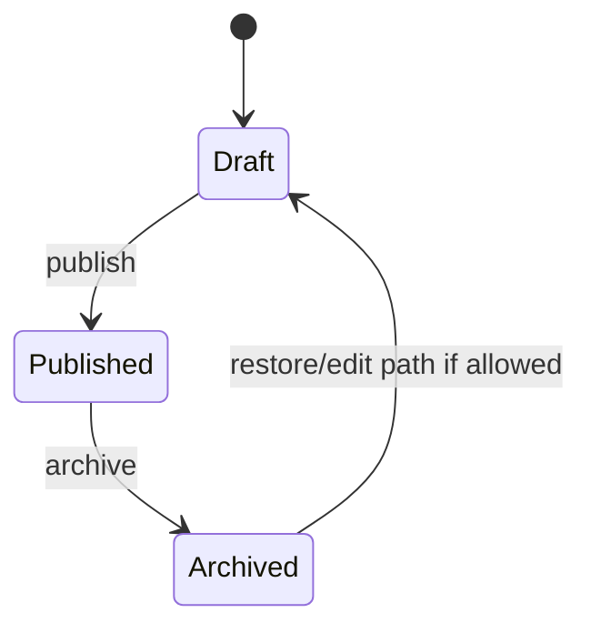
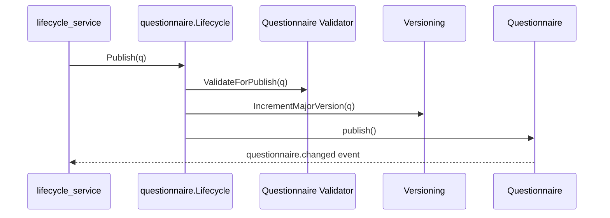

# Questionnaire 生命周期与版本

**本文回答**：问卷如何从编辑走到发布，版本如何保护历史答卷与后续评估。

## 30 秒结论

| 主题 | 当前事实 |
| ---- | -------- |
| 生命周期 | draft / published / archived 等状态由领域生命周期控制 |
| 版本 | 提交和评估都围绕 `questionnaire_code + questionnaire_version` 保持卷面一致性 |
| 历史答卷 | 已提交答卷携带当时的 code/version，不随后台新版本自动改写 |
| 事件 | 问卷变更通过 `questionnaire.changed` best-effort 发布 |



## 版本读法

1. 后台编辑问卷时，`Questionnaire` 维护题目结构和版本。
2. 前台提交答卷时，客户端声明的问卷版本必须和服务端当前可用结构一致。
3. 答卷保存后携带 `(questionnaire_code, questionnaire_version)`。
4. 后续评估优先按答卷上的版本取问卷结构，避免“新问卷解释旧答卷”。

## 架构与领域服务设计

`Questionnaire` 的生命周期没有直接放在 handler 或 repository 中，而是由 `domain/survey/questionnaire.Lifecycle` 领域服务控制。这个服务先判断当前状态，再调用 `Validator.ValidateForPublish` 和 `Versioning.IncrementMajorVersion`，最后通过聚合根包内方法触发状态变更和领域事件。



## 设计模式与取舍

| 设计点 | 当前实现 | 为什么这样设计 |
| ------ | -------- | -------------- |
| 状态机 | `Draft -> Published -> Archived` 由 `Lifecycle` 约束 | 生命周期规则集中在领域服务，不散落在 REST handler |
| 领域服务 | `Lifecycle` 访问聚合根包内方法 | 发布需要同时做状态检查、发布校验、版本递增和事件触发，单个实体方法会过胖 |
| 版本对象 | `Versioning` 负责 major version 递增 | 版本变化是业务语义，不应由应用层随手拼字符串 |
| best-effort 事件 | `questionnaire.changed` 不走 durable outbox | 问卷变更是治理/缓存通知，不是评估主链的强一致起点 |

取舍是：发布路径更清晰，但读者必须理解“状态变更在领域服务编排、聚合根执行”的分工；此外 best-effort 事件意味着它不能承担业务强一致命令。

## 代码锚点

- 生命周期：[lifecycle.go](../../../internal/apiserver/domain/survey/questionnaire/lifecycle.go)
- 版本模型：[versioning.go](../../../internal/apiserver/domain/survey/questionnaire/versioning.go)
- 生命周期应用服务：[lifecycle_service.go](../../../internal/apiserver/application/survey/questionnaire/lifecycle_service.go)
- 版本测试：[versioning_test.go](../../../internal/apiserver/domain/survey/questionnaire/versioning_test.go)

## Verify

```bash
go test ./internal/apiserver/domain/survey/questionnaire ./internal/apiserver/application/survey/questionnaire
```
