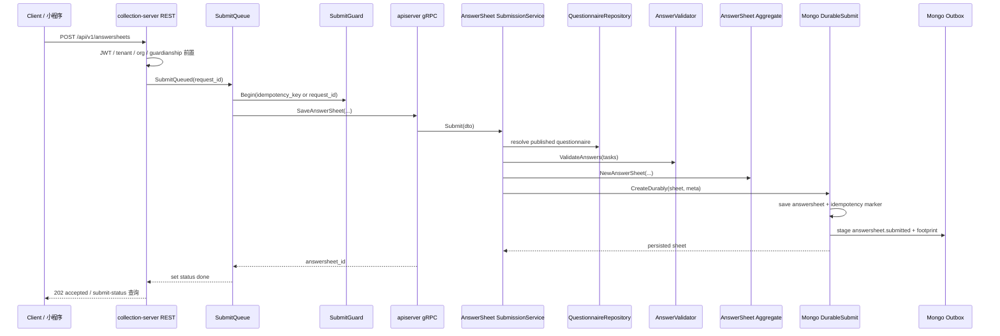
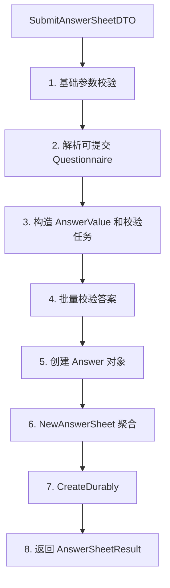

# AnswerSheet 提交与校验

**本文回答**：`AnswerSheet` 从 collection-server 前台入口到 qs-apiserver 主写入之间，如何完成身份前置、入口削峰、问卷版本解析、答案值对象构造、批量校验、答卷聚合创建、业务幂等和 `answersheet.submitted` outbox 入站起点。

---

## 30 秒结论

| 主题 | 当前事实 |
| ---- | -------- |
| 模块定位 | `AnswerSheet` 是 Survey 模块里的“作答事实”聚合，负责记录某个填写者基于某个问卷版本提交了哪些答案 |
| 前台入口 | collection-server 暴露 REST `/api/v1/answersheets`，统一进入 `SubmitQueued`，成功受理返回 `202 accepted` |
| 主写模型 | 答卷权威写入在 qs-apiserver 内完成，collection-server 只做 BFF 入口治理和 gRPC 转调 |
| 提交版本 | 未传 `questionnaire_version` 时使用当前 active published version；传版本时必须找到且为 published |
| 答案校验 | 先按题型构造 `AnswerValue`，再基于问卷题目的 validation rules 批量校验 |
| 幂等边界 | `request_id` 服务 collection 本地队列状态；`idempotency_key` 才是 durable submit 的业务幂等键 |
| 事件起点 | `answersheet.submitted` 在 durable submit 边界内进入 outbox，不直接依赖“写库后立即 publish” |
| 后续链路 | 计分、创建 Assessment、Evaluation pipeline、报告生成不属于 AnswerSheet 提交本身 |

一句话概括：**AnswerSheet 提交链路要保证“采集事实可靠落库”，但不在提交请求内完成测评解释。**

---

## 1. 为什么 AnswerSheet 需要单独建模

`AnswerSheet` 解决的是“某次作答事实是否可信”的问题。它不是问卷模板，也不是测评结果。

| 对象 | 解决的问题 | 不应该承担 |
| ---- | ---------- | ---------- |
| `Questionnaire` | 问卷结构、题目、选项、校验规则、发布版本 | 不记录某个人具体答了什么 |
| `AnswerSheet` | 某个填写者对某个问卷版本提交的答案事实 | 不负责量表因子、风险等级、报告文案 |
| `Assessment` | 一次测评行为及其状态、总分、风险结果 | 不负责维护原始问卷结构 |
| `Report` | 解读结果、风险文案和建议 | 不反向改写答卷事实 |

这条边界非常关键：**答卷一旦提交，就是后续测评链路的事实输入。后续计算可以失败、重试、补偿，但不应该改变“当时提交了什么”。**

---

## 2. 端到端提交主图



这张图里有两个事实要先分清：

1. **collection-server 的 `SubmitQueue` 是入口侧削峰与状态查询机制**，不是 MQ，也不是 qs-worker。
2. **qs-apiserver 的 durable submit 是权威写入边界**，负责把答卷、幂等记录和 outbox 一起写进去。

---

## 3. collection-server 入口治理

collection-server 的职责是前台 BFF。它接收小程序或收集端请求，做入口前置，再通过 gRPC 调用 qs-apiserver。

### 3.1 REST handler

`AnswerSheetHandler.Submit` 的核心动作是：

1. 绑定 JSON 请求。
2. 从 query 参数兜底补 `task_id`。
3. 从认证上下文取当前用户 ID。
4. 生成或读取 `request_id`。
5. 调用 `submissionService.SubmitQueued(...)`。
6. 队列满返回 `429`；成功受理返回 `202 accepted`。

这意味着前端收到 `202 accepted` 时，语义是**提交请求已进入 collection 侧队列**，不是“评估报告已经完成”。

### 3.2 SubmitQueue

`SubmitQueue` 是 collection 进程内的 memory channel 队列。它做三件事：

| 能力 | 说明 |
| ---- | ---- |
| 削峰 | 用带缓冲 channel 接收提交任务 |
| 本地状态 | 维护 `queued / processing / done / failed` 状态，TTL 默认 10 分钟 |
| 重复受理保护 | 相同 `request_id` 在队列状态有效期内会复用状态 |

但它也有明确边界：

| 边界 | 说明 |
| ---- | ---- |
| 不跨实例 | 它是进程内内存结构，不是 Redis stream，也不是 MQ |
| 不持久 | 进程重启后本地 `request_id` 状态不可依赖 |
| 不替代业务幂等 | durable submit 的业务幂等依赖 `idempotency_key` |
| 不生成报告 | 它只是把请求排队交给 apiserver gRPC |

### 3.3 SubmitGuard

collection 的 `SubmissionService` 会使用 `SubmitGuard` 保护同一 key 的并发提交。key 的来源是：

```text
优先 req.IdempotencyKey
否则使用 request_id
```

当 guard 命中已完成状态时，直接返回已提交的 answer_sheet_id；当同一 key 正在处理中时，可能返回 `ResourceExhausted`。

这里要注意：collection 的 guard 能降低重复提交压力，但最终的业务一致性仍应以 apiserver durable submit 为准。

---

## 4. apiserver 提交应用服务

qs-apiserver 的 `application/survey/answersheet/submissionService` 是 AnswerSheet 提交的业务编排中心。它不是简单 CRUD，而是按阶段执行。



### 4.1 DTO 基础校验

提交入口先检查：

| 字段 | 校验 |
| ---- | ---- |
| `questionnaire_code` | 不能为空 |
| `filler_id` | 不能为空 |
| `testee_id` | 不能为空 |
| `answers` | 不能为空 |
| `answer.question_code` | 不能为空 |
| `answer.question_type` | 不能为空 |

这些是请求级校验，不涉及题型值是否合法，也不涉及问卷题目是否存在。

### 4.2 问卷版本解析

提交时问卷版本有两种情况：

| 请求情况 | 服务端行为 |
| -------- | ---------- |
| 未传 `questionnaire_version` | 查找当前已发布问卷版本，并把版本回填到 DTO |
| 传了 `questionnaire_version` | 按 `code + version` 查找问卷，并要求该版本是 published |

这里的设计目标是：**答卷必须绑定到一个明确的、可提交的问卷版本。**

这也解释了为什么 `Questionnaire` 需要 `published_snapshot`：旧答卷不能被后续 head 草稿修改污染。

### 4.3 构造问题映射

加载问卷后，应用层会把问题列表转为：

```text
question_code -> Question
```

之后每个答案都必须能在这张 map 中找到对应问题。找不到问题直接返回答卷非法错误。

---

## 5. 答案值对象与批量校验

提交链路不是直接把前端 JSON 裸值塞进数据库，而是先构造 `AnswerValue`。

### 5.1 AnswerValue 工厂

`CreateAnswerValueFromRaw` 根据 `QuestionType` 构造不同值对象：

| 题型 | 期望原始值 | 值对象 |
| ---- | ---------- | ------ |
| `Radio` | `string` | `OptionValue` |
| `Checkbox` | `[]string` 或 `[]interface{}` 中全是 string | `OptionsValue` |
| `Text` / `Textarea` / `Section` | `string` | `StringValue` |
| `Number` | `float64` / `int` / `int64` | `NumberValue` |

这一步解决的是“值形态合法”问题。例如 Checkbox 如果传入非字符串数组，会在这里失败。

### 5.2 AnswerValidationTask

值对象构造成功后，应用层会生成 `ruleengine.AnswerValidationTask`：

```text
ID    = question_code
Value = AnswerValueAdapter(answerValue)
Rules = validationRuleSpecsFromQuestion(question)
```

这说明校验规则来源是问卷题目本身，执行校验的是 ruleengine port，而不是 `AnswerSheet` 聚合自己跑校验策略。

### 5.3 批量校验失败语义

如果批量校验失败，应用层会收集失败题目和错误信息，返回 `ErrAnswerSheetInvalid`。失败会终止提交，不会创建 AnswerSheet 聚合，也不会写 durable store。

---

## 6. Answer 与 AnswerSheet 聚合创建

### 6.1 Answer

`Answer` 是答卷中的答案值对象，包含：

| 字段 | 说明 |
| ---- | ---- |
| `questionCode` | 问题编码 |
| `questionType` | 题型 |
| `score` | 当前答案分数，提交时初始为 0 |
| `value` | 题型对应的 AnswerValue |

提交时的 score 初始化为 0，后续由评分链路更新。这是一个重要边界：**提交答卷不等于完成计分。**

### 6.2 AnswerSheet

`AnswerSheet` 聚合创建时会校验：

| 校验 | 说明 |
| ---- | ---- |
| `questionnaireRef` 非空 | 必须绑定问卷 code/version/title |
| `filler` 非空 | 必须知道谁填写 |
| `answers` 非空 | 至少有一个答案 |
| 问题答案唯一 | 同一个 question_code 不能重复提交答案 |

`AnswerSheet` 的领域注释明确：**答卷一旦创建就是已提交状态，不存在后端草稿；答卷不可修改，是不可变对象。**

---

## 7. durable submit 与业务幂等

AnswerSheet 创建后，不是简单 `repo.Create`。当前主路径是 `SubmissionDurableStore.CreateDurably(...)`。

### 7.1 DurableSubmitMeta

durable submit 会携带提交元数据，例如：

| 元数据 | 作用 |
| ------ | ---- |
| `IdempotencyKey` | durable 业务幂等键 |
| `WriterID` | 填写人 |
| `TesteeID` | 受试者 |
| `OrgID` | 组织 |
| `TaskID` | 若来源于计划任务，用于后续链路 |

这些数据不只是日志，它们会参与幂等记录和事件 payload。

### 7.2 CreateDurably 的写入边界

Mongo repository 的 `CreateDurably` 会做：

1. 如果有 `idempotency_key`，先查 completed submission。
2. 在 Mongo transaction 中执行：
   - 保存 AnswerSheet。
   - 写 completed idempotency 记录。
   - stage outbox events。
3. 如果并发冲突，等待已完成幂等结果。
4. 清空聚合事件并返回。

这个设计关闭了一个关键窗口：

```text
答卷已保存成功，但 answersheet.submitted 事件丢失
```

### 7.3 request_id 与 idempotency_key 的区别

| 字段 | 所属层 | 用途 | 是否 durable |
| ---- | ------ | ---- | ------------ |
| `request_id` | collection-server | 本地队列状态查询、短期重复受理保护 | 否 |
| `idempotency_key` | apiserver durable submit | 业务幂等，避免重复创建答卷和重复 outbox 起点 | 是 |

不要把这两个字段混为一谈。

---

## 8. answersheet.submitted 事件

提交成功后，AnswerSheet 会 raise `AnswerSheetSubmittedEvent`。durable store 会把该事件写入 outbox。

同时，提交链路还会追加一个 statistics footprint 事件，用于行为足迹和统计投影。

### 8.1 事件不等于评估完成

`answersheet.submitted` 的语义只是：

```text
某个答卷事实已经可靠提交
```

它不是：

```text
测评已创建
评估已完成
报告已生成
任务已完成
```

这些属于后续异步链路。

### 8.2 worker 后续处理

后续由 worker 消费 `answersheet.submitted` 后，通过 internal gRPC 推进：

```text
CalculateAnswerSheetScore
CreateAssessmentFromAnswerSheet
```

因此 AnswerSheet 提交文档只讲到事件起点，不在本文重复完整 Evaluation pipeline。完整端到端链路见：

- [../../00-总览/03-核心业务链路.md](../../00-总览/03-核心业务链路.md)
- [../../01-运行时/03-qs-worker运行时.md](../../01-运行时/03-qs-worker运行时.md)

---

## 9. 校验边界

提交校验分三层：

| 层 | 校验内容 | 失败后果 |
| -- | -------- | -------- |
| collection REST | JSON 绑定、认证用户、request_id、队列容量 | 请求不入队或返回 429/4xx |
| collection application | writer、guardianship、canonical testee、gRPC input 转换 | 不调用或中断调用 apiserver |
| apiserver application/domain | 问卷版本、题目存在、答案值形态、validation rules、AnswerSheet 不变量 | 不创建 AnswerSheet，不写 durable store |

### 9.1 collection 侧不做的校验

collection 不应该复制 apiserver 的完整问卷规则校验。否则会出现两套规则 drift。

collection 可以做：

- 用户身份。
- 监护关系。
- 入口限流。
- 队列削峰。
- 轻量请求合法性。
- gRPC DTO 转换。

collection 不应该成为：

- 问卷题目结构权威源。
- AnswerSheet 仓储。
- Evaluation 状态机。
- 报告生成器。

### 9.2 apiserver 侧不做的事

apiserver 的 AnswerSheet 提交服务不做：

- 前台 request_id 状态查询。
- collection 进程内队列状态管理。
- Evaluation pipeline。
- 报告生成。
- 风险等级解释。

它只保证**答卷事实被可靠提交**。

---

## 10. 设计模式与实现意图

| 设计点 | 当前实现 | 为什么这样设计 |
| ------ | -------- | -------------- |
| BFF Pattern | collection-server 负责前台 REST 与入口治理 | 避免把小程序访问控制、削峰、状态查询逻辑塞进 apiserver |
| Queue / Worker Pool | collection `SubmitQueue` | 高峰提交时削峰，避免 HTTP 请求直接打满 apiserver gRPC |
| Guard / Lock | collection `SubmitGuard` | 降低同 key 并发重复提交 |
| Value Object | `AnswerValue` 系列 | 把不同题型原始 JSON 转成稳定领域值 |
| Strategy / Port | `AnswerValidator` / `ruleengine` | 校验规则可扩展，不让提交服务成为巨型 switch |
| Aggregate Factory | `NewAnswerSheet` | 创建时集中校验 AnswerSheet 不变量 |
| Durable Store / Outbox | `SubmissionDurableStore` | 同一持久化边界内保存答卷、幂等记录和事件起点 |
| Event-driven | `answersheet.submitted` | 提交快路径和后续评估慢路径解耦 |

---

## 11. 设计取舍

| 设计 | 收益 | 代价 |
| ---- | ---- | ---- |
| collection 返回 202 accepted | 前台提交体验稳定，支持削峰 | 客户端需要理解 submit-status，不应误以为报告完成 |
| request_id 与 idempotency_key 分离 | 本地状态和业务幂等职责清楚 | 接入方需要正确传 durable 幂等键 |
| AnswerValue 值对象 | 题型值形态清晰，便于扩展 | 新题型需要补值对象、校验和 mapper |
| 批量校验 | 可一次返回多个题目问题 | 校验器依赖 ruleengine port，测试需要 fake |
| outbox | 避免保存成功但事件丢失 | 引入最终一致性，需要 relay 和排障文档 |
| 提交不跑 Evaluation | 快路径短，慢路径可重试 | 用户不能在提交响应里立即拿到报告 |

---

## 12. 常见误区

### 12.1 “提交答卷成功 = 测评完成”

错误。提交成功只是 AnswerSheet 已进入 durable store，后续还要经历 worker、internal gRPC、Assessment、Evaluation、Report。

### 12.2 “request_id 就是业务幂等键”

不准确。`request_id` 主要用于 collection 本地队列状态。业务幂等应该使用 `idempotency_key`。

### 12.3 “collection-server 也保存答卷”

错误。collection 只转调 apiserver；答卷权威状态在 apiserver 的 Mongo durable submit。

### 12.4 “SubmitQueue 是 MQ”

错误。SubmitQueue 是 collection 进程内 memory channel。真正 MQ 是 apiserver outbox relay 出站后由 worker 消费的消息系统。

### 12.5 “AnswerSheet 应该直接包含风险等级”

错误。风险等级属于 Evaluation/Scale 解释结果，不属于 Survey 的作答事实。

---

## 13. 代码锚点

### collection-server

- REST handler：[../../../internal/collection-server/transport/rest/handler/answersheet_handler.go](../../../internal/collection-server/transport/rest/handler/answersheet_handler.go)
- SubmitQueue：[../../../internal/collection-server/application/answersheet/submit_queue.go](../../../internal/collection-server/application/answersheet/submit_queue.go)
- BFF SubmissionService：[../../../internal/collection-server/application/answersheet/submission_service.go](../../../internal/collection-server/application/answersheet/submission_service.go)
- gRPC clients：[../../../internal/collection-server/infra/grpcclient/](../../../internal/collection-server/infra/grpcclient/)

### qs-apiserver

- 提交应用服务：[../../../internal/apiserver/application/survey/answersheet/submission_service.go](../../../internal/apiserver/application/survey/answersheet/submission_service.go)
- 问卷解析：[../../../internal/apiserver/application/survey/answersheet/submission_questionnaire_resolver.go](../../../internal/apiserver/application/survey/answersheet/submission_questionnaire_resolver.go)
- 答案装配：[../../../internal/apiserver/application/survey/answersheet/submission_answer_assembler.go](../../../internal/apiserver/application/survey/answersheet/submission_answer_assembler.go)
- durable store 端口：[../../../internal/apiserver/application/survey/answersheet/durable_store.go](../../../internal/apiserver/application/survey/answersheet/durable_store.go)
- durable submit 实现：[../../../internal/apiserver/infra/mongo/answersheet/durable_submit.go](../../../internal/apiserver/infra/mongo/answersheet/durable_submit.go)
- AnswerSheet 聚合：[../../../internal/apiserver/domain/survey/answersheet/answersheet.go](../../../internal/apiserver/domain/survey/answersheet/answersheet.go)
- Answer 值对象：[../../../internal/apiserver/domain/survey/answersheet/answer.go](../../../internal/apiserver/domain/survey/answersheet/answer.go)
- AnswerSheet 事件：[../../../internal/apiserver/domain/survey/answersheet/events.go](../../../internal/apiserver/domain/survey/answersheet/events.go)

### 契约与事件

- collection REST 契约：[../../../api/rest/collection.yaml](../../../api/rest/collection.yaml)
- apiserver gRPC proto：[../../../internal/apiserver/interface/grpc/proto/answersheet/answersheet.proto](../../../internal/apiserver/interface/grpc/proto/answersheet/answersheet.proto)
- 事件契约：[../../../configs/events.yaml](../../../configs/events.yaml)

---

## 14. Verify

```bash
go test ./internal/collection-server/application/answersheet
go test ./internal/apiserver/application/survey/answersheet
go test ./internal/apiserver/domain/survey/answersheet
go test ./internal/apiserver/infra/mongo/answersheet
```

如果改动影响 collection REST 行为，还应检查 OpenAPI：

```bash
make docs-rest
make docs-verify
```

如果改动影响事件字段或 delivery 语义，还应同步检查：

```bash
configs/events.yaml
docs/03-基础设施/event/
docs/00-总览/03-核心业务链路.md
```

---

## 15. 下一跳

- 问卷版本如何保护提交语义：[01-Questionnaire生命周期与版本.md](./01-Questionnaire生命周期与版本.md)
- 题型校验如何扩展：[03-题型校验与计分扩展.md](./03-题型校验与计分扩展.md)
- 存储、事件、缓存边界：[04-存储事件缓存边界.md](./04-存储事件缓存边界.md)
- 新增题型流程：[05-新增题型SOP.md](./05-新增题型SOP.md)
- 端到端主链路：[../../00-总览/03-核心业务链路.md](../../00-总览/03-核心业务链路.md)
