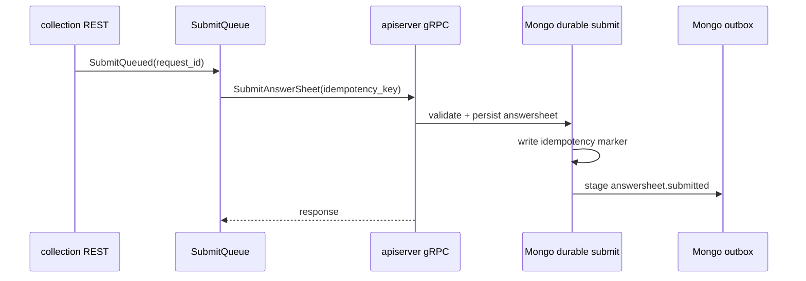
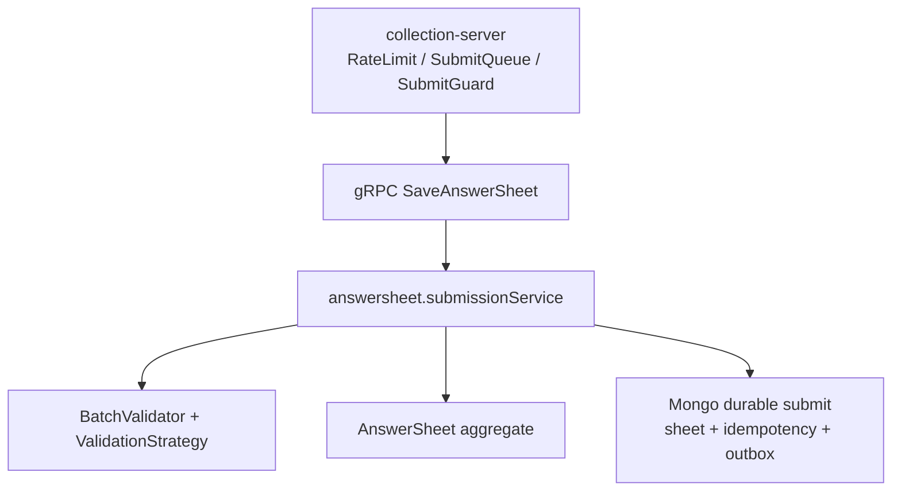

# AnswerSheet 提交与校验

**本文回答**：答卷提交如何经过 collection BFF、apiserver durable submit、答案校验、幂等记录和 outbox。

## 30 秒结论

| 主题 | 当前事实 |
| ---- | -------- |
| 前台入口 | collection-server REST 统一进入 `SubmitQueued` |
| 主写入 | apiserver durable submit 写 Mongo 答卷、幂等记录和 `answersheet.submitted` outbox |
| 幂等边界 | durable 幂等依赖显式 `idempotency_key`；`request_id` 只服务 collection 本地队列状态 |
| 异步起点 | `answersheet.submitted` 不再 direct publish，而由 outbox relay 出站 |



## 校验边界

- 题目存在性、必填、选项合法性属于 `survey`。
- 量表因子、风险等级、报告解读不在答卷提交时完成。
- collection 只做入口治理和 gRPC 转调，不拥有答卷主写模型。

## 架构与模型设计

AnswerSheet 提交链路采用“BFF 入口保护 + apiserver 主写模型 + durable store”的分层。collection-server 的 `SubmitQueue` 和 `SubmitGuard` 解决入口削峰和幂等保护；apiserver 的 `submissionService` 才是真正创建 `AnswerSheet` 聚合并写入 Mongo 的地方。



## 设计模式与取舍

| 设计点 | 当前实现 | 为什么这样设计 |
| ------ | -------- | -------------- |
| Split Phase | DTO 校验 -> 问卷加载 -> AnswerValue 构造 -> 批量校验 -> 聚合创建 -> durable save | 把提交链路拆成阶段，方便定位失败和补测试 |
| Strategy | `validation.BatchValidator` 调用 rule strategy | 新增校验规则不用改提交主流程 |
| Value Object | `AnswerValue` 按题型封装 raw value | 应用层不直接处理裸 `interface{}` 或 JSON |
| Unit of Work 边界 | durable store 同时写答卷、幂等记录和 outbox | 关闭“答卷保存成功但事件丢失”的窗口 |

取舍是：提交应用服务比普通 CRUD 更长，但每个阶段都有明确领域语义；如果强行拆成多个异步事件，会让“答卷是否已提交”这个用户语义变得不稳定。

## 代码锚点

- collection 入口：[answersheet_handler.go](../../../internal/collection-server/transport/rest/handler/answersheet_handler.go)
- collection 队列：[submit_queue.go](../../../internal/collection-server/application/answersheet/submit_queue.go)
- apiserver 提交服务：[submission_service.go](../../../internal/apiserver/application/survey/answersheet/submission_service.go)
- durable submit：[durable_submit.go](../../../internal/apiserver/infra/mongo/answersheet/durable_submit.go)
- 事件定义：[events.go](../../../internal/apiserver/domain/survey/answersheet/events.go)

## Verify

```bash
go test ./internal/collection-server/application/answersheet ./internal/apiserver/application/survey/answersheet ./internal/apiserver/infra/mongo/answersheet
```
