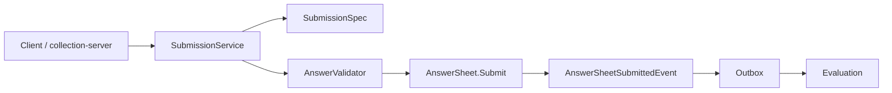

# AnswerSheet 提交事实模型

> 本文是 Survey 模块文档重建的第三篇。
>
> 上一篇《01-Questionnaire模型与SubmissionSpec》讲清了模板侧模型：`Questionnaire` 如何通过 `SubmissionSpec` 暴露可提交规格。
>
> 本文聚焦事实侧模型：`AnswerSheet` 为什么不是普通答案表，而是一次完整、不可变、可追踪的提交事实；`SubmissionContext` 为什么必须进入模型；`Answer / AnswerValue` 如何承接题型扩展；`AnswerSheet.Submit` 如何产生 `AnswerSheetSubmittedEvent`，并成为后续 Evaluation 链路的起点。

---

## 1. 结论先行

`AnswerSheet` 是 Survey 域中的**答卷提交事实聚合**。

它不只是保存一组答案，也不是前端表单草稿，更不是测评结果。

它表达的是：

```text
某个填写人在某个业务上下文中，基于某个确定的问卷版本，提交了一组符合问卷规格和校验规则的答案。
```

因此，`AnswerSheet` 至少需要同时回答四个问题：

```text
基于哪份问卷版本提交？
谁提交，为谁提交，属于哪个组织/任务？
提交了哪些题目的哪些答案？
这个提交事实如何通知后续 Evaluation 链路？
```

一句话概括：

> **AnswerSheet 不是 answer rows 的集合，而是 Survey 到 Evaluation 的作答事实边界。**

---

## 2. AnswerSheet 在核心链路中的位置

qs-server 的主链路是从 AnswerSheet 开始进入异步评估的。

```text
Client
  -> collection-server
  -> qs-apiserver SubmissionService
  -> AnswerSheet.Submit
  -> DurableStore.CreateDurably
  -> Outbox answersheet.submitted
  -> Worker
  -> Evaluation
```

在这个链路里，`AnswerSheet` 是第一个被稳定保存下来的业务事实。



这意味着：

```text
Questionnaire 是提交前的模板事实；
AnswerSheet 是提交后的作答事实；
Evaluation 是基于作答事实和规则模型产生的测评事实。
```

---

## 3. AnswerSheet 的模型定位

`AnswerSheet` 负责表达一次已经发生的提交。

它负责回答：

```text
这份答卷的 ID 是什么？
它引用哪份 QuestionnaireCode + QuestionnaireVersion？
填写人是谁？
受试者是谁？
属于哪个组织？
是否来自某个测评任务？
提交了哪些答案？
提交时间是什么？
提交后产生了哪些领域事件？
```

它不负责回答：

```text
这些答案如何聚合成因子分；
风险等级是什么；
报告内容是什么；
Assessment 当前状态是什么；
任务是否完成；
统计视图如何更新。
```

这些问题分别属于 Scale、Evaluation、Plan、Statistics。

---

## 4. AnswerSheet 的核心结构

AnswerSheet 可以抽象为以下结构。

```text
AnswerSheet
├── ID
├── QuestionnaireRef
├── SubmissionContext
├── Answers
├── FilledAt
├── Score
└── DomainEvents
```

### 4.1 ID

`ID` 是答卷提交事实的唯一标识。

当前强模型设计中，`AnswerSheet.Submit` 应该接收明确的 ID，而不是先构造无 ID 对象，再由外部补充提交事件。

这样做的好处是：

```text
提交事实创建时就是完整事实；
SubmittedEvent 可以在 Submit 内部直接产生；
事件 payload 可以携带确定 AnswerSheetID；
避免“先创建答卷，再外部补事件”的语义割裂。
```

### 4.2 QuestionnaireRef

`QuestionnaireRef` 是 AnswerSheet 对模板版本的引用。

它至少包含：

```text
QuestionnaireCode
QuestionnaireVersion
QuestionnaireTitle
```

AnswerSheet 不持有完整 Questionnaire 聚合。

原因是：

```text
Questionnaire 是模板聚合，会演进；
AnswerSheet 是历史事实，应只绑定提交时的确定模板版本；
历史答卷不应该被当前最新模板污染。
```

### 4.3 SubmissionContext

`SubmissionContext` 是提交上下文。

它表达：

```text
谁填的；
为谁填的；
属于哪个组织；
是否来自某个任务。
```

这不是 DTO 辅助信息，而是提交事实本身的一部分。

### 4.4 Answers

`Answers` 是答案值对象集合。

它不是裸 `map[string]any`，也不应该只是 MongoDB 中的一段 JSON。

每个 Answer 至少表达：

```text
QuestionCode
QuestionType
AnswerValue
Score
```

### 4.5 FilledAt

`FilledAt` 表示答卷提交时间。

它应该由服务端确定，或者至少由服务端校准。

提交时间是后续统计、审计、任务状态判断、报告时效判断的重要事实。

### 4.6 DomainEvents

AnswerSheet 提交成功后会产生领域事件。

最关键的是：

```text
answersheet.submitted
```

这个事件是 Survey 到 Evaluation 的异步起点。

---

## 5. 为什么 AnswerSheet 没有草稿状态

AnswerSheet 在后端不维护草稿。

这是一个明确的模型选择。

```text
前端草稿：用户填写过程中的临时体验；
后端答卷：提交成功后的业务事实。
```

如果后端也维护草稿状态，会带来几个问题：

| 问题 | 说明 |
| --- | --- |
| 状态语义变复杂 | draft / submitted / cancelled / expired 等状态会进入 AnswerSheet |
| 并发修改复杂 | 用户多端编辑、自动保存、恢复草稿需要额外冲突处理 |
| 提交边界模糊 | 很难判断什么时候产生 answersheet.submitted |
| Survey 与 Plan 混杂 | 草稿过期、任务窗口等会侵入 Survey |

当前系统选择更清晰的设计：

```text
后端只保存正式提交后的 AnswerSheet；
提交成功即成为不可随意变更的作答事实。
```

这也解释了为什么核心入口应该叫：

```text
AnswerSheet.Submit
```

而不是普通的：

```text
NewAnswerSheet
```

---

## 6. AnswerSheet.Submit：提交事实的领域入口

`AnswerSheet.Submit` 是 AnswerSheet 最重要的领域行为。

它的语义不是“new 一个对象”，而是：

```text
创建一次正式提交事实。
```

### 6.1 Submit 应该保护的不变量

`Submit` 至少需要保护以下不变量。

| 不变量 | 说明 |
| --- | --- |
| ID 不能为空 | 提交事实必须有确定身份 |
| QuestionnaireRef 合法 | 必须绑定确定问卷 code/version |
| SubmissionContext 合法 | 必须知道填写人、受试者、组织等上下文 |
| Answers 非空 | 正式提交不能没有答案 |
| QuestionCode 不重复 | 同一答卷中同一题不能重复提交 |
| FilledAt 合法 | 提交时间不能是非法零值 |
| 事件必须产生 | 提交事实成立后必须产生 SubmittedEvent |

### 6.2 Submit 不应该做的事情

`Submit` 不应该做：

```text
加载 Questionnaire；
判断 question_code 是否属于问卷；
执行 required/min/max 等校验规则；
计算因子分；
判断风险等级；
生成报告；
创建 Assessment。
```

这些职责已经由其他对象承担。

| 职责 | 归属 |
| --- | --- |
| 加载已发布问卷 | Application Service / Repository |
| 判断题目归属 | SubmissionSpec |
| 执行答案规则校验 | AnswerValidator |
| 计算和解释 | Scale / Evaluation |
| 创建 Assessment | Evaluation |

### 6.3 Submit 的理想链路

```text
SubmissionService
  -> Questionnaire.BuildSubmissionSpec
  -> SubmissionSpec.PrepareAnswers
  -> AnswerValidator.ValidateAnswers
  -> AnswerSheet.Submit
  -> DurableStore.CreateDurably
```

`AnswerSheet.Submit` 位于规则校验之后、持久化之前。

这说明它接收的是已经经过规格准备和校验的答案事实。

---

## 7. SubmissionContext：提交上下文为什么必须入模

`SubmissionContext` 是这次强模型重构中的关键对象。

它的存在说明：

> 一份答卷不是孤立答案集合，而是发生在具体业务上下文中的提交事实。

### 7.1 SubmissionContext 的核心字段

SubmissionContext 可以抽象为：

```text
SubmissionContext
├── Filler
├── Testee
├── OrgID
└── TaskID
```

| 字段 | 说明 |
| --- | --- |
| Filler | 填写人，表示谁执行了填写动作 |
| Testee | 受试者，表示这份答卷是为谁填写的 |
| OrgID | 组织 / 机构上下文 |
| TaskID | 测评任务来源，可选或按业务场景要求 |

### 7.2 Filler 与 Testee 的区别

Filler 和 Testee 不能混用。

```text
Filler：执行填写动作的人；
Testee：被测评的人。
```

它们可能是同一个人，也可能不是。

例如：

| 场景 | Filler | Testee |
| --- | --- | --- |
| 成人自评 | 本人 | 本人 |
| 家长代填儿童量表 | 家长 | 儿童 |
| 医生访谈录入 | 医生 | 患者 |
| 老师填写观察问卷 | 老师 | 学生 |

如果 AnswerSheet 只保存 `filler`，就无法表达“为谁提交”。

如果只保存 `testee`，就无法表达“谁填写”。

所以二者都应该进入 SubmissionContext。

### 7.3 OrgID 的意义

OrgID 表示这次提交发生在哪个机构 / 租户 / 组织上下文中。

它用于：

```text
权限边界；
数据隔离；
统计聚合；
任务归属；
后续报告查询。
```

OrgID 不应该只存在于 token 或请求上下文里。

一旦答卷成为历史事实，就应该能够独立回答：

```text
这份答卷属于哪个组织上下文？
```

### 7.4 TaskID 的意义

TaskID 表示这次提交是否来自某个测评任务。

它可以连接 Plan 模块：

```text
Plan / Task
  -> QuestionnaireRef
  -> AnswerSheet
  -> Assessment
```

Survey 不负责完整任务状态机，但可以保存 TaskID 作为提交来源。

后续 Plan 或 Evaluation 可以根据 TaskID 判断：

```text
任务是否完成；
是否需要触发提醒；
是否需要生成计划维度统计；
这份答卷应该绑定哪种 EvaluationModel。
```

---

## 8. Answer：题目答案值对象

`Answer` 是 AnswerSheet 内部的答案值对象。

它表达：

```text
用户对某一道题提交的类型化答案。
```

它至少包含：

```text
Answer
├── QuestionCode
├── QuestionType
├── AnswerValue
└── Score
```

### 8.1 QuestionCode

`QuestionCode` 表示答案对应哪道题。

它必须来自 SubmissionSpec 准备结果，而不能由 AnswerSheet 自己判断是否存在于问卷。

AnswerSheet 只负责保证：

```text
同一份答卷中 QuestionCode 不重复。
```

### 8.2 QuestionType

`QuestionType` 表示这道题在模板中的题型。

它的事实来源应该是：

```text
Questionnaire -> SubmissionSpec -> PreparedSubmissionAnswer -> Answer
```

而不是客户端 DTO。

这点非常重要。

客户端可以传 question_type 作为兼容字段，但服务端必须以问卷模板中的题型为准。

### 8.3 AnswerValue

`AnswerValue` 是类型化答案值。

它用于避免 raw value 在领域层到处流动。

```text
radio     -> OptionValue
checkbox  -> OptionsValue
text      -> StringValue
textarea  -> StringValue
number    -> NumberValue
```

### 8.4 Score

`Score` 是答案上的基础分数字段。

注意：

```text
Answer.Score 可以保存单题基础得分；
但因子分、风险等级、解读结果不属于 Answer。
```

也就是说：

| 能力 | 归属 |
| --- | --- |
| 单题答案值 | Survey / Answer |
| 单题基础分 | Survey 可承载 |
| 因子分 | Scale / Evaluation |
| 风险等级 | Scale / Evaluation |
| 报告解释 | Evaluation |

---

## 9. 答案校验与基础分值的事实侧边界

AnswerSheet 侧需要讲清两个问题：

```text
1. 用户提交的答案如何成为合法 AnswerValue；
2. 单题基础分如何进入 Answer，但不越界成为测评结果。
```

这两个问题都属于 Survey，但边界不同。

### 9.1 答案校验为什么属于 Survey

Survey 必须保证 AnswerSheet 是一份合法作答事实。

因此，进入 AnswerSheet.Submit 之前，答案至少应该通过两类校验。

第一类是规格校验：

```text
question_code 属于当前 QuestionnaireVersion；
question_type 与 SubmissionSpec 一致；
raw value 能够被当前题型解析；
raw value 能够转换成对应 AnswerValue。
```

第二类是规则校验：

```text
required；
min/max；
min_length/max_length；
min_selected/max_selected；
option exists；
pattern。
```

这些校验的目标不是解释答案，而是保证：

```text
AnswerSheet 中的 Answer 是合法、类型化、可追溯的答案事实。
```

### 9.2 Answer.Score 的语义

`Answer.Score` 可以存在，但必须严格限定语义。

它表达的是：

```text
当前答案在问卷模板下对应的单题基础分。
```

例如：

```text
Radio 题：用户选择 B；
B 选项在 QuestionnaireVersion 中配置基础分 1；
Answer.Score = 1。
```

这仍然是作答事实的一部分，因为它可以追溯到：

```text
QuestionnaireVersion；
QuestionCode；
OptionCode；
OptionScore。
```

### 9.3 Answer.Score 不是什么

`Answer.Score` 不是完整测评结果。

它不等于：

```text
FactorScore；
ScaleTotalScore；
RiskLevel；
InterpretationResult；
ReportConclusion。
```

这些属于 Scale / Evaluation。

边界应该是：

```text
Survey 可以保存单题基础分；
Scale / Evaluation 负责把多个答案基础分聚合成因子分、总分、风险等级和报告解释。
```

### 9.4 为什么要把基础分写入 Answer

是否把基础分写入 Answer，需要结合业务取舍。

写入 Answer 的好处是：

```text
历史答卷可以保留提交时的基础分；
后续 Questionnaire 选项分值变化不会污染历史事实；
Evaluation 可以直接读取稳定的单题基础分；
排查计分问题时有更清楚的证据链。
```

风险是：

```text
如果把 Answer.Score 当成测评结果，会污染 Survey 边界；
如果基础分重算逻辑不清楚，可能造成模板分值和答卷分值不一致。
```

因此建议文档和代码中明确：

```text
Answer.Score = answer-level base score
不是 evaluation result score。
```

### 9.5 推荐边界表

| 概念 | 是否属于 AnswerSheet | 说明 |
| --- | --- | --- |
| AnswerValue | 是 | 类型化答案事实 |
| Answer.Score | 可以是 | 单题基础分，必须可追溯到模板版本 |
| Question / Option score | 不直接属于 AnswerSheet | 属于 Questionnaire 模板，Answer 可保存其快照结果 |
| FactorScore | 否 | Evaluation 聚合结果 |
| TotalScore | 否 | Evaluation 聚合结果 |
| RiskLevel | 否 | Evaluation / Scale 解释结果 |
| ReportConclusion | 否 | Evaluation / Report 输出 |

---

## 10. AnswerValue：题型扩展的事实侧模型

上一篇文档讲过：题型扩展不能只看 QuestionType。

在 AnswerSheet 侧，题型扩展对应的是 AnswerValue。

```text
QuestionType 是模板侧语义；
AnswerValue 是事实侧语义。
```

### 10.1 当前 AnswerValue 类型

常见 AnswerValue 可以抽象为：

| AnswerValue | 对应题型 | 语义 |
| --- | --- | --- |
| StringValue | Text / Textarea / Section | 字符串答案 |
| NumberValue | Number | 数值答案 |
| OptionValue | Radio | 单个选项编码 |
| OptionsValue | Checkbox | 多个选项编码 |

### 10.2 AnswerValue 不应该只是 Raw()

为了适配存储、JSON、规则引擎，AnswerValue 可以提供 `Raw()`。

但从领域模型角度看，不应该把 `Raw() any` 当作唯一语义。

长期更好的方向是补充：

```text
Kind()
IsEmpty()
AsString()
AsNumber()
OptionCode()
OptionCodes()
```

这样做的价值是：

```text
减少 any 在领域层传播；
让校验器和计分器更明确地理解值类型；
新增题型时有稳定扩展点。
```

### 10.3 OptionsValue 的不可变性

多选答案尤其要注意不可变性。

如果 OptionsValue 内部保存 `[]string`，构造和返回时都应该 clone。

否则外部 slice 可能污染领域值对象。

```text
NewOptionsValue(values) 需要 clone；
OptionsValue.Raw() 返回时也需要 clone。
```

值对象应该尽量不可变。

这是 AnswerSheet 保持提交事实稳定的基础。

---

## 11. 题型扩展在 AnswerSheet 侧的影响

新增题型时，AnswerSheet 侧至少要检查以下内容。

| 影响点 | 说明 |
| --- | --- |
| AnswerValue 类型 | 是否复用已有值对象，还是新增专属值对象 |
| RawValue 解析 | 原始输入如何转换为 AnswerValue |
| ValidationAdapter | 校验器如何读取该 AnswerValue |
| Answer 持久化 | Mongo / DTO 如何保存和还原该值 |
| 查询返回 | 前端如何拿到可渲染答案结构 |
| Score 更新 | 该答案是否可以保存单题分 |
| Evaluation 输入 | 下游是否需要该答案的特殊语义 |

例如新增 `Rating` 题型：

```text
QuestionTypeRating
  -> RatingValue 或 NumberValue
  -> min/max/step 校验
  -> number 存储
  -> 可能参与 Scale 计分
```

如果新增 `MatrixRadio`：

```text
QuestionTypeMatrixRadio
  -> MatrixOptionValue
  -> row/column 校验
  -> 复杂 JSON 存储
  -> 前端需要矩阵结构还原
```

所以，题型扩展在 AnswerSheet 侧不是小改动。

---

## 12. AnswerSheetSubmittedEvent：提交事实事件

`AnswerSheetSubmittedEvent` 是 AnswerSheet 提交后产生的领域事件。

它表达：

```text
一份答卷事实已经正式提交。
```

它不是：

```text
评估完成事件；
报告生成事件；
任务完成事件；
统计完成事件。
```

### 12.1 事件数据应该来自 AnswerSheet

事件 payload 应该能从 AnswerSheet 自身导出。

典型字段包括：

```text
AnswerSheetID
QuestionnaireCode
QuestionnaireVersion
FillerID
FillerType
TesteeID
OrgID
TaskID
SubmittedAt
```

如果事件需要外部传入大量参数，说明 AnswerSheet 本身没有完整表达提交事实。

这就是为什么 SubmissionContext 要进入 AnswerSheet。

### 12.2 事件命名

事件名称应该表达事实，而不是动作命令。

推荐：

```text
answersheet.submitted
```

不推荐：

```text
create.assessment
calculate.answer.sheet
start.evaluation
```

原因是：

```text
Survey 只声明“答卷已提交”；
下游如何处理，是 Evaluation / Worker / Event Handler 的职责。
```

### 12.3 事件与 Outbox

AnswerSheetSubmittedEvent 不应该在 handler 中直接 publish MQ。

正确链路是：

```text
AnswerSheet.Submit
  -> sheet.Events()
  -> DurableStore.CreateDurably
  -> stage outbox
  -> Outbox relay
  -> MQ
  -> Worker
```

这样才能保证：

```text
答卷事实保存成功；
对应事件也可靠进入出站队列。
```

---

## 13. Durable Submit 中的 AnswerSheet

`DurableStore.CreateDurably` 是 AnswerSheet 提交链路的持久化边界。

它通常负责：

```text
业务幂等检查；
保存 AnswerSheet；
保存提交幂等记录；
stage AnswerSheetSubmittedEvent；
事务失败后的并发提交兜底查询；
清理聚合事件。
```

### 13.1 AnswerSheet 与 DurableStore 的分工

| 对象 | 职责 |
| --- | --- |
| AnswerSheet | 表达提交事实，保护聚合不变量，产生领域事件 |
| DurableStore | 处理事务、幂等、持久化、Outbox staging |

AnswerSheet 不应该知道 MongoDB、Outbox 表、MQ topic。

DurableStore 不应该重新判断答案业务规则。

### 13.2 幂等键不属于 AnswerSheet 核心模型

`IdempotencyKey` 是提交入口和持久化幂等机制的一部分。

它用于防止重复提交。

但它不一定属于 AnswerSheet 的核心领域属性。

原因是：

```text
同一份答卷事实即使没有暴露 IdempotencyKey，也应该成立；
IdempotencyKey 更像提交请求层面的去重机制；
AnswerSheet 的身份应该由 AnswerSheetID 表达。
```

因此，幂等键适合放在 DurableSubmitMeta 或提交记录中，而不是强行塞进 AnswerSheet 聚合。

---

## 14. AnswerSheet 与其他模块的边界

### 14.1 与 Questionnaire

AnswerSheet 只持有 QuestionnaireRef，不持有完整 Questionnaire。

```text
Questionnaire 负责生成提交规格；
AnswerSheet 负责保存提交事实。
```

二者通过 `QuestionnaireRef` 连接。

### 14.2 与 Scale

AnswerSheet 不知道 Scale。

它不应该保存：

```text
ScaleID
FactorID
RiskLevel
InterpretationRule
```

Scale 可以基于 AnswerSheet 的答案事实进行后续计分和解释，但 AnswerSheet 不依赖 Scale。

### 14.3 与 Evaluation

AnswerSheet 不负责创建 Assessment。

它只通过 `answersheet.submitted` 事件通知：

```text
一份可用于后续评估的作答事实已经出现。
```

Assessment 是否创建、如何创建、使用哪种 EvaluationModel，是 Evaluation / Plan / ModelResolver 的职责。

### 14.4 与 Actor

AnswerSheet 通过 SubmissionContext 保存 Actor 引用。

但它不负责管理 Actor 生命周期。

```text
Actor 管人和关系；
AnswerSheet 只保存提交时需要的参与者引用。
```

### 14.5 与 Plan

AnswerSheet 可以保存 TaskID。

但它不负责判断任务是否完成、是否逾期、是否需要提醒。

这些属于 Plan 或 Evaluation 后续状态推进。

---

## 15. 当前实现评价

### 15.1 已完成得比较好的部分

| 方面 | 评价 |
| --- | --- |
| Submit 语义 | 已经从普通构造升级为提交事实入口 |
| QuestionnaireRef | 已明确绑定问卷 code/version/title |
| SubmissionContext | 已把 filler/testee/org/task 纳入提交事实 |
| Answer 值对象 | 已经避免答案完全以 map[string]any 流动 |
| AnswerValue 类型 | 已有 String / Number / Option / Options 等类型化表达 |
| 答案校验边界 | 已明确规格校验与规则校验共同保障 AnswerSheet 合法性 |
| 基础分值边界 | 已明确 Answer.Score 只能表达单题基础分，不表达因子分、风险等级和报告结论 |
| SubmittedEvent | 已能从 AnswerSheet 提交事实中产生 |
| DurableStore 边界 | 已区分领域事实与事务/幂等/outbox 责任 |
| 模块边界 | AnswerSheet 未侵入 Scale / Evaluation 解释逻辑 |

### 15.2 仍可继续增强的部分

| 问题 | 建议 |
| --- | --- |
| AnswerValue 仍以 Raw() 为中心 | 增加 Kind / IsEmpty / 强类型访问方法 |
| SubmissionContext 引用可变性 | 尽量值对象化，避免返回内部指针 |
| Events 返回值 | 返回 clone，避免外部修改内部事件 slice |
| Answers / Options 不可变性 | 保持 slice clone，避免提交事实被外部污染 |
| FilledAt 校验 | 明确零值时间是否合法，不合法则拒绝 |
| nil 入参防御 | durable store 接收 nil sheet 应返回错误 |

### 15.3 不建议做的事情

| 不建议 | 原因 |
| --- | --- |
| 给 AnswerSheet 增加复杂草稿状态机 | 后端只保存正式提交事实 |
| 让 AnswerSheet 判断 question_code 是否属于问卷 | 这是 SubmissionSpec 的职责 |
| 让 AnswerSheet 直接计算风险等级 | 会污染 Survey 边界 |
| 让 AnswerSheet 聚合因子分或总分 | 因子分和总分属于 Scale / Evaluation 的聚合结果 |
| 把 Answer.Score 当成报告结论 | Answer.Score 只是单题基础分，不是测评解释结果 |
| 在 AnswerSheet 中保存完整 Questionnaire | 模板与事实生命周期不同 |
| 在 AnswerSheet 中保存完整 Scale | Scale 是规则域，不属于提交事实 |
| 让事件由外部临时拼 payload | 说明提交事实没有完整入模 |

---

## 16. 代码锚点

| 类型 | 路径 |
| --- | --- |
| AnswerSheet 聚合 | `internal/apiserver/domain/survey/answersheet/answersheet.go` |
| SubmissionContext / QuestionnaireRef | `internal/apiserver/domain/survey/answersheet/types.go` |
| Answer / AnswerValue | `internal/apiserver/domain/survey/answersheet/answer.go` |
| AnswerSheetSubmittedEvent | `internal/apiserver/domain/survey/answersheet/events.go` |
| AnswerValue 校验适配 | `internal/apiserver/domain/survey/answersheet/validation_adapter.go` |
| AnswerSheet Repository | `internal/apiserver/domain/survey/answersheet/repository.go` |
| 答卷计分服务 | `internal/apiserver/domain/survey/answersheet/scoring_service.go` |
| 提交应用服务 | `internal/apiserver/application/survey/answersheet/submission_service.go` |
| 答案准备 | `internal/apiserver/application/survey/answersheet/submission_answer_assembler.go` |
| durable store 接口 | `internal/apiserver/application/survey/answersheet/durable_store.go` |
| transactional durable store | `internal/apiserver/application/survey/answersheet/transactional_durable_store.go` |
| Mongo durable submit | `internal/apiserver/infra/mongo/answersheet/durable_submit.go` |
| 事件契约 | `configs/events.yaml` |

---

## 17. Verify

修改 AnswerSheet、SubmissionContext、AnswerValue 或提交事件后，建议执行：

```bash
go test ./internal/apiserver/domain/survey/answersheet/...
go test ./internal/apiserver/application/survey/answersheet/...
go test ./internal/apiserver/infra/mongo/answersheet/...
```

如果改动涉及 collection-server 提交入口：

```bash
go test ./internal/collection-server/application/answersheet/...
go test ./internal/collection-server/transport/rest/handler/...
```

如果改动涉及事件契约或文档链接：

```bash
make docs-hygiene
```

---

## 18. 面试与宣讲口径

### 18.1 30 秒版本

```text
AnswerSheet 在 Survey 域里不是普通答案表，而是一次完整提交事实。
它通过 QuestionnaireRef 绑定确定问卷版本，通过 SubmissionContext 保存填写人、受试者、组织和任务上下文，通过 Answer / AnswerValue 保存类型化答案，并在 Submit 时产生 answersheet.submitted 事件。
这样 Survey 只负责作答事实，后续 Assessment 创建、计分、风险解释和报告生成交给 Evaluation。
```

### 18.2 3 分钟版本

```text
AnswerSheet 是 Survey 模块的事实聚合。它和 Questionnaire 的职责不同：Questionnaire 是模板，负责定义能填什么；AnswerSheet 是事实，负责保存某次实际提交了什么。

这次重构里，我没有把 AnswerSheet 当成 answer rows 的集合，而是把它建模成一次提交事实。它包含 QuestionnaireRef、SubmissionContext、Answers、FilledAt 和 DomainEvents。

QuestionnaireRef 保证历史答卷可以追溯到确定的问卷版本；SubmissionContext 保证答卷能说明谁填的、为谁填的、属于哪个组织、来自哪个任务；Answer 和 AnswerValue 则把 raw value 转成类型化答案，支持 radio、checkbox、text、number 等题型。

核心领域入口是 AnswerSheet.Submit。它会校验提交事实必要不变量，并产生 AnswerSheetSubmittedEvent。之后 durable store 会把 AnswerSheet、幂等记录和 outbox event 放在一个持久化边界内处理，避免答卷保存成功但后续 Evaluation 不知道。

所以 AnswerSheet 的边界非常清楚：它只声明作答事实已经发生，不负责计算风险等级、不负责生成报告、不负责 Assessment 状态机。
```

### 18.3 高频追问

| 追问 | 回答要点 |
| --- | --- |
| AnswerSheet 为什么不是普通答案表？ | 它包含问卷版本、提交上下文、答案值和领域事件，是一次完整提交事实 |
| 为什么后端不保存草稿？ | 后端只保存正式提交事实，草稿属于前端体验 |
| Filler 和 Testee 有什么区别？ | Filler 是填写动作执行者，Testee 是被测评对象 |
| 为什么 SubmissionContext 要入模？ | 让 AnswerSheet 自己能完整表达提交业务上下文，并生成事件 payload |
| AnswerValue 有什么意义？ | 把 raw value 转成类型化答案，支撑题型扩展、校验和计分 |
| Answer.Score 是测评结果吗？ | 不是。它只是单题基础分，因子分、总分、风险等级和报告结论属于 Scale / Evaluation |
| AnswerSheetSubmittedEvent 表达什么？ | 只表达答卷已提交，不表达评估完成或报告生成 |
| 幂等键为什么不放进 AnswerSheet？ | 幂等键属于提交请求/持久化去重机制，不是答卷事实本身 |

---

## 19. 下一篇文档

下一篇建议编写：

```text
03-答卷提交链路分析.md
```

重点回答：

```text
一次 SubmitAnswerSheet 请求如何从 collection-server 进入 qs-apiserver；
SubmissionService 如何加载 Questionnaire 并生成 SubmissionSpec；
AnswerValue 和 ValidationTask 如何构造；
AnswerValidator 如何执行校验；
AnswerSheet.Submit 如何进入 durable store；
Outbox 如何发布 answersheet.submitted 并驱动 Evaluation。
```
