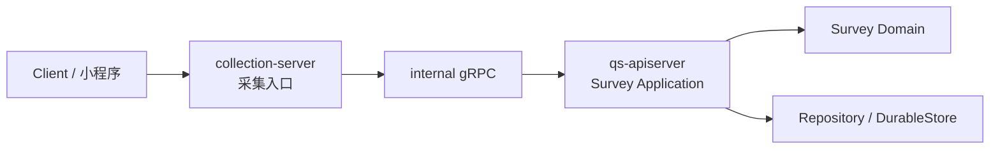
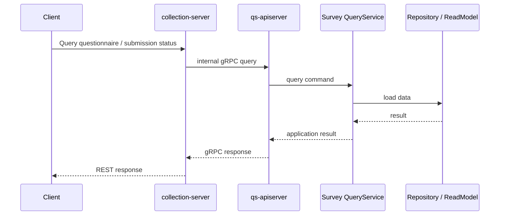
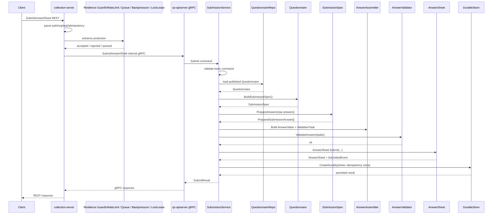

# 测评服务查询与提交链路

> 本文是 Survey 模块文档的第四篇。
>
> 前两篇已经分别说明了模板侧模型和事实侧模型：`Questionnaire / Question / SubmissionSpec` 负责可提交模板，`AnswerSheet / Answer / AnswerValue` 负责作答事实。
>
> 本文聚焦服务链路：前台如何通过 `collection-server` 查询测评问卷、提交答卷；`collection-server` 与 `qs-apiserver` 如何分工；`SubmissionService` 如何编排 `Questionnaire / SubmissionSpec / AnswerValidator / AnswerSheet.Submit`；查询链路和提交链路分别应该保持怎样的边界。

---

## 1. 结论先行

Survey 的服务链路不是单进程内部调用，而是由 `collection-server` 与 `qs-apiserver` 协作完成。

`collection-server` 的运行时定位更接近前台采集 BFF / Collection Gateway：它面向小程序或前台用户，承接前台协议、入口保护、上下文提取和响应适配；`qs-apiserver` 则是主业务事实源，负责 Survey 的领域模型、应用服务、持久化和事件出站。

Survey 的服务链路要分清两个运行时角色：

```text
collection-server：外部采集入口，面向前台用户与小程序；
qs-apiserver：Survey 领域事实源，负责领域模型、应用服务和持久化边界。
```

一句话概括：

> **collection-server 是采集入口，qs-apiserver 是 Survey 领域模型与持久化事实源。**

测评服务链路主要有两类：

```text
查询链路：查询可填写问卷、问卷详情、提交状态；
提交链路：提交 AnswerSheet，形成作答事实并触发后续 Evaluation。
```

提交链路本身不是复杂业务流程。

它更接近一个明确的应用用例：

```text
接收提交请求；
加载已发布问卷；
构造 SubmissionSpec；
准备 AnswerValue；
执行答案校验；
调用 AnswerSheet.Submit；
交给 DurableStore 可靠保存。
```

这种“一个请求对应一条应用编排过程”的组织方式，接近 Fowler 所说的 Transaction Script：每个过程处理来自表示层的一个请求。这个类比适合帮助理解 SubmitAnswerSheet 的应用层编排边界，而不是说领域模型退化成贫血模型。

---

## 2. 本文边界

本文只讲服务查询与提交链路。

本文重点：

```text
collection-server 的职责；
qs-apiserver 的职责；
前台问卷查询链路；
答卷提交链路；
SubmissionService 应用层编排；
DTO / Command / Domain 的转换边界；
提交结果与提交状态查询。
```

本文不展开：

```text
Questionnaire / Question / SubmissionSpec 的模型细节；
AnswerSheet / Answer / AnswerValue 的模型细节；
DurableStore / Idempotency / Outbox 的可靠出站细节；
Worker / Evaluation 的异步执行细节。
```

这些分别由以下文档承接：

```text
01-Questionnaire模型-Questionnaire-Question-SubmissionSpec.md
02-AnswerSheet模型-AnswerSheet-Answer-AnswerValue.md
04-测评提交事件幂等与Outbox出站链路.md
```

---

## 3. collection-server 与 qs-apiserver 的分工

Survey 的用户侧服务链路通常不是前台直接访问 `qs-apiserver`，而是先进入 `collection-server`。

```text
Client / Mini Program
  -> collection-server
  -> qs-apiserver internal gRPC
  -> Survey application service
  -> Survey domain model
  -> Repository / DurableStore
```



### 3.1 collection-server 的职责

`collection-server` 是面向前台的采集入口。

它负责：

```text
暴露前台 REST API；
适配前端 DTO；
提取用户身份、组织、任务等上下文；
做入口级参数校验；
挂载入口保护能力，例如 RateLimit / SubmitQueue / Backpressure / LockLease；
传递 IdempotencyKey，而不是自己完成答卷持久化幂等；
通过 internal gRPC 调用 qs-apiserver；
把 qs-apiserver 结果转换为前端响应。
```

它不负责：

```text
直接保存 AnswerSheet；
直接操作 Questionnaire / AnswerSheet 领域模型；
直接发布 answersheet.submitted；
直接创建 Assessment；
直接执行 Evaluation。
```

### 3.2 collection-server 的运行时定位

`collection-server` 应作为运行时入口理解，而不是一个独立业务域。

它的核心价值是：

```text
把前台采集请求接进来；
在进入主业务服务前完成入口保护；
把前台协议转换为 internal gRPC；
把 qs-apiserver 的业务结果转换为前台响应。
```

它可以挂载基础设施韧性能力，但这些能力不改变 Survey 的领域语义。

```text
RateLimit 控制请求进入速率；
SubmitQueue 对提交请求削峰排队；
Backpressure 在下游压力过高时保护系统；
LockLease / SubmitGuard 抑制短时间重复提交。
```

这些能力属于基础设施层，不属于 Survey 领域模型。

Survey 只关心请求最终是否进入 `qs-apiserver` 的应用服务，并形成合法的 `AnswerSheet` 提交事实。

相关基础设施文档：

```text
../../03-基础设施/resilience/01-RateLimit入口限流.md
../../03-基础设施/resilience/02-SubmitQueue提交削峰.md
../../03-基础设施/resilience/03-Backpressure下游背压.md
../../03-基础设施/resilience/04-LockLease重复提交抑制.md
```

### 3.3 qs-apiserver 的职责

`qs-apiserver` 是 Survey 的主业务中心和事实源边界。

它负责：

```text
加载已发布 Questionnaire；
生成 SubmissionSpec；
准备 AnswerValue；
执行 AnswerValidator；
调用 AnswerSheet.Submit；
保存 AnswerSheet；
处理幂等与 Outbox；
提供查询与内部 gRPC 能力。
```

也就是说：

```text
collection-server 管入口；
qs-apiserver 管领域事实。
```

这个分工可以避免前台采集入口变成业务中心，也可以避免主业务服务暴露过多面向前端的协议细节。

---

## 4. 查询链路总览

Survey 查询链路主要服务于前台填写体验。

典型查询包括：

```text
查询可填写问卷列表；
查询问卷详情；
查询某个任务对应的问卷；
查询已提交答卷或提交状态；
查询答卷详情。
```

查询链路通常是：

```text
Client
  -> collection-server REST
  -> qs-apiserver internal gRPC / application query service
  -> Repository / ReadModel
  -> collection-server response DTO
```



### 4.1 查询链路的原则

查询链路应遵守：

```text
前端响应 DTO 不等于领域模型；
collection-server 负责前端响应适配；
qs-apiserver 提供稳定业务查询结果；
查询结果不应该暴露可变领域实体；
必要时使用 Snapshot / Query DTO。
```

### 4.2 查询链路不应该做什么

查询链路不应该：

```text
临时修改 Questionnaire；
临时修改 AnswerSheet；
触发 submitted 事件；
推进 Evaluation 状态机；
执行计分和报告生成。
```

查询链路只返回当前事实或读侧视图。

---

## 5. 提交链路总览

答卷提交链路是 Survey 的核心写链路。

完整链路如下：



这条链路要表达清楚：

```text
collection-server 是入口；
resilience guard 是入口保护能力；
qs-apiserver 是领域事实源；
SubmissionService 是用例编排；
Questionnaire 提供提交规格；
SubmissionSpec 做规格准备；
AnswerValidator 执行答案规则校验；
AnswerSheet.Submit 创建提交事实；
DurableStore 处理可靠持久化与事件出站准备。
```

---

## 6. SubmitAnswerSheet 的输入边界

前台提交请求通常包含：

```text
QuestionnaireCode；
QuestionnaireVersion 或任务上下文；
Answers；
Filler / Testee / OrgID / TaskID；
IdempotencyKey；
FilledAt / ClientSubmittedAt。
```

这些信息进入系统后，需要分层处理。

| 输入 | 处理位置 | 说明 |
| --- | --- | --- |
| 用户身份 | collection-server / IAM context | 入口层提取 |
| OrgID / TaskID | collection-server / application command | 提交上下文 |
| QuestionnaireCode / Version | SubmissionService / QuestionnaireResolver | 用于加载已发布问卷 |
| Raw Answers | SubmissionSpec / AnswerAssembler | 准备 AnswerValue |
| IdempotencyKey | collection-server 传递，DurableStore / LockLease 使用 | 请求去重与短时间重复提交抑制 |
| FilledAt | application / domain | 填写时间或提交时间 |

关键原则：

```text
外部 DTO 不是领域事实；
进入 qs-apiserver 后要转换为 command；
command 再经应用服务转换为领域对象。
```

---

## 7. SubmissionService 的职责

`SubmissionService` 是提交用例的应用层入口。

它负责把一次提交请求编排成多个领域协作。

### 7.1 SubmissionService 应该做什么

```text
校验 command 基本结构；
解析或加载已发布 Questionnaire；
调用 Questionnaire.BuildSubmissionSpec；
调用 SubmissionSpec.PrepareAnswers；
调用 AnswerAssembler 构造 AnswerValue 和 ValidationTask；
调用 AnswerValidator 执行校验；
构造 SubmissionContext；
调用 AnswerSheet.Submit；
调用 DurableStore.CreateDurably；
返回提交结果。
```

### 7.2 SubmissionService 不应该做什么

```text
直接遍历 Questionnaire.questions 拼规则；
直接把客户端 question_type 当成事实源；
自己手写所有题型校验；
自己拼 AnswerSheetSubmittedEvent；
直接 publish MQ；
直接创建 Assessment；
直接生成 Report。
```

它的职责是编排，不是吞掉所有领域逻辑。

---

## 8. QuestionnaireResolver：加载可提交问卷

提交前必须加载可提交问卷。

这通常由 `QuestionnaireResolver` 或类似应用组件完成。

它负责：

```text
根据 QuestionnaireCode / Version / Task 上下文找到 Questionnaire；
确保 Questionnaire 存在；
确保 Questionnaire 处于 published；
必要时校验组织或任务上下文；
返回 Questionnaire 聚合。
```

它不负责：

```text
准备答案；
校验答案值；
创建 AnswerSheet；
保存 Outbox。
```

为什么要单独抽出 Resolver？

```text
避免 SubmissionService 直接理解各种查询路径；
为后续 Task -> Questionnaire / Plan -> Questionnaire 解析留下扩展点；
让“如何找到可提交问卷”这件事集中管理。
```

---

## 9. SubmissionSpec 在提交链路中的职责

`SubmissionSpec` 是从 published Questionnaire 构建出来的可提交规格。

在提交流程中，它负责：

```text
提供 QuestionnaireRef；
提供 QuestionSpec；
校验 submitted question_code 是否存在；
校验 submitted question_type 是否与模板一致；
输出 PreparedSubmissionAnswer。
```

核心原则：

> **题型事实源是 Questionnaire / SubmissionSpec，不是客户端 DTO。**

客户端传来的 question_type 只能用于校验兼容性，不能作为最终领域事实。

---

## 10. AnswerAssembler：从 Raw Answer 到领域输入

`AnswerAssembler` 或类似组件负责把 prepared answer 转成领域可用输入。

它通常做两件事：

```text
1. 构造 AnswerValue；
2. 构造 ValidationTask。
```

```text
PreparedSubmissionAnswer
  -> AnswerValue
  -> Answer

PreparedSubmissionAnswer
  -> ValidationTask
  -> AnswerValidator
```

这一步的意义是：

```text
将 raw value 收敛为类型化答案值；
将 question spec 上的 validation rules 转换成校验任务；
让 AnswerSheet.Submit 接收的是已经准备好的答案事实。
```

AnswerAssembler 不应该：

```text
保存 AnswerSheet；
发布事件；
计算 FactorScore；
判断 RiskLevel。
```

---

## 11. AnswerValidator：执行答案规则校验

`AnswerValidator` 执行答案规则校验。

它处理：

```text
required；
min / max；
min_length / max_length；
min_selected / max_selected；
option exists；
pattern。
```

它与 SubmissionSpec 的边界是：

| 问题 | 归属 |
| --- | --- |
| question_code 是否属于问卷 | SubmissionSpec |
| question_type 是否与模板一致 | SubmissionSpec |
| raw value 如何转 AnswerValue | AnswerAssembler |
| required 是否满足 | AnswerValidator |
| min / max 是否满足 | AnswerValidator |
| option 是否存在 | AnswerValidator / adapter |

校验完成后，才允许进入：

```text
AnswerSheet.Submit
```

---

## 12. AnswerSheet.Submit：创建提交事实

`AnswerSheet.Submit` 是领域层创建提交事实的入口。

它接收：

```text
AnswerSheetID；
QuestionnaireRef；
SubmissionContext；
Answers；
FilledAt。
```

它保护：

```text
ID 不能为空；
QuestionnaireRef 合法；
SubmissionContext 合法；
Answers 非空；
QuestionCode 不重复；
FilledAt 合法；
提交成功后产生 AnswerSheetSubmittedEvent。
```

它不负责：

```text
加载问卷；
校验题目归属；
执行 required/min/max；
持久化；
发布 MQ；
创建 Assessment。
```

这些职责由应用层、校验器、DurableStore 和 Evaluation 承担。

---

## 13. DurableStore 在本文中的位置

本文只说明 DurableStore 在提交链路中的位置，不展开 Outbox 细节。

`DurableStore` 是提交链路的最后一步。

它接收：

```text
AnswerSheet；
IdempotencyMeta；
AnswerSheetSubmittedEvent。
```

它负责把以下内容放入可靠持久化边界：

```text
AnswerSheet；
提交幂等记录；
Outbox 事件。
```

详细说明放到下一篇：

```text
04-测评提交事件幂等与Outbox出站链路.md
```

---

## 14. resilience 能力在本文中的位置

本文只从服务链路角度轻量说明 resilience 能力，不展开实现细节。

在答卷提交链路中，resilience 能力主要挂载在 `collection-server` 入口侧。

| 能力 | 链路位置 | 语义边界 |
| --- | --- | --- |
| RateLimit | collection-server 入口 | 控制 submit / query / wait-report 等入口速率 |
| SubmitQueue | submit 入口 | 对瞬时提交流量削峰排队 |
| Backpressure | 调用 qs-apiserver 前后 | 下游压力过高时保护系统 |
| LockLease / SubmitGuard | submit 入口或幂等前置 | 抑制短时间重复提交 |

这些能力不改变 Survey 的领域事实。

```text
RateLimit 拒绝请求，不等于 AnswerSheet 提交失败；
SubmitQueue 排队请求，不等于 AnswerSheet 已提交；
Backpressure 保护下游，不等于 Evaluation 失败；
LockLease 抑制重复请求，不等于 DurableStore 幂等记录。
```

Survey 的领域事实仍然以 `qs-apiserver` 中的 `AnswerSheet.Submit` 和 `DurableStore.CreateDurably` 为准。

也就是说：

```text
入口保护属于基础设施韧性层；
AnswerSheet 提交属于 Survey 领域事实层；
Outbox 出站属于 qs-apiserver 的可靠事件边界。
```

相关实现细节见：

```text
../../03-基础设施/resilience/01-RateLimit入口限流.md
../../03-基础设施/resilience/02-SubmitQueue提交削峰.md
../../03-基础设施/resilience/03-Backpressure下游背压.md
../../03-基础设施/resilience/04-LockLease重复提交抑制.md
```

---

## 15. 提交结果与提交状态查询

提交链路结束后，前台通常需要得到一个明确结果。

提交成功可以返回：

```text
AnswerSheetID；
QuestionnaireCode；
QuestionnaireVersion；
SubmittedAt；
NextStatus / Message。
```

注意：提交成功不等于 Evaluation 完成。

更准确的语义是：

```text
AnswerSheet 已保存；
answersheet.submitted 已进入可靠出站链路；
后续 Evaluation 会异步执行。
```

因此，提交状态查询可能需要区分：

```text
submitted：答卷已提交；
evaluating：评估处理中；
evaluated：评估完成；
failed：评估失败。
```

其中 `submitted` 属于 Survey，后续状态更多属于 Evaluation。

如果前台需要统一展示，可以由 collection-server 聚合 Survey / Evaluation 查询结果。

---

## 16. collection-server 的响应适配

collection-server 面向前台，需要做响应适配。

它可以把 qs-apiserver 返回的业务结果转换成：

```text
前台提交成功页需要的结构；
下一步跳转信息；
评估处理中提示；
错误提示文案；
重复提交时的幂等响应。
```

但它不应该把这些前端响应语义反向写入 Survey 领域模型。

也就是说：

```text
领域结果是事实；
前端响应是展示适配。
```

---

## 17. 错误处理边界

提交链路中的错误可以分层。

| 错误类型 | 产生位置 | 示例 |
| --- | --- | --- |
| DTO 错误 | collection-server / transport | 字段缺失、格式错误 |
| 问卷解析错误 | QuestionnaireResolver | 问卷不存在、未发布 |
| 规格错误 | SubmissionSpec | question_code 不存在、question_type 不一致 |
| 校验错误 | AnswerValidator | required 失败、选项不存在、范围不合法 |
| 领域错误 | AnswerSheet.Submit | context 非法、answers 为空、question 重复 |
| 持久化错误 | DurableStore | 写库失败、幂等冲突、事务失败 |
| 下游异步错误 | Worker / Evaluation | 评估失败、规则缺失 |

处理原则：

```text
同步提交只返回提交链路内的确定错误；
Evaluation 异步失败不应该伪装成提交失败；
重复提交应尽量返回幂等结果；
领域错误应映射为稳定 API code。
```

---

## 18. 与 Scale / Evaluation 的边界

提交链路到 `AnswerSheet.Submit` 为止仍然属于 Survey。

它不应该做：

```text
选择 MedicalScale；
计算 FactorScore；
匹配 InterpretationRules；
生成 InterpretReport；
完成 Assessment。
```

提交完成后，Survey 只通过事件声明：

```text
answersheet.submitted
```

Evaluation 后续负责：

```text
加载 AnswerSheet；
解析 EvaluationModel；
加载 Scale / 规则模型；
执行计分；
保存结果；
生成报告。
```

---

## 19. 当前链路成熟度评价

| 方面 | 评价 |
| --- | --- |
| collection-server 边界 | 作为采集入口，与 qs-apiserver 领域边界区分清楚 |
| internal gRPC | 能让采集入口调用主业务服务而不直接操作持久化 |
| SubmissionService | 适合作为轻量提交用例编排入口 |
| QuestionnaireResolver | 能收口可提交问卷解析逻辑 |
| SubmissionSpec | 能收口题目归属和题型规格 |
| AnswerAssembler | 能把 raw answer 转成领域输入 |
| AnswerValidator | 与 SubmissionSpec 分工清楚 |
| AnswerSheet.Submit | 创建提交事实，领域语义清楚 |
| DurableStore | 作为可靠提交边界，后续由 04 篇展开 |

综合判断：

```text
测评提交服务链路的核心已经清楚：collection-server 管入口，qs-apiserver 管领域事实，SubmissionService 做轻量编排，AnswerSheet.Submit 创建提交事实。
```

---

## 20. 后续演进方向

### 20.1 collection-server 运行时文档索引

Survey 文档只说明 collection-server 在测评查询与提交链路中的业务位置。

collection-server 的运行时装配、路由注册、入口保护能力挂载、internal gRPC client 初始化、优雅关闭等内容，应在运行时文档中维护。

建议索引：

```text
../../01-运行时/02-collection-server运行时.md
../../03-基础设施/resilience/README.md
```

### 20.2 查询链路读模型收敛

前台查询问卷和提交状态时，可以逐步形成稳定 Query DTO。

目标：

```text
前端不直接依赖领域实体；
collection-server 不直接拼领域内部结构；
qs-apiserver 提供稳定查询结果。
```

### 20.3 command / DTO 分层更清晰

保持：

```text
REST DTO -> internal gRPC request -> application command -> domain input
```

不要让前端 DTO 直接穿透到领域层。

### 20.4 Evaluation 状态聚合查询

如果前台需要同时展示提交状态和评估状态，可以由 collection-server 聚合查询：

```text
Survey submitted status；
Evaluation processing/result status。
```

不要把 Evaluation 状态塞进 AnswerSheet。

### 20.5 Task / Plan 上下文解析

如果未来提交不再直接传 QuestionnaireCode，而是通过 TaskID 解析问卷，则应把解析逻辑放在：

```text
QuestionnaireResolver / PlanResolver / EvaluationModelResolver
```

不要散落在 handler 中。

---

## 21. 不建议做的事情

| 不建议 | 原因 |
| --- | --- |
| collection-server 直接保存 AnswerSheet | 会绕过 qs-apiserver 领域事实源 |
| handler 里直接操作 Questionnaire / AnswerSheet | transport 会吞掉 application 职责 |
| SubmissionService 手写所有题型规则 | 会让 SubmissionSpec / AnswerValidator 失去价值 |
| 客户端 question_type 作为事实源 | 题型事实应该来自 Questionnaire / SubmissionSpec |
| 提交成功就同步执行完整 Evaluation | 会拉长提交响应，且污染 Survey 边界 |
| 把 Evaluation 状态塞进 AnswerSheet | 会让作答事实聚合变成测评流程聚合 |
| Worker 直接实现复杂状态机 | 状态机应收敛在 Evaluation application service |
| 在 Survey 文档里重复展开 RateLimit / SubmitQueue 实现 | 这些属于基础设施 resilience 文档 |
| 把 SubmitQueue 当成 AnswerSheet 已提交 | Queue 只是入口削峰，领域事实仍以 DurableStore 成功为准 |
| 把 LockLease 当成 DurableStore 幂等记录 | LockLease 是入口重复抑制，DurableStore 幂等是提交事实层去重 |

---

## 22. 代码锚点

| 类型 | 路径 |
| --- | --- |
| collection REST 入口 | `internal/collection-server/transport/rest/handler/answersheet_handler.go` |
| collection 应用服务 | `internal/collection-server/application/answersheet` |
| collection resilience 装配 | `internal/collection-server` |
| resilience 基础设施文档 | `docs/03-基础设施/resilience` |
| internal gRPC 契约 | `internal/apiserver/interface/grpc/proto/internalapi/internal.proto` |
| internal gRPC handler | `internal/apiserver/interface/grpc` |
| 提交应用服务 | `internal/apiserver/application/survey/answersheet/submission_service.go` |
| 问卷解析 | `internal/apiserver/application/survey/answersheet/submission_questionnaire_resolver.go` |
| 答案准备 | `internal/apiserver/application/survey/answersheet/submission_answer_assembler.go` |
| 提交 finalizer | `internal/apiserver/application/survey/answersheet/submission_finalizer.go` |
| DurableStore 接口 | `internal/apiserver/application/survey/answersheet/durable_store.go` |
| AnswerSheet 聚合 | `internal/apiserver/domain/survey/answersheet/answersheet.go` |
| SubmissionSpec | `internal/apiserver/domain/survey/questionnaire/submission_spec.go` |
| AnswerValidator | `internal/apiserver/domain/survey/answersheet/validation_adapter.go` |

---

## 23. Verify

修改测评查询与提交链路后，建议执行：

```bash
go test ./internal/collection-server/application/answersheet/...
go test ./internal/collection-server/transport/rest/handler/...
go test ./internal/apiserver/application/survey/answersheet/...
go test ./internal/apiserver/domain/survey/...
```

如果改动涉及 internal gRPC 契约：

```bash
go test ./internal/apiserver/interface/grpc/...
```

如果改动涉及 DurableStore：

```bash
go test ./internal/apiserver/infra/mongo/answersheet/...
```

如果改动涉及 Evaluation 状态查询：

```bash
go test ./internal/apiserver/application/evaluation/...
```

---

## 24. 面试与宣讲口径

### 24.1 30 秒版本

```text
Survey 的测评服务链路分成 collection-server 和 qs-apiserver 两层。
collection-server 是外部采集入口，负责前台协议、身份上下文、DTO、入口保护能力挂载和 internal gRPC 调用；RateLimit、SubmitQueue、Backpressure、LockLease 属于基础设施韧性层。
qs-apiserver 是 Survey 领域事实源，负责加载已发布 Questionnaire、构造 SubmissionSpec、准备 AnswerValue、执行 AnswerValidator、调用 AnswerSheet.Submit，并交给 DurableStore 可靠保存。
```

### 24.2 3 分钟版本

```text
测评提交链路不是复杂流程，而是一次清晰的应用用例。

前台请求先进入 collection-server。collection-server 面向小程序或前端，负责 REST 协议、身份上下文、组织和任务信息、幂等 key 传递，同时可以挂载 RateLimit、SubmitQueue、Backpressure、LockLease 等入口保护能力。这些能力属于基础设施韧性层，不改变 Survey 的领域事实语义。

qs-apiserver 才是 Survey 的主业务边界。提交进入 SubmissionService 后，首先加载已发布 Questionnaire，再调用 BuildSubmissionSpec 得到提交规格。SubmissionSpec 会校验 question_code 是否属于当前问卷版本，以及客户端提交的 question_type 是否与模板一致。

之后 AnswerAssembler 会把 raw answer 转成 AnswerValue，并组装 ValidationTask。AnswerValidator 执行 required、min/max、option exists 等校验。校验通过后，SubmissionService 构造 SubmissionContext，调用 AnswerSheet.Submit 创建正式提交事实。

最后 DurableStore 负责可靠保存 AnswerSheet、提交幂等记录和 outbox 事件。Survey 到这里为止只声明 answersheet.submitted，后续 Evaluation 由 worker 异步驱动。
```

### 24.3 高频追问

| 追问 | 回答要点 |
| --- | --- |
| collection-server 和 qs-apiserver 怎么分工？ | collection-server 管前台采集入口，qs-apiserver 管领域模型和持久化事实源 |
| SubmissionService 做什么？ | 编排加载问卷、构造规格、准备答案、校验、Submit、持久化 |
| 为什么需要 internal gRPC？ | 让采集入口调用主业务服务，同时不直接暴露 apiserver 内部模型 |
| 查询链路和提交链路区别？ | 查询只读事实或读模型，提交创建 AnswerSheet 并触发事件 |
| 为什么客户端 question_type 不可信？ | 题型事实来自 published Questionnaire / SubmissionSpec |
| 提交成功是否等于评估完成？ | 不等于。提交成功只表示 AnswerSheet 已保存，Evaluation 后续异步执行 |
| Evaluation 状态放在哪里？ | 属于 Evaluation，不应塞进 AnswerSheet |
| Worker 是否直接实现状态机？ | 不建议，Worker 应驱动 Evaluation application service |
| SubmitQueue 属于 Survey 模型吗？ | 不属于，它是 collection-server 入口削峰能力，属于 resilience 基础设施 |
| LockLease 和幂等记录有什么区别？ | LockLease 是入口重复抑制，DurableStore 幂等记录是提交事实层去重 |
| RateLimit / Backpressure 会改变提交事实吗？ | 不会，它们只影响请求是否进入提交链路，AnswerSheet 事实仍由 qs-apiserver 创建 |

---

## 25. 下一篇文档

下一篇建议维护：

```text
04-测评提交事件幂等与Outbox出站链路.md
```

重点回答：

```text
IdempotencyKey 如何保证重复提交安全；
DurableStore 如何同时保存 AnswerSheet、幂等记录和 Outbox 事件；
answersheet.submitted 如何可靠出站；
Outbox relay 与 Worker 如何协作；
Evaluation 下游如何处理重复事件。
```
