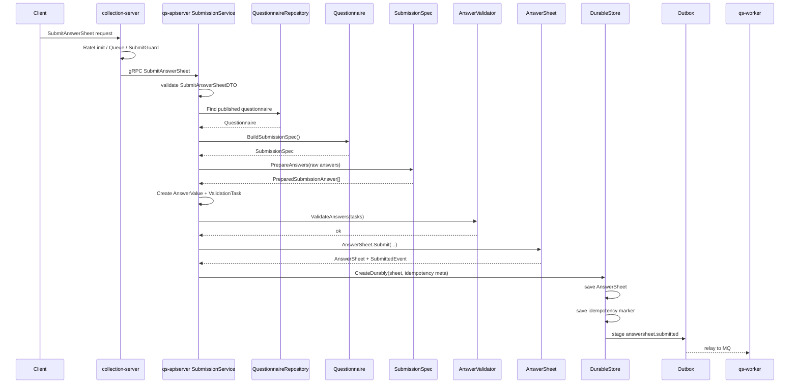

# 答卷提交链路分析

> 本文是 Survey 模块文档重建的第四篇。
>
> 前两篇分别讲清了模板侧的 `Questionnaire / SubmissionSpec`，以及事实侧的 `AnswerSheet / SubmissionContext / AnswerValue`。
>
> 本文聚焦一次真实提交请求的完整执行链路：请求如何从 `collection-server` 进入 `qs-apiserver`，`SubmissionService` 如何加载已发布问卷并构建 `SubmissionSpec`，如何准备 `AnswerValue` 与 `ValidationTask`，如何执行规则校验，如何调用 `AnswerSheet.Submit` 创建提交事实，最后如何通过 `DurableStore + Outbox` 可靠发布 `answersheet.submitted`。

---

## 1. 结论先行

答卷提交链路不是简单的 `insert answersheet`。

它是一条由多层协作完成的业务事实落地链路：

```text
collection-server
  -> qs-apiserver SubmissionService
  -> QuestionnaireRepository
  -> Questionnaire.BuildSubmissionSpec
  -> SubmissionSpec.PrepareAnswers
  -> AnswerValue factory
  -> AnswerValidator
  -> AnswerSheet.Submit
  -> SubmissionDurableStore.CreateDurably
  -> Outbox answersheet.submitted
```

这条链路的设计目标是：

```text
1. 前台提交入口可治理；
2. 只允许基于已发布问卷版本提交；
3. 客户端 DTO 不能成为题型事实源；
4. 答案必须符合问卷规格与校验规则；
5. AnswerSheet 必须表达完整提交事实；
6. 答卷保存、幂等记录、事件出站必须在 durable boundary 内完成；
7. Survey 只声明“答卷已提交”，不直接执行 Evaluation。
```

一句话概括：

> **答卷提交链路的本质，是把一次前台提交请求转化为一份可靠保存的 AnswerSheet 提交事实，并通过 Outbox 发布 answersheet.submitted，驱动后续异步评估。**

---

## 2. 总体链路

一次提交请求可以分成七个阶段。

```text
1. collection-server 接收前台请求
2. qs-apiserver SubmissionService 校验 DTO
3. 加载并验证可提交 Questionnaire
4. 通过 SubmissionSpec 准备答案
5. 构造 AnswerValue 与 ValidationTask，并执行 AnswerValidator
6. 调用 AnswerSheet.Submit 创建提交事实
7. DurableStore 保存答卷、处理幂等、stage outbox
```



---

## 3. 为什么提交链路要拆这么多层

如果把答卷提交写成一个大函数：

```text
handler 读取请求
  -> 查问卷
  -> 校验答案
  -> 插入答卷
  -> 发 MQ
```

短期可以跑，但长期会出现几个问题。

| 问题 | 后果 |
| --- | --- |
| handler 理解业务规则 | 入站层膨胀，难测试，难复用 |
| application 自己拆问卷结构 | Questionnaire 聚合失去提交规格语义 |
| 客户端 question_type 被信任 | 题型事实可能被污染 |
| 规则校验和规格校验混在一起 | 错误定位不清楚，新增题型困难 |
| 保存答卷后直接发 MQ | 容易出现答卷保存成功但事件发布失败 |
| worker 直接处理业务状态 | apiserver 主业务事实源边界被破坏 |

当前链路拆层的目的不是“为了复杂而复杂”，而是把不同问题交给不同对象处理。

| 层次 | 核心问题 |
| --- | --- |
| collection-server | 前台提交如何被保护 |
| SubmissionService | 一次提交用例如何被编排 |
| Questionnaire | 哪份问卷可以被提交 |
| SubmissionSpec | 这份问卷如何被提交 |
| AnswerValidator | 答案是否符合校验规则 |
| AnswerSheet | 如何表达一次提交事实 |
| DurableStore | 提交事实如何可靠落库并出站 |
| Worker | 后续异步评估如何被驱动 |

---

## 4. 阶段一：collection-server 接收提交请求

前台请求通常先进入 `collection-server`。

它不是 Survey 聚合所在位置，而是前台提交保护层。

主要职责包括：

```text
REST BFF；
RateLimit；
SubmitQueue；
SubmitGuard；
submit-status；
gRPC Client 调用 qs-apiserver。
```

### 4.1 collection-server 不负责什么

collection-server 不应该负责：

```text
直接写 AnswerSheet；
直接写 MongoDB；
直接创建 Assessment；
直接执行 Evaluation；
直接发布 answersheet.submitted；
直接判断问卷是否 published；
直接执行题目规则校验。
```

它的边界是：

> collection-server 是前台提交入口治理层，不是作答事实源。

### 4.2 为什么需要 collection-server

答卷提交是前台高并发入口。

collection-server 的价值在于：

```text
把高峰流量挡在主业务服务前；
对重复提交、排队、限流进行统一治理；
让 qs-apiserver 专注主业务事实与领域模型。
```

这也是 qs-server 三进程架构中的重要边界。

---

## 5. 阶段二：SubmissionService 校验 DTO

请求进入 qs-apiserver 后，首先由 `SubmissionService.Submit` 编排。

当前 Submit 的主流程可以概括为：

```text
validateSubmitDTO
fetchAndValidateQuestionnaire
buildAnswerValuesAndTasks
validateAnswersBatch
createAnswers
createAndSaveAnswerSheet
```

### 5.1 DTO 校验负责什么

DTO 校验只做基本输入完整性检查。

典型检查包括：

```text
QuestionnaireCode 不能为空；
FillerID 不能为空；
TesteeID 不能为空；
OrgID 不能为空；
Answers 不能为空；
每个 answer 的 QuestionCode 不能为空；
每个 answer 的 QuestionType 不能为空。
```

注意：这里的 `QuestionType` 校验只是 DTO 完整性检查。

它不代表客户端 question_type 是可信事实。

真正的题型事实源仍然是：

```text
Questionnaire -> SubmissionSpec -> PreparedSubmissionAnswer
```

### 5.2 DTO 校验不负责什么

DTO 校验不应该负责：

```text
判断问卷是否已发布；
判断 question_code 是否属于问卷；
判断 question_type 是否与模板一致；
执行 required/min/max 等规则；
创建 AnswerSheet；
发布事件。
```

这些都属于后续阶段。

---

## 6. 阶段三：加载并验证可提交 Questionnaire

`fetchAndValidateQuestionnaire` 负责获取可提交问卷，并生成 SubmissionSpec。

它内部核心步骤是：

```text
resolveSubmittableQuestionnaire
  -> qnr.EnsureSubmittable
  -> qnr.BuildSubmissionSpec
```

### 6.1 未指定版本：使用当前已发布版本

如果请求没有传 `QuestionnaireVer`，系统会通过：

```text
FindPublishedByCode(questionnaire_code)
```

查找当前已发布版本。

查到后，会把这个已发布版本回填到提交 DTO 中。

这个行为的语义是：

```text
客户端可以只说“我要提交某个问卷 code”；
服务端必须落到一个确定的已发布 version；
最终 AnswerSheet 必须保存明确的 QuestionnaireVersion。
```

### 6.2 指定版本：必须是已发布版本

如果请求指定了 `QuestionnaireVer`，系统会通过：

```text
FindByCodeVersion(questionnaire_code, questionnaire_version)
```

加载指定版本。

然后调用：

```text
qnr.EnsureSubmittable()
```

确保它处于可提交状态。

这避免了：

```text
提交草稿版问卷；
提交归档版问卷；
提交不存在的版本；
提交版本语义不明确的问卷。
```

### 6.3 BuildSubmissionSpec

拿到可提交问卷后，调用：

```text
qnr.BuildSubmissionSpec()
```

这一步非常关键。

它把 Questionnaire 从“完整模板聚合”转换成“提交链路需要的规格对象”。

```text
Questionnaire
  -> SubmissionSpec
      -> QuestionnaireRef
      -> QuestionSpec map
      -> ValidationRules
```

这样 application service 不需要自己拆 Questionnaire 内部结构。

---

## 7. 阶段四：SubmissionSpec 准备答案

提交 DTO 中的答案需要先转换成 `RawSubmissionAnswer`。

RawSubmissionAnswer 通常包含：

```text
QuestionCode
QuestionType
Value
```

然后调用：

```text
spec.PrepareAnswers(rawAnswers)
```

### 7.1 PrepareAnswers 负责什么

`PrepareAnswers` 负责规格层校验。

它至少要保证：

```text
question_code 不为空；
question_code 属于当前问卷版本；
客户端提交的 question_type 与 QuestionSpec 一致；
能够返回题目对应的 ValidationRules。
```

输出结果是：

```text
PreparedSubmissionAnswer
├── QuestionCode
├── QuestionType
├── RawValue
└── ValidationRules
```

### 7.2 PrepareAnswers 不负责什么

PrepareAnswers 不应该执行完整规则校验。

例如：

```text
required；
min_length；
max_length；
min_value；
max_value；
min_selected；
max_selected。
```

这些属于 AnswerValidator。

### 7.3 为什么题型事实源必须来自 SubmissionSpec

客户端请求是外部输入，不可信。

客户端可以传：

```json
{
  "question_code": "Q001",
  "question_type": "text",
  "value": "A"
}
```

但模板中 Q001 可能真实类型是 radio。

如果服务端信任客户端 question_type，就可能出现：

```text
用 text 方式解析 radio 答案；
绕过 option 校验；
污染 AnswerValue；
导致后续计分和 Evaluation 输入错误。
```

因此，最终进入 Answer 的 QuestionType 必须来自：

```text
Questionnaire / SubmissionSpec
```

---

## 8. 阶段五：构造 AnswerValue 与 ValidationTask

规格准备完成后，application 会构造两个中间结果：

```text
AnswerValue
ValidationTask
```

### 8.1 构造 AnswerValue

根据 PreparedSubmissionAnswer 中的 QuestionType 与 RawValue，调用：

```text
answersheet.CreateAnswerValueFromRaw(questionType, rawValue)
```

典型映射关系：

| QuestionType | AnswerValue |
| --- | --- |
| radio | OptionValue |
| checkbox | OptionsValue |
| text | StringValue |
| textarea | StringValue |
| number | NumberValue |
| section | StringValue / EmptyValue |

这一步的意义是：

```text
尽早把 raw value 转成类型化领域值；
避免 map[string]any 在领域层到处流动；
为校验、计分、持久化提供稳定输入。
```

### 8.2 构造 ValidationTask

同时，application 会把 PreparedSubmissionAnswer 中的 ValidationRules 转成 ruleengine 的 ValidationRuleSpec。

然后构造：

```text
AnswerValidationTask
├── ID = QuestionCode
├── Value = AnswerValueAdapter
└── Rules = ValidationRuleSpec[]
```

`AnswerValueAdapter` 的作用是把领域值对象适配给规则引擎。

这样 ruleengine 不需要直接依赖 AnswerValue 的具体实现。

### 8.3 为什么 AnswerValue 与 ValidationTask 要同时构造

因为两者来自同一份规格准备结果。

```text
PreparedSubmissionAnswer
  -> AnswerValue：用于后续创建 Answer
  -> ValidationTask：用于规则校验
```

这可以确保：

```text
被校验的值，和后续进入 AnswerSheet 的值，是同一套语义来源。
```

---

## 9. 阶段六：AnswerValidator 批量校验答案

`validateAnswersBatch` 会调用：

```text
answerValidator.ValidateAnswers(ctx, tasks)
```

它负责执行题目规则校验。

### 9.1 AnswerValidator 负责什么

AnswerValidator 负责检查：

```text
required；
min_length / max_length；
min_value / max_value；
min_selected / max_selected；
pattern；
option exists；
其他题型相关规则。
```

它返回每个问题的校验结果。

如果有失败，SubmissionService 会收集失败题目和错误信息，返回 `ErrAnswerSheetInvalid`。

### 9.2 AnswerValidator 不负责什么

AnswerValidator 不负责：

```text
查找 Questionnaire；
判断 Questionnaire 是否 published；
判断 question_code 是否属于问卷版本；
创建 AnswerSheet；
保存答卷；
发布事件。
```

它只执行规则校验。

### 9.3 为什么需要批量校验

批量校验有几个好处：

```text
一次返回多个题目的错误；
减少反复调用规则引擎的开销；
便于统一记录 validation errors；
提交链路语义更清楚。
```

---

## 10. 阶段七：创建 Answer 值对象

答案校验通过后，application 会把中间结果转换成领域 `Answer`。

```text
answerBuildResult
  -> answersheet.NewAnswer(...)
```

每个 Answer 包含：

```text
QuestionCode
QuestionType
AnswerValue
Score
```

当前提交时，Score 通常初始化为 0。

这是合理的，因为 Survey 提交链路只负责保存作答事实，不负责完整测评解释。

后续是否更新单题基础分、如何聚合因子分，应由 Scale / Evaluation 相关链路处理。

---

## 11. 阶段八：创建 AnswerSheet 提交事实

创建 AnswerSheet 的过程在 `createAndSaveAnswerSheet` 中完成。

逻辑可以拆成两步：

```text
createAnswerSheet
persistSubmittedAnswerSheet
```

### 11.1 创建 QuestionnaireRef

首先创建 QuestionnaireRef：

```text
NewQuestionnaireRef(
  QuestionnaireCode,
  QuestionnaireVersion,
  QuestionnaireTitle,
)
```

它保证 AnswerSheet 引用的是明确问卷版本。

### 11.2 创建 SubmissionContext

然后创建 SubmissionContext：

```text
NewSubmissionContext(
  FillerRef,
  TesteeRef,
  OrgID,
  TaskID,
)
```

这里会把 DTO 中的：

```text
FillerID
TesteeID
OrgID
TaskID
```

转换成领域引用和值对象。

### 11.3 调用 AnswerSheet.Submit

最后调用：

```text
answersheet.Submit(
  answersheet.NewID(),
  questionnaireRef,
  submissionContext,
  answers,
  time.Now(),
)
```

这一步完成的是：

```text
创建完整提交事实；
校验 AnswerSheet 聚合不变量；
产生 AnswerSheetSubmittedEvent。
```

### 11.4 为什么事件应该在 Submit 中产生

因为 `answersheet.submitted` 是提交事实成立后的领域事件。

如果事件由外部 application 临时拼装，说明 AnswerSheet 本身没有完整表达提交事实。

当前更合理的方式是：

```text
AnswerSheet.Submit
  -> addEvent(NewAnswerSheetSubmittedEvent(sheet))
```

这样事件 payload 可以从 AnswerSheet 自身导出。

---

## 12. 阶段九：DurableStore 持久化与 Outbox

`persistSubmittedAnswerSheet` 调用：

```text
durableStore.CreateDurably(ctx, sheet, DurableSubmitMeta{IdempotencyKey: ...})
```

这是提交链路的持久化边界。

### 12.1 DurableStore 的职责

DurableStore 通常负责：

```text
检查业务幂等键；
命中幂等时返回已存在 AnswerSheet；
开启事务；
保存 AnswerSheet；
保存提交幂等记录；
从 sheet.Events() 读取领域事件；
stage outbox entry；
事务失败后做并发提交兜底查询；
成功后 ClearEvents。
```

### 12.2 为什么 DurableStore 不属于领域模型

DurableStore 解决的是工程一致性问题：

```text
事务；
幂等；
持久化；
outbox staging；
并发兜底。
```

它不应该放进 AnswerSheet 聚合。

AnswerSheet 只负责：

```text
表达提交事实；
保护不变量；
产生领域事件。
```

### 12.3 幂等命中

如果请求携带 `IdempotencyKey`，DurableStore 可以先查是否已有完成记录。

如果已有，则直接返回已有 AnswerSheet，并标记 `existing = true`。

这让前端重复提交时可以得到稳定结果。

```text
第一次提交：保存 AnswerSheet + outbox
重复提交：返回同一份 AnswerSheet
```

### 12.4 Outbox staging

答卷保存和事件出站必须在同一持久化边界内完成。

否则会出现：

```text
AnswerSheet 保存成功；
answersheet.submitted 没有发布；
Evaluation 永远不会被驱动。
```

Outbox 的作用是把事件发布从“直接发 MQ”变成：

```text
先可靠写入 outbox；
再由 relay 异步发布 MQ。
```

这让提交链路更可靠。

---

## 13. 阶段十：answersheet.submitted 驱动后续 Evaluation

Survey 链路完成后，系统不会直接在提交请求中同步生成报告。

它只是发布：

```text
answersheet.submitted
```

后续由 Outbox Relay 和 Worker 推动。

```text
Outbox
  -> MQ
  -> qs-worker
  -> internal gRPC
  -> qs-apiserver Evaluation
```

### 13.1 为什么不在提交请求中直接评估

直接同步评估会带来问题：

```text
提交接口耗时变长；
报告生成失败会影响答卷保存；
高峰期 Evaluation 计算会拖垮前台提交；
重试和失败补偿不清晰；
Survey 与 Evaluation 边界混杂。
```

所以当前链路采用：

```text
同步保存作答事实；
异步执行测评评估。
```

### 13.2 Worker 不应该直接写业务表

Worker 消费事件后，应该通过 internal gRPC 回调 qs-apiserver。

它不应该直接写 AnswerSheet、Assessment、Report 等主业务表。

原因是：

```text
apiserver 才是主业务事实源；
Assessment 状态机应该由 Evaluation 应用服务控制；
Worker 只是异步驱动器。
```

---

## 14. 成功路径总结

一次成功提交可以用下面的状态转移概括。

```text
SubmitAnswerSheetDTO received
  -> DTO valid
  -> Published Questionnaire resolved
  -> SubmissionSpec built
  -> Raw answers prepared
  -> AnswerValue built
  -> ValidationTask passed
  -> Answer objects created
  -> SubmissionContext built
  -> AnswerSheet.Submit succeeded
  -> AnswerSheet saved
  -> Idempotency marker saved
  -> answersheet.submitted staged
  -> Submit API returns success
```

这条成功路径中，最关键的事实是：

```text
API 返回提交成功，并不代表 Evaluation 已完成；
它只代表 AnswerSheet 已可靠保存，answersheet.submitted 已进入出站链路。
```

---

## 15. 失败路径分析

### 15.1 DTO 参数失败

典型原因：

```text
QuestionnaireCode 为空；
FillerID 为空；
TesteeID 为空；
OrgID 为空；
Answers 为空；
Answer.QuestionCode 为空；
Answer.QuestionType 为空。
```

处理方式：

```text
直接返回 ErrAnswerSheetInvalid；
不访问 Questionnaire；
不产生 AnswerSheet；
不产生事件。
```

### 15.2 问卷不存在或不可提交

典型原因：

```text
QuestionnaireCode 不存在；
没有已发布版本；
指定版本不存在；
指定版本不是 published；
BuildSubmissionSpec 失败。
```

处理方式：

```text
返回 ErrQuestionnaireNotFound 或 ErrAnswerSheetInvalid；
不继续构造答案；
不产生 AnswerSheet。
```

### 15.3 提交答案不符合问卷规格

典型原因：

```text
question_code 不属于问卷；
question_type 与模板不一致；
raw answer 无法被规格接受。
```

处理方式：

```text
PrepareAnswers 返回错误；
不构造 AnswerSheet；
不产生事件。
```

### 15.4 AnswerValue 构造失败

典型原因：

```text
radio 题 value 不是 string；
checkbox 题 value 不是 []string / array；
number 题 value 无法转为数字；
新增题型没有对应 AnswerValue factory。
```

处理方式：

```text
返回 ErrAnswerSheetInvalid；
不执行持久化。
```

### 15.5 AnswerValidator 校验失败

典型原因：

```text
required 不满足；
超出 min/max；
文本长度不合法；
多选数量不合法；
选项不存在。
```

处理方式：

```text
收集失败题目和错误信息；
返回 ErrAnswerSheetInvalid；
不创建 AnswerSheet。
```

### 15.6 AnswerSheet.Submit 失败

典型原因：

```text
QuestionnaireRef 非法；
SubmissionContext 非法；
answers 为空；
QuestionCode 重复；
FilledAt 非法。
```

处理方式：

```text
返回 ErrAnswerSheetInvalid；
不进入 DurableStore。
```

### 15.7 DurableStore 失败

典型原因：

```text
数据库写入失败；
幂等记录写入失败；
outbox staging 失败；
事务提交失败。
```

处理方式：

```text
返回 ErrDatabase；
事务回滚；
必要时通过 IdempotencyKey 做并发提交兜底查询。
```

---

## 16. 幂等与重复提交

前台提交很容易出现重复请求。

典型场景：

```text
用户连续点击提交按钮；
移动端网络重试；
网关超时后客户端重发；
前端未收到响应但服务端已经成功。
```

### 16.1 幂等键的语义

`IdempotencyKey` 的语义是：

```text
同一个提交动作的重复请求，应该返回同一份提交结果。
```

它不是 AnswerSheet 的业务身份，而是提交请求层面的去重标识。

### 16.2 幂等应该在哪里处理

幂等应该在 durable boundary 处理。

原因是：

```text
只有持久化层能确认某个幂等键是否已经对应一个完成提交；
只有 durable boundary 能同时处理 AnswerSheet 保存和幂等记录保存；
如果在 handler 层处理，容易和真正落库结果不一致。
```

### 16.3 幂等命中后的返回

如果命中已有完成提交，系统应该返回已有 AnswerSheet。

这对客户端来说等价于：

```text
你的提交已经成功处理过了。
```

---

## 17. 链路中的职责边界

### 17.1 SubmissionService

负责：

```text
编排提交用例；
记录日志；
调用 repository；
调用 SubmissionSpec；
调用 AnswerValidator；
调用 AnswerSheet.Submit；
调用 DurableStore；
转换返回 DTO。
```

不负责：

```text
直接判断题目是否属于问卷；
直接执行规则校验；
直接拼事件 payload；
直接发 MQ。
```

### 17.2 Questionnaire / SubmissionSpec

负责：

```text
判断问卷是否可提交；
生成提交规格；
校验题目归属；
校验题型一致性；
提供 ValidationRules。
```

不负责：

```text
保存 AnswerSheet；
执行完整规则校验；
创建 Assessment。
```

### 17.3 AnswerValidator

负责：

```text
执行题目校验规则。
```

不负责：

```text
理解完整 Questionnaire 聚合；
持久化答卷；
发布事件。
```

### 17.4 AnswerSheet

负责：

```text
表达提交事实；
保护提交事实不变量；
产生 SubmittedEvent。
```

不负责：

```text
查问卷；
执行规则校验；
计算报告；
写数据库。
```

### 17.5 DurableStore

负责：

```text
事务；
幂等；
持久化；
outbox staging。
```

不负责：

```text
领域规则判断；
题型解析；
答案校验。
```

---

## 18. 当前实现评价

### 18.1 已经完成得比较好的部分

| 方面 | 评价 |
| --- | --- |
| 提交流程拆分 | Submit 主流程分阶段清楚 |
| 可提交问卷解析 | 支持当前已发布版本和指定版本两种模式 |
| SubmissionSpec | 已将题目归属和题型一致性下沉到规格层 |
| AnswerValue 构造 | 已基于 SubmissionSpec 的 QuestionType 创建值对象 |
| 批量校验 | AnswerValidator 统一执行规则校验 |
| AnswerSheet.Submit | 已将提交事实创建收口到领域入口 |
| SubmissionContext | 已把 filler/testee/org/task 纳入提交事实 |
| DurableStore | 已处理幂等、事务、outbox staging |
| 事件边界 | Survey 只发布 answersheet.submitted，不直接执行评估 |

### 18.2 仍可继续增强的部分

| 问题 | 建议 |
| --- | --- |
| DTO 中仍要求 QuestionType | 长期可以移除或改为兼容字段，由 SubmissionSpec 完全推导 |
| Submit 主流程仍较长 | 可以继续通过 command / result object 提升可读性 |
| DurableStore nil 入参 | 传入 nil sheet 应返回编程错误 |
| AnswerValue 语义方法 | 增加 Kind / IsEmpty / 强类型访问方法 |
| 错误码分层 | 区分规格错误、规则校验错误、持久化错误、幂等冲突 |
| 链路测试 | 增加端到端用例覆盖成功、幂等命中、校验失败、outbox staging |

### 18.3 不建议做的事情

| 不建议 | 原因 |
| --- | --- |
| 在 collection-server 中查问卷和校验答案 | 会破坏主业务事实源边界 |
| 在 handler 中直接保存 AnswerSheet | 会绕过 application 和 domain 模型 |
| 在 Survey 提交链路中同步生成报告 | 会混淆 Survey 与 Evaluation 边界 |
| 在 AnswerSheet 中保存 Scale 专属字段 | 会污染作答事实模型 |
| 直接 publish MQ 而绕过 Outbox | 会引入事件丢失窗口 |
| Worker 直接写业务表 | 会破坏 apiserver 的状态机边界 |

---

## 19. 代码锚点

| 类型 | 路径 |
| --- | --- |
| 提交服务主流程 | `internal/apiserver/application/survey/answersheet/submission_service.go` |
| 问卷解析 | `internal/apiserver/application/survey/answersheet/submission_questionnaire_resolver.go` |
| 答案准备与 ValidationTask | `internal/apiserver/application/survey/answersheet/submission_answer_assembler.go` |
| AnswerSheet 创建与保存 | `internal/apiserver/application/survey/answersheet/submission_finalizer.go` |
| durable store 接口 | `internal/apiserver/application/survey/answersheet/durable_store.go` |
| transactional durable store | `internal/apiserver/application/survey/answersheet/transactional_durable_store.go` |
| Questionnaire 聚合 | `internal/apiserver/domain/survey/questionnaire/questionnaire.go` |
| SubmissionSpec | `internal/apiserver/domain/survey/questionnaire/submission_spec.go` |
| AnswerSheet 聚合 | `internal/apiserver/domain/survey/answersheet/answersheet.go` |
| Answer / AnswerValue | `internal/apiserver/domain/survey/answersheet/answer.go` |
| AnswerSheetSubmittedEvent | `internal/apiserver/domain/survey/answersheet/events.go` |
| Mongo durable submit | `internal/apiserver/infra/mongo/answersheet/durable_submit.go` |
| collection-server REST 入口 | `internal/collection-server/transport/rest/handler/answersheet_handler.go` |
| internal gRPC proto | `internal/apiserver/interface/grpc/proto/internalapi/internal.proto` |
| 事件契约 | `configs/events.yaml` |

---

## 20. Verify

修改提交链路后，建议至少执行：

```bash
go test ./internal/apiserver/domain/survey/questionnaire/...
go test ./internal/apiserver/domain/survey/answersheet/...
go test ./internal/apiserver/application/survey/answersheet/...
go test ./internal/apiserver/infra/mongo/answersheet/...
```

如果改动涉及 collection-server：

```bash
go test ./internal/collection-server/application/answersheet/...
go test ./internal/collection-server/transport/rest/handler/...
```

如果改动涉及 proto、REST 契约或事件契约：

```bash
go test ./internal/apiserver/interface/...
make docs-hygiene
```

---

## 21. 面试与宣讲口径

### 21.1 30 秒版本

```text
答卷提交链路不是简单插入一条答卷记录。
它从 collection-server 的限流、排队和重复提交保护开始，进入 qs-apiserver 后，由 SubmissionService 加载已发布 Questionnaire，生成 SubmissionSpec，准备 AnswerValue 和 ValidationTask，经过 AnswerValidator 校验后，调用 AnswerSheet.Submit 创建提交事实，最后通过 DurableStore 在一个持久化边界内保存答卷、幂等记录并 stage answersheet.submitted outbox。
```

### 21.2 3 分钟版本

```text
在 qs-server 里，答卷提交是整条测评链路的事实入口，所以我没有把它写成简单 CRUD。

前台请求先进入 collection-server，那里负责限流、排队和重复提交保护。collection-server 不直接写主业务库，而是通过 gRPC 调用 qs-apiserver。

在 apiserver 里，SubmissionService 负责编排提交用例。它先做 DTO 基础校验，然后加载已发布 Questionnaire。如果客户端没有指定版本，就使用当前已发布版本；如果指定版本，则必须保证该版本可提交。拿到 Questionnaire 后，调用 BuildSubmissionSpec，生成可提交规格。

接下来，SubmissionSpec.PrepareAnswers 会校验 question_code 是否属于当前问卷版本，以及 question_type 是否与模板一致。然后 application 根据 PreparedSubmissionAnswer 构造 AnswerValue 和 ValidationTask，交给 AnswerValidator 批量校验 required、min/max、选项合法性等规则。

校验通过后，系统会创建 Answer 值对象，再调用 AnswerSheet.Submit。这个方法会把 QuestionnaireRef、SubmissionContext、Answers、FilledAt 收口成一次完整提交事实，并产生 AnswerSheetSubmittedEvent。

最后，DurableStore 在一个持久化边界里保存 AnswerSheet、处理 IdempotencyKey、写入幂等记录，并把 answersheet.submitted stage 到 outbox。后续由 Outbox Relay 发布 MQ，worker 消费后再回调 apiserver 推进 Evaluation。

所以 API 返回提交成功，只代表 AnswerSheet 已可靠保存且事件已进入出站链路，不代表报告已经生成。
```

### 21.3 高频追问

| 追问 | 回答要点 |
| --- | --- |
| 为什么不直接在 handler 里保存答卷？ | handler 不应承载领域规则，提交涉及问卷规格、答案校验、领域事件、幂等和 outbox |
| 为什么需要 SubmissionSpec？ | 防止 application 直接拆 Questionnaire，也防止客户端 question_type 污染事实源 |
| 为什么提交时要校验已发布问卷？ | 答卷必须基于稳定模板版本，不能基于草稿或归档版本 |
| AnswerValidator 和 SubmissionSpec 的区别？ | SubmissionSpec 管规格归属，AnswerValidator 执行规则校验 |
| 为什么提交成功不等于报告完成？ | Survey 同步保存作答事实，Evaluation 异步执行报告生成 |
| 为什么需要 Outbox？ | 保证答卷保存和事件出站之间的一致性，避免事件丢失 |
| 幂等命中返回什么？ | 返回同一个已存在 AnswerSheet，表示该提交动作已成功处理 |
| Worker 能不能直接写 Assessment？ | 不建议。Worker 应回调 apiserver，让 Evaluation 应用服务维护状态机 |

---

## 22. 下一篇文档

下一篇建议编写：

```text
04-事务幂等与Outbox出站.md
```

重点回答：

```text
SubmissionDurableStore 为什么存在；
答卷保存、幂等记录、outbox staging 如何形成一个 durable boundary；
IdempotencyKey 如何处理重复提交；
Outbox 如何避免答卷保存成功但事件丢失；
worker 消费事件后为什么必须回调 apiserver。
```
