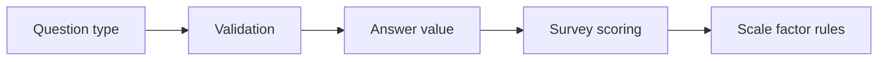
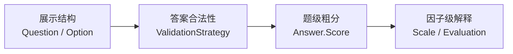

# 题型校验与计分扩展

**本文回答**：新增题型时，哪些变化属于问卷结构，哪些变化属于答案校验，哪些变化属于计分。

## 30 秒结论

| 扩展点 | 归属 | 说明 |
| ------ | ---- | ---- |
| 题型字段 | `Question` | 定义题目展示和答案形态 |
| 校验规则 | `questionnaire.Validator` / answersheet validation adapter | 判断提交答案是否符合问卷结构 |
| 粗分 | `answersheet.ScoringService` | 处理与作答事实绑定的题级或答卷级粗分 |
| 医学解释 | `scale` / `evaluation` | 因子、风险、报告不放回 `survey` |



## 维护规则

- 新题型必须先说明答案值结构，再补校验，再补粗分。
- 如果题型只影响展示，不应修改 evaluation pipeline。
- 如果规则影响医学解释，应进入 `scale` 或 `evaluation`，不要塞进 `Question`。

## 设计模式应用

| 模式 | 使用点 | 作用 |
| ---- | ------ | ---- |
| 策略模式 | `ValidationStrategy` 按 `RuleType` 分发 | required、min length 等规则独立扩展 |
| 值对象 | `AnswerValue` 系列类型 | 封装 string/number/array 等答案形态，避免裸 JSON 穿透 |
| Factory | `CreateAnswerValueFromRaw` | 按题型集中创建答案值对象并校验基础形态 |
| 领域服务 | `QuestionManager` | 新增/替换题目时维护题目 code 唯一和顺序 |

## 为什么这样设计

题型扩展最容易把三个概念混在一起：展示结构、答案合法性、医学解释。当前设计把它们拆开：Survey 只保证“这个答案对这个题是合法事实”，Scale 再解释题分到因子分，Evaluation 再生成风险和报告。



代价是新增题型需要改多个点，但这是有意的：每个点都对应不同的不变量，不能用一个大 switch 一次性吞掉。

## 取舍与边界

| 边界 | 说明 |
| ---- | ---- |
| Survey 只保证作答事实合法 | 医学解释、风险等级和报告文案不放在题型模型里 |
| 多点扩展是有意设计 | 模型、校验、DTO、粗分各自保护不同不变量 |
| 不绕过领域校验 | 前端字段或 JSON schema 不能替代领域层校验 |
| 不用一个万能题型 | 万能 JSON 题型短期灵活，但会削弱校验和计分可测试性 |

## 代码锚点

- 题目模型：[question.go](../../../internal/apiserver/domain/survey/questionnaire/question.go)
- 题目管理：[question_manager.go](../../../internal/apiserver/domain/survey/questionnaire/question_manager.go)
- 问卷校验：[validator.go](../../../internal/apiserver/domain/survey/questionnaire/validator.go)
- 答卷校验适配：[validation_adapter.go](../../../internal/apiserver/domain/survey/answersheet/validation_adapter.go)
- 答卷粗分：[scoring_service.go](../../../internal/apiserver/domain/survey/answersheet/scoring_service.go)

## Verify

```bash
go test ./internal/apiserver/domain/survey/questionnaire ./internal/apiserver/domain/survey/answersheet
```
