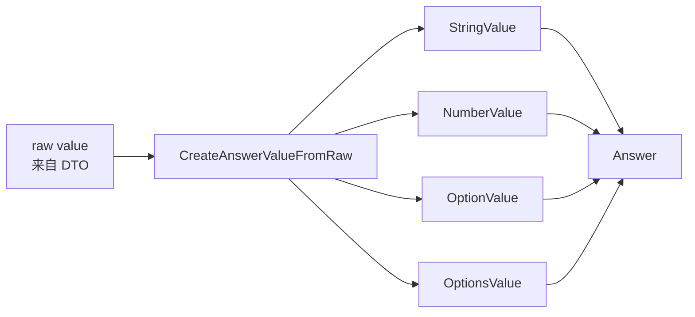
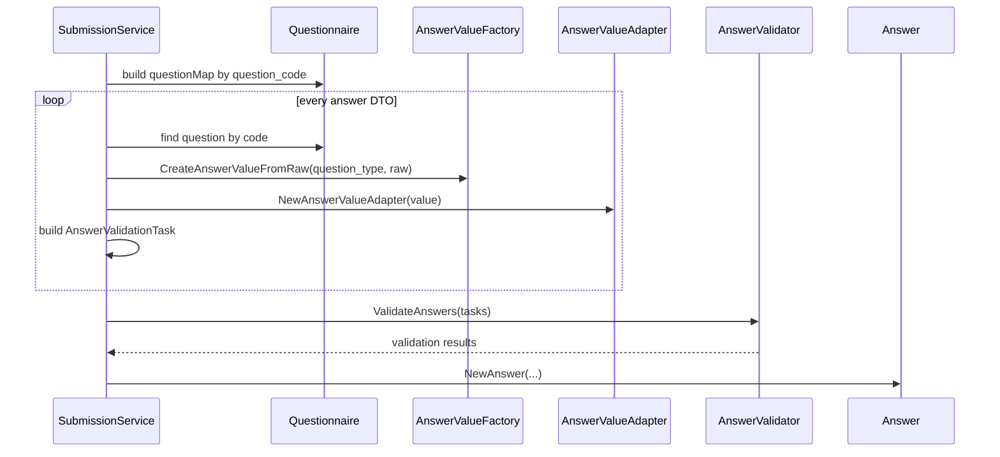
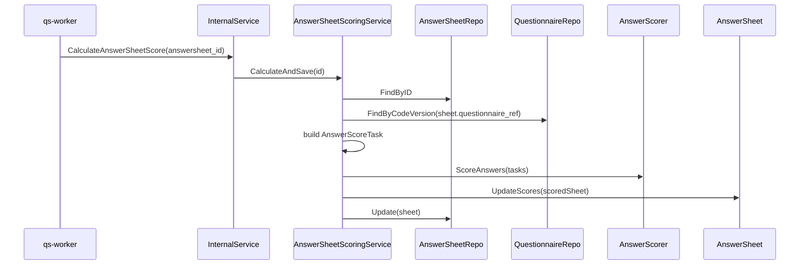

# 题型校验与计分扩展

**本文回答**：Survey 模块中题型如何影响答案值建模、提交校验和答卷计分；新增题型或新增校验规则时，应该改哪些模型、端口、适配器和测试，避免把题型逻辑散落在 handler 或提交服务里。

---

## 30 秒结论

| 主题 | 当前事实 |
| ---- | -------- |
| 题型来源 | `QuestionType` 定义在 `domain/survey/questionnaire`，当前包含 `Section / Radio / Checkbox / Text / Textarea / Number` |
| 答案值建模 | `AnswerValue` 定义在 `domain/survey/answersheet`，按题型转换为 `StringValue / NumberValue / OptionValue / OptionsValue` |
| 提交校验 | 提交时先由 `CreateAnswerValueFromRaw` 做值形态校验，再生成 `AnswerValidationTask` 交给 `ruleengine.AnswerValidator` |
| 校验规则 | 当前 ruleengine 支持 `required / min_length / max_length / min_value / max_value / min_selections / max_selections / pattern` |
| 答卷计分 | worker 触发 `CalculateAnswerSheetScore` 后，由 apiserver 加载答卷和问卷版本，构造 `AnswerScoreTask`，交给 `ruleengine.AnswerScorer` |
| 计分范围 | Survey 只负责“答案级粗分”和答卷总分；量表因子分、风险等级、报告解读属于 Scale/Evaluation |
| 扩展原则 | 新增题型必须同时补齐：题型定义、DTO/契约、AnswerValue、校验适配、计分适配、Mongo mapper、测试和文档 |

一句话概括：**题型扩展不是只加一个枚举；它会贯穿问卷定义、答卷提交、校验、计分、存储和接口契约。**

---

## 1. 为什么要把题型、校验、计分分开

Survey 模块里有三类变化原因：

| 变化点 | 变化原因 | 应该放在哪里 |
| ------ | -------- | ------------ |
| 题型 | 前台展示和答案值形态变化 | `QuestionType`、Question DTO、AnswerValue |
| 校验 | “这个答案是否可接受”的规则变化 | validation rules、`AnswerValidator` |
| 计分 | “这个答案值对应多少分”的规则变化 | option score、`AnswerScorer` |
| 因子解释 | 多题聚合、风险等级、解读文案变化 | Scale / Evaluation |

如果把这些全放进一个 `SubmitAnswerSheet` handler，会造成三个问题：

1. 题型越多，handler 越像大 switch。
2. 提交校验和计分耦合，提交时很难只保存作答事实。
3. Scale/Evaluation 的解释逻辑会污染 Survey 的采集模型。

当前设计把它拆成了三个层次：

```text
QuestionType / AnswerValue       解决“值是什么”
ValidationRule / AnswerValidator 解决“值是否合法”
AnswerScorer                    解决“值多少分”
```

---

## 2. 当前题型模型

### 2.1 QuestionType

`QuestionType` 是问卷题目的类型标识，决定前台展示、答案值形态、校验规则和计分输入。

当前内置类型：

| 题型 | 语义 | 答案值形态 |
| ---- | ---- | ---------- |
| `Section` | 段落 / 说明块 | 当前按字符串值处理 |
| `Radio` | 单选 | 一个选项 code |
| `Checkbox` | 多选 | 多个选项 code |
| `Text` | 短文本 | string |
| `Textarea` | 长文本 | string |
| `Number` | 数字 | number |

### 2.2 Option 与 score

对于选择类题型，选项不仅用于展示，也参与答案级计分。当前答案计分任务会从 `Question.GetOptions()` 中提取：

```text
option_code -> option_score
```

然后由 `AnswerScorer` 根据用户选择计算分数。

这说明：**选择题的计分数据源在 Questionnaire 的 Option 上，而不是 AnswerSheet 自己携带。**

---

## 3. AnswerValue：题型值对象

提交时，前端传来的 `value` 是原始 JSON 值。应用层不会直接保存裸 JSON，而是先转换成 `AnswerValue`。



### 3.1 当前题型到 AnswerValue 的映射

| 题型 | 原始值要求 | AnswerValue | 失败示例 |
| ---- | ---------- | ----------- | -------- |
| `Radio` | `string` | `OptionValue` | 传数组、数字 |
| `Checkbox` | `[]string` 或 `[]interface{}` 且元素全是 string | `OptionsValue` | 传单字符串、数组中有非 string |
| `Text` | `string` | `StringValue` | 传数字 |
| `Textarea` | `string` | `StringValue` | 传数组 |
| `Section` | `string` | `StringValue` | 传对象 |
| `Number` | `float64 / int / int64` | `NumberValue` | 传无法转数字的字符串 |

### 3.2 AnswerValueAdapter

`AnswerValueAdapter` 把 `AnswerValue` 适配成 ruleengine 需要的 `ValidatableValue` 表面：

| 方法 | 用途 |
| ---- | ---- |
| `IsEmpty()` | required、min/max rule 判断是否跳过空值 |
| `AsString()` | length、pattern 等字符串规则 |
| `AsNumber()` | min_value、max_value |
| `AsArray()` | min_selections、max_selections |

这个 adapter 的意义是：**validation 引擎不需要 import Survey 的具体 AnswerValue 类型，只依赖 ruleengine port 定义的接口。**

---

## 4. 提交校验链路

AnswerSheet 提交中的校验不是一次完成的，而是分阶段执行。



### 4.1 提交时的三层校验

| 阶段 | 目标 | 失败时机 |
| ---- | ---- | -------- |
| DTO 基础校验 | 字段是否缺失，例如 code、filler、testee、answer list | 进入问卷加载前 |
| 题型值校验 | raw value 是否符合题型，例如 Radio 必须是 string | 构造 `AnswerValue` 时 |
| 规则校验 | required、长度、数值范围、选择数量、pattern | 执行 `AnswerValidator` 时 |
| 聚合不变量 | AnswerSheet 是否有问卷引用、填写者、答案、重复题目 | `NewAnswerSheet` 时 |

这种分层的收益是定位清楚：字段缺失、值类型错误、业务规则不满足、聚合不变量失败，不会混成同一种错误。

### 4.2 validation rule 的转换

Question 里的 validation rules 会被转换成 ruleengine-facing 的 `ValidationRuleSpec`：

```text
RuleType    = rule.GetRuleType()
TargetValue = rule.GetTargetValue()
```

然后组成：

```text
AnswerValidationTask{
    ID:    question_code,
    Value: AnswerValueAdapter(answerValue),
    Rules: []ValidationRuleSpec,
}
```

这一步把领域模型和执行引擎隔开了：Question 知道规则配置，ruleengine 知道如何执行规则。

---

## 5. 当前校验规则

当前 infra ruleengine 注册了这些 validation strategy：

| 规则 | 适用值 | 语义 |
| ---- | ------ | ---- |
| `required` | 所有值 | 值不能为空 |
| `min_length` | 字符串 | 字符数不能少于目标值 |
| `max_length` | 字符串 | 字符数不能超过目标值 |
| `min_value` | 数字 | 数值不能小于目标值 |
| `max_value` | 数字 | 数值不能大于目标值 |
| `min_selections` | 数组 | 多选数量不能少于目标值 |
| `max_selections` | 数组 | 多选数量不能超过目标值 |
| `pattern` | 字符串 | 必须匹配正则 |

### 5.1 空值处理规则

除 `required` 外，大多数规则在 `value.IsEmpty()` 时直接通过。这是常见设计：空值是否允许由 `required` 决定，长度、数值、pattern 不重复承担必填语义。

例如：

```text
非必填 Text 为空 -> min_length 不报错
必填 Text 为空 -> required 报错
```

### 5.2 未知规则处理

`AnswerValidator` 在执行时，如果找不到对应 strategy，会跳过该规则。这种设计降低了坏配置导致全链路失败的风险，但也意味着新增规则时必须补测试，否则可能出现“规则配置了但没有生效”的静默风险。

---

## 6. 答卷计分链路

AnswerSheet 提交时，答案 score 初始化为 0。真正的答案级计分通常由 worker 消费 `answersheet.submitted` 后触发 internal gRPC：

```text
InternalService.CalculateAnswerSheetScore
```

apiserver 内部的计分应用服务会执行：



这里最重要的事实是：**计分使用答卷上保存的 questionnaire code/version 精确加载问卷版本**。这样即使后台发布了新版本，也不会用新题目结构解释旧答卷。

---

## 7. AnswerScoreTask 与 AnswerScorer

### 7.1 构造计分任务

`buildAnswerScoreTasks` 会：

1. 从 Questionnaire 构建 `question_code -> Question` 映射。
2. 遍历 AnswerSheet.Answers。
3. 找到对应问题。
4. 从问题选项构建 `option_code -> score` 映射。
5. 把 answer value 适配为 `ScorableValue`。
6. 构造 `AnswerScoreTask`。

```text
AnswerScoreTask{
    ID:           question_code,
    Value:        ScorableValue(answer.Value),
    OptionScores: map[option_code]score,
}
```

### 7.2 当前计分规则

当前 `AnswerScorer` 的行为是：

| 值形态 | 计分规则 |
| ------ | -------- |
| 单选 | 选择的 option code 命中 `OptionScores` 后返回对应分数 |
| 多选 | 多个选项分数求和 |
| 数字 | 直接返回数值 |
| 空值 / 未命中 | 0 |
| maxScore | 当前取 `OptionScores` 中最大值 |

这说明当前答案级计分是“题目选项分 / 数字值”级别的粗分。更复杂的因子聚合、风险分层、解释文案不在 Survey 的 AnswerSheet 计分里完成。

---

## 8. Survey 计分与 Scale/Evaluation 的边界

Survey 负责把单题答案计算成可用的基础分数：

```text
AnswerSheet.Answer.score
AnswerSheet.total_score
```

Scale/Evaluation 负责更高层的解释：

```text
Factor score
RiskLevel
Interpretation
Report
Trend
Tagging
```

| 能力 | 所属模块 |
| ---- | -------- |
| 单题选项分 | Survey |
| 答卷总分 | Survey |
| 因子聚合 | Scale / Evaluation |
| 风险等级 | Evaluation |
| 解读文案 | Scale / Evaluation |
| 报告生成 | Evaluation |
| 受试者标签 | Actor + Evaluation 后处理 |

不要把“量表因子计分”写进 AnswerSheet 提交文档，也不要让 Survey 直接持有 risk level。

---

## 9. 新增校验规则怎么做

例如新增 `email` 校验规则。

### 9.1 修改点

| 层 | 修改 |
| -- | ---- |
| ruleengine port | 新增 `ValidationRuleTypeEmail` |
| infra ruleengine | 新增 `emailStrategy`，注册进 `newDefaultValidationStrategies()` |
| 问卷规则配置 | 确保 Question validation rule 可表达 `email` |
| 测试 | 补 validation strategy 测试 |
| 文档 | 更新本篇和新增题型 SOP，如影响接口也更新 OpenAPI |

### 9.2 注意事项

- 不要在 `SubmissionService` 中硬编码 email 校验。
- 不要让 handler 认识 email 规则。
- 如果规则只依赖字符串表面，应复用 `ValidatableValue.AsString()`。
- 如果规则需要复杂上下文，例如跨题校验，不适合直接塞进当前单题 validation strategy，需要单独设计。

---

## 10. 新增题型怎么做

例如新增 `Date` 题型。

### 10.1 需要修改的最小集合

| 层 | 修改内容 |
| -- | -------- |
| domain/questionnaire | 新增 `QuestionType` 常量 |
| DTO / OpenAPI / proto | 允许新题型 |
| domain/answersheet | 新增 Date 对应的 `AnswerValue` 或复用 StringValue 但要明确语义 |
| `CreateAnswerValueFromRaw` | 支持 Date raw value 解析 |
| `AnswerValueAdapter` | 确保 `IsEmpty / AsString / AsNumber / AsArray` 行为合理 |
| validation | 如需要新增 `date_range` 等规则，新增 strategy |
| scoring | 如果 Date 不计分，要明确返回 0；如果计分，需要扩展 `ScorableValue` 或 scorer |
| Mongo mapper | 确认 Date 值可正确序列化和反序列化 |
| 前端契约 | 更新表单渲染和提交格式 |
| 测试 | 领域、应用、infra、contract 测试 |
| 文档 | 更新本篇和 `05-新增题型SOP.md` |

### 10.2 最容易漏的点

| 漏点 | 后果 |
| ---- | ---- |
| 只加 `QuestionType`，没改 `CreateAnswerValueFromRaw` | 提交时报 unsupported question type |
| 只改提交，没改 Mongo mapper | 能提交但不能正确读取 |
| 只改 AnswerValue，没改 validation adapter | 校验规则失效或错误 |
| 只改校验，没改 scoring | 后续计分结果不符合预期 |
| 没改 OpenAPI/proto | 调用方不知道新题型 contract |
| 没补测试 | 静默跳过规则或计分返回 0 难以及时发现 |

---

## 11. 设计模式与实现意图

| 设计点 | 当前实现 | 为什么这样设计 |
| ------ | -------- | -------------- |
| 值对象 | `AnswerValue` 系列 | 统一封装不同题型值，避免裸 JSON 在业务层到处传 |
| Adapter | `AnswerValueAdapter` / `ScorableValue` | 让 ruleengine 只依赖执行表面，不依赖 Survey 内部类型 |
| Strategy | validation strategies | 新增规则不改提交主流程 |
| Port / Adapter | `ruleengine.AnswerValidator`、`AnswerScorer` | 应用层依赖端口，infra 提供执行器 |
| Split Phase | 构造值对象 -> 校验任务 -> Answer -> AnswerSheet | 每阶段职责单一，失败定位清楚 |
| Async scoring | worker 触发 `CalculateAnswerSheetScore` | 提交快路径和计分慢路径解耦 |

---

## 12. 设计取舍

| 设计 | 收益 | 代价 |
| ---- | ---- | ---- |
| 题型值对象化 | 提交校验、计分、存储都有稳定数据形态 | 新题型要补多个层次 |
| 校验策略化 | 新规则扩展成本低 | 未注册规则可能被跳过，需要测试兜底 |
| 提交时只做答案合法性 | 快路径短，用户提交稳定 | 提交后还要异步计分，状态不是一步完成 |
| 答案级计分在 Survey | AnswerSheet 能保存基础分和总分 | 因子分和风险解释必须另走 Evaluation |
| 精确问卷版本计分 | 历史答卷解释稳定 | 需要长期保留 published snapshot |

---

## 13. 常见误区

### 13.1 “新增题型就是加一个枚举”

错误。新增题型至少影响题型定义、AnswerValue、提交 DTO、OpenAPI/proto、validation adapter、scoring、Mongo mapper 和测试。

### 13.2 “required 可以和 min_length 合并”

不建议。`required` 是空值规则，`min_length` 是非空后的长度规则。当前策略也体现了这个分离：大多数规则遇到 empty 会跳过。

### 13.3 “AnswerSheet 提交时就应该完成所有计分”

不准确。提交只保证采集事实可靠；答案级计分由异步链路触发，Evaluation 的因子和报告更晚。

### 13.4 “Survey 的计分就是医学量表最终分”

错误。Survey 只做答案级分数和答卷总分；医学量表最终解释依赖 Scale 因子和 Evaluation pipeline。

### 13.5 “校验规则写在 handler 更直观”

短期直观，长期会产生规则漂移。handler 不应该理解每个题型和每个规则的细节。

---

## 14. 代码锚点

### 题型与问卷

- 题型定义：[../../../internal/apiserver/domain/survey/questionnaire/types.go](../../../internal/apiserver/domain/survey/questionnaire/types.go)
- Question 模型：[../../../internal/apiserver/domain/survey/questionnaire/question.go](../../../internal/apiserver/domain/survey/questionnaire/question.go)

### 答案值与校验适配

- Answer 与 AnswerValue：[../../../internal/apiserver/domain/survey/answersheet/answer.go](../../../internal/apiserver/domain/survey/answersheet/answer.go)
- AnswerValueAdapter：[../../../internal/apiserver/domain/survey/answersheet/validation_adapter.go](../../../internal/apiserver/domain/survey/answersheet/validation_adapter.go)
- 答案装配：[../../../internal/apiserver/application/survey/answersheet/submission_answer_assembler.go](../../../internal/apiserver/application/survey/answersheet/submission_answer_assembler.go)

### ruleengine port 与 infra

- ruleengine port：[../../../internal/apiserver/port/ruleengine/ruleengine.go](../../../internal/apiserver/port/ruleengine/ruleengine.go)
- AnswerValidator：[../../../internal/apiserver/infra/ruleengine/validation.go](../../../internal/apiserver/infra/ruleengine/validation.go)
- validation strategies：[../../../internal/apiserver/infra/ruleengine/validation_strategies.go](../../../internal/apiserver/infra/ruleengine/validation_strategies.go)
- AnswerScorer：[../../../internal/apiserver/infra/ruleengine/scoring.go](../../../internal/apiserver/infra/ruleengine/scoring.go)

### 答卷计分

- 计分应用服务：[../../../internal/apiserver/application/survey/answersheet/scoring_app_service.go](../../../internal/apiserver/application/survey/answersheet/scoring_app_service.go)
- 计分任务装配：[../../../internal/apiserver/application/survey/answersheet/scoring_task_assembler.go](../../../internal/apiserver/application/survey/answersheet/scoring_task_assembler.go)

---

## 15. Verify

```bash
go test ./internal/apiserver/domain/survey/questionnaire
go test ./internal/apiserver/domain/survey/answersheet
go test ./internal/apiserver/application/survey/answersheet
go test ./internal/apiserver/infra/ruleengine
```

如果新增题型影响接口契约：

```bash
make docs-rest
make docs-verify
```

如果新增题型会被 worker 计分链路使用：

```bash
go test ./internal/worker/handlers
go test ./internal/apiserver/transport/grpc/service
```

---

## 16. 下一跳

- AnswerSheet 提交流程：[02-AnswerSheet提交与校验.md](./02-AnswerSheet提交与校验.md)
- 存储、事件、缓存边界：[04-存储事件缓存边界.md](./04-存储事件缓存边界.md)
- 新增题型 SOP：[05-新增题型SOP.md](./05-新增题型SOP.md)
- Scale 规则与因子计分：[../scale/01-规则与因子计分.md](../scale/01-规则与因子计分.md)
- Evaluation pipeline：[../evaluation/02-EnginePipeline.md](../evaluation/02-EnginePipeline.md)
