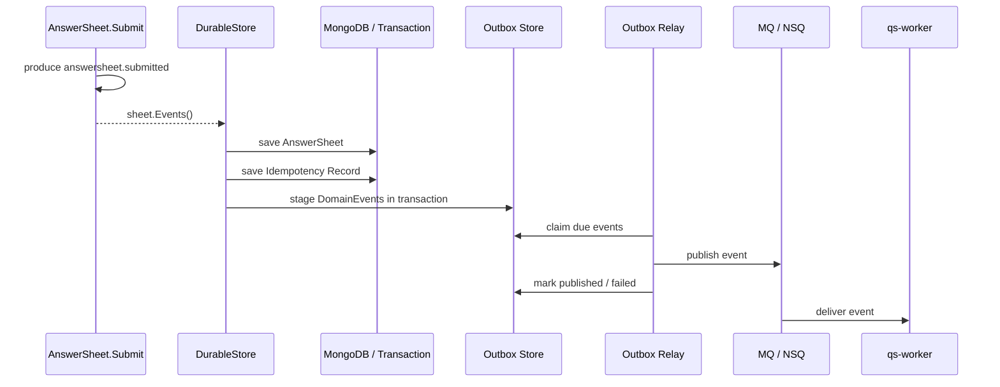

# 事务幂等与 Outbox 出站

> 本文是 Survey 模块文档重建的第五篇。
>
> 前一篇《03-答卷提交链路分析》已经说明：一次答卷提交会从 `collection-server` 进入 `qs-apiserver`，经过 `SubmissionSpec`、`AnswerValidator`、`AnswerSheet.Submit`，最终进入 `DurableStore.CreateDurably`。
>
> 本文聚焦 `CreateDurably` 背后的工程一致性问题：为什么不能保存答卷后直接 publish MQ？为什么需要幂等记录？为什么 `answersheet.submitted` 必须通过 Outbox 可靠出站？为什么 worker 消费事件后仍然要回调 `qs-apiserver`，而不是直接修改主业务表？

---

## 1. 结论先行

Survey 的答卷提交链路中，最关键的工程边界不是 `InsertOne(answersheet)`，而是：

```text
AnswerSheet 保存
  + Submit Idempotency 记录
  + DomainEvents staged to Outbox
```

这三件事必须被视为一个 **durable boundary**。

原因很简单：

```text
如果只保存 AnswerSheet，但 answersheet.submitted 没有可靠出站，
后续 Evaluation 就永远不知道这份答卷已经提交。
```

因此，Survey 提交链路采用：

```text
AnswerSheet.Submit
  -> sheet.Events()
  -> SubmissionDurableStore.CreateDurably
  -> SaveSubmittedAnswerSheet
  -> Stage Outbox Events
  -> Outbox Relay
  -> MQ
  -> Worker
  -> internal gRPC 回调 qs-apiserver
```

一句话概括：

> **事务幂等与 Outbox 的目标，是让“答卷事实已保存”和“后续评估事件可被驱动”在工程上成为一个可靠结果。**

---

## 2. 这条链路要解决什么问题

答卷提交不是普通写库。

它至少面临四类问题。

| 问题 | 场景 | 如果不处理会怎样 |
| --- | --- | --- |
| 重复提交 | 用户连点、网络重试、客户端超时重发 | 生成多份 AnswerSheet，重复评估 |
| 事件丢失 | 答卷保存成功，但 MQ publish 失败 | 后续 Assessment / Evaluation 永远不发生 |
| 并发竞争 | 两个相同 IdempotencyKey 几乎同时提交 | 唯一键冲突、返回不确定 |
| 消费重复 | MQ 至少一次投递、worker 重试 | 下游 Assessment / Report 重复生成 |

`SubmissionDurableStore` 主要解决前面三个问题。

第四个问题则需要 Evaluation 侧和 Worker 侧继续做业务幂等。

---

## 3. 为什么不能直接 publish MQ

最直觉的写法是：

```text
Save AnswerSheet
Publish answersheet.submitted to MQ
Return success
```

这个写法有一个致命窗口：

```text
Save AnswerSheet 成功；
Publish MQ 失败；
API 已经返回或无法重试；
这份答卷永远不会触发 Evaluation。
```

还有反向问题：

```text
Publish MQ 成功；
Save AnswerSheet 失败；
worker 消费事件后找不到答卷。
```

所以，提交链路不能把“保存业务事实”和“发布消息”拆成两个没有一致性保护的动作。

正确做法是：

```text
在业务持久化事务中写入 AnswerSheet；
同时把 DomainEvent 写入 Outbox；
事务成功后，由 Outbox Relay 异步发布 MQ。
```

这样，MQ publish 失败不会丢事件，因为事件还在 outbox 中，可以稍后重试。

---

## 4. Outbox 在 qs-server 中的定位

Outbox 不是业务模型。

它是基础设施一致性模式。

在 qs-server 中，它承担：

```text
业务数据库与消息出站之间的一致性；
事件重试；
事件状态观测；
防止业务事实保存成功但事件丢失。
```

README 中也明确：事件系统由 `EventCatalog`、`RoutingPublisher`、`Outbox`、MQ 和 Worker 串联；Outbox 负责业务数据库与消息出站之间的一致性，Worker 消费不承诺 exactly-once，业务侧必须幂等。

### 4.1 Outbox 的基本链路



### 4.2 Outbox 不解决什么

Outbox 只解决“事件可靠出站”。

它不保证：

```text
MQ exactly-once；
worker 只消费一次；
Evaluation 一定成功；
业务处理天然幂等。
```

因此，下游仍然必须通过：

```text
Assessment 唯一约束；
状态机检查；
幂等 handler；
结果唯一索引；
重复事件忽略。
```

来保证最终业务结果稳定。

---

## 5. SubmissionDurableStore 的职责

`SubmissionDurableStore` 是 AnswerSheet 提交链路的 application 层持久化端口。

它的接口语义可以概括为：

```text
CreateDurably(ctx, sheet, meta)
  -> saved AnswerSheet
  -> existing bool
  -> error
```

其中 `existing` 表示是否命中了幂等历史结果。

### 5.1 它负责什么

| 职责 | 说明 |
| --- | --- |
| 幂等查询 | 根据 IdempotencyKey 查找是否已有完成提交 |
| 事务写入 | 在事务中保存 AnswerSheet 与相关记录 |
| 幂等记录 | 保存 IdempotencyKey -> AnswerSheetID 的完成记录 |
| 事件 staging | 从 sheet.Events() 读取领域事件并写入 Outbox |
| 并发兜底 | 事务失败后等待可能已完成的同幂等提交 |
| 清理聚合事件 | 成功或幂等命中后 ClearEvents，避免重复 stage |

### 5.2 它不负责什么

| 不负责 | 原因 |
| --- | --- |
| 构造 AnswerSheet | 这是 domain/application 前置职责 |
| 校验答案规则 | 这是 AnswerValidator 职责 |
| 判断问卷是否可提交 | 这是 Questionnaire / SubmissionSpec 职责 |
| 解释答案含义 | 这是 Scale / Evaluation 职责 |
| 直接发布 MQ | 应由 Outbox Relay 负责 |

---

## 6. 当前实现的两层形态

当前仓库里存在两类相关实现。

### 6.1 application 层事务包装

`internal/apiserver/application/survey/answersheet/durable_store.go` 定义了：

```text
SubmissionDurableStore
SubmissionDurableWriter
EventStager
```

`transactional_durable_store.go` 使用：

```text
transaction runner
+ durable writer
+ event stager
```

完成通用的 durable write 编排。

其核心流程是：

```text
if idempotency key exists:
    FindCompletedSubmission
    if existing != nil: return existing, true

WithinTransaction:
    events = SaveSubmittedAnswerSheet(sheet, meta)
    Stage(events)

if transaction failed and idempotency key exists:
    WaitForCompletedSubmission

ClearEvents
return sheet
```

这层适合表达 application 层的统一模式。

### 6.2 Mongo Repository 真实实现

`internal/apiserver/infra/mongo/answersheet/durable_submit.go` 中的 `Repository.CreateDurably` 是 Mongo 侧真实落库实现。

它做了几件关键事情：

```text
sheet nil 防御；
FindCompletedSubmission；
withTransaction；
SaveSubmittedAnswerSheet；
outboxStore.StageEventsTx；
事务失败后的 WaitForCompletedSubmission；
sheet.ClearEvents。
```

其中 `SaveSubmittedAnswerSheet` 会：

```text
检查 sheet.ID 是否已分配；
校验 SubmissionContext；
将 AnswerSheet 映射为 Mongo 文档；
写入 AnswerSheet collection；
写入 Idempotency collection；
复制 sheet.Events()；
追加 footprint.answersheet_submitted 行为足迹事件；
返回 events 给 outbox staging。
```

这个实现说明：

> 当前 Survey 提交不只是保存答卷，还会同时为 Evaluation 和 Statistics 两条后续链路准备事件。

---

## 7. DurableSubmitMeta 与 IdempotencyKey

`DurableSubmitMeta` 当前主要承载：

```text
IdempotencyKey
```

它是 application 层 durable write metadata，不是 AnswerSheet 领域模型的一部分。

### 7.1 为什么 IdempotencyKey 不放进 AnswerSheet

因为 IdempotencyKey 表达的是：

```text
这个请求是否是同一次提交动作的重复请求。
```

而 AnswerSheet 表达的是：

```text
一份已经发生的作答事实。
```

二者不是同一个概念。

| 概念 | 归属 | 生命周期 |
| --- | --- | --- |
| AnswerSheetID | 领域事实 ID | 跟随答卷永久存在 |
| IdempotencyKey | 请求去重键 | 服务于提交请求去重 |

所以，IdempotencyKey 更适合放在：

```text
DurableSubmitMeta
AnswerSheetSubmitIdempotencyPO
```

而不是放进 AnswerSheet 聚合。

### 7.2 幂等记录保存什么

幂等记录至少应该保存：

```text
IdempotencyKey
WriterID / FillerID
TesteeID
QuestionnaireCode
QuestionnaireVersion
AnswerSheetID
Status
CreatedAt
UpdatedAt
```

这样后续重复提交可以通过 IdempotencyKey 找到已有完成结果。

---

## 8. 幂等处理流程

### 8.1 第一次提交

```text
Client 提交 IdempotencyKey = K
  -> FindCompletedSubmission(K) = nil
  -> 开启事务
  -> 保存 AnswerSheet
  -> 保存 idempotency(K -> AnswerSheetID)
  -> stage outbox
  -> 提交事务
  -> 返回 AnswerSheet, existing=false
```

### 8.2 重复提交命中

```text
Client 重试 IdempotencyKey = K
  -> FindCompletedSubmission(K) = AnswerSheet
  -> 直接返回 AnswerSheet, existing=true
```

这种情况下不会重新创建 AnswerSheet，也不会重新 stage 事件。

### 8.3 并发提交竞争

两个请求几乎同时使用同一个 IdempotencyKey：

```text
ReqA FindCompletedSubmission(K) = nil
ReqB FindCompletedSubmission(K) = nil
ReqA 进入事务并写入成功
ReqB 进入事务时遇到唯一键冲突或事务失败
ReqB WaitForCompletedSubmission(K)
ReqB 找到 ReqA 的结果
ReqB 返回 existing=true
```

这就是 `WaitForCompletedSubmission` 的价值。

它用于把并发竞争中的失败转成稳定的幂等命中结果。

### 8.4 没有 IdempotencyKey 的提交

如果没有 IdempotencyKey，系统无法判断两个请求是不是同一个用户动作。

此时只能依赖其他约束，例如：

```text
业务唯一键；
SubmitGuard；
前端防重复；
Plan/Task 状态机；
Evaluation 侧幂等。
```

所以前台提交接口应尽量要求或鼓励客户端携带 IdempotencyKey。

---

## 9. SaveSubmittedAnswerSheet 的职责

`SaveSubmittedAnswerSheet` 是 durable writer 的核心方法。

它负责将领域对象写入持久化层，并返回需要 stage 的事件。

### 9.1 前置校验

保存前应该至少校验：

```text
sheet 不能为空；
sheet.ID 已分配；
SubmissionContext 完整；
QuestionnaireRef 合法；
Answers 合法。
```

当前 Mongo 实现会显式检查：

```text
sheet.ID 不能是 zero；
SubmissionContext.Validate() 必须通过。
```

### 9.2 持久化 AnswerSheet

AnswerSheet 会被 mapper 转成 PO，然后写入 MongoDB。

这一步是作答事实落库。

### 9.3 写入幂等记录

如果 `IdempotencyKey` 非空，则写入幂等记录。

幂等记录状态通常为：

```text
completed
```

并记录 AnswerSheetID。

### 9.4 收集领域事件

保存后会复制：

```text
sheet.Events()
```

这些事件至少包含：

```text
answersheet.submitted
```

当前实现还会追加统计行为足迹事件：

```text
footprint.answersheet_submitted
```

因此一次答卷提交会同时推动：

```text
Evaluation 链路
Statistics 行为投影链路
```

---

## 10. Outbox staging 的语义

`StageEventsTx` 的语义是：

```text
把待发布事件写入 Outbox，并且与业务写入处于同一个事务上下文中。
```

### 10.1 为什么必须在事务里 stage

如果 AnswerSheet 保存和 Outbox 事件不是同一个事务，仍然会有一致性窗口。

正确边界是：

```text
Transaction:
  Save AnswerSheet
  Save Idempotency Record
  Stage Outbox Events
Commit
```

只要事务提交成功，系统就有能力最终发布事件。

即使 MQ 暂时不可用，也不会丢事件。

### 10.2 Outbox 事件状态

Outbox 通常需要维护：

```text
pending
publishing / claimed
published
failed
next_attempt_at
retry_count
last_error
```

当前 Mongo repository 暴露了：

```text
ClaimDueEvents
MarkEventPublished
MarkEventFailed
OutboxStatusSnapshot
```

这说明 Outbox 不只是“事件表”，还承担发布状态机和运维观测能力。

---

## 11. Outbox Relay

Outbox Relay 负责从 Outbox 中取出待发布事件，并发送到 MQ。

它通常做：

```text
ClaimDueEvents(limit, now)
Publish to MQ
MarkEventPublished
如果失败：MarkEventFailed，并设置 nextAttemptAt
```

### 11.1 Relay 不应该做业务逻辑

Outbox Relay 不应该理解：

```text
AnswerSheet；
Assessment；
Scale；
Report；
Statistics。
```

它只负责事件传输。

业务语义在事件 handler 和 application service 中处理。

### 11.2 失败重试

如果 MQ 发布失败，Relay 应该：

```text
记录 last_error；
增加 retry_count；
设置 next_attempt_at；
等待下一轮发布。
```

这就是 Outbox 相比“直接 publish MQ”的价值。

---

## 12. Worker 消费后的边界

`answersheet.submitted` 发布到 MQ 后，由 `qs-worker` 消费。

但 worker 不应该直接写主业务表。

正确模式是：

```text
Worker consume event
  -> call internal gRPC
  -> qs-apiserver application service
  -> Evaluation / Survey / Statistics 状态推进
```

### 12.1 为什么 worker 不能直接写主业务表

如果 worker 直接写业务表，会出现：

```text
apiserver 和 worker 各自拥有一套业务状态机；
Assessment 状态转换分散；
幂等逻辑分散；
事务边界难统一；
代码难测试和审计。
```

qs-server 的设计原则应该是：

```text
worker 是异步驱动器；
apiserver 是主业务事实源。
```

### 12.2 Worker 消费不承诺 exactly-once

MQ 消费通常是 at-least-once 语义。

也就是说：

```text
同一个 answersheet.submitted 事件可能被消费多次。
```

因此，下游 handler 必须幂等。

例如：

```text
CreateAssessmentFromAnswerSheet：同一 AnswerSheet 只能创建一个 Assessment；
CalculateAnswerSheetScore：重复计算应得到同一结果或安全覆盖；
EvaluateAssessment：状态机应拒绝重复解释；
ReportGenerated：同一 Assessment 不应生成多份冲突报告。
```

---

## 13. 与 Statistics 行为投影的关系

当前 `SaveSubmittedAnswerSheet` 除了返回 `answersheet.submitted`，还会追加：

```text
footprint.answersheet_submitted
```

这说明一次提交同时产生两类后续影响。

| 事件 | 目标 |
| --- | --- |
| `answersheet.submitted` | 驱动 Evaluation 链路 |
| `footprint.answersheet_submitted` | 驱动 Statistics 行为投影 |

这两个事件都应该通过 Outbox durable 出站。

它们的区别是：

```text
answersheet.submitted 是业务主链路事件；
footprint.answersheet_submitted 是读侧/行为统计事件。
```

这有利于后续统计重建，也避免把统计更新同步塞进提交请求里。

---

## 14. 成功路径总结

完整成功路径如下：

```text
AnswerSheet.Submit
  -> sheet contains answersheet.submitted
  -> CreateDurably
  -> FindCompletedSubmission = nil
  -> Transaction begin
  -> SaveSubmittedAnswerSheet
       -> Insert AnswerSheet
       -> Insert Idempotency Record
       -> Collect sheet.Events
       -> Append footprint.answersheet_submitted
  -> StageEventsTx(events)
  -> Transaction commit
  -> sheet.ClearEvents
  -> return sheet, existing=false
```

API 层可以据此返回：

```text
提交成功；
AnswerSheetID；
是否命中幂等；
后续评估状态查询入口。
```

注意：

```text
提交成功 != 报告生成成功。
```

---

## 15. 失败路径分析

### 15.1 sheet 为空

这是编程错误。

Mongo repository 当前会返回：

```text
answer sheet is required
```

这比静默返回 nil 更合理。

### 15.2 sheet.ID 为空

这说明 AnswerSheet 没有通过正确的 `Submit` 入口构造，或者 ID 没有前置生成。

应该拒绝保存：

```text
answersheet durable save requires preassigned answer sheet id
```

### 15.3 SubmissionContext 不完整

如果 SubmissionContext 缺少 filler/testee/org 等信息，说明提交事实不完整。

应该拒绝保存。

原因是：

```text
事件 payload、统计投影、Evaluation 创建都需要这些上下文。
```

### 15.4 幂等记录唯一键冲突

这是并发重复提交的典型情况。

处理方式：

```text
事务失败；
WaitForCompletedSubmission(idempotencyKey)；
如果找到已完成结果，则返回 existing=true；
如果超时仍找不到，则返回原错误。
```

### 15.5 Outbox staging 失败

如果 outbox staging 失败，整个事务应该失败。

不能接受：

```text
AnswerSheet 保存成功；
Outbox 写入失败；
事务仍然提交。
```

否则又回到了事件丢失问题。

### 15.6 Relay 发布失败

这发生在事务提交之后。

此时 AnswerSheet 和 Outbox 事件已经可靠保存。

Relay 应该标记事件失败并重试。

业务事实不会丢。

---

## 16. 一致性语义

Survey 提交链路提供的是：

```text
答卷保存与事件入 Outbox 的事务一致性；
事件发布到 MQ 的最终一致性；
worker 消费后的业务处理幂等。
```

它不提供：

```text
MQ exactly-once；
报告同步生成；
所有下游投影立即可见；
跨所有系统的强一致性。
```

更准确的表达是：

> **AnswerSheet 提交采用同步事实保存 + Outbox 可靠出站 + 下游异步最终一致。**

---

## 17. 当前实现评价

### 17.1 已完成得比较好的部分

| 方面 | 评价 |
| --- | --- |
| durable boundary | 已把 AnswerSheet、幂等记录、Outbox staging 放在一个边界内 |
| 幂等查询 | CreateDurably 前置查询 completed submission |
| 并发兜底 | 事务失败后通过 WaitForCompletedSubmission 兜底 |
| 事件 staging | 通过 outboxStore.StageEventsTx 在事务内写入事件 |
| 事件清理 | 成功后 sheet.ClearEvents，避免重复 stage |
| 统计事件 | 提交时追加 footprint.answersheet_submitted，支持读侧投影 |
| Outbox 运维 | 暴露 ClaimDueEvents / MarkEventPublished / MarkEventFailed / Snapshot |

### 17.2 仍可继续增强的部分

| 问题 | 建议 |
| --- | --- |
| application 层 wrapper nil sheet 返回 nil | 建议与 Mongo 实现保持一致，返回编程错误 |
| 幂等记录状态 | 后续可考虑 pending / completed / failed 更完整状态机 |
| 幂等范围 | 明确 IdempotencyKey 是否需要绑定 writer/testee/questionnaire，避免跨场景误用 |
| Outbox 观测 | 文档补充 pending/failed/retry_count/oldest_pending_age 指标解释 |
| 下游幂等 | Evaluation handler 文档中必须继续说明 Assessment 唯一约束和状态机幂等 |
| 事件 payload 版本 | 后续可补 event schema version，支持事件演进 |

### 17.3 不建议做的事情

| 不建议 | 原因 |
| --- | --- |
| 保存 AnswerSheet 后直接 publish MQ | 存在事件丢失窗口 |
| 把 IdempotencyKey 放进 AnswerSheet 核心模型 | 它是请求去重元数据，不是答卷事实本身 |
| 在 Outbox Relay 中写业务逻辑 | Relay 应只负责事件传输 |
| Worker 直接写主业务表 | 会破坏 apiserver 作为事实源的边界 |
| 用 MQ exactly-once 代替业务幂等 | Worker 消费仍可能重复，下游必须幂等 |
| 把统计同步写入提交主流程 | 会拉长提交耗时，且统计应走读侧投影 |

---

## 18. 代码锚点

| 类型 | 路径 |
| --- | --- |
| durable store 接口 | `internal/apiserver/application/survey/answersheet/durable_store.go` |
| application 事务包装 | `internal/apiserver/application/survey/answersheet/transactional_durable_store.go` |
| Mongo durable submit | `internal/apiserver/infra/mongo/answersheet/durable_submit.go` |
| DurableSubmitMeta | `internal/apiserver/port/answersheetsubmit/meta.go` |
| AnswerSheet 聚合事件 | `internal/apiserver/domain/survey/answersheet/events.go` |
| AnswerSheet.Submit | `internal/apiserver/domain/survey/answersheet/answersheet.go` |
| 提交 finalizer | `internal/apiserver/application/survey/answersheet/submission_finalizer.go` |
| Outbox port | `internal/apiserver/port/outbox` |
| shared eventing | `internal/apiserver/application/eventing` |
| 事件契约 | `configs/events.yaml` |
| worker handler | `internal/worker` |

---

## 19. Verify

修改 durable submit、幂等或 outbox staging 后，建议至少执行：

```bash
go test ./internal/apiserver/application/survey/answersheet/...
go test ./internal/apiserver/infra/mongo/answersheet/...
go test ./internal/apiserver/application/eventing/...
```

如果改动涉及事件契约：

```bash
make docs-hygiene
```

如果改动涉及 worker 消费链路：

```bash
go test ./internal/worker/...
go test ./internal/apiserver/application/evaluation/...
```

如果改动涉及 Mongo 索引或事务行为，建议补充集成测试或本地 Mongo 环境验证。

---

## 20. 面试与宣讲口径

### 20.1 30 秒版本

```text
答卷提交不是保存 AnswerSheet 后直接发 MQ。
我在提交链路里用了 durable boundary：在同一个持久化边界内保存 AnswerSheet、写入幂等记录，并把 answersheet.submitted stage 到 Outbox。
这样即使 MQ 暂时不可用，事件也不会丢；重复提交则通过 IdempotencyKey 返回同一份 AnswerSheet；worker 消费事件后只回调 apiserver 推进业务状态机，不直接写主业务表。
```

### 20.2 3 分钟版本

```text
Survey 提交链路里最关键的工程问题是：答卷保存成功之后，后续 Evaluation 必须能被可靠驱动。

如果我在保存 AnswerSheet 后直接 publish MQ，就会有一个一致性窗口：答卷已经保存，但 MQ publish 失败，后续 Assessment 和报告永远不会生成。反过来，如果先发 MQ 再保存答卷，worker 又可能消费到找不到答卷的事件。

所以我把提交持久化设计成 durable boundary。AnswerSheet.Submit 会先产生 answersheet.submitted 领域事件。然后 SubmissionDurableStore.CreateDurably 在持久化边界内做三件事：保存 AnswerSheet，保存 IdempotencyKey 对应的完成记录，把 sheet.Events stage 到 Outbox。

IdempotencyKey 用来处理重复提交。第一次提交会写入 AnswerSheet 和幂等记录；后续相同 key 的重试会直接返回已有 AnswerSheet。如果并发请求同时进来，一个事务成功后，另一个可以通过 WaitForCompletedSubmission 兜底查到已完成结果。

Outbox 负责可靠出站。事件先写入 outbox，再由 relay 发布 MQ。如果 MQ 发布失败，事件仍然在 outbox 中，可以重试。worker 消费事件后也不直接写业务表，而是通过 internal gRPC 回调 apiserver，让 Evaluation 应用服务维护 Assessment 状态机。

这条链路提供的是同步保存作答事实、事件可靠出站、下游最终一致，而不是同步生成报告或 MQ exactly-once。
```

### 20.3 高频追问

| 追问 | 回答要点 |
| --- | --- |
| 为什么不能保存后直接发 MQ？ | 保存成功后 publish 失败会导致事件丢失，Evaluation 无法被驱动 |
| Outbox 解决什么问题？ | 解决业务数据库与消息出站之间的一致性窗口 |
| IdempotencyKey 属于 AnswerSheet 吗？ | 不属于，它是请求去重元数据，不是答卷事实本身 |
| 幂等命中时返回什么？ | 返回已有 AnswerSheet，并标记 existing=true |
| 并发重复提交怎么处理？ | 唯一键/事务失败后 WaitForCompletedSubmission 兜底获取已完成结果 |
| Outbox 能保证 exactly-once 吗？ | 不能。它保证可靠出站，下游仍需业务幂等 |
| Worker 为什么不能直接写业务表？ | 会破坏 apiserver 作为主业务事实源和状态机中心的边界 |
| 统计事件为什么也进 Outbox？ | 统计是读侧投影，应该异步、可重建、不可拖慢提交主链路 |

---

## 21. 下一篇文档

下一篇建议编写：

```text
05-Survey模块总结与后续演进.md
```

重点回答：

```text
Survey 模块当前已经完成了哪些模型化建设；
Questionnaire / SubmissionSpec / AnswerSheet / DurableSubmit 的最终边界是什么；
还存在哪些小的模型补强点；
未来支持 MBTI 或其他测评模型时，Survey 为什么基本不需要变化；
Survey 模块在面试和宣讲中如何总结。
```
