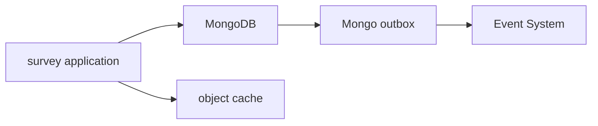
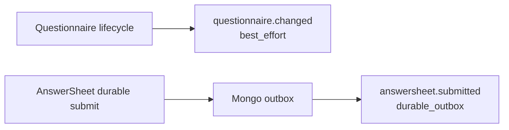

# Survey 存储、事件与缓存边界

**本文回答**：`survey` 何时用 Mongo，何时发事件，何时走 Redis cache。

## 30 秒结论

| 能力 | 当前归属 |
| ---- | -------- |
| 问卷结构 | MongoDB；通过 repository 与 object cache 加速读取 |
| 答卷事实 | MongoDB；durable submit 同时写 outbox |
| 问卷生命周期事件 | `questionnaire.changed`，best-effort publish |
| 答卷提交事件 | `answersheet.submitted`，durable outbox |
| 缓存治理 | Redis cache truth layer，`survey` 只消费对象缓存结果 |



## 边界说明

- `questionnaire.changed` 是生命周期通知，当前不是 durable_outbox。
- `answersheet.submitted` 是评估主链起点，必须和答卷持久化同边界 staged。
- Redis cache 只加速读，不是问卷/答卷事实来源。

## 为什么要区分两类事件

Survey 里有两类看起来相似但语义完全不同的事件：问卷变更和答卷提交。前者是配置/缓存/二维码等通知，允许 best-effort；后者是评估主链起点，必须 durable。

| 事件 | 业务语义 | delivery | 取舍 |
| ---- | -------- | -------- | ---- |
| `questionnaire.changed` | 问卷配置变化通知 | `best_effort` | 低成本通知，失败后不影响主业务写模型 |
| `answersheet.submitted` | 一份答卷已成为评估起点 | `durable_outbox` | 增加 outbox/relay 复杂度，换取写库与出站一致性 |



缓存同样必须区分语义：object cache 可以加速问卷读取，但不能成为问卷结构的权威；缓存治理可以 warmup/repair，但不能替代 Mongo 中的主事实。

## 设计模式应用

| 模式 / 技法 | 位置 | 作用 |
| ----------- | ---- | ---- |
| Repository + Decorator | questionnaire object cache | 缓存作为读优化，不污染应用服务调用面 |
| Transactional Outbox | answersheet durable submit | 答卷保存和 `answersheet.submitted` 同边界 staged |
| Delivery Class | `events.yaml` | 区分 best-effort 和 durable_outbox 事件 |
| Cache Governance | Redis cache truth layer | warmup/hotset/repair 处理缓存运维，不改变业务事实 |

## 代码锚点

- 问卷缓存：[questionnaire_cache.go](../../../internal/apiserver/infra/cache/questionnaire_cache.go)
- durable submit：[durable_submit.go](../../../internal/apiserver/infra/mongo/answersheet/durable_submit.go)
- Event catalog：[events.yaml](../../../configs/events.yaml)
- Redis cache 深讲：[../../03-基础设施/redis/README.md](../../03-基础设施/redis/README.md)

## Verify

```bash
go test ./internal/apiserver/infra/cache ./internal/apiserver/infra/mongo/answersheet ./internal/pkg/eventcatalog
```
